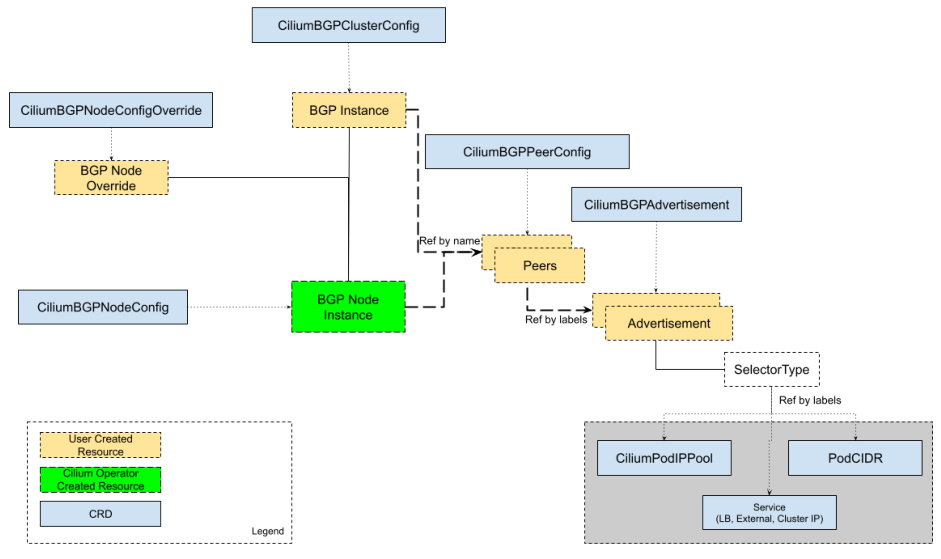

简单来说，就是让外部网络能访问到我们集群里的东西。记住，它只负责对外通告，集群内部的通信，那是数据路径Datapath的事儿，BGP控制平面不插手。

配置Cilium的BGP控制平面，主要有两种路子。老的那条路，叫CiliumBGPPeeringPolicy，现在用的人不多了，而且官方说了，以后要废弃。所以，我们强烈推荐走新路，也就是CiliumBGPClusterConfig。这新方法更灵活，功能也更强大。虽然现在两种都能用，但长远来看，还是得拥抱新事物。所以，大家在规划或者升级的时候，优先考虑用CiliumBGPClusterConfig来搞定BGP配置。

要玩转Cilium的BGP控制平面，你需要掌握几个关键的资源。

- 首先是CiliumBGPClusterConfig，这是整个集群层面的BGP蓝图，定义了哪些节点要用BGP，以及它们的对等体配置。
- 然后是CiliumBGPPeerConfig，这个是通用的配置模板，可以给多个对等体共享，避免重复配置。
- 接着是CiliumBGPAdvertisement，它告诉Cilium要把哪些路由信息，比如Pod CIDR、Service IP，通过BGP通告出去。
- 最后是CiliumBGPNodeConfigOverride，如果你觉得某个节点的配置需要特殊处理，就可以用这个来覆盖默认的集群配置。



这张图展示了它们之间的关系，大家可以参考一下。

我们深入看看这个CiliumBGPClusterConfig。它就像一个集群的BGP配置文件，你可以用它来指定哪些节点需要启用BGP，通过nodeSelector这个字段来匹配。在一个集群里，你可以定义多个BGP实例，每个实例都有一个名字，比如instance-65000。每个实例下面可以挂好几个对等体，也就是你的邻居路由器，比如TOR交换机。配置对等体的时候，你需要告诉Cilium对方的AS号peerASN、IP地址peerAddress，以及最重要的，指向哪个通用的CiliumBGPPeerConfig。

这里有个坑得注意，CiliumBGPClusterConfig和老的CiliumBGPPeeringPolicy不能同时用，如果都存在，后者会优先级更高，所以别搞混了。

```yaml
apiVersion: cilium.io/v2alpha1
kind: CiliumBGPClusterConfig
metadata:
  name: cilium-bgp
spec:
  nodeSelector:
    matchLabels:
      rack: rack0
  bgpInstances:
  - name: "instance-65000"
    localASN: 65000
    peers:
    - name: "peer-65000-tor1"
      peerASN: 65000
      peerAddress: fd00:10:0:0::1
      peerConfigRef:
        name: "cilium-peer"
    - name: "peer-65000-tor2"
      peerASN: 65000
      peerAddress: fd00:11:0:0::1
      peerConfigRef:
        name: "cilium-peer"
```

来看个例子，这段YAML定义了一个名为cilium-bgp的CiliumBGPClusterConfig。

- nodeSelector指定了只适用于标签为rack rack0的节点。下面定义了一个名为instance-65000的BGP实例，本地AS号是65000。
- 实例下面有两个对等体，分别是peer-65000-tor1和peer-65000-tor2，它们的AS号都是65000，IP地址分别是fd00:10:0:0::1和fd00:11:0:0::1，而且都引用了同一个名为cilium-peer的CiliumBGPPeerConfig。

这个例子展示了如何定义一个基本的BGP集群配置。现在我们来看看CiliumBGPPeerConfig，这个资源是配置BGP对等体细节的地方。你可以把它想象成一个通用的BGP会话模板，多个对等体可以共享这个配置，大大简化了管理。

这里面可以配置很多东西，比如MD5密码保证安全性，各种定时器控制连接行为，EBGP多跳处理跨网段情况，优雅重启减少中断，还有传输层的端口、支持的地址族、以及最重要的通告策略。

```yaml
apiVersion: cilium.io/v2alpha1
kind: CiliumBGPPeerConfig
metadata:
  name: cilium-peer
spec:
  timers:
    holdTimeSeconds: 9
    keepAliveTimeSeconds: 3
  authSecretRef: bgp-auth-secret
  ebgpMultihop: 4
  gracefulRestart:
    enabled: true
    restartTimeSeconds: 15
  families:
    - afi: ipv4
      safi: unicast
      advertisements:
        matchLabels:
          advertise: "bgp"
```

这个例子展示了如何定义一个名为cilium-peer的通用配置，包括了定时器设置、EBGP多跳、优雅重启、传输端口和地址族，以及在IPv4 unicast下，通过标签advertise等于bgp来选择哪些路由通告。安全性很重要，所以BGP会话通常会用MD5密码来加密。

在CiliumBGPPeerConfig里，你可以通过authSecretRef字段来引用一个存储在Kubernetes Secret中的密码。这个Secret通常放在kube-system命名空间，里面必须有一个名为password的键。创建Secret的命令很简单，比如kubectl create secret generic。但是要注意，如果Cilium对BGP会话做了地址转换，比如NAT，那MD5就用不了了。另外，如果密码错了或者连接失败，日志里看到的可能只是dial timeout，不太直观，但确实是密码问题导致的连接失败。

BGP会话不是一成不变的，它需要心跳来维持。这里的定时器就是控制心跳的。主要有三个：

- connectRetryTimeSeconds，控制连接失败后多久重试，默认120秒；
- holdTimeSeconds，表示对等体之间保持连接的最长时间，超过这个时间没收到Keepalive消息，会话就断了，默认90秒；
- keepAliveTimeSeconds，表示每隔多久发送一个Keepalive消息，证明我还活着，默认30秒。

在数据中心这种环境，为了快速发现故障，通常建议把holdTime和keepaliveTime设得小一些，比如9秒和3秒，这样一旦对端挂了，能更快地知道。同时，connectRetryTime也可以设小点，比如5秒，让连接更快恢复。

默认情况下，EBGP报文的TTL值是1，这意味着它只能在同一个子网内跳一次。如果你的BGP邻居路由器在另一个子网，比如通过一个路由器服务器连接，那这个报文就到不了了。这时候就需要用ebgpMultihop参数来设置TTL值，让它可以跨越多个网段。比如，你可以设置ebgpMultihop等于4，这样报文就可以在路由器服务器上跳4次，最终到达目标对等体。这个例子就是配置了ebgpMultihop等于4。

网络服务不能动不动就中断，优雅重启就是为了解决这个问题。当你需要重启Cilium Agent，或者BGP会话意外中断后恢复时，启用优雅重启可以保证路由信息不会立刻被撤回，从而避免流量中断。原理是这样的：对等体收到你的重启信号后，会启动一个restartTimeSeconds倒计时，这段时间内，它会继续保留你之前通告的路由，直到倒计时结束。这样，即使在Agent重启期间，数据包也能继续通过。默认的重启时间是120秒，你可以根据自己的需求调整。这个例子展示了如何启用优雅重启并设置重启时间为15秒。

BGP默认使用TCP 179端口进行通信。但有时候，你可能需要在特定的端口上监听或发起连接，比如在某些防火墙策略下，或者需要与其他服务区分。这时，你可以使用transport字段下的peerPort来指定BGP会话的目的端口。默认情况下，Cilium Agent会主动发起连接，目的端口是179，源端口是随机的。如果你想修改这个目的端口，比如改成1790，就可以在CiliumBGPPeerConfig里添加transport peerPort 1790。这个例子展示了如何设置自定义端口。

BGP支持多种协议，比如IPv4和IPv6。在CiliumBGPPeerConfig的families字段里，你可以明确告诉对等体，你支持哪些协议类型，比如AFI IPv4, SAFI Unicast，或者AFI IPv6, SAFI Unicast。如果你不指定，默认会发送IPv4和IPv6的多协议能力。在每个地址族下面，你可以通过advertisements的label selector来控制具体通告哪些路由。比如，你可以设置一个标签advertise等于bgp，然后在selector里匹配这个标签。如果没有匹配的通告，Cilium就不会向对等体发布任何路由。这个例子展示了如何配置IPv4和IPv6的unicast，并且都通过advertise等于bgp标签进行路由选择。

配置了BGP对等体之后，下一步就是告诉Cilium要把哪些路由信息告诉对等体。这就是BGP通告的作用。我们通过CiliumBGPAdvertise这个资源来定义具体的通告类型和属性。

在CiliumBGPPeerConfig的families里，我们用advertisements的label selector来匹配这个CiliumBGPAdvertise资源。这样，Cilium就知道了，对于这个对等体，应该通告哪些类型的路由。

```yaml
apiVersion: cilium.io/v2alpha1
kind: CiliumBGPAdvertisement
metadata:
  name: bgp-advertisements
  labels:
    advertise: bgp
spec:
  advertisements:
    - advertisementType: "PodCIDR"
      attributes:
        communities:
          standard: [ "65000:99" ]
        localPreference: 99
```

比如，你可以定义一个PodCIDR通告，或者一个Service VIP通告。在通告里，还可以配置BGP路径属性，比如Communities和LocalPreference，来控制路由的传播和优先级。在CiliumBGPAdvertise里，我们可以给路由信息打上BGP属性的标签。主要有两种：Communities 和 LocalPreference。Communities 是一种标准的BGP团体属性，用来在路由域间传递信息，比如过滤路由、设置策略等。你可以用标准格式，比如65000:99，也可以用RFC定义的WellKnown字符串，比如no-export，或者更强大的Large Communities

LocalPreference 是一种本地优先级，数值越高，路由越优先。但它只对iBGP邻居有效，也就是在同一个AS内部的路由器之间。这个例子展示了如何定义一个PodCIDR通告，并且给它加上了Community 65000:99 和 LocalPreference 99。

- 通告的第一种类型是Pod CIDR。这个功能非常实用，它可以让你的外部路由器直接看到并路由到集群里的Pod，而不需要通过Load Balancer或NAT。这对于实现高性能的外部访问非常重要。配置方式有两种：如果你用的是Kubernetes默认的IPAM或者ClusterPool IPAM，直接在CiliumBGPAdvertise里设置advertisementType等于PodCIDR就可以了。如果你用的是MultiPool IPAM，就需要指定advertisementType等于CiliumPodIPPool，并且通过selector来选择要通告的Pod IP池。记住，通告的是分配给当前节点的Pod CIDR，而不是整个集群的Pod网段。
- 除了Pod CIDR，我们还可以通告Service的虚拟IP。这样，外部网络就可以直接访问到你的Service。Service可以有多种VIP，比如ClusterIP、ExternalIP和LoadBalancerIP。你可以通过配置CiliumBGPAdvertise，指定serviceAddresses等于ClusterIP、ExternalIP或LoadBalancerIP，然后用selector来选择哪些Service的VIP需要通告。比如，你可以选择所有标签为bgp等于blue的Service。
- 如果上游路由器支持ECMP，你还可以利用这个功能，把同一个Service的VIP通告到多个节点，实现流量的负载均衡。不过要注意，有些路由器的ECMP路由表大小有限，通告太多VIP可能会超限，所以要提前评估。如果你想从外部访问集群内部的ClusterIP类型Service，就需要配置serviceAddresses等于ClusterIP。这通常用于配合kubeProxyReplacement特性来实现。需要注意的是，如果要使用这个功能，可能需要在Cilium里启用一些特定的BPF参数，具体配置可以参考文档。
- 同样，你需要用selector来选择哪些ClusterIP的Service需要通告。对于需要负载均衡的场景，我们通常会使用Service的Load Balancer IP。这个IP地址会通过status.loadBalancer.ingress[*].ip字段暴露出来。要通告这个IP，你需要在CiliumBGPAdvertise里设置serviceAddresses等于LoadBalancerIP。同样，你需要用selector来选择哪些Service的Load Balancer IP需要通告。前提是你得先给Service分配好这个Ingress IP。Cilium本身支持通过Load Balancer IPAM功能来分配这个IP。如果你想通告所有Service的Load Balancer IP，可以用一个特殊的NotIn匹配表达式来实现。
- 通告Load Balancer IP还有一个细节，就是看Service的loadBalancerClass字段。如果这个字段是io.cilium/bgp-control-plane或者没指定，Cilium就会通告这个Service的Ingress IP。如果指定了其他的类，那就不会通告。另外，对于ExternalIP和LoadBalancerIP的通告，还会考虑Service的externalTrafficPolicy字段。如果externalTrafficPolicy等于cluster，那无论有没有本地Endpoint，都会通告。如果等于local，那只有当本地节点有这个Service的Endpoint时，才会通告。对于ClusterIP的通告，则会考虑internalTrafficPolicy。这些策略确保了路由通告的准确性。

最后，我们来看看CiliumBGPNodeConfigOverride。这个资源允许你对特定节点的BGP配置进行微调。比如，你可以给某个节点的BGP实例指定一个固定的Router ID，而不是让它自动选择。或者，你可以设置一个监听端口，让这个节点的BGP进程能够接受来自外部的连接请求。还可以指定在与特定对等体建立连接时，使用哪个本地接口的地址。这个资源的名称必须和目标节点的名称完全一致。

这个例子展示了如何为一个名为bgpv2-cpplane-dev-multi-homing-worker的节点，覆盖其BGP实例的Router ID、监听端口和与TOR1、TOR2的连接源地址。

```yaml
apiVersion: cilium.io/v2alpha1
kind: CiliumBGPNodeConfigOverride
metadata:
  name: bgpv2-cplane-dev-multi-homing-worker
spec:
  bgpInstances:
    - name: "instance-65000"
      routerID: "192.168.10.1"
      localPort: 1790
      peers:
        - name: "peer-65000-tor1"
          localAddress: fd00:10:0:2::2
        - name: "peer-65000-tor2"
          localAddress: fd00:11:0:2::2
```

