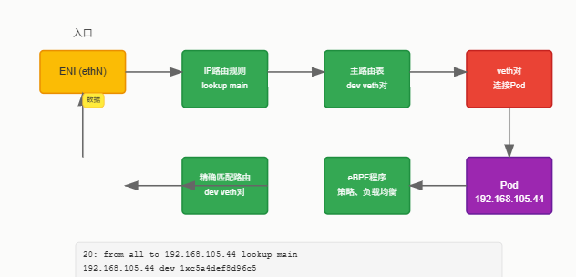
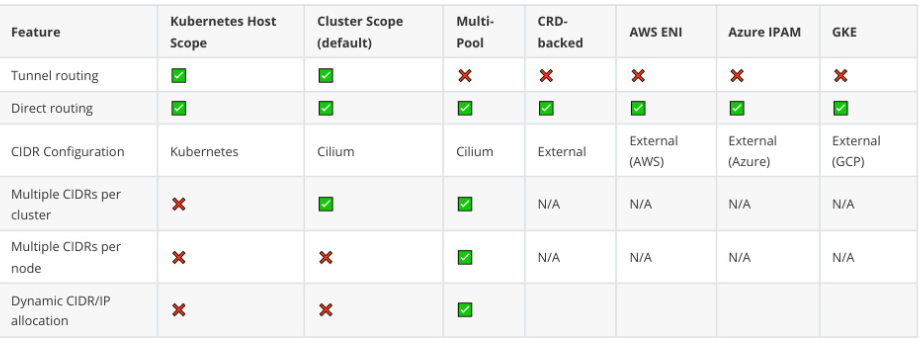
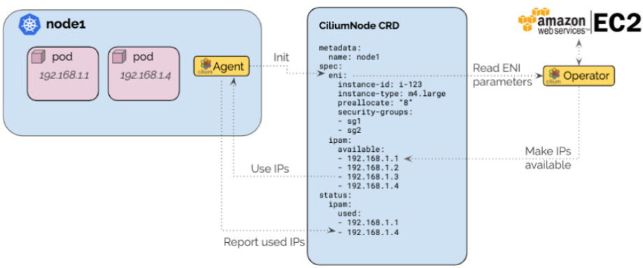

## 路由模式

我们直接来看Cilium路由的几种核心模式。

### 封装模式

首先是最基础的封装模式。这是默认情况下，如果你没有特别配置，Cilium会自动运行的模式。它的最大特点就是对底层网络环境的要求非常低，可以说是开箱即用。具体怎么实现呢？就是**通过UDP协议，比如VXLAN或Geneve，把所有节点都连接起来，形成一个隧道网**。

简单来说，节点之间互相通信，数据包都被包了一层壳。这个封装模式对网络环境的要求其实不高。

- 首先，只要你的节点本身能互相Ping通，那基本上就满足了路由的基本要求。
- 其次，它目前依赖IPv4，虽然社区也在努力推进IPv6隧道的支持，但目前还不是主流。
- 最关键的一点，就是你的网络防火墙和底层网络必须允许这些封装协议的流量通过。VXLAN默认是8472端口，Geneve是6081端口，这两个端口必须是开放的，否则封装就无法进行。

封装模式的好处是显而易见的。

- 首先，简洁性极强。你的底层网络，比如交换机、路由器，完全不需要关心Pod的网络地址，也就是Pod CIDR。无论你的网络拓扑多么复杂，只要节点能互相通信，封装模式就能搞定。
- 其次，地址空间非常大。因为不依赖于底层网络的限制，理论上你可以给每个节点分配非常大的Pod CIDR，轻松运行成千上万个Pod。
- 再者它能和Kubernetes这样的编排系统无缝集成，新节点加入集群后，它能自动发现并把自己纳入到这个隧道网络里。
- 最后它还能利用封装协议本身携带的元数据，比如源安全身份，这在性能优化上很有用，可以减少一次远程节点的身份验证。

当然，凡事都有两面性。封装模式最大的缺点就是**性能开销**。由于给数据包加了额外的头，比如VXLAN头就有50个字节，这会直接减少有效载荷的大小，导致网络传输的吞吐量下降。想象一下，本来能跑1500字节的数据，现在因为封装头占了50字节，实际传输效率就打了折扣。不过，这个影响可以通过启用巨帧来缓解。巨帧就是把数据包做得更大，比如从1500字节提高到9000字节，这样封装头的相对比例就小了，性能损失自然就小了。所以，对于对性能要求不极致的场景，封装模式是个不错的选择。

### 原生路由模式

接下来我们看第二种模式：原生路由。要启用这个模式，你需要在配置里明确指定 routing-mode: native。

和封装模式不同，**原生路由模式下，Cilium会尽量少干预，它把数据包转发给Linux内核的路由子系统去处理**。这意味着，如果一个数据包不是发给本地的Pod，Cilium就直接把它交给内核，让它像普通本地进程发的数据包一样去路由。这种模式的好处是，理论上可以达到更高的网络性能，因为它避免了封装和解封装的开销。但代价是，它对网络环境的要求更高了。原生路由模式对网络环境的要求主要体现在两个方面。

- 第一，连接你这些Cilium节点的网络本身，必须能够转发Pod IP地址的流量。
- 第二，每个节点的Linux内核路由表，必须知道怎么把数据包路由到其他所有节点的Pod。

这怎么实现呢？有两种主流方式。

- 每个节点不知道所有Pod的路由，但有一个中心路由器知道所有Pod的路由，节点就配置一个默认路由指向这个路由器。这种方式在很多云平台集成中很常见，比如后面会讲的GKE和AWS ENI。
- 每个节点都手动配置所有其他节点的Pod IP路由，这通常需要借助BGP等协议来实现路由通告，比如以前的Kube-Router项目，虽然现在有些过时了。

如果你的网络是二层网络，也可以通过配置 auto-direct-node-routes: true 来简化路由配置。配置原生路由模式，核心就是设置这两个选项。routing-mode: native 是必须的，告诉Cilium你要用原生路由。ipv4-native-routing-cidr 则指定了哪些CIDR范围内的流量可以走原生路由，超出这个范围的流量可能需要走其他路径，比如封装。这是个关键的配置，决定了你的网络策略范围。还有一个可选的参数 direct-routing-skip-unreachable，这个比较高级，如果你在用BGP并且集群网络有多个子网，开启这个选项可以让节点在同一个区域内有二层连通性，即使某些路由暂时不可达，也能避免流量被BGP路由器强制转发，提高效率。

### AWS ENI模式

现在我们来看看专门为AWS环境设计的AWS ENI模式。这个模式需要在启动时通过 --ipam=eni 或者在ConfigMap里设置 ipam: eni 来启用。它的核心优势在于，**Pod可以直接使用AWS弹性网络接口ENI上的IP地址**，这些IP地址在AWS VPC内部是天然路由的，这意味着Pod之间的通信非常简单，甚至不需要像传统方式那样做SNAT。

而且，每个Pod的IP都可以独立配置安全组，这对于精细化的网络隔离非常有帮助。

当然，它也有缺点。

- 首先，每个实例上的ENI数量是有限制的，取决于你的EC2实例类型，如果你要在小实例上跑很多Pod，可能会遇到限制。
- 其次，分配ENI和IP需要调用EC2 API，这个API是有调用频率限制的，所以Operator设计需要考虑这个问题。

我们来看看这个模式的入口流量是怎么走的。



- 首先，流量从实例的ENI接口，比如ethN进来。
- 然后，内核会根据路由规则，比如上面这个例子，把发往本地Pod的流量导向主路由表。主路由表里会有一个精确匹配路由，比如这个例子，把目标地址是192.168.105.44的流量，通过设备1xc5a4def8d96c5转发。这个设备1xc5a4def8d96c5实际上是一个veth对的一端，它连接着Pod的网络命名空间。
- 在数据包真正进入Pod之前，它会经过eBPF程序的处理，进行安全策略检查、负载均衡、流量控制等等。整个过程非常高效。

再来看出口流量，也就是Pod要出去访问外部网络的情况。

```
30:      from 192.168.105.44 to 192.168.0.0/16 lookup 92

default via 192.168.0.1 dev eth2
192.168.0.1 dev eth2
```

- Pod内部的网络命名空间里，有一个默认路由，指向的是一个路由器IP地址，这个路由器IP实际上是在ENI上分配的一个IP地址。Pod发出的数据包，先经过veth对，同样会被eBPF处理。
- 然后，内核会根据路由规则，比如这个例子，把源地址是192.168.105.44的流量，通过路由表92查找。这个路由表92是专门为这个Pod的ENI创建的。
- 这个ENI路由表里，通常会有一个默认路由，指向VPC的路由器，通过ENI接口eth2出去。这样，Pod的流量就被正确地路由到VPC内部的网络了。

配置AWS ENI模式，除了核心的 ipam等于eni，还需要几个关键的选项。

- enable-endpoint-routes等于true 是必须的，它告诉Cilium可以直接路由到ENI的veth对，而不是通过cilium_host接口。
- auto-create-cilium-node-resource等于true 也很有用，它可以让Cilium Agent自动创建一个名为ciliumnodes.cilium.io的Custom Resource Definition，Operator会监听这个CRD来管理IPAM。
- 另外，如果你的集群需要做NAT，可以使用 egress-masquerade-interfaces 来指定哪些接口需要进行伪装，或者干脆 disable-ipv4-masquerade等于false 来禁用伪装。

对于在Google Cloud上运行Cilium，无论是GKE还是自建集群，都可以利用Google Cloud强大的网络基础设施，配合Cilium的原生路由模式。这种方式的好处是，既能享受Google Cloud网络的高性能，又能获得Cilium提供的各种高级功能，比如精细的网络策略、高效的负载均衡、NodePort、ExternalIP等。具体来说

- Pod的IP会从节点的Pod CIDR里分配，但这些IP会通过Alias IP的方式在Google Cloud网络里路由，所以不需要额外的封装或路由配置。
- 对于离开集群的流量，如果不在指定的原生路由CIDR内，会被伪装成节点的IP。
- 负载均衡方面，ClusterIP是基于eBPF实现的，而NodePort、ExternalIP、HostPort等，在GKE 1.15版本以上或者Linux内核4.19以上版本，也都是基于eBPF来实现的，性能非常出色。
- 所有策略的执行和监控，也都是通过eBPF来完成的。

要在GKE上配置Cilium，核心就是启用 gke.enabled: true。这个选项会自动帮你设置好一系列相关的配置，包括启用 Kubernetes Host Scope IPAM，也就是让Kubernetes负责分配IP；启用原生路由模式；以及启用节点端点路由，这会自动禁用本地节点的路由。当然，你还需要手动设置 ipv4-native-routing-cidr，告诉Cilium哪些网络是原生路由的范围。

具体的安装指南，可以参考官方文档里的Cilium Quick Installation for GKE。

## IPAM

现在我们来聊聊IP地址管理，也就是IPAM。简单来说，**IPAM就是负责给Cilium管理的网络端点比如容器分配IP地址的**。它有很多种模式，每种模式都有自己的特点和适用场景。这张表总结了不同IPAM模式在支持隧道路由、直接路由、CIDR配置方式、是否支持多CIDR集群或节点、以及是否支持动态分配IP等方面的能力。



比如，Kubernetes Host Scope模式依赖Kubernetes配置，而Cluster Scope模式则由Cilium自己配置。AWS ENI和Azure IPAM是针对特定云平台的，GKE模式则是在原生路由基础上进行优化。理解这些模式的区别，有助于我们根据实际需求选择合适的配置。

这里要特别强调一点：在生产环境中，绝对不要轻易更改正在运行的集群的IPAM模式！这绝对是一个非常危险的操作。因为IPAM模式直接决定了Pod的网络地址和路由策略，贸然修改可能会导致集群内大量工作负载的网络连接永久中断，后果不堪设想。所以，如果你确实需要切换IPAM模式，最稳妥的做法是，先搭建一个全新的Kubernetes集群，然后在这个新集群上使用新的IPAM配置。

如果你想让Cilium支持在线迁移IPAM模式，可以关注一下GitHub上的这个Issue 27164，社区也在努力解决这个问题。

### 集群范围模式

我们先来看集群范围模式，这也是Cilium默认的IPAM模式。它的核心思想是，每个节点都会被分配一个独立的Pod CIDR，然后在这个节点上，使用一个主机作用域的分配器来管理Pod的IP地址。这个模式有点像Kubernetes里的v1.Node资源，但Cilium通过它自己的v2.CiliumNode CRD来管理这些节点的Pod CIDR。

它的最大优势在于，它不依赖于Kubernetes是否配置了Pod CIDR，即使Kubernetes不支持，Cilium也能通过Operator来管理。在这个模式下，Cilium Agent启动时会等待Operator通过v2.CiliumNode对象把这个节点的Pod CIDR信息下发下来，Agent拿到这个信息后，就可以开始在节点内部分配IP地址了。

要启用集群范围模式，具体的配置方法可以参考文档里的CRD-Backed by Cilium教程。这里有个重要的实践点：当你需要扩展集群的IP池时，比如发现Pod CIDR快用完了，正确的做法是增加一个新的CIDR范围到 clusterPoolIPv4PodCIDRList 列表里，而不是去修改已经存在的CIDR。这是因为分配器内部会预留每个CIDR块的前两个IP地址用于网络和广播地址，所以最小掩码长度是斜杠30，推荐使用斜杠29。而且，你不能修改 clusterPoolIPv4MaskSize 这个参数，也不能修改已有的列表元素。总之，扩展时只添加新元素，不修改旧元素。如果遇到集群范围模式的问题，怎么排查呢？首先，可以检查CiliumNode的状态，特别是 status.ipam.operator-status 字段里的 Error 字段，看看有没有错误信息。其次，要特别注意节点网络的CIDR范围。默认情况下，Pod的CIDR是 10.0.0.0/8。如果你的节点网络本身也用了这个范围，那就会出问题，因为Pod发出的流量会被错误地认为是发给本地节点上的其他Pod，而不是发给其他节点的。解决方法很简单，要么显式地把集群的Pod CIDR设置成一个不冲突的范围，比如 192.168.0.0/12，要么就把你的节点网络换到一个不冲突的CIDR范围。

### AWS ENI模式

我们再来看AWS ENI模式下的IPAM。这个模式是专门为AWS云环境设计的，它直接利用AWS的弹性网络接口ENI来分配IP地址。它的架构设计得很巧妙，只有一个Operator负责和EC2 API交互，这样可以避免在大型集群中遇到API调用的速率限制。它还引入了**预分配水位**的概念，Operator会提前预留一些IP地址，确保在Pod调度时，Agent能立刻拿到可用的IP，而不需要每次都去调用EC2 API。不过，目前这个模式还不支持IPv6-only的ENI，相关的支持工作正在追踪中。

AWS ENI模式的IPAM架构是基于CRD-Backed Allocator的。当一个节点上的Cilium Agent第一次启动时，它会创建一个名为ciliumnodes.cilium.io的Custom Resource，里面包含了这个节点的实例ID、实例类型、VPC信息等。Operator会监听这个CRD，一旦发现新的节点，就自动开始管理这个节点的IPAM。



Operator会去扫描EC2实例，找出已有的ENI和它们关联的IP地址，然后把这些可用的IP地址发布到CiliumNode的spec.ipam.available字段里。同时，它还会监控节点上已使用的IP地址，一旦发现IP不足，就会自动创建新的ENI，或者从已有ENI上分配更多的IP地址，以满足预分配水位的需求。更棒的是，你可以为每个节点单独配置不同的子网和安全组，实现精细化的网络隔离。

配置AWS ENI模式的IPAM，核心就是启用 ipam等于eni。

- 然后，为了方便，通常会设置 auto-create-cilium-node-resource等于true，让Agent自动创建CRD。
- 如果你的集群IP资源比较紧张，可以考虑开启 aws-release-excess-ips等于true，这样Operator会定期检查ENI上的IP是否过剩，如果有，就会尝试释放。
- 启用 Operator Metrics 也是个好主意，方便你监控和调试。
- Operator默认会给ENI打上集群名称的标签，方便后续清理。如果你想自定义垃圾回收的标签，可以使用 eni-gc-tags 参数。

除了使用默认的配置，你还可以通过自定义CNI配置文件来精细控制AWS ENI的IPAM行为。你需要创建一个ConfigMap，里面包含一个名为cni-config的键，其值是一个JSON字符串，描述了CNI的配置。在这个JSON里，你可以找到eni字段，里面可以设置各种参数，比如subnet-tags，用于筛选子网。

创建好ConfigMap后，用 kubectl apply -f cni-config.yaml 部署。

在Helm安装Cilium时，需要加上 --set cni.customConf=true 和 --set cni.configMap=cni-configuration 这两个参数。这样，Cilium就会加载你自定义的配置了。在自定义的CNI配置文件里，你可以设置很多ENI相关的参数。比如

- spec.eni.InstanceType、vpc-id、availability-zone、node-subnet-id 这些参数通常由Operator自动填充，但你也可以手动指定。
- spec.ipam.min-allocate、max-allocate、pre-allocate、max-above-watermark 这些参数控制了IP的预分配和水位管理。spec.eni-first-interface-index 可以让你指定从哪个ENI开始分配IP。
- spec.eni.security-group-tags 和 security-groups 控制了新创建的ENI会附加哪些安全组。spec.eni.subnet-ids 和 subnet-tags 用于筛选分配IP的子网。
- spec.eni.exclude-interface-tags 可以用来排除某些特定的ENI接口，不参与Pod IP分配。spec.eni.delete-on-termination 默认是true，表示实例终止时自动删除ENI。

最后，我们快速过一下AWS ENI模式IPAM的运行细节。Operator会维护一个缓存，里面记录了整个AWS账户下的所有ENI、VPC和子网信息。它会定期比如每分钟或者在IP分配或ENI创建后触发去调用 DescribeNetworkInterfaces, DescribeSubnets, DescribeVpcs 这三个API来更新这个缓存。

缓存更新后，Operator会扫描所有节点的ENI，找出可用的IP地址，然后更新到对应的CiliumNode CRD里。Operator还会持续监控所有节点的IP使用情况，一旦发现某个节点的可用IP低于预设的水位，就会自动创建新的ENI或分配IP。如果开启了 aws-release-excess-ips，Operator还会定期检查是否有多余的IP，尝试释放掉。整个过程自动化程度很高，能很好地适应AWS环境的动态变化。


