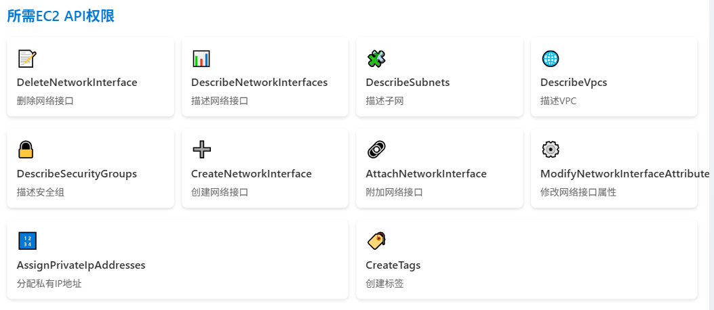

IP地址管理，也就是IPAM。这不仅仅是简单的分配IP地址，而是Cilium实现高效、可扩展网络的关键所在。Cilium如何判断一个节点是否需要IP地址？它不是简单地看有没有用完，而是进行了一套精密的计算。

核心思想是，比较当前节点可用的IP地址数量，与根据配置策略计算出来的所需IP数量。这个所需量，考虑了预分配的预留空间、最小分配数量以及最大分配上限。通过这个公式，Cilium能精确地判断出缺口大小，从而决定是否需要启动IP分配流程。这就像一个精明的管家，时刻关注着家里的资源，确保在需要时能及时补充。有缺口就有盈余，反之亦然。

```
availableIPS := len(spec.ipam.pool)
neededIPS = max(spec.ipam.pre-allocate - (availableIPS - len(status.ipam.used)),
                spec.ipam.min-allocate - availableIPS)
if spec.ipam.max-allocate > 0 {
    neededIPS = min(max(spec.ipam.max-allocate - availableIPS, 0),
                    neededIPS)
}
```

关键参数

```
spec.ipam.pool: IP池大小
status.ipam.used: 已使用IP地址数量
spec.ipam.min-allocate: 最小分配数量
spec.ipam.max-above-watermark: 水位线以上可释放的额外容量
```

当Cilium发现节点上的IP地址用得不够多，或者说有富余时，它会计算出可以释放多少。这个计算同样基于几个关键参数，特别是引入了水位线的概念。这个水位线由最小分配数量和一个额外的可释放上限组成。只有当可用IP数量超过这个水位线，且满足一定的条件，比如已用IP加预留的IP也小于水位线，Cilium才会考虑释放IP。

这个机制确保了即使在节点负载变化时，也能保持足够的IP地址冗余，避免频繁的创建和销毁。

当检测到IP缺口，节点就会被加入到一个需要分配的队列里。这个队列不是随机的，而是有讲究的。谁的缺口最大，谁就排在最前面，优先得到满足。而且，需要分配IP的节点会优先于需要释放IP的节点。这个队列不是实时处理的，而是按需触发，但为了保证响应速度，它最多每秒处理一次。这样既保证了效率，又不会过于频繁地打扰系统资源。

要分配IP，首先得找到合适的容器。这里的容器就是AWS的弹性网络接口，简称ENI。Cilium会先检查节点上已经存在的ENI，看看哪些还能用。它会排除掉主网卡eth0，可以通过配置spec.eni-first-interface-index来实现，然后检查每个ENI，看它是否还有空闲的IP地址，或者它关联的子网是否还有足够的IP地址。

计算公式如下

```
min(AvailableOnSubnet, 
     min(AvailableOnENI, 
         NeededAddresses + spec.ipam.max-above-watermark + surgeAllocate))
```

找到第一个满足条件的ENI，就选中它来分配新的IP地址。这个过程就像是在仓库里找合适的货架，既要满足容量，又要保证货架本身是可用的。选定了ENI，接下来就要决定在这个ENI上分配多少个IP地址。这个数量也不是拍脑袋决定的。它会综合考虑几个因素：子网里还有多少可用的IP，这个ENI本身还能容纳多少IP，之前算出来的缺口大小，再加上一个可选的额外缓冲量，以及应对突发情况的 surgeAllocate。

最终的分配数量是这几个值中的最小值，确保不会超量分配，也不会因为某个限制而无法满足需求。这就像给仓库补货，既要保证满足需求，又不能浪费空间。

具体的分配过程是这样的

- 首先，Cilium会检查现有的ENI，看看能不能在上面分配。
- 如果现有ENI都不合适，比如都满了，或者关联的子网没IP了，那就得创建一个新的ENI。
- 无论是哪种情况，最终都会调用AWS EC2的AssignPrivateIpAddresses API来完成IP地址的分配。

这里有个小细节，如果待创建的Pod数量很多，超过了预分配的IP，Operator会主动多分一些，避免后续Pod创建时卡住。所以，单次分配的IP可能比预设的pre-allocate要多，这是一种主动优化。分配有缺口，释放就有盈余。

当Cilium发现节点有IP地址可以释放时，它会先扫描所有符合条件的ENI，找到那个当前可用IP最多的一个。然后，根据之前提到的盈余计算公式，确定可以从这个ENI上释放多少个IP。这个释放量会受到预分配和额外缓冲区的限制。释放操作会调用UnassignPrivateIpAddresses API。

需要注意的是，即使释放了IP，ENI本身并不会被移除，它会继续留在节点上，方便后续可能需要再次使用。如果现有ENI都不够用，或者需要创建新的网络接口，Cilium会自动创建。这个过程的第一步是选择一个合适的子网。它会优先匹配VPC ID和可用区，如果配置了subnet-ids或subnet-tags，还会进一步筛选。如果没有明确指定，它会尝试和主网卡eth0在同一个子网里创建，如果不行，就退而求其次，选择VPC和可用区匹配的、并且有最多可用IP的子网。选好子网后，就要确定这个新ENI的接口索引号，通常会选择第一个空闲的、大于spec.eni-first-interface-index的索引。

选好子网和索引，接下来就是给ENI设置安全规则。Cilium会按照一定的优先级来决定附加哪些安全组。你可以直接指定安全组ID，或者通过标签来匹配。如果都没设置，就默认继承主网卡eth0的安全组。

安全设置好后，就可以正式创建ENI，并把它挂载到EC2实例上。最后，还会给ENI添加一个描述，方便识别，以及根据配置添加标签信息，方便后续管理和清理。ENI的生命周期管理也很重要。Cilium允许你配置一个删除策略，spec.eni.delete-on-termination。如果这个选项被设置为true，那么当这个ENI关联的EC2实例被终止时，这个ENI也会自动被删除，避免了资源的残留。这个删除策略是通过修改ENI的属性来实现的，确保了资源的整洁回收。

当一个节点被Kubernetes标记为要删除时，Kubernetes API Server会通知Cilium Operator。Operator收到这个消息后，会执行相应的清理操作。其中一个关键操作就是删除与该节点对应的ciliumnodes.cilium.io自定义资源。这个资源是Cilium用来管理节点状态的重要信息载体，删除它标志着Cilium对这个节点的管理结束。

为了让Operator能够顺利地创建和管理ENI，以及分配IP地址，它需要获得一系列的权限。这些权限主要集中在AWS EC2 API上，包括读取和修改网络接口、子网、VPC、安全组等信息，以及创建、删除、附加、修改这些资源。此外，如果启用了ENI自动回收或者IP释放功能，还需要额外的权限，比如DescribeTags、UnassignPrivateIpAddresses等。确保Operator拥有这些权限，是Cilium正常工作的前提。AWS实例类型对ENI的数量和每个ENI上的IP地址数量是有限制的。



目前，Cilium把这些限制值硬编码在了代码里，方便用户开箱即用。但如果你的实例类型特殊，或者需要修改这些限制，Cilium提供了两种方法。一种是在启动Operator时通过命令行参数--aws-instance-limit-mapping来指定自定义的限制。另一种更灵活的方式是通过--update-ec2-adapter-limit-via-api，直接调用EC2 API来获取最新的限制值，但这需要额外的DescribeInstanceTypes权限。

在Cilium管理ENI上的网络配置时，可能会遇到一些系统层面的干扰。比如，Linux系统自带的NetworkManager或systemd-network服务可能会试图自动给新出现的ENI设备分配DHCP地址，或者在链路中断时移除Cilium配置的IP地址。这会导致Cilium的配置失效。为了避免这种情况，你需要确保这些系统服务不会自动管理新添加的ENI设备。通常的做法是禁用它们，或者像这里展示的NetworkManager配置示例一样，明确告诉它们哪些设备是不受管理的。记住，Cilium是ENI网络配置的唯一主人。

## 地址转换

Pod通常使用的是私有地址，比如10.0.0.0/8段的RFC1918地址。当它们需要访问外部网络时，这些私有地址是无法直接路由的。为了解决这个问题，Cilium默认会自动进行地址转换，也就是Masquerading。它会把Pod发出的流量，源地址转换成节点自身的公网IP地址，这样外部网络就能看到并响应节点的请求了。这个功能是默认开启的，但如果你有特殊需求，可以通过配置enable-ipv4-masquerade或enable-ipv6-masquerade为false来禁用。

地址转换的配置也很灵活。你可以指定一个可路由的CIDR，比如你的Pod IP地址段10.0.0.0/8，告诉Cilium，只要是发往这个网络的流量，就不用进行地址转换了，可以直接路由。此外，你还可以指定哪些网络接口负责进行地址转换。Cilium实现地址转换有两种方式：

- 一种是基于eBPF的，这是推荐的，因为它高效，但目前依赖于bpf NodePort功能，未来会改进
- 另一种是基于iptables的传统方式，兼容性好，但性能稍差。

| 实现方式              | 原理                                                    | 优势           |
| :-------------------- | :------------------------------------------------------ | :------------- |
| 传统方式 (kube-proxy) | 通过 `iptables` 规则实现流量转发                        | 成熟，广泛兼容 |
| Cilium方式            | 监控Service和Endpoint变化，更新每个节点上的eBPF Map条目 | 更高效、更灵活 |

eBPF实现的地址转换，是Cilium推荐的高效方式。它直接在内核层面处理，性能优越。默认情况下，它还会启用bpf Host-Routing模式，但这需要留意一些依赖和限制。目前它依赖于bpf NodePort功能，但这个依赖关系会逐渐消除。需要注意的是，只有在运行了eBPF masquerading程序的设备上，这个转换才会生效。你可以通过ipMasqAgent.enabled=true启用一个更精细的配置工具，来定义哪些CIDR范围内的流量不进行转换，以及是否转换链路本地地址。

如果你的内核版本比较老，或者不希望使用eBPF，Cilium也提供了基于iptables的实现方式。这是传统方式，兼容性好，但性能上不如eBPF。默认情况下，它会在所有非Cilium网络设备上进行地址转换。你可以通过配置egress-masquerade-interfaces来指定哪些接口比如eth0或eth+进行转换。对于更高级的场景，比如路由层会根据目标地址选择不同的源地址，还可以启用enable-masquerade-to-route-source选项来实现更复杂的转换逻辑。

网络传输中，有时候数据包会因为MTU限制而被分片。对于像UDP这样的协议，它本身并不支持分片，这就会导致传输失败。Cilium默认会启用IPv4分片跟踪功能，让这些协议也能透明地传输大消息。你可以通过配置--enable-ipv4-fragment-tracking来控制它。不过要注意，如果同时运行了kube-proxy，可能会因为内核的一个MTU相关bug导致NodePort流量中断，这需要确保你的内核版本已经修复了这个问题。另外，这个分片跟踪功能目前还是Beta版，需要大家积极反馈。

Cilium在Kubernetes集群中扮演着多重角色。它不仅仅是提供网络连接，还实现了基于身份的NetworkPolicy，可以精细地控制Pod之间的三层四层通信。更进一步，它还扩展了NetworkPolicy，支持七层应用协议的策略控制，比如HTTP和Kafka。它还提供了Egress策略，可以控制Pod访问外部服务的权限。对于Headless Service，它能自动限制访问到服务的端点。当然，它也实现了ClusterIP，提供分布式负载均衡。

最重要的是，Cilium的设计是与现有kube-proxy模型兼容的。在Kubernetes中，Pod是容器部署的基本单元，每个Pod都有一个唯一的IP地址。在Cilium环境下，这个IP地址通常是从节点的IP地址段里分配出来的。默认情况下，如果没有特别的网络策略，集群内的所有Pod都可以互相访问。这些Pod的IP地址通常只在集群内部有效，如果需要访问集群外部的服务，流量就会自动经过我们前面讲到的地址转换机制，源地址会被替换为节点的公网IP。

Kubernetes的Service是实现负载均衡的关键。它提供了一个虚拟的IP地址，让客户端可以访问到后端多个Pod实例。传统的实现方式，比如kube-proxy，是通过在每个节点上配置大量的iptables规则来实现流量转发。而Cilium采用了一种更现代的方式：它同样监控Service和Pod的变更，但不是去修改iptables，而是更新每个节点上eBPF Map的数据。这种方式更高效、更灵活，也更符合现代网络技术的趋势。


