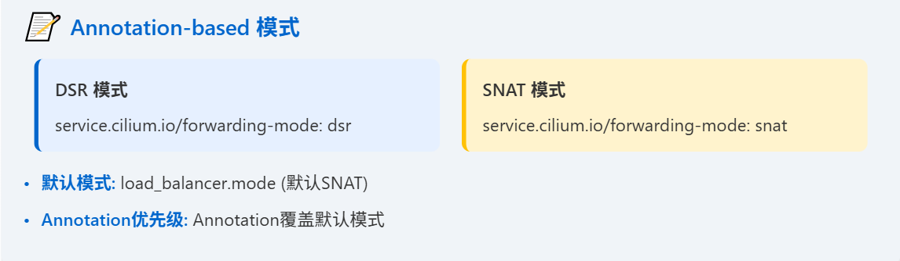
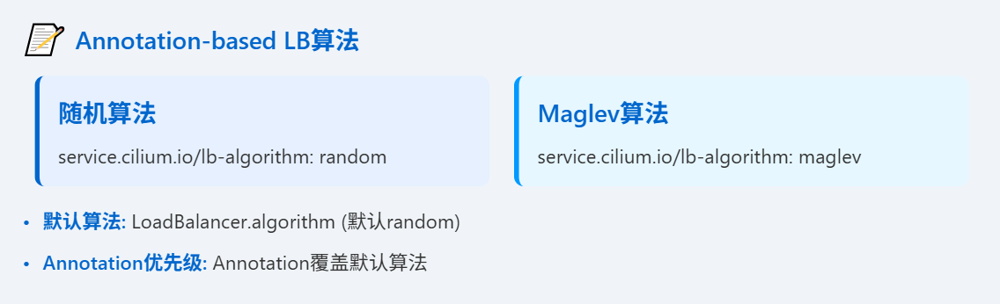

上节课我们深入探讨了网络策略与Kubernetes服务的集成，现在，我们将目光转向更具体的性能优化领域，特别是如何利用Cilium来提升负载均衡和网络加速的效率。这直接关系到应用的响应速度和用户体验。

## Maglev哈希

在一致性哈希的基础上，Maglev哈希提供了一种更强大的解决方案。它通过一个查找表，确保当后端服务器发生变化时，只有极少数流量被重新分配，通常不超过百分之一。这意味着什么？对于那些对一致性要求极高的场景，比如金融交易、实时监控等，Maglev能保证你的服务不会因为后端扩容或缩容而出现大规模的抖动。想象一下，如果每次服务升级后，用户访问路径都变得不稳定，那将是灾难性的。

Maglev就是为了解决这个问题而生的。它不仅适用于外部流量，还能与Cilium的XDP加速器完美结合，进一步提升性能。但要注意，对于集群内部的Pod间通信，由于是直接连接，没有中间环节，所以Maglev并不适用。

配置Maglev，关键在于两个参数：tableSize 和 hashSeed。

- tableSize 决定了查找表的大小，它必须足够大，至少是预期后端数量的100倍，而且必须是素数。Cilium默认是16381，支持一系列预设的素数，比如65521，适合大约650个后端。如果你的后端数量远超这个值，就需要手动调整。
- 另一个关键参数是 hashSeed，这是一个Base64编码的12字节随机数。强烈建议大家不要使用默认的固定种子，而是像示例里那样，通过命令 head -c12 /dev/urandom | base64 -w0 生成一个随机种子，并且在集群中所有节点上使用完全相同的种子。这就像给每个节点都设定了一个独特的、但又完全一致的密码，确保Maglev的查找逻辑在所有节点上都高度一致，避免出现路由混乱。

## DSR

我们来聊聊Direct Server Return，简称DSR。默认情况下，Cilium的NodePort工作在SNAT模式下。当一个外部请求到达节点，发现后端服务在另一个节点时，当前节点会先把请求包转发到后端，然后后端返回的数据包再经过当前节点进行SNAT转换，最后才返回给客户端。这个过程相当于多了一个跳转，增加了延迟。

更重要的是，SNAT会改变源IP，导致后端无法直接看到客户端的真实IP，这对于需要基于源IP进行策略控制的场景是个大问题。

而DSR模式则完全不同，**它让后端服务器直接回复客户端，省去了中间节点的转发和转换，大大降低了延迟**。同时，源IP也被保留下来，后端可以直接看到客户端的IP。当然，DSR也并非完美无缺，它需要调整MTU值，而且在某些云环境，比如AWS，可能需要关闭源/目的检查才能正常工作。

DSR如何实现呢？Cilium默认使用一种叫做IPv4 Option 或 IPv6 Extension Header 的机制来传递信息。简单来说，就是把服务的IP地址和端口信息，悄悄地塞进IP包的头部里，告诉后端服务器应该用哪个地址回复。这种方式在Native-Routing模式下效果很好，但问题是，有些网络设备，特别是老旧的路由器，可能不认识这种特殊的IP选项，或者干脆丢弃掉包含这些选项的包。这就好比你给一个只认普通话的翻译员递了一张写着外语的纸条，他可能根本看不懂。所以，如果你在某些云环境中遇到DSR连接失败，特别是后端节点没有收到请求的情况，可以尝试检查是否是这种兼容性问题。

如果确认是兼容性问题，可以考虑切换到另一种DSR实现方式：**Geneve隧道**。为了解决IPv4 Option可能遇到的兼容性问题，**Cilium提供了另一种DSR实现方式：Geneve DSR。这个方法不再直接修改IP包头部，而是通过Geneve隧道来封装数据包。**Geneve是一种通用的网络隧道协议，它在数据包外面加上一个额外的头，这个头里面就包含了服务的IP地址和端口信息。这样，即使底层网络设备不认识特殊的IP选项，只要它支持Geneve隧道，就能正确处理这个包，并将信息传递给后端服务器。

Geneve DSR不仅支持Native-Routing模式，也支持Encapsulation模式，但要注意，它不支持VXLAN封装。配置上，只需要将loadBalancer.dsrDispatch设置为geneve即可。这就像换了一种更通用的信封，确保信息能安全送达。

有时候，我们既想享受DSR带来的低延迟，又不想因为MTU调整而引入潜在问题。怎么办？Cilium提供了混合模式。在这种模式下，TCP连接会使用DSR，因为TCP协议本身对延迟敏感，而且可以通过SYN包携带服务信息来优化MTU调整。而UDP连接则会使用SNAT。这样做的好处是，既保证了主要应用协议TCP的低延迟，又避免了UDP流量需要手动调整MTU的麻烦。这就像在高速公路上，小汽车走快速通道DSR，大卡车走普通车道SNAT，各取所需。配置非常简单，只需要将loadBalancer.mode设置为hybrid即可。前面我们讲的都是全局的负载均衡模式，比如默认是SNAT，或者DSR。

但有时候，我们希望对不同的服务，采用不同的策略。比如，某个服务对延迟敏感，适合用DSR，而另一个服务对MTU调整比较敏感，更适合用SNAT。Cilium提供了基于Annotation的配置方式，让你可以在每个Service的定义里，通过添加注释来指定它应该使用哪种模式。比如，添加service.cilium.io/forwarding-mode: dsr，这个服务就会强制使用DSR。如果注释为空，或者没有注释，那么就按照全局的默认模式来。这种方式非常灵活，可以根据具体的服务需求进行精细化配置。当然，一旦服务创建完成，这个注释就不能轻易更改了，否则可能会导致连接中断。



除了DSR/SNAT模式，我们还可以通过Annotation来控制负载均衡算法的选择。默认情况下，如果全局没有指定，Cilium会使用随机算法。但如果你希望某个服务使用Maglev，以保证一致性哈希，就可以在它的Service定义里添加注释：service.cilium.io/lb-algorithm: maglev。同样，如果注释为空，或者没有注释，就按照全局的默认算法来。这种方式特别适合那些对性能要求不高的服务，或者后端节点数量很少的服务，可以避免使用Maglev带来的额外内存开销。配置也很简单，只需要设置bpf.lbAlgorithmAnnotation等于true，然后在Service定义里添加相应的注释即可。



Cilium通常在Socket层就完成了负载均衡，应用层看起来是直接连接到服务的ClusterIP，但实际上内核socket已经连接到了后端。但这在某些特殊场景下，比如Istio Sidecar、KubeVirt、Kata Containers、gVisor等，可能会出现问题。因为这些场景可能需要访问原始的ClusterIP，而不是经过Socket LB转换后的后端IP。为了解决这个问题，Cilium提供了Socket LB Bypass功能。通过设置socketLB.hostNamespaceOnly等于true，Cilium会绕过Socket层的负载均衡，让数据包回到TC层进行处理，这样就可以保证Pod内部的网络操作能够访问到正确的ClusterIP。这就像给特定的VIP用户开了一个后门，让他们可以绕过常规的安检通道。

## XDP加速

为了进一步榨干网络性能，Cilium引入了XDP加速。XDP，全称eXpress Data Path，它允许eBPF程序直接在网卡驱动的最底层，也就是网络数据包刚进入系统时，就进行处理。这比传统的TC层或Socket层要快得多。Cilium利用XDP来加速NodePort、LoadBalancer和externalIPs的处理，特别是当请求需要转发到远程节点时，可以在XDP层就完成转发决策，避免数据包在内核中多次拷贝。这就像给快递小哥配备了超级跑车，让包裹能更快地到达目的地。

当然，要启用这个功能，需要设置LoadBalancer.acceleration等于native。这通常需要较新的内核和对XDP友好的网卡驱动，比如SR-IOV网卡。

在AWS上部署XDP加速，有几个关键步骤。首先，你需要使用支持XDP的弹性网卡，比如m5n.xlarge实例。然后，确保你的内核版本至少是5.4.58，驱动版本至少是2.2.8。接下来是两个重要的网络配置：

```
MTU 降低: ip link set dev eth0 mtu 3498
Channel 调整: ethtool -L eth0 combined 2
```

- 降低MTU值和调整Channel参数。默认的MTU是9001，但为了XDP工作，需要降到3498。
- 通道数需要调整为Combined值的一半，比如Combined是4，就调整为2。这些操作通常需要通过SSH登录到每个节点上去执行。

配置完成后，就可以在Helm安装Cilium时，加上loadBalancer.acceleration=native参数来启用XDP加速了。

