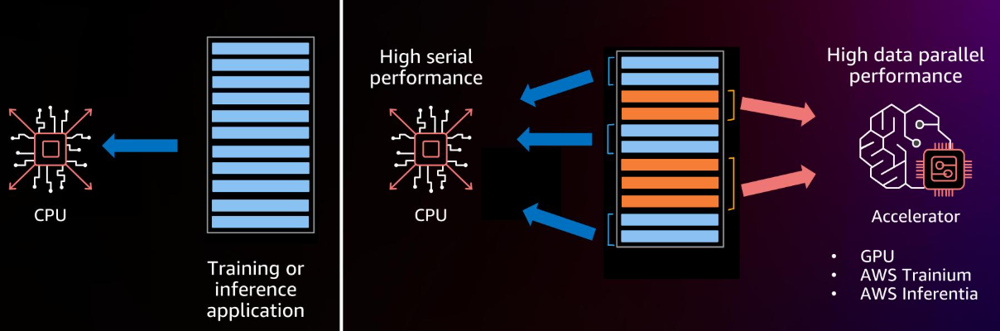
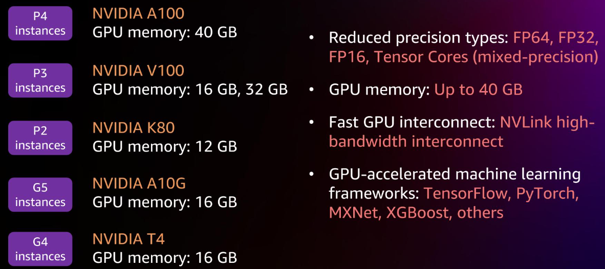
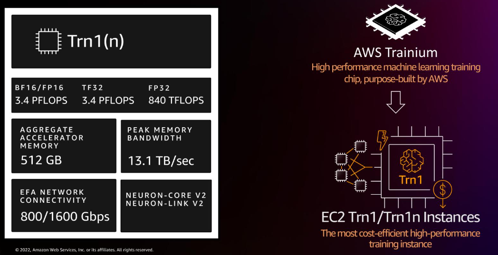
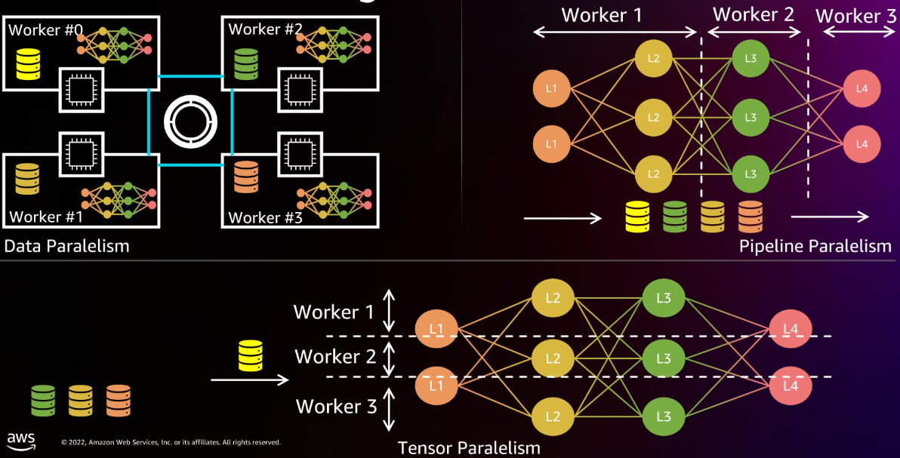
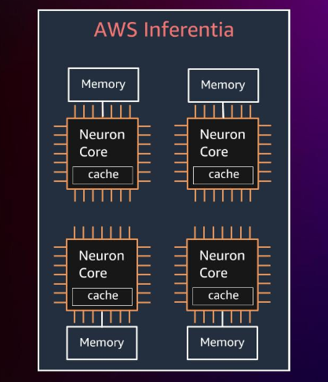
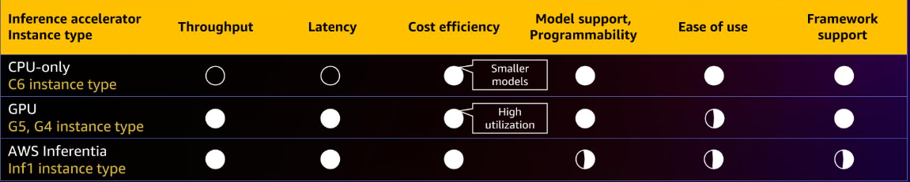

我们来看看机器学习训练的典型场景

| type             | architecture      | scene                                                 | dataset                   |
| ---------------- | ----------------- | ----------------------------------------------------- | ------------------------- |
| Small            | Small models      | Classic machine learning (ML)/shallow neural networks | Small/toy datasets        |
| Intermediate/big | Medium/big models | DL/big trees/clusters                                 | Intermediate/big datasets |
| Huge             | Transformers      | Models with 10Bi+ params                              | Huge datasets/TB          |

- 小型模型，比如经典的机器学习模型，或者浅层神经网络，通常使用小规模或玩具数据集。这类场景通常在资源有限的环境下，快速验证想法。
- 中大型模型，涉及深度学习、大型树或集群，以及中等规模的数据集。这需要更强的计算能力，但可能不需要极致的性能。
- 超大型模型，例如Transformer架构，参数量超过100亿，处理TB级数据集。这些是当前AI研究的前沿，对计算资源的要求极高。

在这些场景下，数据科学家们面临着严峻的挑战：他们需要在更短的时间内，以更低的成本，构建和部署各种类型、各种规模的机器学习模型。核心问题在于，如何找到最佳的性价比硬件配置，来支撑模型的构建和部署。基于这些挑战，我们经常遇到一些关键问题。比如，我应该选择CPU还是硬件加速器？是否需要分布式训练，还是单机训练足够？哪种文件系统最适合存储我的数据集？如何优化数据从文件系统到训练主机的传输？特别是对于那些模型参数量达到十亿级别，数据集达到TB级别的超大规模模型，我们该怎么办（可能是EC2 UltraClusters）？

在选择CPU和加速器时，我们需要权衡。

这张图展示了CPU与训练或推理应用的关系。CPU擅长处理串行计算，但面对大规模并行计算，比如深度学习模型，就显得力不从心。而加速器，如GPU、AWS Trainium和Inferentia，它们在并行计算能力上远超CPU，能够高效处理大规模数据并行计算。所以，选择哪种，取决于你的**任务是串行为主还是并行为主**。

现在我们聚焦于训练实例的选择。这是构建强大机器学习模型的第一步。AWS提供了多种用于机器学习训练的实例类型。这张图展示了主要的几类：

- CPU实例，如C5和M5；
- GPU实例，例如P4d、P3、G5、G4；
- AWS自研的专用加速器实例，如基于Trainium和Habana Gaudi的实例。

什么时候考虑使用CPU实例进行训练呢？

什么时候考虑使用CPU实例进行训练呢？当你的任务是传统机器学习模型，比如Scikit-learn；或者只是在原型设计深度学习模型；训练较小的深度学习模型；或者在较小数据集上进行微调；并且训练时间不敏感，可以接受以时间换取成本的策略。CPU选项提供了

- 从2到128个vCPU的多线程工作负载能力
- 内存从4到256GB
- 主流的C5、C6系列搭载Intel CPU，C5a、C6a搭载AMD CPU
- 多线程优化的Amazon SageMaker内置算法和框架，如TensorFlow、PyTorch、MXNet、XGBoost等。

GPU实例是训练大规模模型的主力军。AWS提供了多种GPU系列

- P4系列搭载NVIDIA A100，内存高达40GB；
- P3系列搭载NVIDIA V100，有16GB和32GB两种内存；
- P2系列搭载NVIDIA K80，内存12GB；
- G5系列搭载NVIDIA A10G，内存16GB；
- G4系列搭载NVIDIA T4，内存16GB

这些GPU支持多种精度类型，包括FP64、FP32、FP16以及Tensor Cores混合精度计算，内存最高可达40GB，通过NVLink高速互联，配合TensorFlow、PyTorch、MXNet、XGBoost等GPU加速的机器学习框架。

如何选择合适的GPU实例？这需要根据你的模型大小、数据量、预算和时间要求来决定。比如对于需要极致性能和最大内存的超大规模模型，P4d实例可能是一个选择。G5实例则提供了更经济的GPU训练选项，适合许多场景。

选择合适的GPU型号，需要仔细权衡性能和成本。现在，我们来介绍一个重要的选项：亚马逊EC2 Trn1斜杠Trn1n实例。这是AWS专为机器学习训练设计的高性能、高性价比的实例。它搭载了AWS自研的Trainium芯片，支持BF16斜杠FP16、TF32、FP32等精度，提供高达3.4 PFLOPS的BF16斜杠FP16性能，以及840 TFLOPS的FP32性能。总加速器内存高达512GB，峰值内存带宽达13.1 TB每秒。它还支持EFA网络连接，提供高达1600 Gbps的带宽，以及Neuron-Core V2和Neuron-Link V2接口。目标是成为最经济高效的高性能训练实例。

Trn1实例是如何设计的？它专为大规模扩展而生。相比P4d，它拥有60%更高的加速器内存，以及两倍的网络带宽。它原生支持PyTorch和TensorFlow，这意味着你可以直接在Trn1上训练，然后在任何地方部署。这张图展示了加速器内存的对比，Trn1的512GB内存是P4d的320GB的1.6倍。

Trn1在小批量时表现尤为高效，展现出强大的扩展能力。Trn1的扩展性设计体现在几个关键方面。

- 计算和通信的并行化。Trainium芯片集成了计算引擎和通信引擎，实现了计算和通信的高效协同。
- 采用了2D环状拓扑结构用于集体通信，这种结构在大规模分布式训练中非常高效。
- 还具备高速本地互联，例如EFA V2，确保节点间的数据交换畅通无阻。

这些设计共同支撑了Trn1的卓越扩展性能。对于大规模训练，分布式训练是必不可少的。主要有三种模式

- data并行，将数据分成多个部分，每个节点处理一部分数据，然后汇总梯度
- pipeline并行，将模型的不同层分配到不同的节点上，形成流水线
- tensor并行，将模型参数张量分解，分配到多个节点上。

选择哪种模式取决于你的模型结构、数据量和可用资源。AWS提供了强大的工具来支持这些分布式训练模式。亚马逊SageMaker是构建和部署机器学习模型的完整平台。它覆盖了从数据准备、模型构建、训练调优到部署管理的全流程。SageMaker的目标是民主化机器学习创新，让更多的团队，包括业务分析师，都能参与进来。它加速了机器学习的生命周期，将训练时间从小时级缩短到分钟级。它提供了强大的数据处理能力，可以处理结构化和非结构化数据。它还简化了机器学习流程，自动化和标准化了MLOps过程。

对于大型训练数据集，SageMaker提供了多种数据存储和访问方式。

- 对于中等和大型数据集，推荐使用Amazon S3。你可以选择文件模式，将数据复制到本地卷；或者快速文件模式，直接从S3流式传输数据，无需下载。
- 对于需要共享文件系统的场景，可以使用Amazon EFS，它优化了高性能计算，与S3原生集成。
- 对于需要极致性能的HPC场景，可以使用Amazon FSx for Lustre，同样与S3集成，提供高性能的文件访问。

现在，我们转向推理实例。推理是将训练好的模型应用到实际场景中的关键步骤。推理性能直接影响用户体验。推理过程中的关键环节包括：应用请求通过实例层，最终由模型处理。

性能指标主要围绕三个核心：

- 往返延迟，即用户等待响应的时间
- 吞吐量，即单位时间内处理的请求数量
- 成本

通常，延迟越低越好，吞吐量越高越好，但成本越低越好。我们需要在三者之间找到最佳平衡点，以满足应用需求。如何优化推理性能？可以从多个维度入手。

- 模型和运行时，包括选择合适的CPU、GPU或专用推理芯片，以及优化模型本身，如压缩、量化等。
- 服务栈，包括选择合适的模型服务器，如TorchServe、TensorFlow Serving、Nvidia Triton，以及配置动态批处理、工作线程数等参数。
- 计算和基础设施，包括网络配置、实例选择和部署方式。

GPU加速推理有哪些好处？

- 性能，GPU是吞吐量处理器，可以在期望的延迟下实现高吞吐量。
- 成本，虽然GPU本身成本较高，但如果你的模型较小、批量较小，或者推理请求不频繁，GPU利用率可能不高，导致单位推理请求成本上升。
- 易用性，所有主流深度学习框架都原生支持GPU加速。

还有NVIDIA TensorRT和Amazon SageMaker Neo编译器，可以轻松实现模型优化和量化，进一步提升性能。

AWS Inferentia是AWS首款专为机器学习推理设计的自研芯片。它包含四个NeuronCore，提供高达128 TOPS的算力。采用两级内存层次结构：片上大缓存和通用DRAM。支持FP16、BF16、INT8等多种数据类型，支持混合精度计算。芯片间互联速度快。

上图展示了四个NeuronCore的简化示意图，每个核心都连接到内存。AWS Inferentia有哪些优势？

- 性能，Inf1实例可以在较低成本下实现高吞吐量，相比GPU更具优势。如果你的模型被AWS Neuron SDK支持，并且满足你的延迟和吞吐量目标，Inf1是理想选择。
- 成本，对于YOLOv4、OpenPose、BERT、SSD等流行模型，Inf1在TensorFlow、MXNet、PyTorch上的成本比GPU更低。
- 易用性，AWS Neuron SDK提供了编译器、运行时、性能分析工具和TensorBoard支持。SDK还允许通过Python线程实现对Neuron Core的更高控制。

这张图表总结了不同推理加速器实例的性能对比。

CPU实例在成本效率上表现较好，但吞吐量和延迟较低。GPU实例如G5和G4在吞吐量和延迟方面表现优异，但成本效率相对较低。AWS Inferentia Inf1在性价比方面表现最佳，尤其在吞吐量和延迟上与GPU相当，但成本更低。

选择时需要根据你的具体需求权衡。亚马逊SageMaker提供了多种推理服务，以适应不同的场景。

- SageMaker Real-time Inference适合创建一个长期运行的微服务，响应负载大小不超过6MB的请求，可从外部应用调用，支持自动扩展。
- SageMaker Serverless Inference适用于不可预测的流量，可以容忍冷启动，支持自动扩展到零实例。
- SageMaker Asynchronous Inference适合处理大负载（高达1GB）的请求，处理超时较长（最长15分钟），也支持自动扩展到零实例，非常适合CV和NLP任务。
- SageMaker Batch Transform用于批量处理数据，可以按需付费，适合周期性到达的大规模数据。

为了帮助你选择合适的推理实例，SageMaker提供了[Inference Recommender](https://docs.amazonaws.cn/sagemaker/latest/dg/inference-recommender.html#:~:text=%E6%82%A8%E5%8F%AF%E4%BB%A5%E4%BD%BF%E7%94%A8%20Inference%20Recommender%20%E5%B0%86%E6%A8%A1%E5%9E%8B%E9%83%A8%E7%BD%B2%E5%88%B0%E4%BB%A5%E6%9C%80%E4%BD%8E%E6%88%90%E6%9C%AC%E6%8F%90%E4%BE%9B%E6%9C%80%E4%BD%B3%E6%80%A7%E8%83%BD%E7%9A%84%E5%AE%9E%E6%97%B6%E6%8E%A8%E7%90%86%E7%AB%AF%E7%82%B9%E3%80%82,Inference%20Recommender%20%E5%8F%AF%E5%B8%AE%E5%8A%A9%E6%82%A8%E4%B8%BA%E6%9C%BA%E5%99%A8%E5%AD%A6%E4%B9%A0%E6%A8%A1%E5%9E%8B%E5%92%8C%E5%B7%A5%E4%BD%9C%E8%B4%9F%E8%BD%BD%E9%80%89%E6%8B%A9%E6%9C%80%E4%BD%B3%E5%AE%9E%E4%BE%8B%E7%B1%BB%E5%9E%8B%E5%92%8C%E9%85%8D%E7%BD%AE%E3%80%82%20%E5%AE%83%E8%80%83%E8%99%91%E7%9A%84%E5%9B%A0%E7%B4%A0%E5%8C%85%E6%8B%AC%E5%AE%9E%E4%BE%8B%E6%95%B0%E9%87%8F%E3%80%81%E5%AE%B9%E5%99%A8%E5%8F%82%E6%95%B0%E3%80%81%E6%A8%A1%E5%9E%8B%E4%BC%98%E5%8C%96%E3%80%81%E6%9C%80%E5%A4%A7%E5%B9%B6%E5%8F%91%E9%87%8F%E5%92%8C%E5%86%85%E5%AD%98%E5%A4%A7%E5%B0%8F%E7%AD%89%E3%80%82)。它可以基于你的模型和目标性能指标，推荐合适的实例类型。它还能提供模型参数的调整建议，运行广泛的负载测试基准，与模型注册表集成，让你在SageMaker Studio中查看性能指标，自定义负载测试，微调模型、模型服务器和容器，并通过CloudWatch获取详细指标。这大大简化了推理部署的优化过程。