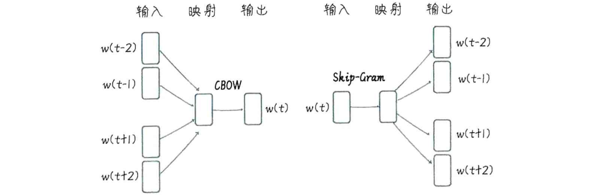
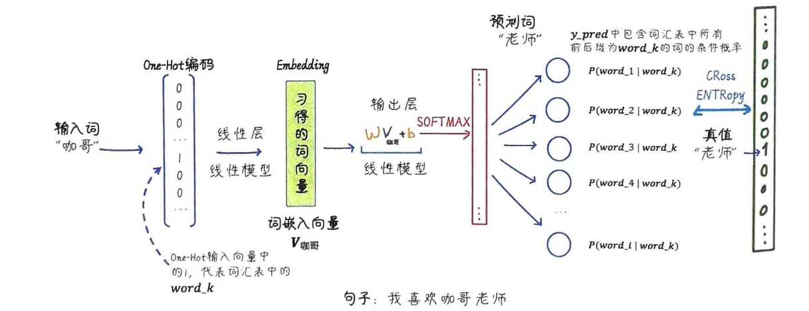

大家经常听到“词向量”和“词嵌入”，的核心都是把一个词，比如“猫”，变成一个数字向量。这个向量就代表了这个词的“语义特征”。如果两个词意思相近，比如“猫”和“小猫”，它们在向量空间里的距离就会很近，用数学上的余弦相似度来衡量，就是很高。所以，

- “词向量”更侧重于指那个具体的、数值化的向量本身，
- “词嵌入”则更侧重于指代整个过程，比如我们用什么算法去生成这些向量，以及生成的这个向量空间。

那么词向量是怎么来的呢？最著名的算法就是 Word2Vec。它的核心思想非常朴素，也很符合直觉，就是我们常说的近朱者赤，近墨者黑。Word2Vec就是利用这个原理，通过大量的文本数据训练，让模型学习到这种上下文关系。它会**把一个词和它周围的一些词一起输入到一个简单的神经网络里，让模型去预测中心词或者上下文词**。这样反复学习，词的向量就自然而然地学会了捕捉语义信息。

在介绍 Word2Vec 之前，我们先简单区分一下两种常见的向量表示：**稀疏向量和稠密向量**。

- One-Hot 编码，比如一个词汇表有 10 个词，那么每个词就对应一个 10 维的向量，只有对应位置是 1，其他都是 0。这种就是典型的稀疏向量，大部分元素都是 0，维度很高。

- Word2Vec 学习到的词向量，通常是几百维的，而且大部分元素都不为 0，这就是稠密向量。稠密向量的维度低，但信息量却很大，能更好地捕捉词语之间的语义关系。虽然计算量稍微大一点，但在 NLP 中，稠密向量通常效果更好，也更受欢迎。

**Word2Vec 的实现主要有两种方式：CBOW 和 Skip-Gram**。你可以把它们看作是两种不同的神经网络结构，用来完成同一个任务：学习词向量。

- CBOW，全称是 Continuous Bag-of-Words，可以理解为连续词袋模型，它的任务是**根据给定的上下文词，来预测中间的中心词**。
- Skip-Gram 则相反，它是给定一个中心词，预测它周围的上下文词。

虽然预测方向不同，但它们都是通过训练一个神经网络，让模型不断学习预测的准确性，最终，**网络中那些隐藏层的权重，就变成了我们想要的词向量**。



虽然它们预测的方向和目标不同，但本质上都是通过学习词语之间的共现关系，来训练一个神经网络，最终目的是得到那个隐藏层的权重，也就是词向量。你可以理解为，CBOW 是看周围猜中间，Skip-Gram 是看中间猜周围。

从神经网络的角度来看，这两个模型的结构其实很简单。

- Skip-Gram 模型，输入是中心词，经过隐藏层得到词向量，然后用这个向量去预测上下文词。

- CBOW 模型，它的输入是上下文词，经过一个隐藏层，得到一个词向量，然后用这个向量去预测中心词。

**关键在于那个隐藏层，它的权重就是我们要学习的词向量**。这两个模型都是浅层神经网络，但正是它们，开启了词向量表示的大门。

## Skip-Gram

理论讲完了，我们来看看怎么用代码实现 Skip-Gram 模型。我们会用到 PyTorch，这是一个非常流行的深度学习框架，它提供了强大的张量计算和神经网络构建能力。



整个流程大致是这样的

1. 构建实验语料库

   ```py
   sentences = ["Kage is Teacher", "Mazong is Boss", "Niuzong is Boss", "Xiaobing is Student", "Xiaoxue is Student",]
   
   词汇表： ['Niuzong', 'Boss', 'Student', 'Xiaoxue', 'Mazong', 'is', 'Kage', 'Xiaobing', 'Teacher']
   词汇到索引的字典： {'Niuzong': 0, 'Boss': 1, 'Student': 2, 'Xiaoxue': 3, 'Mazong': 4, 'is': 5, 'Kage': 6, 'Xiaobing': 7, 'Teacher': 8}
   ```

2. 生成 Skip-Gram 数据，对于句子 Kage is Teacher，如果窗口大小是2，那么 is 就是中心词，Kage 和 Teacher 就是上下文词

   ```
   [('is', 'Kage'), ('Teacher', 'Kage'), ('Kage', 'is')]
   ```

3. One-Hot 编码。

   ```
   One-Hot 编码前的单词： Teacher
   One-Hot 编码后的向量： tensor([0., 0., 0., 0., 0., 0., 0., 0., 1.])
   ```

4. 定义 Skip-Gram 类

   ```py
   import torch.nn as nn
   class SkipGram(nn.Module):
       
       def __init__(self, voc_size, embedding_size):
           super(SkipGram, self).__init__()
           # 从词汇表大小到嵌入层大小（维度）的线性层（权重矩阵）
           self.input_to_hidden = nn.Linear(voc_size, embedding_size, bias=False)  
           # 从嵌入层大小（维度）到词汇表大小的线性层（权重矩阵）
           self.hidden_to_output = nn.Linear(embedding_size, voc_size, bias=False)
           
       def forward(self, X): # 前向传播的方式，X 形状为 (batch_size, voc_size)      
            # 通过隐藏层，hidden 形状为 (batch_size, embedding_size)
               hidden = self.input_to_hidden(X) 
               # 通过输出层，output_layer 形状为 (batch_size, voc_size)
               output = self.hidden_to_output(hidden)  
               return output    
           
   embedding_size = 2 # 设定嵌入层的大小
   skipgram_model = SkipGram(voc_size, embedding_size)  # voc_size 为词表长度
   ```

5. 训练模型

   ```py
   learning_rate = 0.001 # 设置学习速率
   epochs = 1000 # 设置训练轮次
   criterion = nn.CrossEntropyLoss()  # 定义交叉熵损失函数
   
   import torch.optim as optim # 导入随机梯度下降优化器
   optimizer = optim.SGD(skipgram_model.parameters(), lr=learning_rate)  
   loss_values = []  # 用于存储每轮的平均损失值
   for epoch in range(epochs):
       loss_sum = 0 # 初始化损失值
       for context, target in skipgram_data:        
           X = one_hot_encoding(target, word_to_idx).float().unsqueeze(0) # 将中心词转换为 One-Hot 向量  
           y_true = torch.tensor([word_to_idx[context]], dtype=torch.long) # 将周围词转换为索引值 
           y_pred = skipgram_model(X)  # 计算预测值
           loss = criterion(y_pred, y_true)  # 计算损失
           loss_sum += loss.item() # 累积损失
           optimizer.zero_grad()  # 清空梯度
           loss.backward()  # 反向传播
           optimizer.step()  # 更新参数
       if (epoch+1) % 100 == 0: # 输出每 100 轮的损失，并记录损失
         print(f"Epoch: {epoch+1}, Loss: {loss_sum/len(skipgram_data)}")  
         loss_values.append(loss_sum / len(skipgram_data))
   ```

6. 展示词向量

   ```py
   for word, idx in word_to_idx.items(): # 输出每个词的嵌入向量
   	print(f"{word}: {skipgram_model.input_to_hidden.weight[:,idx].detach().numpy()}")
   ```

## CBOW

现在我们来看 CBOW 模型的实现。它的核心区别在于输入和输出的顺序。生成的数据格式是 (上下文词列表, 中心词)，比如 (Kage, [is, Teacher])。在模型的 forward 方法中，我们对每个上下文词都进行一次 Embedding，然后把它们的 Embedding 向量平均一下，得到一个综合的上下文表示，再用这个表示去预测中心词。

```py
import torch.nn as nn
class CBOW(nn.Module):
    def __init__(self, voc_size, embedding_size):
        super(CBOW, self).__init__()
        # 从词汇表大小到嵌入大小的线性层（权重矩阵）
        self.input_to_hidden = nn.Linear(voc_size, embedding_size, bias=False)  
        # 从嵌入大小到词汇表大小的线性层（权重矩阵）
        self.hidden_to_output = nn.Linear(embedding_size, voc_size, bias=False)  
    def forward(self, X): # X: [num_context_words, voc_size]
        # 生成嵌入：[num_context_words, embedding_size]
        embeddings = self.input_to_hidden(X)  
        # 计算隐藏层，求嵌入的均值：[embedding_size]
        hidden_layer = torch.mean(embeddings, dim=0)  
        # 生成输出层：[1, voc_size]
        output_layer = self.hidden_to_output(hidden_layer.unsqueeze(0)) 
        return output_layer    
embedding_size = 2
cbow_model = CBOW(voc_size,embedding_size)
```

训练过程也类似，输入是上下文词的 One-Hot 编码，输出是中心词的索引。

```py
learning_rate = 0.001 # 设置学习速率
epochs = 1000 # 设置训练轮次
criterion = nn.CrossEntropyLoss()  # 定义交叉熵损失函数
import torch.optim as optim # 导入随机梯度下降优化器
optimizer = optim.SGD(cbow_model.parameters(), lr=learning_rate)  
# 开始训练循环
loss_values = []  # 用于存储每轮的平均损失值
for epoch in range(epochs):
    loss_sum = 0 # 初始化损失值
    for target, context_words in cbow_data:
        # 将上下文词转换为 One-Hot 向量并堆叠
        X = torch.stack([one_hot_encoding(word, word_to_idx) for word in context_words]).float() 
        # 将目标词转换为索引值
        y_true = torch.tensor([word_to_idx[target]], dtype=torch.long) 
        y_pred = cbow_model(X)  # 计算预测值
        loss = criterion(y_pred, y_true)  # 计算损失
        loss_sum += loss.item() # 累积损失
        optimizer.zero_grad()  # 清空梯度
        loss.backward()  # 反向传播
        optimizer.step()  # 更新参数
    if (epoch+1) % 100 == 0: # 输出每 100 轮的损失，并记录损失
      print(f"Epoch: {epoch+1}, Loss: {loss_sum/len(cbow_data)}")  
      loss_values.append(loss_sum / len(cbow_data))
```

这张表总结了 Skip-Gram 和 CBOW 的区别。

| 模型          | 训练目标                                                     | 结构                                                         | 性能                                                         |
| ------------- | ------------------------------------------------------------ | ------------------------------------------------------------ | ------------------------------------------------------------ |
| Skip-Gram模型 | 给定一个目标词，预测上下文词。因此，它的训练目标是在给定目标词的情况下，使上下文词出现的条件概率最大化 | 模型首先将目标词映射到嵌入向量空间，然后从嵌入向量空间映射回词汇表空间以预测上下文词的概率分布 | 由于其目标是预测多个上下文词，其在捕捉稀有词和更复杂的词语关系方面表现得更好 |
| CBOW模型      | 给定上下文词，预测目标词。因此，它的训练目标是在给定上下文词的情况下，使目标词出现的条件概率最大化 | 模型首先将上下文词映射到嵌入向量空间，然后从嵌入向量空间映射回词汇表空间以预测目标词的概率分布 | 由于其目标是预测一个目标词，其在训练速度和捕捉高频词语关系方面表现得更好 |

最后，我们来总结一下词向量的学习过程。我们的目标是通过神经网络，学习到包含词义信息的稠密向量。我们用 Skip-Gram 或者 CBOW 模型，通过训练一个简单的神经网络，让模型预测上下文词或中心词，这个过程实际上是在学习词向量。最终，我们得到的词向量，可以用来表示词语之间的相似性。这些词向量可以作为其他 NLP 任务的输入特征，比如文本分类、情感分析等等。

我们再来对比一下 Bag-of-Words 和 Word2Vec。

| 特点                     | Bag-of-Words                 | Word2Vec                                 |
| ------------------------ | ---------------------------- | ---------------------------------------- |
| 稀疏性 vs 密集性         | 高维稀疏向量，计算效率低     | 低维密集向量，计算效率更高               |
| 上下文无关 vs 上下文敏感 | 忽略上下文信息               | 能够捕获单词之间的上下文关系             |
| 语义关系                 | 无法捕捉单词之间的语义关系   | 能捕获单词之间的语义和语法关系           |
| 参数共享                 | 每个单词的向量表示都是唯一的 | 参数共享，能够减少参数数量，提高泛化能力 |

Word2Vec 的出现，是 NLP 领域在表示词语和处理语义方面的一个重要进步。当然，Word2Vec 也不是完美的。它有几个主要的局限性。

- 它生成的是静态词向量，每个词只有一个固定的向量，无法捕捉词语的多义性，比如一个词在不同语境下可能有不同含义。
- 它无法处理未知词，也就是 OOV 问题，对于训练语料库中没有出现过的词，或者低频词，Word2Vec 就无能为力了。
- 虽然它能预测词，但本质上它更侧重于学习词嵌入，而不是像后来的 Transformer 这样的模型，能够更好地建模整个句子的上下文概率。