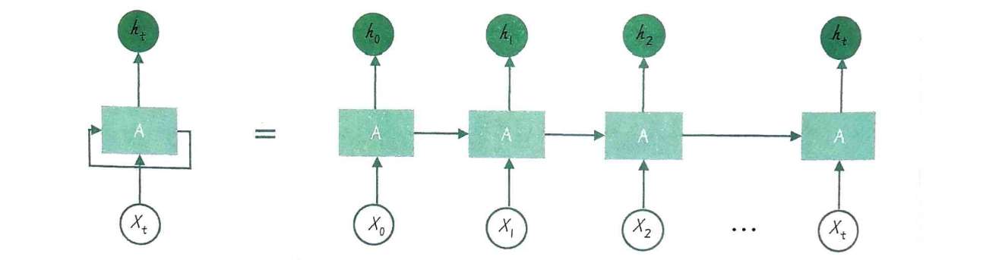

上节课我们聊了词向量表示，像Word2Vec这样的模型，它确实能捕捉到词语之间的语义关系，但问题在于，它本质上还是在孤立地看待每个词。英文的“Apple”，可以指苹果公司，也可以指水果。这种一词多义的特性，以及词语在上下文中的微妙变化，Word2Vec这种固定向量的表示方式就捉襟见肘了。而且，它还不能处理新词，一旦遇到词表里没有的词，就束手无策。所以，尽管有了词向量，NLP领域在很长一段时间内，也就是所谓的深度学习元年之前，其实并没有迎来真正的突破。

大家看看那些当年最火的AI应用，什么ImageNet图像分类、人脸识别、AlphaGo下围棋，还有后来GAN生成假照片，这些都跟NLP关系不大。这说明什么？说明NLP的技术瓶颈确实存在，尤其是在处理长距离依赖关系和复杂语义方面，当时的模型很难做到。如何让NLP技术真正落地，解决实际问题，成了当时NLP学者们最头疼的问题。

## NPLM

就在2003年，约书亚·本希奥及其团队发表了一篇划时代的论文，题目就是《一种神经概率语言模型》。这篇论文的核心思想，就是把神经网络这个强大的工具，引入到语言模型的构建中。这就像在黑暗中看到了一盏明灯，为NLP领域指明了方向，开辟了神经网络在语言处理领域的应用，也为后来的深度学习模型奠定了基础。可以说，NPLM的出现，标志着NLP进入了一个新的阶段。

在NPLM之前，主流的语言模型是啥？N-Gram。简单说，就是数数，看某个词在前几个词出现的频率高不高，然后预测下一个词。这种方法简单粗暴，但遇到问题就来了。比如，如果一个词很少出现，或者两个词之间距离很远，N-Gram就很难准确预测。而NPLM就不一样了，它利用神经网络强大的非线性拟合能力，直接学习词汇之间的概率分布。这就好比，N-Gram是靠经验统计，而NPLM是用神经网络这个大脑去学习规律，自然更强大。当然，代价是计算量也上去了，但效果提升是显著的。

我们来看一下NPLM的内部构造。它主要由三层组成：输入层、隐藏层和输出层。

- 输入层，就是我们熟悉的词嵌入，把离散的词变成连续的向量。
- 隐藏层，这是核心，它通过一个非线性激活函数，比如tanh，来学习词与词之间的复杂关系，捕捉上下文信息。
- 输出层，通常用一个全连接层，再接上一个softmax函数，得到每个词作为下一个词的概率。

理论讲完了，我们来看看怎么一步步实现一个NPLM。

1. 构建实验语料库

   ```
   sentences = ["我 喜欢 玩具", "我 爱 爸爸", "我 讨厌 挨打"] 
   词汇表： {'爸爸': 0, '喜欢': 1, '玩具': 2, '讨厌': 3, '挨打': 4, '爱': 5, '我': 6}
   ```

2. 生成NPLM训练数据

   ```
   输入批处理数据： tensor([[6, 3],[6, 1]])
   输入批处理数据对应的原始词： [['我', '讨厌'], ['我', '喜欢']]
   目标批处理数据： tensor([4, 2])
   目标批处理数据对应的原始词： ['挨打', '玩具']
   ```

3. 定义NPLM模型

   - self.C：一个词嵌入层，用于将输入数据中的每个词转换为固定大小的向量表 示。voc_size表示词汇表大小，embedding_size表示词嵌入的维度。
   - self.linear1：第一个线性层，不考虑批次的情况下输入大小为n_step*embedding_size，输出大小 n_hidden。n_step表示时间步数，即每个输入序列的长度；embedding_size表示词嵌入的维度；n_hidden表示隐藏层的大小。
   - self.linear2：第二个线性层，不考虑批次的情况下输入大小为n_hidden，输出大小为voc_size。n_hidden表示隐藏层的大小，voc_size表示词汇表大小。

   ```py
   import torch.nn as nn # 导入神经网络模块
   # 定义神经概率语言模型（NPLM）
   class NPLM(nn.Module):
       def __init__(self):
           super(NPLM, self).__init__() 
           self.C = nn.Embedding(voc_size, embedding_size) # 定义一个词嵌入层
           # 第一个线性层，其输入大小为 n_step * embedding_size，输出大小为 n_hidden
           self.linear1 = nn.Linear(n_step * embedding_size, n_hidden) 
           # 第二个线性层，其输入大小为 n_hidden，输出大小为 voc_size，即词汇表大小
           self.linear2 = nn.Linear(n_hidden, voc_size) 
       def forward(self, X):  # 定义前向传播过程
           # 输入数据 X 张量的形状为 [batch_size, n_step]
           X = self.C(X)  # 将 X 通过词嵌入层，形状变为 [batch_size, n_step, embedding_size]
           X = X.view(-1, n_step * embedding_size) # 形状变为 [batch_size, n_step * embedding_size]
           # 通过第一个线性层并应用 ReLU 激活函数
           hidden = torch.tanh(self.linear1(X)) # hidden 张量形状为 [batch_size, n_hidden]
           # 通过第二个线性层得到输出 
           output = self.linear2(hidden) # output 形状为 [batch_size, voc_size]
           return output # 返回输出结果
       
   NPLM(
     (C): Embedding(7, 2)
     (linear1): Linear(in_features=4, out_features=2, bias=True)
     (linear2): Linear(in_features=2, out_features=7, bias=True)
   )
   ```

4. 实例化NPLM模型，训练NPLM模型

   ```py
   import torch.optim as optim # 导入优化器模块
   criterion = nn.CrossEntropyLoss() # 定义损失函数为交叉熵损失
   optimizer = optim.Adam(model.parameters(), lr=0.1) # 定义优化器为 Adam，学习率为 0.1
   # 训练模型
   for epoch in range(5000): # 设置训练迭代次数
       optimizer.zero_grad() # 清除优化器的梯度
       input_batch, target_batch = make_batch() # 创建输入和目标批处理数据
       # input_batch = tensor([[6, 1], [6, 3]])   
       # target_batch = tensor([2, 4])
       output = model(input_batch) # 将输入数据传入模型，得到输出结果
       loss = criterion(output, target_batch) # 计算损失值
       if (epoch + 1) % 1000 == 0: # 每 1000 次迭代，打印损失值
        print('Epoch:', '%04d' % (epoch + 1), 'cost =', '{:.6f}'.format(loss))
       loss.backward() # 反向传播计算梯度
       optimizer.step() # 更新模型参数
   ```

5. 用NPLM预测新词

   ```py
   # 进行预测
   input_strs = [['我', '讨厌'], ['我', '喜欢']]  # 需要预测的输入序列
   # 将输入序列转换为对应的索引
   input_indices = [[word_to_idx[word] for word in seq] for seq in input_strs]
   
   # 将输入序列的索引转换为张量
   input_batch = torch.LongTensor(input_indices) 
   # 对输入序列进行预测，取输出中概率最大的类别
   predict = model(input_batch).data.max(1)[1]  
   # 将预测结果的索引转换为对应的词
   predict_strs = [idx_to_word[n.item()] for n in predict.squeeze()]  
   for input_seq, pred in zip(input_strs, predict_strs):
      print(input_seq, '->', pred)  # 打印输入序列和预测结果
   ```

回顾一下NPLM，它的贡献是划时代的。它把神经网络带进了NLP领域，开启了深度学习的大门。从此以后，我们不再需要费力地设计各种人工特征，模型可以自动学习。它能处理大规模数据，捕捉到更复杂的语言模式。但是，NPLM本身也有不少局限。它的结构比较浅，表达能力有限，处理不了太长的句子，对长距离依赖关系也不够敏感，训练效率不高，而且死板地依赖于固定词汇表，遇到新词就抓瞎。

## RNN

这些局限，正是后来RNN、LSTM等模型要解决的问题。为了解决NPLM的这些问题，特别是处理长句子和捕捉长距离依赖，研究人员提出了循环神经网络，也就是RNN。RNN的核心思想非常巧妙，就是引入了循环。它**不像NPLM那样只看固定窗口，而是把前面的信息记住，传递给后面**。这样，它就能处理任意长度的序列，并且有能力记住很久以前的信息，从而捕捉到长距离依赖关系。这在处理像文本这样的序列数据时，优势非常明显。我们来看RNN的基本结构。

- 它有一个隐藏层，这个隐藏层的状态是会随着时间步更新的。
- 每个时间步，RNN会接收当前的输入，然后结合上一个时间步的隐藏状态，计算出当前的隐藏状态。
- 这个隐藏状态会同时传递给下一个时间步的RNN单元，以及当前时间步的输出层。
- RNN在每个时间步使用相同的权重（RNN具有参数共享的特性。这意味着在不同时间步，RNN使用相同的权
  重矩阵（W_hh，W_xh和W_hy）和偏置（b_h和b_y）进行计算）。这使得它能够处理任意长度的输入序列，非常灵活。



RNN是如何工作的呢？简单来说，就是一步一步地处理序列。

- 每个时间步t，它接收当前的输入x_t，然后用一个公式，把当前的隐藏状态h_t-1和输入x_t结合起来，计算出新的隐藏状态h_t。这个公式通常用tanh激活函数。
- 有了新的隐藏状态h_t，再通过另一个线性变换和softmax函数，得到当前时间步的输出y_t。
- 这个过程是沿着时间序列一步步展开的。

**训练RNN时，我们用的是BPTT，也就是通过时间反向传播**。RNN采用BPTT算法进行训练。与普通反向传播不同，BPTT算法需要在时间维度上展开RNN，以便在处理时序依赖性时计算损失梯度。因此，BPTT算法可以看作一种针对具有时间结构的数据的反向传播算法。

BPTT算法的关键在于，我们需要将梯度沿着时间步（对于自然语言处理问题来说，时间步就是文本序列的token）反向传播，从输出层一直传播到输入层。具体步骤如下。

1. 根据模型的输出和实际标签计算损失。对每个时间步，都可以计算一个损失值，然后对所有时间步的损失值求和，得到总损失。
2. 计算损失函数关于模型参数（权重矩阵和偏置）的梯度。这需要应用链式求导法则，分别计算损失函数关于输出层、隐藏层和输入层的梯度。然后将这些梯度沿着时间步传播回去。
3. 使用优化算法（如梯度下降法、Adam等）来更新模型参数。这包括更新权重矩阵（W_hh，W_xh和W_hy）和偏置（b_h和b_y)。经过多轮迭代训练，RNN模型的参数不断更新，从而使得模型在处理序列数据时的性能不断提高。

这个算法会把整个序列展开，然后计算梯度，再反向传播回去更新参数。虽然RNN很强大，但也不是完美的。它最大的问题就是梯度消失和梯度爆炸。这导致它在处理很长的序列时，很难记住前面的信息，也就是长距离依赖学不好。另外，**RNN是顺序计算的，没法并行计算，效率比较低**。

为了解决这些问题，人们又发明了LSTM和GRU。它们都是RNN的变体，但引入了门控机制，就像给信息流动加了开关，可以更好地控制哪些信息需要保留，哪些信息需要遗忘，从而更好地捕捉长距离依赖。

我们来看一个RNN的实战例子。我们还是用刚才那个简单的数据集，但是这次，我们用一个LSTM层来替换掉NPLM里的第一个线性层。这样，我们的模型就变成了：词嵌入层 -> LSTM层 -> 线性层。LSTM层会接收输入序列的词嵌入，然后逐个时间步处理，输出一系列的隐藏状态。我们通常只取最后一个时间步的隐藏状态，作为线性层的输入，来预测下一个词。

```py
import torch.nn as nn # 导入神经网络模块
# 定义神经概率语言模型（NPLM）
class NPLM(nn.Module):
    def __init__(self):
        super(NPLM, self).__init__() # 调用父类的构造函数
        self.C = nn.Embedding(voc_size, embedding_size) # 定义一个词嵌入层
        # 用 LSTM 层替代第一个线性层，其输入大小为 embedding_size，隐藏层大小为 n_hidden
        self.lstm = nn.LSTM(embedding_size, n_hidden, batch_first=True) 
        # 第二个线性层，其输入大小为 n_hidden，输出大小为 voc_size，即词汇表大小
        self.linear = nn.Linear(n_hidden, voc_size) 
    def forward(self, X):  # 定义前向传播过程
        # 输入数据 X 张量的形状为 [batch_size, n_step]
        X = self.C(X)  # 将 X 通过词嵌入层，形状变为 [batch_size, n_step, embedding_size]
        # 通过 LSTM 层
        lstm_out, _ = self.lstm(X) # lstm_out 形状变为 [batch_size, n_step, n_hidden]
        # ！！！只选择最后一个时间步的输出作为全连接层的输入，通过第二个线性层得到输出 
        output = self.linear(lstm_out[:, -1, :]) # output 的形状为 [batch_size, voc_size]
        return output # 返回输出结果
```

这个改动，就是把NPLM变成了一个RNN模型。这个RNN模型主要由几个参数决定：词嵌入的维度，LSTM隐藏层的大小。在PyTorch中，LSTM层的输入是一个形状为 batch_size, seq_length, input_size 的张量，其中 seq_length 是序列长度。还有一个可选的初始隐藏状态 h_0。最关键的是，RNN不再需要像NPLM那样，预先设定一个固定的时间步数 n_step。它可以处理任意长度的序列，这是RNN的一个巨大优势。

刚才我们提到了LSTM的门控机制，这里稍微展开一下。LSTM内部有三个主要的门：输入门、遗忘门和输出门。

- 输入门决定哪些新信息可以加入到细胞状态里
- 遗忘门决定哪些旧的、不重要的信息要从细胞状态里移除
- 输出门决定哪些细胞状态的信息要输出到隐藏状态

通过这些门的精妙配合，LSTM就能有效地记住长期信息，同时忽略短期干扰。这些公式展示了门控机制的计算过程，**核心思想就是控制信息的流动**。尽管RNN及其变体，特别是LSTM，曾经在NLP领域取得了巨大的成功，甚至可以说是SOTA，但它们仍然存在一些固有的局限性。比如，

- **顺序计算的特性限制了并行计算能力**
- 长距离依赖的处理能力在某些情况下仍然不足，可扩展性也受到挑战。

在RNN时代，NLP应用落地整体效果不佳，除了模型本身，也受限于当时数据量、计算资源和优化算法的水平。当然，RNN的出现已经极大地推动了NLP的发展，为后续更强大的模型如Transformer奠定了基础。