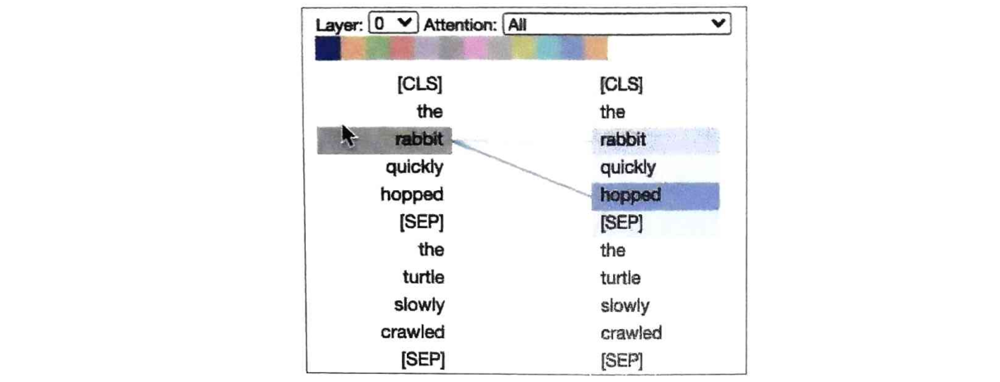
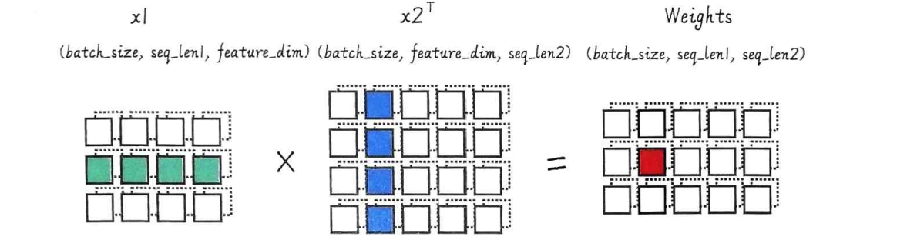
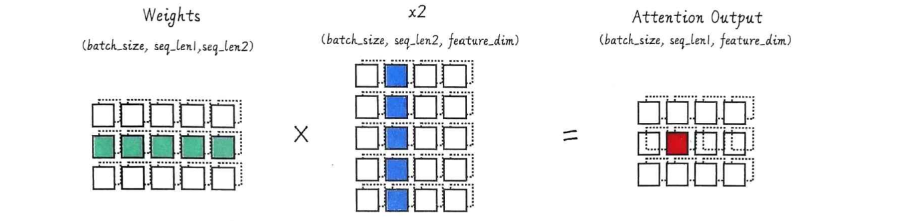
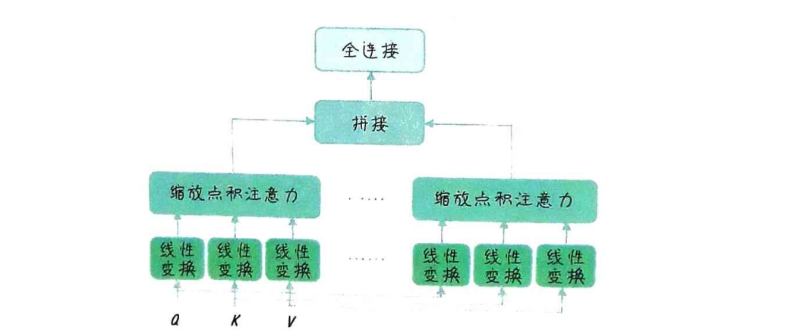
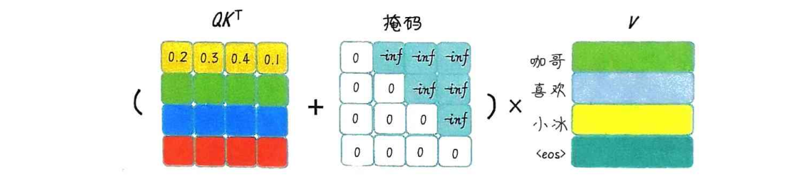

大家有没有注意到，当序列变长时，比如翻译一篇长文章，或者处理一个长句子，RNN这种编码器就有点力不从心了。它把整个序列信息压缩到一个固定大小的向量里，信息丢失严重，而且很难记住前面的细节，特别是对于长距离依赖关系，比如一个句子开头的主语和后面动词的搭配关系，RNN可能就忘了。

所以，我们需要一种更聪明的方法，让模型能够像我们人类一样，看问题的时候，知道哪些地方是重点，哪些地方可以忽略。这就是我们今天要讲的注意力机制。具体来说，RNN的编码器在处理输入序列时，比如一个英文句子，它会一步步地读取每个单词，然后更新内部状态。最后，它会输出一个固定长度的向量，这个向量试图代表整个句子的意思。问题在于，**这个过程是单向的，信息在压缩过程中不可避免地丢失，尤其是对于长句子，早期信息可能被覆盖**。而且，**RNN对每个词都同等对待**，无法区分哪些词更重要，哪些词是背景信息。这种一刀切的处理方式，对于捕捉复杂的语义关系，比如长距离的指代关系，就显得非常吃力了。

所以，注意力机制的核心思想就是：让模型在处理序列时，能够动态地分配注意力权重。简单来说，就是**让模型在处理当前输入时，不仅关注当前的词，还要回顾之前的信息，并且根据当前的上下文，决定哪些词更重要**。注意力机制就是让机器也学会这种“看重点”的能力，从而更好地理解序列信息，捕捉上下文关系，最终提升模型的性能。



这张图展示了BERT模型在处理句子时的注意力机制。左边是原始句子，右边是模型生成的句子。每个词旁边的颜色条代表了注意力权重，颜色越深，表示该词在模型生成当前输出时被关注得越多。像rabbit和hopped这样的词，它们之间的注意力权重很高，说明模型在处理hopped这个词的时候，特别关注了rabbit这个词，因为它们是主语和谓语的关系，这对理解句子结构至关重要。这就是注意力机制在工作：它让模型在生成每个词时，能够动态地回顾和利用之前输入序列中相关的部分信息，而不是像以前那样，只能依赖于一个固定的、压缩后的向量。

## 点积注意力

我们来看最基础的注意力机制：点积注意力。想象我们有两个张量，x1和x2，它们分别代表了两个序列的信息。我们的目标是计算x1对x2的注意力，也就是x1中的每个位置，应该关注x2中的哪些位置。这个过程大致分为四个步骤。

- 创建两个形状分别为（batch_size，seq_len1，feature_dim）和（batch_size,seq_len2,feature_dim)的张量x1和x2。
- 将x1中的每个元素和x2中的每个元素进行点积，得到形状为（batch_size，seq_len1，seq_len2）的原始权重raw_weights。
- 用softmax函数对原始权重进行归一化，得到归一化后的注意力权重attn_weights（注意力权重的值在0和1之间，且每一行的和为1），形状仍为（batch_size, seq_len1, seq_len2）
- 用注意力权重attn_weights对x2中的元素进行加权求和（与x2相乘），得到输出张量y，形状为（batch_size，seq_len1，feature_dim)。这就是x1对x2的点积注意力。

我们来看一下这个过程的代码实现。

```py
import torch # 导入 torch
import torch.nn.functional as F # 导入 nn.functional
# 1. 创建两个张量 x1 和 x2
x1 = torch.randn(2, 3, 4) # 形状 (batch_size, seq_len1, feature_dim)
x2 = torch.randn(2, 5, 4) # 形状 (batch_size, seq_len2, feature_dim)
# 2. 计算原始权重
raw_weights = torch.bmm(x1, x2.transpose(1, 2)) # 形状 (batch_size, seq_len1, seq_len2)
# 3. 用 softmax 函数对原始权重进行归一化
attn_weights = F.softmax(raw_weights, dim=2) # 形状 (batch_size, seq_len1, seq_len2)
# 4. 将注意力权重与 x2 相乘，计算加权和
attn_output = torch.bmm(attn_weights, x2)  # 形状 (batch_size, seq_len1, feature_dim)
```

重点看一下第二步：计算原始权重。我们使用了torch.bmm，也就是**批量矩阵乘法**。这个函数很强大，它能同时处理多个矩阵的乘法。在这个例子中，x1的形状是batch, seq_len1, feature_dim，而x2转置后是batch, feature_dim, seq_len2。bmm将它们相乘，结果raw_weights的形状是batch, seq_len1, seq_len2。这个过程**实际上是在计算x1中的每个位置向量，与x2中的所有位置向量之间的点积。这个点积值就是它们之间的相似度得分，越大表示越相似**。所以，这个原始权重矩阵就是一张相似度地图，告诉我们x1的每个位置和x2的每个位置有多相关。



得到了原始权重矩阵 raw_weights 后，我们还需要进行归一化。为什么要归一化呢？因为原始权重只是相似度得分，没有概率意义。我们希望得到一个权重，它能表示每个位置的重要性，并且所有权重加起来等于1，这样才符合概率分布的性质。这就是Softmax函数的作用。我们沿着 dim=2 的方向，也就是 seq_len2 的方向，对 raw_weights 应用 F.softmax。Softmax 的作用就像一个裁判，把所有相似度得分都拉到一个公平的尺度上，得分高的位置权重就高，得分低的权重就低，而且所有权重加起来正好等于1。这样，我们就得到了真正的**注意力权重 attn_weights，它告诉我们 x1 中的每个位置，应该关注 x2 中的哪些位置，以及关注的程度**。

**这里使用bmm的意义是求加权和，这与之前用bmm求两个向量相似度不同**



最后一步，我们用计算得到的注意力权重attn_weights，去加权求和x2。这个过程就是用torch.bmm将attn_weights和x2相乘。这次的bmm操作，意义是将x2中的每个位置向量，乘以它在attn_weights中对应的权重，然后把所有这些加权后的向量求和。这个结果attn_output，就是我们最终的注意力输出。它是一个新的张量，形状和x1一样，batch, seq_len1, feature_dim。这个输出向量包含了x2中所有信息的加权平均，但权重是由注意力机制决定的。也就是说，**attn_output融合了x2中所有位置的信息**，但更侧重于那些权重高的位置，也就是模型认为更重要的部分。

我们来回顾一下点积注意力的核心步骤。它通过计算两个向量的点积得到相似度，然后用Softmax进行归一化得到权重，最后用权重对另一个向量进行加权求和。这个过程最终输出的是一个注意力输出，它融合了原始输入序列的信息，但权重是动态的。这使得模型能够更好地理解序列中的相关性。

比如，我们之前提到的例子，用户特征 x1 关注电影特征 x2，通过注意力机制，我们可以得到一个包含用户兴趣的电影特征向量（关注了x2之后的“新×1”），这个向量就比原始的电影特征向量更能反映用户的偏好。这就是注意力机制的核心价值。

## 缩放点积注意力

刚才我们讲的点积注意力，虽然简单，但有一个潜在的问题，尤其是在特征维度 d 很大的时候。当两个向量维度很高时，它们的点积结果可能非常大，比如几百上千甚至更大。如果直接把这么大的值送入 Softmax，Softmax 函数会在一个非常陡峭的区域工作，导致梯度变得非常小，甚至消失，这会影响模型训练的稳定性。为了解决这个问题，我们引入了**缩放点积注意力**。

缩放点积注意力（ScaledDot-ProductAttention）和点积注意力（Dot-ProductAttention）之间的主要区别在于：缩放点积注意力在计算注意力权重之前，会将点积结果也就是原始权重除以一个缩放因子，得到缩放后的原始权重。通常，这个缩放因子是输入特征维度的平方根。

它的核心思想很简单：**在 Softmax 之前，先把点积结果除以一个缩放因子，通常是 d_k 的平方根，也就是 K 向量的维度的平方根**。这样做是为了让点积结果的值落在一个更平缓的区域，避免梯度消失，从而提高模型的训练效率和稳定性。

```py
import torch # 导入 torch
import torch.nn.functional as F # 导入 nn.functional
# 1. 创建两个张量 x1 和 x2
x1 = torch.randn(2, 3, 4) # 形状 (batch_size, seq_len1, feature_dim)
x2 = torch.randn(2, 5, 4) # 形状 (batch_size, seq_len2, feature_dim)
# 2. 计算张量点积，得到原始权重
raw_weights = torch.bmm(x1, x2.transpose(1, 2)) # 形状 (batch_size, seq_len1, seq_len2)

# 3. 将原始权重除以缩放因子
scaling_factor = x1.size(-1) ** 0.5
scaled_weights = raw_weights  / scaling_factor # 形状 (batch_size, seq_len1, seq_len2)

# 4. 对原始权重进行归一化
attn_weights  =  F.softmax(raw_weights, dim=2) #  形 状 (batch_size,  seq_len1,  seq_len2)
# 5. 使用注意力权重对 x2 加权求和
attn_output = torch.bmm(attn_weights, x2)  # 形状 (batch_size, seq_len1, feature_dim)
```

缩放点积注意力的计算流程和点积注意力基本一致，只是在第三步之后，增加了一个缩放操作。这个缩放操作，虽然看起来简单，但对模型的训练稳定性至关重要。

## 注意力机制的具体应用

<font color="red">这个时候还是有解码器的模型</font>

我们已经理解了注意力机制的基本原理，现在来看看它在实际应用中是怎么工作的。最常见的应用场景就是编码器-解码器注意力，通常用于Seq2Seq模型。在这个场景下，我们把 x_1 和 x_2 的角色定义为

- x_1：这是解码器在各个时间步的隐藏状态，形状为（batch_size，seq_len1, feature_dim)。其中，seq_len1是解码器序列的长度，feature_dim是隐藏状态的维度。
- x_2：这是编码器在各个时间步的隐藏状态，形状为（batch_size，seq_len2, feature_dim)。其中，seq_len2是编码器序列的长度，feature_dim是隐藏状态的维度。

**解码器在生成一个词的时候，需要回顾整个输入序列，看看哪些部分的信息对当前的输出更重要**。注意力机制就是让解码器能够动态地做到这一点，而**不是像以前那样，只能依赖一个固定的编码器输出**。这个过程是怎么工作的呢？

首先，编码器读完输入序列，得到一系列的隐藏状态 x_2。然后，解码器开始逐个生成输出词。在每个时间步，解码器会生成当前的隐藏状态 x_1。接下来，解码器会利用这个 x_1，去计算它对编码器输出 x_2 的注意力权重。这个权重矩阵告诉我们，解码器当前的状态应该关注编码器输出序列中的哪些部分。然后，我们用这个权重矩阵去加权求和编码器输出 x_2，得到一个上下文向量 context。<font color="red">**这个上下文向量包含了当前解码器状态最需要关注的输入序列信息**</font>。最后，我们将这个上下文向量和当前解码器状态 x_1 融合在一起，比如拼接起来，然后送入下一个解码器层或输出层，生成最终的输出词。

在代码层面，我们需要做一些改动。首先，我们需要定义一个新的模块，叫做 Attention，它负责计算注意力权重和上下文向量。

```py
import torch.nn as nn
class Attention(nn.Module):
    def __init__(self):
        super(Attention, self).__init__()
    def forward(self, decoder_context, encoder_context):
        # 计算 decoder_context 和 encoder_context 的点积，得到注意力分数
        scores = torch.matmul(decoder_context, encoder_context.transpose(-2, -1))
        # 归一化分数
        attn_weights = nn.functional.softmax(scores, dim=-1)
        # 将注意力权重乘以 encoder_context，得到加权的上下文向量
        context = torch.matmul(attn_weights, encoder_context)
        return context, attn_weights
```

然后，我们修改解码器类 Decoder。在解码器的初始化函数里，我们添加一个 Attention 实例。在解码器的前向传播函数 forward 里，我们接收一个额外的参数，编码器的输出 enc_output，然后调用我们定义的 Attention 模块，计算出注意力权重和上下文向量。接着，我们把上下文向量和解码器自身的输出拼接起来，作为新的输入。

```py
import torch.nn as nn # 导入 torch.nn 库
# 定义编码器类
class Encoder(nn.Module):
    def __init__(self, input_size, hidden_size):
        super(Encoder, self).__init__()       
        self.hidden_size = hidden_size # 设置隐藏层大小       
        self.embedding = nn.Embedding(input_size, hidden_size) # 创建词嵌入层       
        self.rnn = nn.RNN(hidden_size, hidden_size, batch_first=True) # 创建 RNN 层    
    def forward(self, inputs, hidden): # 前向传播函数
        embedded = self.embedding(inputs) # 将输入转换为嵌入向量       
        output, hidden = self.rnn(embedded, hidden) # 将嵌入向量输入 RNN 层并获取输出
        return output, hidden
# 定义解码器类
class DecoderWithAttention(nn.Module):
    def __init__(self, hidden_size, output_size):
        super(DecoderWithAttention, self).__init__()
        self.hidden_size = hidden_size # 设置隐藏层大小
        self.embedding = nn.Embedding(output_size, hidden_size) # 创建词嵌入层
        self.rnn = nn.RNN(hidden_size, hidden_size, batch_first=True) # 创建 RNN 层
        self.attention = Attention()  # 创建注意力层
        self.out = nn.Linear(2 * hidden_size, output_size) # 修改线性输出层，考虑隐藏状态和上下文向量
    
    # srq2seq模型中的函数定义def forward(self, inputs, hidden):
    # 这里额外将编码器输出加入到解码器参数中计算注意力分数
    def forward(self, dec_input, hidden, enc_output):
        embedded = self.embedding(dec_input)  # 将输入转换为嵌入向量
        rnn_output, hidden = self.rnn(embedded, hidden)  # 将嵌入向量输入 RNN 层并获取输出 
        context, attn_weights = self.attention(rnn_output, enc_output)  # 计算注意力上下文向量
        dec_output = torch.cat((rnn_output, context), dim=-1)  # 将上下文向量与解码器的输出拼接，此时形状为torch.Size([1, 5, 256])
        dec_output = self.out(dec_output)  # 使用线性层生成最终输出
        return dec_output, hidden, attn_weights
n_hidden = 128 # 设置隐藏层数量
encoder = Encoder(voc_size_cn, n_hidden)
decoder = DecoderWithAttention(n_hidden, voc_size_en)

编码器结构： Encoder(
  (embedding): Embedding(18, 128)
  (rnn): RNN(128, 128, batch_first=True)
)
解码器结构： DecoderWithAttention(
  (embedding): Embedding(20, 128)
  (rnn): RNN(128, 128, batch_first=True)
  (attention): Attention()
  (out): Linear(in_features=256, out_features=20, bias=True)
)
```

最后，我们修改 Seq2Seq 模型的 forward 函数，确保它在调用解码器时，会把编码器的输出传递给解码器。

```py
class Seq2Seq(nn.Module):
    def __init__(self, encoder, decoder):
        super(Seq2Seq, self).__init__()
        # 初始化编码器和解码器
        self.encoder = encoder
        self.decoder = decoder    
    def forward(self, encoder_input, hidden, decoder_input): 
        # 将输入序列通过编码器并获取输出和隐藏状态
        encoder_output, encoder_hidden = self.encoder(encoder_input, hidden)
        # 将编码器的隐藏状态传递给解码器作为初始隐藏状态
        decoder_hidden = encoder_hidden
        # 将目标序列通过解码器并获取输出 -  此处更新解码器调用
        decoder_output, _, attn_weights = self.decoder(decoder_input, decoder_hidden, encoder_output) 
        return decoder_output, attn_weights
# 创建 Seq2Seq 模型
model = Seq2Seq(encoder, decoder)
print('S2S 模型结构：', model)  # 打印模型的结构
```

这样，我们就把注意力机制整合到了 Seq2Seq 模型里。

```py
# 定义训练函数
def train_seq2seq(model, criterion, optimizer, epochs):
    for epoch in range(epochs):
        encoder_input, decoder_input, target = make_data(sentences) # 训练数据的创建
        hidden = torch.zeros(1, encoder_input.size(0), n_hidden) # 初始化隐藏状态      
        optimizer.zero_grad()# 梯度清零        
        output, _ = model(encoder_input, hidden, decoder_input) # 获取模型输出         
        loss = criterion(output.view(-1, voc_size_en), target.view(-1)) # 计算损失        
        if (epoch + 1) % 40 == 0: # 打印损失
            print(f"Epoch: {epoch + 1:04d} cost = {loss:.6f}")         
        loss.backward()# 反向传播        
        optimizer.step()# 更新参数      
# 训练模型
epochs = 400 # 训练轮次
criterion = nn.CrossEntropyLoss() # 损失函数
optimizer = torch.optim.Adam(model.parameters(), lr=0.001) # 优化器
train_seq2seq(model, criterion, optimizer, epochs) # 调用函数训练模型
```

## Query、Key 和 Value

在深入 Transformer 等更复杂的模型之前，我们先来认识一下注意力机制中非常重要的三个概念：Query、Key 和 Value。这三个概念是理解注意力机制的核心。具体来说

- 查询（Query）：是指当前需要处理的信息。模型**根据查询向量在输入序列中查找相关信息**。
- 键（Key）：是指来自输入序列的一组表示。它们用于根据查询向量计算注意力权重。注意力权重反映了不同位置的输入数据与查询的相关性。
- 值（Value）：是指来自输入序列的一组表示。它们用于根据注意力权重计算加权和，得到最终的注意力输出向量，其包含了与查询最相关的输入信息。

整个过程就是：用 Query 去匹配 Key，得到相似度，然后用相似度作为权重，去加权求和 Value。

```py
import torch # 导入 torch
import torch.nn.functional as F # 导入 nn.functional
x1 = torch.randn(2, 3, 4) # 形状 (batch_size, seq_len1, feature_dim)
x2 = torch.randn(2, 5, 4) # 形状 (batch_size, seq_len2, feature_dim)
raw_weights = torch.bmm(x1, x2.transpose(1, 2)) # 形状 (batch_size, seq_len1, seq_len2)
attn_weights = F.softmax(raw_weights, dim=2) # 形状 (batch_size, seq_len1, seq_len2)
attn_output = torch.bmm(attn_weights, x2)  # 形状 (batch_size, seq_len1, feature_dim)
```

例如以上例子中，使用了两个张量×1和x2来说明最基本的注意力机制。在这个简化的情况下，我们可以将x1视为查询（Query，Q）向量，将x2视为键（Key，K）和值（Value，V）向量。这是因为我们直接使用xl和x2的点积作为相似度得分，并将权重应用于x2本身来计算加权信息。所以，在这个简化示例中，Q对应于x1，K和V都对应于x2。

```py
import torch
import torch.nn.functional as F
#1. 创建 Query、Key 和 Value 张量
q = torch.randn(2, 3, 4) # 形状 (batch_size, seq_len1, feature_dim)
k = torch.randn(2, 4, 4) # 形状 (batch_size, seq_len2, feature_dim)
v = torch.randn(2, 4, 4) # 形状 (batch_size, seq_len2, feature_dim)
# 2. 计算点积，得到原始权重，形状为 (batch_size, seq_len1, seq_len2)
raw_weights = torch.bmm(q, k.transpose(1, 2))
# 3. 将原始权重进行缩放（可选），形状仍为 (batch_size, seq_len1, seq_len2)
scaling_factor = q.size(-1) ** 0.5
scaled_weights = raw_weights / scaling_factor
# 4. 应用 softmax 函数，使结果的值在 0 和 1 之间，且每一行的和为 1
attn_weights = F.softmax(scaled_weights, dim=-1) # 形状仍为 (batch_size, seq_len1, seq_len2)
# 5. 与 Value 相乘，得到注意力分布的加权和 , 形状为 (batch_size, seq_len1, feature_dim)
attn_output = torch.bmm(attn_weights, v)
```

**在 Transformer 模型中，Q、K和V通常是从相同的输入序列经过不同的线性变换得到的不同向量**。也就是说，我们用同一个输入，通过三个不同的全连接层，分别映射到 Q、K、V 的空间。这样做的好处是，Q、K、V 可以有不同的维度，可以更好地适应不同的计算需求。

那么在编码器-解码器注意力中，这三个角色是如何具体体现的呢？

- Q向量，代表了解码器在当前时间步的表示，用于和K向量进行匹配，以计算注意力权重。**Q向量通常是解码器隐藏状态的线性变换。**
- K向量，是编码器输出的一种表示，用于和Q向量进行匹配，以确定哪些编码器输出对于当前解码器时间步来说最相关。**K向量通常是编码器隐藏状态的线性变换**。
- V向量，是编码器输出的另一种表示，用于计算加权求和，生成注意力上下文向量。注意力权重会作用在V向量上，以便在解码过程中关注输入序列中的特定部分。**V向量通常也是编码器隐藏状态的线性变换**。

在某些简化版本中，比如我们之前讲的点积注意力，K 和 V 可能是同一个向量，也就是编码器的输出。但核心思想不变：Q 是查询，K 和 V 是被查询的资源。

## 自注意力机制

除了编码器和解码器之间的注意力，还有一种非常重要的注意力机制叫做自注意力。顾名思义，它就是**让一个序列自己关注自己**。具体来说，就是**把一个序列的输入，同时作为 Query、Key 和 Value 的来源**。

比如，对于一个句子，我们用句子的每个词作为 Query，去查询句子中所有词的 Key 和 Value，计算注意力权重，然后得到每个词的上下文表示。**自注意力机制让模型能够理解句子内部的依赖关系，比如主语和谓语、修饰语和中心词之间的关系**。这在 Transformer 模型中扮演着核心角色。

用我们刚才讲过的最简单的注意力来理解，如果我们把x2替换为x1自身，那么我们其实就实现了x1每一个位置对自身其他序列的所有位置的加权和。

```py
import torch
import torch.nn.functional as F
# 一个形状为 (batch_size, seq_len, feature_dim) 的张量 x
x = torch.randn(2, 3, 4)
# 计算原始权重，形状为 (batch_size, seq_len, seq_len)
raw_weights = torch.bmm(x, x.transpose(1, 2))
# 对原始权重进行 softmax 归一化，形状为 (batch_size, seq_len, seq_len)
attn_weights = F.softmax(raw_weights, dim=2)
# 计算加权和，形状为 (batch_size, seq_len, feature_dim) 
attn_outputs = torch.bmm(attn_weights, x)
```

那么，如何实现带有Q、K和V的自注意力呢？

```py
# 一个形状为 (batch_size, seq_len, feature_dim) 的张量 x
x = torch.randn(2, 3, 4) # 形状 (batch_size, seq_len, feature_dim)
# 定义线性层用于将 x 转换为 Q, K, V 向量
linear_q = torch.nn.Linear(4, 4)
linear_k = torch.nn.Linear(4, 4)
linear_v = torch.nn.Linear(4, 4)
# 通过线性层计算 Q, K, V
Q = linear_q(x) # 形状 (batch_size, seq_len, feature_dim)
K = linear_k(x) # 形状 (batch_size, seq_len, feature_dim)
V = linear_v(x) # 形状 (batch_size, seq_len, feature_dim)
# 计算 Q 和 K 的点积，作为相似度分数 , 也就是自注意力原始权重
raw_weights = torch.bmm(Q, K.transpose(1, 2)) # 形状 (batch_size, seq_len, seq_len)
# 将自注意力原始权重进行缩放
scale_factor = K.size(-1) ** 0.5  # 这里是 4 ** 0.5
scaled_weights = raw_weights / scale_factor # 形状 (batch_size, seq_len, seq_len)
# 对缩放后的权重进行 softmax 归一化，得到注意力权重
attn_weights = F.softmax(scaled_weights, dim=2) # 形状 (batch_size, seq_len, seq_len)
# 将注意力权重应用于 V 向量，计算加权和，得到加权信息
attn_outputs = torch.bmm(attn_weights, V) # 形状 (batch_size, seq_len, feature_dim)
print(" 加权信息 :", attn_outputs)
```

- 首先，我们有一个输入序列x。然后，我们用三个不同的线性变换，将 x 分别映射到 Q, K, V 的空间。
- 接着，计算 Q 和 K 的点积，得到相似度矩阵。然后，进行缩放和 Softmax 归一化，得到注意力权重。
- 最后，用这个权重去加权求和 V，得到最终的输出。

这个输出就是经过自注意力处理后的序列，它包含了**序列内部（自身）的依赖关系**。

## 多头自注意力机制

为了进一步提升模型的能力，我们引入了多头自注意力机制。一个注意力头可能只关注到输入的某些特征，而忽略了其他特征。**多头注意力的想法是，让模型同时从多个角度去关注输入**。具体来说，我们<font color="red">**把输入向量投影到多个不同的子空间，每个子空间对应一个注意力头。每个头都有自己的 Q、K、V 线性变换，独立地进行注意力计算**</font>。最后，我们将所有头的输出拼接起来，再进行一次线性变换，得到最终的输出。



这样做的好处是，模型可以同时捕捉到不同类型的特征，比如长距离依赖、局部结构等等，从而提高模型的鲁棒性和表达能力。

```py
import torch
import torch.nn.functional as F

# 一个形状为 (batch_size, seq_len, feature_dim) 的张量 x
x = torch.randn(2, 3, 4)  # 形状 (batch_size, seq_len, feature_dim) 

# 定义头数和每个头的维度
num_heads = 2
head_dim = 2

# feature_dim 必须是 num_heads * head_dim 的整数倍
assert x.size(-1) == num_heads * head_dim
# 定义线性层用于将 x 转换为 Q, K, V 向量
linear_q = torch.nn.Linear(4, 4)
linear_k = torch.nn.Linear(4, 4)
linear_v = torch.nn.Linear(4, 4)
# 通过线性层计算 Q, K, V
Q = linear_q(x)  # 形状 (batch_size, seq_len, feature_dim) 
K = linear_k(x)  # 形状 (batch_size, seq_len, feature_dim) 
V = linear_v(x)  # 形状 (batch_size, seq_len, feature_dim) 

# 将 Q, K, V 分割成 num_heads 个头
def split_heads(tensor, num_heads):
    batch_size, seq_len, feature_dim = tensor.size()
    head_dim = feature_dim // num_heads
    output = tensor.view(batch_size, seq_len, num_heads, head_dim).transpose(1, 2)
    return  output # 形状 (batch_size, num_heads, seq_len, feature_dim)
Q = split_heads(Q, num_heads)  # 形状 (batch_size, num_heads, seq_len, head_dim)
K = split_heads(K, num_heads)  # 形状 (batch_size, num_heads, seq_len, head_dim)
V = split_heads(V, num_heads)  # 形状 (batch_size, num_heads, seq_len, head_dim)

# 计算 Q 和 K 的点积，作为相似度分数 , 也就是自注意力原始权重
raw_weights = torch.matmul(Q, K.transpose(-2, -1))  # 形状 (batch_size, num_heads, seq_len, seq_len)
# 对自注意力原始权重进行缩放
scale_factor = K.size(-1) ** 0.5
scaled_weights = raw_weights / scale_factor  # 形状 (batch_size, num_heads, seq_len, seq_len)
# 对缩放后的权重进行 softmax 归一化，得到注意力权重
attn_weights = F.softmax(scaled_weights, dim=-1)  # 形状 (batch_size, num_heads, seq_len, seq_len)
# 将注意力权重应用于 V 向量，计算加权和，得到加权信息
attn_outputs = torch.matmul(attn_weights, V)  # 形状 (batch_size, num_heads, seq_len, head_dim)

# 将所有头的结果拼接起来
def combine_heads(tensor, num_heads):
    batch_size, num_heads, seq_len, head_dim = tensor.size()
    feature_dim = num_heads * head_dim
    output = tensor.transpose(1, 2).contiguous().view(batch_size, seq_len, feature_dim)
    return output# 形状 : (batch_size, seq_len, feature_dim)
attn_outputs = combine_heads(attn_outputs, num_heads)  # 形状 (batch_size, seq_len, feature_dim) 
# 对拼接后的结果进行线性变换
linear_out = torch.nn.Linear(4, 4)
attn_outputs = linear_out(attn_outputs)  # 形状 (batch_size, seq_len, feature_dim) 
print(" 加权信息 :", attn_outputs)
```

多头自注意力的计算稍微复杂一些。

- 首先，我们需要定义头的数量 num_heads 和每个头的维度 head_dim（每个头关注不同的维度）。
- 然后，我们通过线性变换得到 Q、K、V。关键的一步是分割头。我们把 Q、K、V 这三个张量，按照 num_heads 的数量，分割成 num_heads 个独立的头。每个头处理一个子空间，形状变为 batch, num_heads, seq_len, head_dim。这样，每个头就有了自己的 Q、K、V。有了分割后的 Q, K, V，每个头就可以独立地进行注意力计算了。
- 对于每个头，我们重复之前讲过的 QKV 注意力计算流程：计算 Q 和 K 的点积，缩放，Softmax 归一化，最后用权重去加权求和 V。这样，每个头都会得到一个输出张量。我们将所有头的输出，放在一个列表里，比如 attn_outputs。
- 最后一步是合并头。我们把所有头的输出拼接起来，得到一个形状为 batch, num_heads, seq_len, head_dim 的张量。这个张量的维度是原始特征维度的 num_heads 倍。
- 为了方便后续使用，我们通常会**将这个张量进行一次线性变换，将其维度压缩回原始的特征维度**。这样，我们就得到了多头自注意力的最终输出。

在实际应用中，**多头自注意力通常作为更复杂模型（如Transformer）的一个组成部分**。这些复杂的模型通常包含
其他组件，例如前馈神经网络（Feed-Forward NeuralNetwork）和层归一化（Layer Normalization），以提高模型的表达能力和稳定性。

## 注意力掩码

在实际应用中，我们还需要考虑一个问题：**如何让模型忽略掉不重要的信息，比如填充符或者未来的信息**。这就是注意力掩码的作用。最常见的是填充掩码，它会告诉模型哪些位置是填充，不应该被关注。另一种是后续掩码，用于解码器，防止模型在生成当前位置的时候，看到未来的信息。



实现掩码的方法通常是创建一个掩码矩阵，将不需要关注的位置设为负无穷大，然后在 Softmax 归一化之前，把这个掩码加到注意力权重矩阵上。这样，**Softmax 会将这些位置的权重压到接近于 0，从而实现忽略**。

除了我们今天重点讲的点积注意力、多头注意力和自注意力，还有一些其他的注意力机制。比如

- 加性注意力，它使用 tanh 和全连接层来计算相似度，计算复杂度比点积注意力高一些，但效果可能更好。
- 全局注意力，它关注整个输入序列；
- 局部注意力，只关注窗口内的部分；
- 自适应注意力，可以根据情况动态调整是全局还是局部；
- 分层注意力，可以在不同层级上计算注意力；
- 因果注意力，用于生成任务，防止模型看到未来信息。

这些机制各有特点，可以根据具体任务选择合适的类型。

我们今天主要介绍了注意力机制的核心概念和几种重要的实现方式。我们从为什么需要注意力机制开始，介绍了它如何解决传统模型的局限性，特别是如何处理长距离依赖。我们学习了点积注意力和缩放点积注意力的基本原理和计算流程，理解了 Q、K、V 的角色和作用。我们还深入探讨了自注意力和多头自注意力机制，以及它们如何捕捉序列内部的依赖关系。最后，我们还提到了注意力掩码的重要性。注意力机制是现代深度学习模型，特别是 Transformer 模型的核心组成部分，极大地推动了自然语言处理等领域的发展。