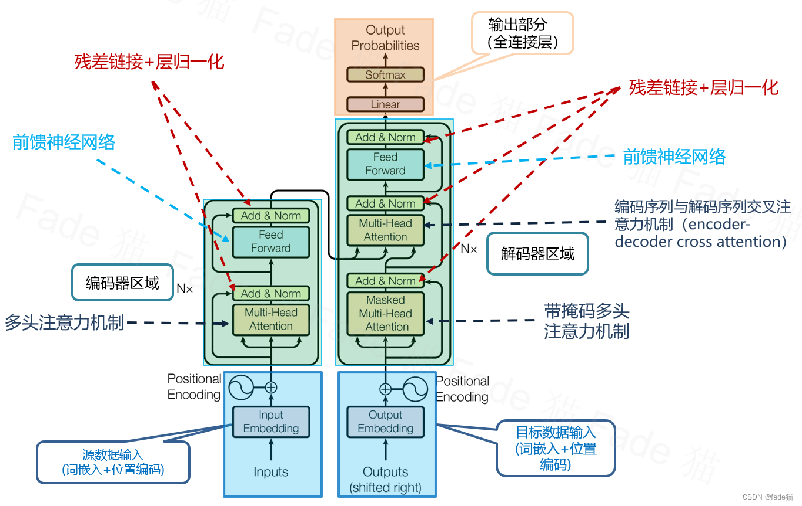
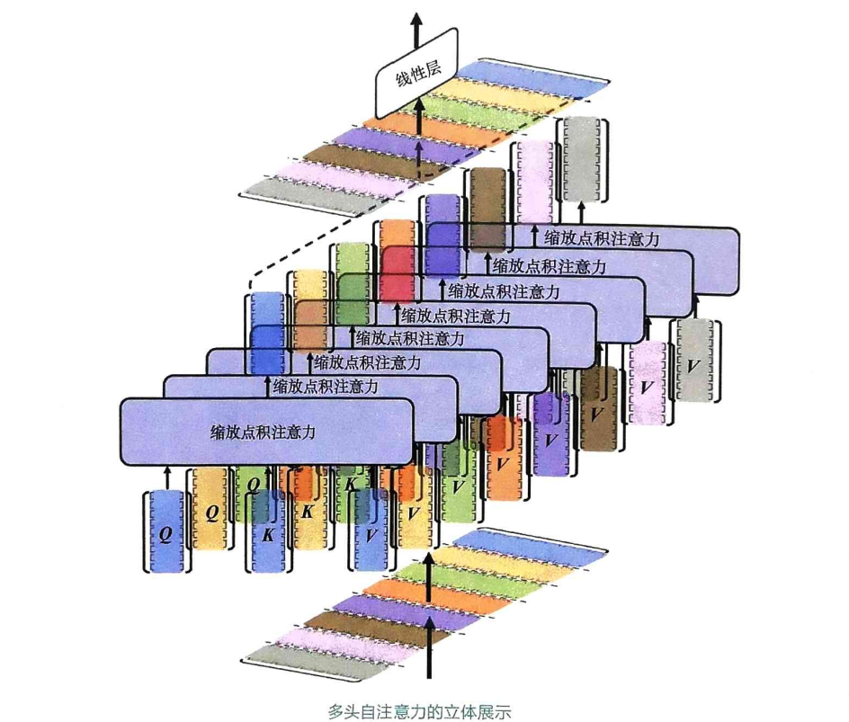

上节课我们深入探讨了注意力机制的原理和应用，它就像我们思考问题时，能够聚焦于关键信息一样。而今天我们要讲的，就是将注意力机制推向极致的Transformer架构。它不仅仅是一个模型，更是一种范式，彻底改变了我们理解和处理自然语言的方式。

2017年，谷歌大脑团队发表了一篇划时代的论文，题目就叫《Attention is All You Need》。这标题本身就充满了力量，宣告了注意力机制的崛起。这篇论文的核心动机，就是要解决当时序列到序列模型，比如RNN、LSTM，在处理长文本时遇到的长距离依赖问题。简单说，就是让模型能记住前面说的，才能更好地理解后面的内容。Transformer的出现，直接把NLP的水平拉上了一个台阶，催生了像BERT、GPT这样的大模型，甚至可以说，没有Transformer，就没有今天的ChatGPT。这就是Transformer的经典架构图。

大家可以看到，它主要由两大部分组成：编码器和解码器。

- 输入的文本首先经过词嵌入，变成向量表示，然后加上位置编码，告诉模型每个词在句子中的位置。
- 这些信息进入编码器和解码器，内部充满了多层自注意力机制和前馈网络，中间还穿插了残差连接和层归一化来稳定训练。
- 解码器的输出经过线性变换和Softmax，得到最终的预测结果。

看起来复杂，但逻辑清晰。**Transformer的核心思想是Seq2Seq**，也就是序列到序列，这在机器翻译、文本摘要等任务中很常见。它的任务是把一个输入序列，比如英文句子，转换成一个输出序列，比如中文句子。Transformer的创新在于，它用编码器和解码器这两个独立模块来完成这个任务。编码器负责吃透输入序列，把信息压缩成一个浓缩的表示；解码器则拿着这个表示，一步步生成输出序列。最关键的是，它**抛弃了RNN和LSTM那种一个词一个词慢慢处理的串行方式，转而使用并行计算的注意力机制**，这大大提升了效率。

## 注意力机制

注意力机制是Transformer的灵魂所在。它允许模型在处理一个词时，不仅关注它本身，还能同时关注序列中其他所有词，根据它们的重要性分配不同的权重。这就像我们阅读时，会关注关键词，忽略一些无关紧要的词。Transformer内部有三种主要的注意力机制：

- 自注意力，让模型在同一个序列内部，比如编码器内部，自己跟自己对话，找出关联；
- 多头注意力，相当于开了多个视角，从不同角度观察；
- 编码器-解码器注意力，让解码器能够回头看看编码器处理过的输入序列，获取上下文信息。

我们先来看最核心的自注意力机制。它的核心思想是计算一个词和序列中所有其他词的关联度。具体怎么做呢？

1. 把每个词的向量投影到三个空间：Q, K, V，分别代表查询、键和值。
2. 计算每个词的查询向量Q和所有词的键向量K的相似度，用点积来衡量，再除以一个缩放因子，防止梯度爆炸，得到注意力分数。
3. 用softmax函数把这些分数变成概率，也就是注意力权重，保证所有权重加起来等于1。
4. 用这些权重去加权对应的值向量V，得到最终的上下文表示。

这个过程让模型能同时看到所有词，而不是像RNN那样只能看一个词。自注意力子层的内部结构中可以看到，核心是多头自注意力模块，它后面跟着一个Add & Norm层。这个Add & Norm层包含了残差连接和层归一化。**残差连接让信息可以直接跳过几层，避免信息丢失，还能加速训练**。**层归一化则是在每一层内部对数据进行归一化，让模型训练更稳定，不容易过拟合**。注意，编码器和解码器的自注意力子层略有不同，**解码器需要额外的后续掩码**，防止它在生成当前词的时候，偷看未来的信息。

## 多头注意力

一个注意力头可能还不够，就像看问题可能需要多角度思考一样。所以，Transformer引入了多头注意力机制。它把自注意力机制复制了多个，比如8个，每个头都像一个独立的观察者，从不同的角度、不同的子空间去关注输入序列。每个头有自己的注意力权重，然后把所有头的注意力结果拼接起来，再通过一个线性层整合，得到最终的输出。这样做的好处是，模型能同时捕捉到序列的局部和全局特征，表达能力大大增强。

这张图更直观地展示了多头注意力的工作原理。你可以看到多个并行处理的注意力头，每个头都处理着不同的输入，计算出不同的注意力权重。这些权重被用来加权对应的值向量，然后所有头的输出被拼接在一起，最后通过一个线性层整合。这种多角度的并行处理方式，使得Transformer能够处理非常复杂的信息，这也是它在处理长文本时表现出色的原因之一。

解码器在生成目标序列的时候，不能只看它自己生成的，还得回头看看输入的源序列。这时候就需要编码器-解码器注意力机制。它的原理是：解码器把自己当前的注意力状态作为查询，去问编码器：输入序列里，哪些词跟我的当前状态最相关？编码器会给出回答，也就是用注意力权重来加权它的输出向量。这样，解码器就能在生成每个词的时候，都回顾一下输入序列，确保翻译或生成的内容是基于原始输入的。

Transformer中的注意力掩码和因果注意力。在注意力机制中，我们希望告诉模型，哪些信息是当前位置最需要关注的；同时也希望告诉模型，某些特定信息是不需要被关注的，这就是注意力掩码的作用。

- 填充注意力掩码（PaddingAttentionMask）：当处理变长序列时，通常需要**对较短的序列进行填充，使所有序列具有相同的长度，以便进行批量处理**。填充的部分对实际任务没有实际意义，因此我们需要**使用填充注意力掩码来避免模型将这些填充位置考虑进来**。填充注意力掩码用于将填充部分的注意力权重设为极小值，在应用softmax时，这些位置的权重将接近于零，从而避免填充部分对模型输出产生影响。在Transformer的编码器中，我们只需要使用填充注意力掩码。
- 后续注意力掩码（SubsequentAttentionMask），又称前瞻注意力掩码（Look-aheadAttentionMask）：在自回归任务中，例如文本生成，模型需要逐步生成输出序列。在这种情况下，为了避免模型在生成当前位置的输出时，
  提前获取未来位置的信息，需要使用前瞻注意力掩码。前瞻注意力掩码将当前位置之后的所有位置的注意力权重设为极小值，这样在计算当前位置的输出时，模型只能访问到当前位置之前的信息，从而确保输出的自回归性质。**在Transformer的解码器中，不仅需要使用填充注意力掩码，还需要使用后续注意力掩码。**

## Transformer架构

现在我们来看看输入是怎么进入Transformer的。

### 嵌入和位置编码

首先是文本序列，比如一句话。第一步是词嵌入，就是把每个词变成一个固定长度的向量，比如512维。这个向量包含了这个词的语义信息。

但是，**Transformer是并行处理的，它不知道每个词在句子中的位置**。所以，第二步是添加位置编码，给每个位置的词向量加上一个表示位置信息的向量，这样模型就能区分句子中不同位置的词了。位置编码是Transformer的一个关键创新点。因为RNN是按顺序处理的，所以它天然知道哪个词在前面哪个在后面。但Transformer是并行的，它需要显式地告诉模型每个词的位置。最常用的方法是正弦和余弦函数编码。这种方法的好处是，它能平滑地表示位置，而且能保留相对位置信息，比如第i个词和第i加1个词的关系。当然，也有其他方法，比如让模型自己学习位置编码，但正弦编码是原始论文中采用的。这个位置编码就像给每个词都贴上了一个坐标标签。

### 编码器

编码器的内部结构非常规整，它是由多个完全相同的层堆叠起来的。每一层都包含两个核心组件：

一个是多头自注意力，另一个是前馈神经网络。输入的词向量和位置编码首先进入第一层的多头自注意力，然后经过残差连接和层归一化。这个过程的输出再进入前馈神经网络，同样经过残差连接和层归一化。这一层的处理完成后，结果进入下一层，重复这个过程。这种层层堆叠的设计，让编码器能够逐步深入地提取输入序列的特征，最终得到一个高质量的上下文表示。

我们再仔细看看这个多头自注意力和Add & Norm层。多头注意力负责并行计算，捕捉不同信息。Add & Norm层是关键，它包含了残差连接和层归一化。残差连接保证了信息能够顺畅地传递下去，即使经过很多层，原始信息也不会丢失太多，还能加速梯度传播，让深层网络更容易训练。层归一化则是在每一层内部稳定数据分布，让模型训练更稳定，不容易发散。这两个技术的组合，是Transformer能够构建深层网络的基础。

前馈神经网络，简称FFN，是编码器和解码器层中的第二个关键组件。它的作用是**对多头注意力的输出进行进一步的非线性变换**，就像给信息做了一个更复杂的加工。通常是一个简单的两层网络，中间夹着一个ReLU激活函数。特别注意的是，这里的前馈网络是逐位置的，也就是**对序列中的每个词独立地应用同一个FFN，而不是把整个序列展平了再处理。这样保证了每个位置的处理是独立的**，不会互相干扰，也保持了序列的顺序信息。

经过编码器层层处理后，我们得到了一个输出序列，这个序列里的每一个向量，都包含了它所代表的那个词，以及它在整个输入序列中的上下文信息。这个信息是通过注意力机制，特别是自注意力机制，从长距离的依赖关系中提取出来的。这个序列就是编码器的最终成果，它将被传递给解码器，作为解码器生成目标序列的唯一依据。可以说，编码器的质量，直接决定了整个Transformer模型的性能上限。

### 解码器

**解码器的输入有点特殊。它不仅要接收来自编码器的信息，还要自己接收一部分目标序列**。这个目标序列的接收方式，通常被称为向右位移。这是什么意思呢？在训练时，我们通常会用真实的答案来喂给解码器，这就是所谓的教师强制。为了让解码器学会生成下一个词，我们会把目标序列向右移动一位，然后在开头补上一个起始符号，比如sos。比如，目标是I love you，那么解码器的输入就是sos I love you。这样，解码器在预测I的时候，能看到的是sos，预测love的时候能看到的是sos和I，以此类推，模拟了真实的生成过程。

解码器的内部结构也和编码器类似，是多层堆叠的。每一层主要包含三个部分

首先是解码器自注意力，它处理的是解码器自身的输入序列，比如目标序列的前缀，而且这里必须使用后续掩码，防止它偷看未来。

然后是编码器-解码器注意力，它把解码器自注意力的结果作为查询，去问编码器：输入序列里哪些词跟我的当前状态相关？

最后，同样是一个前馈神经网络，以及残差连接和层归一化。通过这些步骤，解码器将编码器的上下文信息和自身生成的序列信息结合起来。

**解码器自注意力层的作用，是让解码器在生成当前词的时候，能够回顾之前已经生成的词序列**。这非常关键，因为解码器的输出是逐步生成的，它必须记住之前生成了什么。为了实现这个，我们使用了后续掩码。这个掩码的作用是，当计算当前词的注意力时，强制模型的注意力权重只落在之前生成的词上，而对后面要生成的词，权重接近于0。这样就保证了生成过程的自回归特性，模型在生成每个词时，都是基于之前已知的信息。

**编码器-解码器注意力层是连接编码器和解码器的桥梁**。它的工作机制是，解码器把自己的注意力状态作为查询，去问编码器：输入序列里，哪些词跟我的当前状态最相关？编码器会给出回答，也就是用注意力权重来加权它的输出。这样，解码器在生成每个词的时候，就能同时考虑到输入序列和它已经生成的词序列。这使得它在生成目标序列时，能够充分利用输入信息，生成更准确、更符合语境的翻译或摘要。

### 输出层

解码器经过所有层的处理后，会输出一个序列，每个位置的输出是一个向量，这个向量包含了词汇表中所有词的概率。为了得到最终的预测结果，我们还需要一个输出层。这个输出层通常由一个线性层和一个Softmax层组成。线性层负责把解码器的输出向量映射到词汇表大小，得到每个词的原始分数。

然后，Softmax函数把这些分数转换成概率分布，保证所有概率加起来等于1。这样，我们就能得到每个位置的词，以及它在词汇表中每个词的概率。在实际应用中，比如机器翻译，通常会选择概率最高的那个词作为最终的输出。Transformer的应用远不止于机器翻译。它在文本摘要、文本分类、问答系统、命名实体识别等领域都取得了巨大的成功。

- 在文本摘要任务中，它可以生成简洁的摘要；在文本分类任务中，它可以判断情感倾向或主题类别；
- 在问答系统中，它能从文档中找到答案。
- 甚至在计算机视觉、语音识别、推荐系统等领域，我们也看到了Transformer的身影。

可以说，Transformer已经成为一种通用的序列建模框架，其影响力还在不断扩展。总结一下Transformer的优势。

- 它最大的优势就是能够高效地处理长距离依赖，这得益于注意力机制。它拥有强大的表达能力，能够捕捉到序列中复杂的模式。
- 它支持并行计算，大大提高了训练和推理的效率
- 它具有良好的可扩展性，可以适应不同的任务和规模。
- 它的通用性很强，不仅在NLP领域，还在其他领域展现出强大的潜力

理论讲完了，我们来看看如何将这些组件组装起来，构建一个完整的Transformer模型。

参考附件，[Transformer.ipynb](Transformer.ipynb)

我们已经了解了transformer架构的起源、核心思想、关键组件以及内部结构。从注意力机制到多头注意力，从位置编码到掩码机制，再到编码器-解码器的层层递进，Transformer以其独特的架构和强大的能力，彻底改变了NLP的研究格局。它不仅催生了BERT、GPT等一系列革命性模型，也深刻影响了整个AI领域的发展方向。可以说，Transformer是现代AI技术发展的一个重要里程碑。