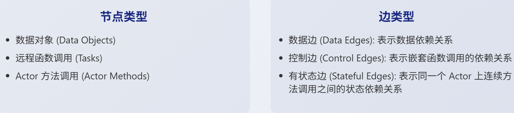
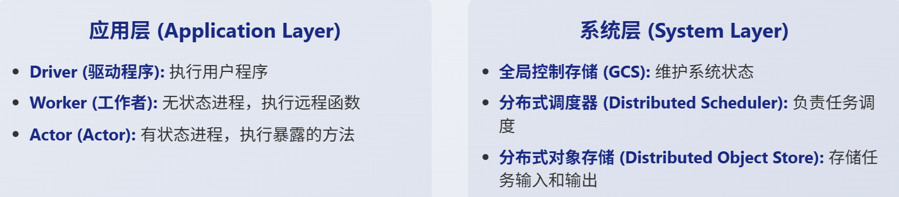
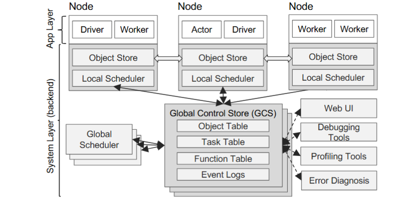
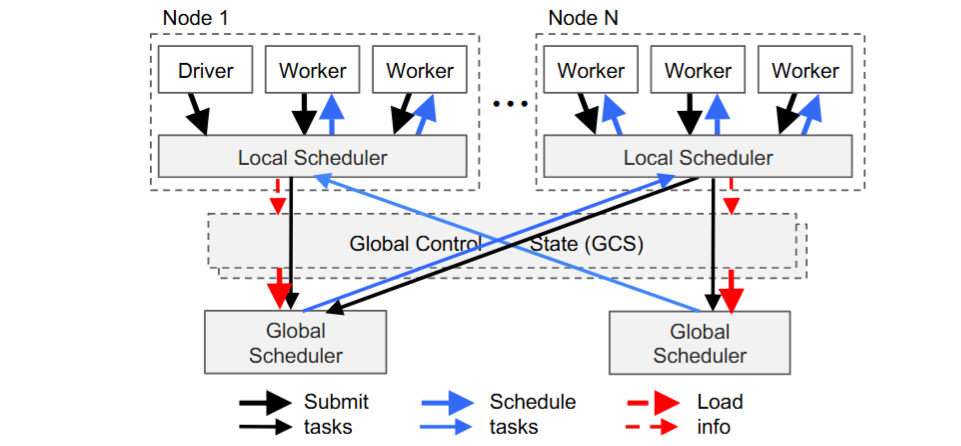
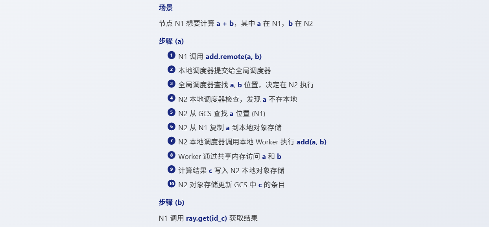

本文将探讨几个关键的分布式系统概念，比如故障容错、资源管理以及如何加速你的远程函数和Actor。这些细节对于分布式应用至关重要。

## 容错机制

故障容错确保即使出现意外——无论是用户代码出错、框架本身崩溃，还是运行机器宕机——系统也能尽可能地继续工作。Ray为不同场景设计了不同的容错机制。核心在于它的三大组件：**全局控制存储GCS、分布式调度器和对象存储**。但要注意一个硬伤：目前的Head Node是单点故障。所以，如果你的应用对高可用性要求极高，可能需要结合ZooKeeper等工具来实现更复杂的恢复逻辑。


上图清晰地展示了Ray的架构。我们可以把它分成两层：应用层和系统层。应用层就是我们直接打交道的部分，包括Driver、Worker、本地的对象存储和调度器。而系统层由GCS、全局调度器以及各种工具和服务组成。特别注意，**除了GCS其他系统组件都是水平可扩展且无状态的**。这意味着你可以轻松地增加更多节点来处理负载，而不用担心状态同步的问题。这种设计极大地简化了架构，并为故障恢复提供了便利。

关于GCS全局控制存储。可以把它想象成Ray的大脑，**GCS集中管理着整个系统的状态信息，包括对象表、函数表、事件日志等等**。内部实现上，它更像是一个带发布订阅功能的键值存储。虽然目前GCS是单点故障，运行在Head Node上，但这种设计有其巧妙之处。通过将所有状态都交给GCS管理，其他系统组件如调度器、对象存储都可以设计成无状态的。这意味着一旦某个组件失败，它只需要重启，然后从GCS读取最新的状态就能恢复，大大简化了故障恢复过程，并使得这些组件更容易独立扩展。

对于**远程函数，由于它们本质上是无状态的**，处理起来就相对简单粗暴了。如果一个远程函数执行失败，Ray会自动尝试重试，直到成功或者达到你设定的最大重试次数max_retries。

```py
@ray.remote
def flaky_remote_fun(x):
	import random
	import sys
    if random.randint(0, 2) == 1:
        sys.exit(0)
    return x
r = flaky_remote_fun.remote(1)
```

以上例子中，flaky_remoteFun 函数有百分之五十的概率随机退出。当你调用 ray.get(r) 时，即使中间经历了几次失败，最终你仍然会得到正确的结果 x。这就是 Ray 对于无状态任务的简单而有效的容错机制。当然，你也可以通过 max_retries 参数来控制这个重试次数，根据你的需求调整。

相比远程函数，Actor的容错就复杂多了，因为它们是有状态的。Actor可能在初始化阶段、处理消息时，甚至两次消息之间发生失败。这里有个关键区别：如果Actor在处理一条消息时失败，Ray不会自动重试这条消息，而是会抛出一个RayActorError。但是，如果Actor在两次消息之间失败了，比如因为节点重启，Ray会在下次调用该Actor时尝试恢复它，最多重试max_retries次。这给了你一个机会去恢复Actor的状态。所以，**Actor的容错效果很大程度上取决于你自己如何编写状态恢复代码**。

## Ray object

Ray对象是Ray中处理数据的基本单元。你可以把它想象成一个容器，里面可以放任何能被序列化的东西，比如数字、字符串、列表、字典，甚至是对其他Ray对象的引用，也就是所谓的ObjectRef。这些ObjectRef就像是指向远程对象的唯一ID，有点像Future的概念。Ray对象通常在你创建任务时自动产生，比如任务返回值或者传递大型参数时。当然，你也可以手动用ray.put创建一个对象，比如`o = ray.put(1)`，它会立即返回一个ObjectRef。

对象的owner是创建它的worker，owner通过引用计数来管理object的生命周期，以便于进行垃圾回收。

> 一般来说小型对象存储在进程的内存中，而大对象则由worker存储在ray系统中

Ray对象有一个非常重要的特性：**不可变性**。这意味着一旦一个对象被创建并放入对象存储，你就不能再修改它了。当你用 ray.get 获取一个对象时，实际上获取的是该对象的一个副本。你对这个副本做的任何修改，都不会影响到存储在对象存储中的原始对象。

尽管Ray尽力保证数据安全，但对象丢失还是可能发生。主要有两种情况：

- 对象的所有者Worker节点挂了，导致引用计数丢失；
- 所有持有该对象副本的节点都挂了。

默认情况下，如果你尝试获取一个已经丢失的对象，Ray会抛出一个ObjectLostError。不过，Ray提供了一个强大的容错机制——**对象重建**。通过在启动Ray时启用 enable_object_reconstruction等于True，当尝试访问一个丢失的对象时，Ray会尝试根据GCS中记录的信息，重新计算或重建这个对象。这个重建过程是惰性的，只有在真正需要的时候才进行，并且会受到之前提到的max_retries限制。

对象存储是Ray管理数据的地方，但它不是无限的。**Ray使用引用计数来进行垃圾回收，清理掉程序不再需要的对象**。但如果内存压力持续增大，对象存储满了怎么办？Ray会采取溢出策略，也就是把一些对象从内存复制到磁盘上，腾出空间。

```py
if False:
    ray.init(num_cpus=20,
         _system_config={
            "min_spilling_size": 1024 * 1024,  # Spill at least 1MB
            "object_store_memory_mb": 500,
            "object_spilling_config": json.dumps(
                {"type": "filesystem", "params": {"directory_path": "/tmp/fast"}},
                )
             })
else:
    ray.init(num_cpus=20, runtime_env=runtime_env)
```

你可以通过配置参数来微调这个行为，比如 min_spilling_size 控制什么时候开始溢出，object_store_memory_mb 设置总内存大小。可以指定 object_spilling_config，让Ray把溢出的对象放到更快的存储设备上，比如SSD，而不是慢速的HDD，从而优化性能。

## 数据序列化

要想在不同的Worker进程之间传递数据和函数，序列化是必不可少的。无论是将数据存入对象存储，还是进行进程间通信IPC，甚至是实现故障容错，都离不开序列化。但要注意，**并非所有东西都能被序列化**。比如，一个打开的数据库连接，就没法直接序列化。

Ray内部使用了多种序列化技术，包括JSON、Arrow、Pickle以及Cloudpickle。选择合适的序列化方式，对于性能和兼容性至关重要。理解这些工具的特点，能帮助你更好地设计和优化你的Ray应用。Cloudpickle 是 Ray Python 生态中最重要的序列化工具之一。它主要用于序列化函数、Actor 以及大部分数据。相比 Python 内置的 pickle，cloudpickle 能够处理更多类型的对象，特别是那些在集群计算中常见的、需要跨进程传输的函数。如果你遇到某些自定义类无法被序列化的情况，比如类里包含了数据库连接，cloudpickle 也提供了机制让你注册自定义的序列化器和反序列化器，来处理这些特殊情况。但要注意，**cloudpickle 有一个硬性要求：加载和读取的 Python 版本必须完全一致**。这意味着你的所有 Ray 工作节点上的 Python 版本必须相同。

当处理大规模数据集时，Apache Arrow 就派上了用场。它是一种高效的列式内存格式，特别擅长处理结构化数据。Ray 在处理数据集时，会优先尝试使用 Arrow 进行序列化，因为它通常比 Cloudpickle 更节省空间，而且具有良好的跨语言兼容性。很多主流的数据处理和机器学习工具，比如 pandas、PySpark、TensorFlow 和 Dask，都支持 Arrow。这使得在不同语言或工具间交换数据变得更加高效。当然，Arrow 也有它的局限性，比如它不支持所有数据类型，像嵌套列这种 pandas 支持但 Arrow 不支持的类型。

gRPC 是 Ray 内部通信的基础框架。它是一个高性能的远程过程调用 RPC 框架，支持多种语言。Ray 使用 gRPC 来协调各个组件之间的通信。gRPC 本身使用 Protocol Buffers 作为序列化机制，对于小对象来说，速度非常快。而**对于那些较大的对象，比如数据集，Ray 会先用 Arrow 或者 Cloudpickle 进行序列化，然后将结果放入对象存储，再通过 gRPC 传递 ObjectRef**。gRPC 的优势在于其高性能和跨语言能力，这使得 Ray 能够在多种语言环境中高效运行。

## 资源管理

Ray 提供了灵活的资源管理方式。默认情况下，每个远程函数或 Actor 会请求 1 个 CPU 和 0 个 GPU。你可以通过 ray.remote 装饰器明确指定所需的资源，比如 num_cpus等于4, num_gpus等于2。

```
@ray.remote(num_cpus=4, num_gpus=2)
```

如果知道任务或actor所需的资源，也可以直接指定从而开启内存感知调度

```
@ray.remote(memory=500*1024*1024)
```

需要注意的是，这些**资源请求通常是soft的**，Ray 会尽力满足你的需求，但不保证一定能分配到那么多资源。

在内存使用方面，主要包括Ray 自身使用的内存（Ray 系统内存）和应用程序使用的内存（Ray 应用程序内存）。


Ray 的系统内存:

- Redis，用于存储集群中存在的节点和参与者列表的内存。这些用途所使用的内存量通常很小。
- Raylet，每个节点上运行的Raylet 进程所使用的内存。这无法控制，但通常很小。 

Ray 应用程序内存:

- Worker heap，应用程序的RSS减去其在 top 等命令中的共享内存使用量（SHR）
- Object store memory，当应用程序通过 ray.put 在对象存储中创建对象以及从远程函数返回值时所使用的内存。当对象超出作用域时会被驱逐。每个节点上都运行着一个对象存储服务器。如果对象存储满了，对象会被溢写到磁盘。
- Object store shared memory，当应用程序通过 ray.get 读取对象时所使用的内存。

## 资源扩展

Ray 支持两种主要的扩展方式：

- 垂直扩展，就是使用配置更高规格的机器，比如配备更多 CPU、GPU 或更大内存的节点；
- 水平扩展，就是增加更多的节点来分担工作负载。

自动伸缩器是Ray集群的智能管家，负责动态地管理Worker节点的数量。它能根据集群的需求自动启动新的节点，或者在节点闲置、配置变更或失败时终止或重启节点。触发自动伸缩的常见原因包括：

- 启动worker，终止work，重启worker节点
- 集群初始创建时需要达到最小节点数（min-nodes）
- 有新的任务请求了额外的资源

- Placement Group需要预分配资源，如果无法满足会创建新的worker
- 通过SDK显式请求资源

Ray的自动伸缩器非常灵活，可以处理不同类型的节点，比如不同大小的云实例或者带有不同加速器的节点。

Placement Group，简称PG，是Ray中用来组织任务和预分配资源的强大工具。它的主要目的有

- 提高数据局部性，把相关联的任务放在同一个节点上，减少数据传输开销（移动函数比移动数据更快）；
- 实现负载均衡，将任务分散到不同节点，提高系统可靠性；
- 进行**Gang Scheduling**，确保一组任务或Actor能够同时启动，这对于需要同步初始化的场景很有用。

使用PG时，你需要定义一组资源束（resource bundle），每个bundle代表一个Worker所需的资源，然后选择一个放置策略，比如

- STRICT PACK，所有资源集中在一个节点

- PACK，尽量把所有资源放在一个节点
- STRICT SPREAD，必须把它们分散到不同节点。
- SPREAD，尽量把它们分散到不同节点。

一个 Placement Group 的生命周期大致分为这几个阶段。

1. 创建，请求会发送给 GCS，GCS 会计算出一个最优的资源分配方案，并尝试原子性地预留资源。
2. 分配，如果现有节点能满足需求，就分配成功；如果不行，自动伸缩器会尝试增加节点来满足需求。
3. 节点故障，如果节点发生故障，GCS 会重新调度剩余的resource bundle，可能会导致部分重启。
4. 清理，当创建这个 PG 的 Job 结束时，PG 会自动被移除。如果你想让 PG 在 Job 结束后仍然存在，可以设置 lifetime等于detached。

Ray 使用一种[自下而上的分布式调度器](https://www.usenix.org/system/files/osdi18-moritz.pdf)来决定任务该在哪里运行，由一个**全局调度器和每个节点的本地调度器**组成

- 本地调度，当一个新任务产生时，它会优先尝试在当前节点上运行，这有助于提高数据局部性，减少网络传输。如果本地节点资源不足，比如队列太长或者缺少特定资源如GPU，或者本地节点过载了，本地调度器就会求助于全局调度器。
- 每个worker会周期性发送全局调度器心跳消息，汇报资源可用性和队列深度。
- 全局调度器会查看所有可用节点，选择一个能让任务等待时间最短的节点。这个等待时间估计是基于节点当前的队列深度和任务所需输入数据的传输时间来计算的。
- Ray 的调度器还包含一些优化，比如并行获取任务参数、提前处理本地对象、考虑节点资源不平衡以及依赖感知调度等。

命名空间是Ray提供的一个轻量级隔离机制，用于逻辑上分组你的Job和Actor。默认情况下，每个Ray程序运行在一个匿名的命名空间里，彼此隔离。如果你想让两个不同的程序共享同一个Actor，就需要将它们放在同一个命名空间下。这可以通过在ray.init时指定namespace参数来实现。

```
ray.init(namespace="my_project")
```

需要注意的是，命名空间提供的主要是逻辑隔离，而不是安全隔离。它不能阻止恶意程序互相干扰，但可以帮助你在开发和测试时更好地组织和管理你的应用。

Python 生态的繁荣离不开丰富的第三方库，但这也带来了依赖管理的挑战。Ray 提供了强大的 Runtime Environment 功能来解决这个问题。它支持 Conda 和 Virtualenv 两种环境管理方式。你**可以动态地为每个 Worker 创建一个带有特定依赖的虚拟环境**，然后启动 Worker。配置方式非常灵活，

可以直接指定 pip 包列表，或者指向一个 requirements.txt 文件，甚至可以使用 conda 来管理更复杂的依赖。你可以选择在全局范围内 ray.init 设置一个运行时环境

```
runtime_env = {"pip" : "requirements.txt"}
```

也可以为特定的远程函数或 Actor 单独指定。

不过要注意，对于那些需要大量原生代码编译的库，比如某些特定架构下的 TensorFlow，动态创建环境可能会比较慢，这时候建议预先准备好 Conda 环境。

除了直接连接到集群，Ray 还提供了一个 Job API，用于提交和管理 Job。这个 API 提供了一种更轻量级的方式来部署你的应用，尤其适合在 Kubernetes 等环境中使用。它避免了直接使用 Ray Client 可能遇到的库版本冲突和网络问题。Job API 主要有三个核心方法：

- submit_job 用于提交一个新的 Job
- get_job_status 用于查询 Job 的当前状态
- get_job_logs 用于获取 Job 的日志。

例如以下示例

```py
from ray.dashboard.modules.job.sdk import JobSubmissionClient
import time
from ray.dashboard.modules.job.common import JobStatus

client = JobSubmissionClient("<your Ray URL>")
job_id = client.submit_job(
    # Entrypoint shell command to execute
    entrypoint="python script_with_parameters.py --kwargs iterations=7",
    # Working dir
    runtime_env={
        "working_dir": ".",
        "pip": ["requests==2.26.0", "qiskit==0.34.2"],
        "env_vars": {"MY_VARIABLE": "foo"}
    }
)
print(f"Submitted job with ID: {job_id}")

while True:
    status = client.get_job_status(job_id)
    print(f"status: {status}")
    if status in {JobStatus.SUCCEEDED, JobStatus.STOPPED, JobStatus.FAILED}:
        break
    time.sleep(5)

logs = client.get_job_logs(job_id)
print(f"logs: {logs}")
```

一个 Job 请求通常包括你要执行的入口脚本、工作目录、以及所需的运行时环境。**Job API 使用 HTTP 协议**，这比 gRPC 更容易与 Kubernetes Ingress 等组件集成。

## 论文解读

https://www.usenix.org/system/files/osdi18-moritz.pdf

Ray是一个专为应对新兴AI应用而设计的分布式框架。它旨在解决下一代AI应用带来的新挑战，尤其是在性能和灵活性方面。过去二十年，我们见证了大数据时代的到来，各种分析框架层出不穷。但AI的野心远不止于此。虽然监督学习取得了巨大成功，比如深度学习在图像识别、自然语言处理上的突破，但它们本质上是基于已知数据的模式匹配。真正的智能，需要机器能够像人一样，在不确定的环境中不断探索、试错、学习，这就是强化学习的核心思想。想想AlphaGo，它不是通过看无数棋谱学会下棋，而是通过与自己对弈，不断调整策略，最终超越人类顶尖高手。这种能力，让AI从被动分析走向主动决策，是迈向通用人工智能的关键一步。

强化学习的核心任务是什么？就是**训练一个策略，这个策略能告诉智能体在特定状态下应该采取什么动作**。这通常是一个迭代的过程：先评估当前策略，看看它在实际环境或模拟环境中表现如何，生成一系列状态、动作、奖励的轨迹；然后根据这些轨迹改进策略，让未来的决策更倾向于获得更高的奖励。这个过程需要三个关键能力：

- 一是仿真，用来快速评估策略并探索各种可能性；
- 二是分布式训练，利用大量计算资源加速策略优化；
- 三是服务，将训练好的策略部署到真实环境中进行实时决策。

这三个环节紧密相连，缺一不可。问题来了，现有的系统能搞定这些吗？答案是：很难。

- 传统的批处理框架，像Spark、MapReduce，擅长处理大规模静态数据，但对强化学习这种需要实时交互、动态调整的场景束手无策。
- 任务并行系统，比如Dask，虽然能处理动态任务，但在分布式训练和低延迟服务方面有所欠缺。
- 深度学习框架，如TensorFlow、PyTorch，虽然训练能力强大，但天然不支持仿真和嵌入式服务。
- 专门的服务系统，比如TensorFlow Serving，又只负责推理，不参与训练和仿真。

理论上，我们可以把它们拼起来用，但实际操作中，**组件之间的数据传输和协调开销巨大，延迟高得离谱**，根本无法满足强化学习对实时性的苛刻要求。所以，大家不得不为每个研究项目或者特定应用，从头开始搭建一套定制化的系统，这无疑增加了巨大的开发和维护成本。

Ray 的核心理念就是统一和灵活。它试图打造一个通用的平台，同时搞定仿真、训练和服务这三件事。怎么实现呢？关键在于它融合了两种计算模型：**任务并行和Actor**。

- 可以把任务想象成一个个独立的小工，比如运行一次仿真模拟，它做完就没了，轻装上阵，适合处理大量无状态的、细粒度的工作。
- Actor则更像是一个有记忆的工人，比如一个模型训练进程，它会持续存在，内部状态不断更新，适合处理长时间运行、需要维护状态的计算，比如参数服务器或者GPU上的迭代计算。

Ray 的巧妙之处在于，它**用一套统一的引擎来管理这两种截然不同的计算方式**，既保证了灵活性，又能实现高效的调度和容错。它需要处理每秒数百万个任务，而且延迟必须控制在毫秒级别，这对于实时决策至关重要。为了达到这个目标，Ray 做了两个关键设计：

- 采用了**分布式调度器**，而不是传统的单点调度器。这避免了调度瓶颈，让系统能够应对海量并发请求。
- 引入了一个**全局控制存储**，简称GCS，用来记录所有任务的血缘信息，也就是任务的依赖关系和执行历史。这个GCS本身也是分布式且容错的。

有了这两个设计，Ray 才能实现高吞吐量和低延迟。同时，它还提供了强大的容错能力：

- 对于任务和Actor，可以通过重放血缘信息来恢复；
- 对于GCS本身，则通过复制来保证数据安全。

Ray 的贡献主要体现在这几个方面：

- 构建了一个统一的框架，把训练、仿真、服务这三块核心拼图整合到了一起，解决了之前系统割裂的问题。
- 将 Actor 和 Task 这两种看似不同的计算模型统一在同一个动态执行引擎下，提供了前所未有的灵活性。
- 提出了一个核心的设计原则：将系统的控制状态集中存储在一个可扩展、容错的 GCS 中，而其他组件如调度器、对象存储保持无状态，这样极大地简化了系统设计，并为水平扩展和容错奠定了基础。
- 设计了一种自底向上的分布式调度策略，有效地平衡了负载，提高了整体吞吐量。

这张图展示了典型的强化学习系统。左边是智能体Agent，它不断地观察环境Environment的状态，做出动作，然后从环境中获得反馈，包括下一个状态和奖励。右边是环境，它可以是真实的物理世界，也可以是一个模拟器。智能体的目标就是学习一个策略Policy，这个策略决定了在给定状态下应该采取哪个动作，最终目的是最大化累积的奖励。这个过程就像一个永不停歇的试错循环，智能体不断与环境互动，积累经验，逐渐变得聪明。

Ray 提供了简洁的API来表达这两种计算模型。

| API                                               | 描述                                                         |
| :------------------------------------------------ | :----------------------------------------------------------- |
| **futures = f.remote(args)**                      | 远程执行函数 **f**，返回 **Future** 对象                     |
| **objects = ray.get(futures)**                    | 获取与一个或多个 **Future** 对象关联的值，这是一个阻塞操作   |
| **ready_futures = ray.wait(futures, k, timeout)** | 返回已完成任务对应的 **Future** 对象，一旦达到 **k** 个任务完成或超时结束 |
| **actor = Class.remote(args)**                    | 将类 **Class** 实例化为远程代理，并返回其句柄                |
| **futures = actor.method.remote(args)**           | 在远程代理上调用方法并返回一个或多个 **Future** 对象         |

Ray 内部是如何管理这些任务和 Actor 的呢？它使用了一种叫做**动态任务图**的模型。你可以把整个应用程序想象成一张图，图中的节点代表数据对象、任务调用或者 Actor 方法调用。节点之间有边连接，表示依赖关系。数据边表示数据从哪里来，控制边表示任务之间的调用顺序，而有状态边则特别用于连接同一个 Actor 上连续的方法调用，因为这些方法共享 Actor 的内部状态。



这种动态图模型非常灵活，能够很好地适应强化学习中不断变化的计算需求。Ray 的架构分为两层：应用层和系统层。



- 应用层是用户直接接触的部分，包括驱动程序Driver，它运行你的 Python 代码；工作者Worker，它们是执行无状态任务的进程；以及 Actor，它们是执行有状态方法的进程。
- 系统层则负责底层的支撑，包括我们前面提到的全局控制存储GCS、分布式调度器，以及分布式对象存储，用来存放任务的输入输出数据。

这个分层设计使得应用层专注于逻辑实现，而系统层则专注于性能和可靠性。

全局控制存储，简称GCS，是Ray架构中一个非常独特且关键的组件。



你可以把它想象成整个系统的中央大脑，但它不是单点的（注：这里的意思可能是说可以通过类似zookeeper的方式实现高可用）。它本质上是一个**分布式、容错的键值存储，用来记录所有关于任务、Actor、数据对象的信息**。为什么需要它？

- 存储了任务的血缘信息，这是实现容错的关键。当节点挂掉时，系统可以从GCS里读取历史信息，重新执行丢失的任务。
- 将元数据的存储和调度决策分离了。传统的系统往往把调度器和元数据存储放在一起，导致调度器成为性能瓶颈。

**Ray通过GCS解耦，让调度器专注于快速决策，而GCS专注于稳定存储**，这对于处理海量任务至关重要。这种设计使得所有组件都可以是无状态的，大大简化了容错和扩展。面对每秒数百万任务的调度压力，传统的集中式调度器根本扛不住。

Ray 采用了自底向上的分布式调度策略。



- 每个节点都有自己的本地调度器。当一个任务产生时，它首先交给本地调度器。本地调度器会先看看自己能不能搞定，比如有没有足够的资源，队列是不是太满了。如果能，就直接调度本地执行，效率最高。如果本地不行，比如需要GPU但本地没有，或者本地已经忙不过来了，它才会把任务上报给全局调度器。

- 全局调度器会综合考虑所有节点的负载情况和任务的资源需求，选择一个预计等待时间最短的节点来执行。

这种两级调度结构，既保证了局部的高效，又通过全局协调实现了整体的负载均衡。

为了让任务执行得更快，Ray 使用了一个内存中的分布式对象存储。这个存储器就像一个巨大的共享缓存，存放着所有任务的输入和输出数据。为了提高效率，它在**每个节点上都使用了共享内存技术**，这意味着同一个节点上的任务可以直接访问内存，无需拷贝，速度飞快。

数据格式采用了 Apache Arrow，这是一种高效的跨语言数据交换格式。如果任务的输入数据不在本地，对象存储会先把它复制过来，然后再执行任务。任务的结果也会写入本地对象存储。当然，内存是有限的，所以 Ray 使用了 LRU 策略，不常用的旧数据会被换到磁盘上。需要注意的是，目前的 Ray 对象存储只支持不可变数据，这简化了数据一致性和容错的处理。

我们来看一个简单的例子，加深理解。



整个过程涉及数据移动和控制信号的传递，但大部分操作都在本地完成，效率很高。理论讲完了，我们来看看实际效果。

- 延迟。当任务输入数据量增大时，如果调度器不考虑数据在哪，延迟会急剧上升，甚至增加几个数量级。但Ray的调度器会尽量把任务调度到靠近数据的地方，所以即使输入很大，延迟也能保持在一个较低的水平。
- 可扩展性。随着节点数量的增加，每秒能处理的任务数量几乎是线性增长的。在60个节点上，吞吐量超过了一百万任务每秒，到了100个节点，更是达到了惊人的180万任务每秒。这证明了Ray的架构设计确实能够支撑大规模的并发计算。

除了调度，对象存储和GCS本身的性能也很关键

- Ray的对象存储在处理大对象时，写入吞吐量可以超过15GB每秒，处理小对象时，IOPS也能达到18000以上，这得益于高效的内存管理和多线程复制。
- GCS的容错能力。即使在模拟节点故障和重新加入的情况下，客户端感受到的读写延迟也基本保持在30毫秒以内，恢复速度很快。如果不进行刷新，GCS的内存会迅速耗尽，导致任务无法完成。而定期刷新，可以将内存占用控制在合理范围内，保证系统长时间稳定运行。
- 容错能力。当节点被移除时，系统会自动重建丢失的依赖关系，当节点恢复后，吞吐量也能迅速恢复。通过检查点机制，即使Actor所在的节点挂掉，只需要重执行少量最近的方法，就能快速恢复，而不是从头再来。

- 调度延迟。通过比较了Ray实现的Allreduce操作和OpenMPI的性能。令人惊讶的是，Ray的性能更好，尤其是在大数据量时。这得益于Ray的低延迟调度和对网络带宽的充分利用。

现在我们把目光聚焦到强化学习的具体构建模块上：

- 分布式训练。对比了Ray、Horovod和分布式TensorFlow在训练ResNet一百零一模型时的性能。Ray的表现非常出色，甚至在某些配置下超过了Horovod，这得益于Ray能够灵活地表达和优化训练过程中的数据流水线。接下来是服务。
- 比较了Ray Actor和Clipper在嵌入式服务场景下的吞吐量。由于Ray的低开销序列化和共享内存机制，它的吞吐量比Clipper高了一个数量级，这对于需要低延迟响应的RL应用至关重要。
- 仿真。Ray在处理大规模、异构的仿真任务时，能够更好地利用资源，达到更高的吞吐量。Ray不仅在性能上更胜一筹，而且使用的GPU数量更少，成本更低。这得益于Ray能够感知资源异构性，允许CPU和GPU任务混合调度，充分利用集群资源。相比之下，MPI通常需要对称架构，限制了灵活性和成本效益。

Ray 的工作并非凭空而来，它站在了很多前辈工作的肩膀上。

- 在动态任务图领域，CIEL 和 Dask 是 Ray 的重要参考。它们都支持动态任务图和嵌套任务，但 Ray 的独特之处在于它同时提供了 Actor 模型，并且采用了分布式、解耦的控制平面和调度器。这使得 Ray 在处理有状态计算和需要低延迟通信的场景时更具优势。
- 像 Spark、MapReduce 这样的数据流系统，虽然应用广泛，但它们的计算模型通常是静态的、批量同步的，难以适应强化学习中细粒度、动态的仿真需求。Naiad 等系统虽然有所改进，但仍然局限于静态任务图。Ray 的核心竞争力在于其动态性和灵活性。
- 在机器学习框架方面，TensorFlow 和 MXNet 是行业的标杆，它们在深度学习模型训练上表现出色。但它们的编程模型相对固定，不太适合需要动态调整计算图的强化学习场景。
- OpenMPI 提供了高性能的通信原语，但编程复杂，需要开发者自己处理很多细节。Ray 的优势在于提供了一个更通用、更易于使用的编程模型，同时又能通过底层的调度和执行引擎实现高性能。
- 在 Actor 系统方面，Orleans、Akka 等框架在构建高并发、高可用的分布式应用方面很有经验。但它们在容错方面，特别是对无状态计算的透明容错和精确一次语义的支持，不如 Ray 那么完善。Ray 的设计目标是让开发者能够更容易地编写健壮、高效的分布式 AI 应用。

Ray 从最初的一个 Spark 库发展到现在的独立框架，经历了漫长的探索。在 API 设计上，Ray 坚持简约主义，从最基础的任务抽象出发，逐步引入 wait 和 Actor。实践证明，这种看似底层的 API 非常强大且易于使用，很多先进的 RL 算法都能用几十行代码快速移植到 Ray 上。

当然，通用性也带来了一些局限性。比如，很难针对特定的 RL 算法进行极致的优化，因为调度器无法完全预知整个计算图的结构。另外，GCS 的存储成本也需要通过垃圾回收机制来管理。关于容错性，有人可能会问，AI 算法本身就有随机性，是不是可以忽略失败？我们的经验是，容错性非常重要。它不仅让编程更简单，还能极大地方便调试，尤其是在调试那些难以捉摸的 AI 算法时，确定性重放非常有用。而且，使用 Spot 实例等廉价资源时，容错更是必不可少。虽然有开销，但 Ray 发现对于目标工作负载来说，这个开销是可以接受的。

GCS 的作用远不止于容错。它极大地简化了 Ray 的开发和调试过程。开发者可以方便地查询整个系统的状态，而不需要像以前那样手动去暴露各个组件的内部信息。我们的时间线可视化工具也是基于 GCS 构建的。更重要的是，GCS 的分片和副本机制是 Ray 实现水平扩展的关键。当 GCS 或调度器成为瓶颈时，我们可以通过增加分片或副本的数量来轻松解决。这让我们相信，将控制状态逻辑化、集中化管理，将是未来分布式系统设计的一个重要趋势。