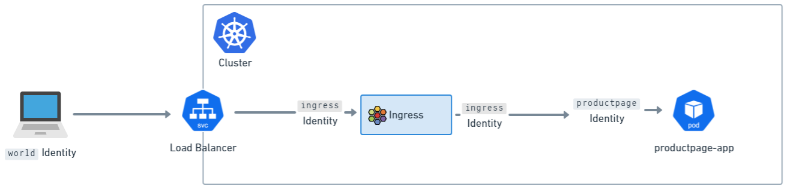

## Service Mesh

讲完了Egress Gateway，我们把目光转向另一个重要领域：Service Mesh。随着分布式应用的普及，服务之间的通信变得越来越复杂，对可见性、连接性和安全性提出了更高的要求。传统的做法是将这些功能硬编码到应用里，但这显然不理想。Service Mesh应运而生，它将这些功能抽离出来，作为基础设施提供给所有应用使用。它能提供韧性连接、L7级的流量管理、基于身份的安全、可观测性和追踪，而且这一切都对应用透明，无需改动代码。

为什么选择Cilium的Service Mesh呢？因为它有很多独特的优势。

- 它基于eBPF，这意味着它在内核层面直接处理数据包，性能非常高效。
- Cilium不仅处理网络协议，还能解析和处理应用层协议，比如HTTP、gRPC等。它还深度集成Envoy这样的代理，实现了强大的L7功能。
- Cilium是原生Kubernetes的，部署和管理都非常方便。如果你对它的实现细节感兴趣，可以去看相关的eCHO视频。

## Kubernetes Ingress

Cilium不仅能做Service Mesh，还提供标准的Kubernetes Ingress支持。你可以像使用其他Ingress Controller一样，创建Ingress资源，只需要在spec字段里指定ingressClassName: cilium。

Cilium允许你选择两种负载均衡模式：

- dedicated，每个Ingress都有自己的负载均衡器；
- shared，所有Ingress共享一个。

Shared模式更节省资源，但Dedicated模式可能更稳定，避免冲突。记住，切换模式可能会导致现有连接中断，所以要谨慎操作。启用Cilium Ingress也很简单。

- 确保你的Cilium环境已经启用了NodePort或者kubeProxy替代，以及L7代理功能。
- 通过Helm安装时设置`ingressController.enabled=true`。你可以选择配置负载均衡模式，比如`dedicated`或`shared`。
- 如果你想让Cilium成为集群的默认Ingress Controller，可以设置`ingressController.default=true`，这样即使没有指定`ingressClass`，Cilium也会接管。一个非常重要的特性是源IP可见性。

```shell
$ helm upgrade cilium cilium/cilium --version 1.17.3 \
    --namespace kube-system \
    --reuse-values \
    --set ingressController.enabled=true \
    --set ingressController.loadbalancerMode=dedicated
$ kubectl -n kube-system rollout restart deployment/cilium-operator
$ kubectl -n kube-system rollout restart ds/cilium
```

对于后端服务来说，知道请求的真实来源IP地址至关重要。Cilium默认会通过x-Forwarded-For和x-Envoy-External-Address这两个HTTP头来传递客户端IP。

Kubernetes的Service对象有一个externalTrafficPolicy字段，它决定了流量是否会被路由到本地节点，以及是否会被伪装。在传统的Ingress Controller中，Local模式通常是为了保证源IP可见。但在Cilium Ingress里，由于它使用了eBPF和TPROXY，即使externalTrafficPolicy是Cluster，源IP也能被正确传递到后端服务。

所以，Cilium Ingress在这方面提供了更好的保证。Cilium Ingress还支持TLS Passthrough，也就是所谓的TLS卸载。在这种模式下，Envoy代理会直接转发原始的TLS连接，不需要自己解密。它通过检查客户端的SNI字段来确定应该将流量转发到哪个后端服务。

这种方式非常高效，但也带来一个问题：由于是新的TCP连接，后端服务看到的源IP会是Envoy的IP地址，而不是原始客户端的IP。所以，如果你需要在后端服务中精确识别客户端IP，那么TLS Passthrough可能不是最佳选择。Ingress规范定义了三种路径类型：Exact、Prefix和ImplementationSpecific。Cilium将ImplementationSpecific解释为正则表达式。这意味着你可以用非常灵活的正则表达式来定义路由规则。需要注意的是，当有多种路径类型时，匹配顺序是：先Exact，再ImplementationSpecific，最后是Prefix。而且，ImplementationSpecific里的正则表达式会优先级最高，但使用时要小心，比如`.*`可能会匹配到更长的路径，反而覆盖了更短的精确匹配。配置时，可以通过ingress.cilium.io/loadbalancer-mode来指定负载均衡模式。

在某些特殊场景下，比如开发环境或者没有集群内LoadBalancer服务支持的环境中，你可以将Cilium Ingress暴露在宿主机网络上。这需要启用ingressController.hostNetwork.enabled。你可以通过Helm全局配置一个端口，或者为每个Ingress单独设置一个端口注解。这样，外部流量可以直接通过这个端口访问到Ingress。当然，要注意端口冲突的问题，确保每个节点上暴露的端口是唯一的。

现在，我们来聊聊Cilium的Ingress和Gateway API与其他控制器相比，最大的不同之处。核心在于它们与CNI网络栈的紧密耦合。大多数其他的Ingress或Gateway API控制器，比如Nginx、Traefik等，它们本质上是独立的进程，通过Service暴露在集群网络中。而Cilium的实现方式完全不同，它将Ingress和Gateway API看作是网络栈的一部分。

当流量到达Service端口时，**Cilium通过eBPF技术直接拦截并透明地将流量转发给Envoy**，这个过程是通过Linux内核的TPROXY机制实现的。这种深度集成带来了很多好处，但也意味着它在行为上会与那些独立的控制器有所不同，比如在客户端IP可见性、Network Policy应用等方面。这种深度集成带来的一个显著优势就是与Cilium Network Policy的无缝结合。由于流量通过Cilium的网络栈，Cilium的Envoy代理天然地成为了Network Policy的执行点。更有趣的是，对于Ingress和Gateway API流量，Cilium设置了两个逻辑上的Policy执行点。



- 第一个是流量进入Envoy之前，根据来源IP被赋予一个特殊的身份标识，比如来自外部的流量会被标记为World，来自集群内部的流量则有其特定标识。
- 第二个是流量离开Envoy、即将进入后端服务之前。这意味着，我们需要确保网络策略允许从外部世界到Ingress的流量，以及从Ingress到集群内部服务的流量。

这种双重检查机制，为入口流量提供了更强大的安全保障。对于大多数应用来说，能够准确知道请求来自哪个IP地址至关重要。在Cilium的Ingress和Gateway API配置中，Source IP的可见性通常能够很好地工作。默认情况下，Cilium的Envoy配置会将原始连接的源地址添加到x-Forwarded-For Header中。我们还设置了一个可信跳数为0，这意味着Envoy会直接信任这个连接的源地址，而不是去解析x-Forwarded-For Header中的其他地址。此外，Envoy还会设置一个名为x-Envoy-External-Address的Header，直接包含客户端的真实IP。

因此，后端应用只需要关注这两个Header，就能轻松获取到客户端的IP信息，而无需关心底层的网络细节。

现在我们来讨论一个常见的Service参数：externalTrafficPolicy。这个字段决定了Service接收到的流量如何被路由到后端Pod。Local模式下，流量只会被路由到同一个节点上的Pod，而且不会伪装源IP，这对于需要精确Source IP的应用非常有用。Cluster模式下，流量会均匀地路由到集群内所有节点上的Pod，但节点可能会伪装源IP，这在某些场景下可能导致Source IP丢失。然而，Cilium由于使用了TPROXY机制，情况有所不同。无论你设置的是Local还是Cluster，流量最终都会被路由到本地节点上的Envoy，然后通过TPROXY转发到后端服务。这意味着，对于Cilium的Ingress和Gateway API，源IP地址都能完整地传递给后端服务。因此，即使你没有显式设置externalTrafficPolicy为Local，Source IP的可见性也能得到保证。这是一个非常重要的特性。

但是，当启用TLS Passthrough模式时，Source IP的可见性就面临新的挑战。无论是Ingress还是Gateway API，都可以通过TLS Passthrough将多个后端服务共享同一个TLS端口，Envoy会解析客户端的SNI信息来确定转发目标。

在这个过程中，Envoy实际上是在进行TCP代理，它会终止一个TCP连接，然后建立一个新的TCP连接转发到后端。由于这是一个新的TCP连接，那么后端服务看到的源地址就变成了Envoy的IP地址，而不是原始客户端的IP。所以，结论很明确：在TLS Passthrough模式下，后端服务无法直接看到客户端的真实IP。这在需要精确Source IP的应用场景下，比如某些日志分析或安全审计，就需要特别注意。

对于那些LoadBalancer Service不可用或者需要更灵活的暴露方式的场景，比如开发环境，或者需要集群外部的负载均衡器，Cilium 1.16版本引入了Host Network Mode。这个模式允许我们将Cilium的L7代理直接暴露在宿主机的网络接口上，而不是通过一个Service。一旦启用，监听器会自动绑定到所有可用的网络接口。当然，这个模式和之前的Service暴露模式是互斥的，你只能选择其一。启用非常简单，只需要在Helm配置中设置gatewayAPI.hostNetwork.enabled=true即可。这为我们提供了更直接的网络暴露方式。在Host Network模式下，我们需要在Gateway的spec.listeners.port字段中明确指定要使用的端口号。这里有几个关键点需要注意。首先，每个Gateway资源的端口必须是唯一的，不能冲突。其次，强烈建议大家选择大于1023的端口，也就是非特权端口。如果非要使用特权端口（小于等于1023），后面我们会讲到如何配置。最重要的一点是，要确保你选择的端口在所有可能运行Cilium Agent的节点上都是可用的。否则，可能会导致端口冲突，导致服务无法正常工作。配置前一定要仔细规划。刚才提到，如果要在Host Network模式下绑定特权端口，比如80、443，就需要额外的配置。因为Cilium的Envoy进程默认没有Linux的特权能力。你需要通过Helm参数来配置。

- 首先，要确保envoy.securityContext.capabilities.keepCapNetBindService设置为true。
- 然后，还需要在envoy.securityContext.capabilities列表中，或者在Embedded模式下对应的ciliumAgent的securityContext.capabilities中，明确添加NET_BIND_SERVICE这个能力。

这样，Envoy才能获得绑定特权端口的权限。这是一个安全相关的配置，需要谨慎操作。与Ingress类似，即使在Host Network模式下，我们仍然可以利用节点标签选择器来控制Envoy监听器只在特定的节点上运行。这同样需要结合Host Network模式。配置方式和之前一样，通过Helm的nodes.matchLabels参数来指定。比如，我们可以创建一个标签，比如role等于infra并且component等于gateway-api，然后只在带有这些标签的节点上启动Envoy。这在需要将入口流量集中到特定的入口节点上，或者进行流量隔离时非常有用。当然，如果选择器为空，那么所有节点都会被选中。

```yaml
ingressController:
  enabled: true
  hostNetwork:
    enabled: true
    nodes:
      matchLabels:
        role: infra
        component: ingress
```

今天我们深入探讨了Cilium的Egress Gateway、Service Mesh和Ingress功能。Egress Gateway提供了强大的出站流量控制和安全策略，Service Mesh利用eBPF实现了高性能的网络服务和可观测性，而Ingress则提供了标准的Kubernetes入口支持。这些功能共同构成了Cilium强大的云原生网络能力。希望今天的分享能帮助大家更好地理解和应用这些特性。

## Gateway API

接下来我们把目光转向Kubernetes网络入口的未来——Gateway API。这个由Kubernetes SIG-Network主导的项目，目标明确：成为Ingress的继任者。它不仅仅是一个简单的替换，而是带来了全新的设计理念。

- 它强调角色导向，意味着不同角色比如开发者、运维人员、安全专家可以专注于他们关心的配置层面，而无需关心底层实现细节。
- 它追求可移植性，让网络配置能够跨越不同的云平台和基础设施。
- Gateway API提供了更强的表达能力，允许我们定义更复杂的路由规则和策略，甚至具备可扩展性，方便社区和厂商根据自身需求进行定制。

Cilium对Gateway API的支持并非浅尝辄止，而是实现了深度集成。目前，我们已经全面支持了Gateway API v1.2.0规范中的核心资源类型，包括定义入口规则的Gateway、HTTPRoute、GRPCRoute，以及用于授权和TLS配置的ReferenceGrant、TLSRoute。这些资源的实现都经过了严格的测试，确保了核心功能的稳定性和可靠性。

要让Cilium的Gateway API功能跑起来，我们需要确保一些先决条件。

- Cilium本身必须启用NodePort或者kubeProxy替代，这是为了让流量能够到达Envoy。
- L7代理功能必须是开启的，这通常也是默认设置。
- 需要预先在集群中安装好Gateway API v1.2.0定义的那些CRD资源，比如GatewayClass、Gateway、HTTPRoute等等。这些CRD是定义和管理入口规则的基础。
- 如果你还想使用TLSRoute来配置TLS，那么还需要额外安装对应的TLSRoute CRD。这些准备工作是后续配置的基础。

安装这些CRD其实很简单，我们直接从官方仓库拉取对应的YAML文件，然后通过kubectl apply -f 命令应用到集群中。这里列出了一套完整的命令，包括GatewayClass、Gateway、HTTPRoute、ReferenceGrant、GRPCRoute，以及实验性的TLSRoute。注意，TLSRoute的配置是放在experimental目录下的，所以需要特别指定。

执行这些命令后，你的集群就会识别并管理这些新的资源类型了。这是配置Gateway API的基础一步。配置好CRD之后，我们需要确保Cilium CLI工具是最新的版本。

安装好CLI和CRD，接下来就是启用Cilium的Gateway API功能。我们通常使用Helm来管理Cilium的部署。在helm upgrade cilium命令中，关键是要加上--set gatewayAPI.enabled=true这个参数。这个参数会告诉Cilium Operator去处理Gateway API相关的资源。启用后，还需要重启cilium-operator和cilium DaemonSet，确保新的配置生效。

最后，别忘了运行cilium status命令，确认Cilium Agent和Operator的状态都正常，特别是检查是否成功启用了Gateway API功能。

Cilium Gateway API 支持 Gateway API 规范中定义的 spec.addresses 字段，可以直接指定一个 Gateway 的 IP 地址。目前只支持 IPAddress 类型，而且它会与 Cilium 的 LB-IPAM 功能集成，用于动态分配或管理 IP 地址。看这个示例，我们定义了一个名为 my-gateway 的 Gateway，明确指定了它的 IP 地址是 172.18.0.140。

配置完成后，你可以通过 kubectl get gateway my-gateway 命令查看这个 Gateway 是否成功获得了指定的地址。这种方式提供了更精细的 IP 地址管理能力。需要注意的是，Cilium 之前使用过一个旧的注解 io.cilium/lb-ipam-ips 来指定 Gateway 的 IP 地址。这个注解通常放在 spec.infrastructure.annotations 中。

现在，如果同时使用了 spec.addresses 字段，那么 spec.addresses 会覆盖掉旧的注解。虽然目前两者可以共存，但官方明确表示，未来会逐步弃用这个旧注解，并且在 spec.addresses 存在的情况下，旧注解会被忽略。为了提醒用户，Cilium Agent 的日志会记录警告信息，并且 Gateway 资源本身也会标记出警告状态。所以，强烈建议大家尽快迁移到 spec.addresses 这种新的方式。

## GAMMA

接下来我们聊聊GAMMA。GAMMA是Gateway API项目内部的一个重要工作流，它专注于定义如何利用Gateway API来配置Service Mesh。它的核心目标是尽可能地保持Gateway API的原貌，同时引入Service Mesh所需的功能。

GAMMA的核心思想是，通过HTTPRoute绑定到Service，而不是像传统Gateway API那样绑定到Gateway，从而实现对Service Layer 7流量的精细化管理。这与Cilium的Layer 7 Traffic Management功能非常契合，GAMMA正是为Cilium提供了一种基于Gateway API的、更标准化的方式来管理Service间的流量。

在GAMMA中，HTTPRoute的配置方式有两种主要类型。

- 第一种是Producer Route，它通常由一个Service的生产者创建，绑定到同一个命名空间、同一个Owner的Service。这种路由控制的是所有访问该Service的流量。
- 第二种是Consumer Route，它由一个Service的消费者创建，绑定到不同命名空间的Service。

目前Cilium的GAMMA支持还比较初步，只支持Producer Route，也就是说，你创建的HTTPRoute必须和它绑定的那个Service在同一个命名空间里。这是当前Cilium GAMMA支持的一个重要限制。Cilium目前支持GAMMA v1.0.0规范中的HTTPRoute和ReferenceGrant资源。

我们的测试表明，Cilium通过了GAMMA的核心一致性测试，并且通过了部分扩展的Mesh测试。不过，需要强调的是，GAMMA本身在v1.0.0版本时仍然是一个实验性功能。因此，Cilium的GAMMA支持也处于实验阶段。目前的局限性在于，我们不支持Consumer HTTP Routes，也不支持MeshConsumerRoute这个特定的特性。这意味着，目前的Cilium GAMMA主要用于增强对服务本身的流量控制，而不是跨服务的复杂路由。

配置GAMMA功能与配置普通Gateway API类似，也需要满足一些先决条件。

- 首先，Cilium需要启用NodePort或者kubeProxy替代，以及L7代理功能。
- 其次，必须预先安装好Gateway API v1.2.0定义的CRD，包括GatewayClass、Gateway、HTTPRoute、GRPCRoute、ReferenceGrant。
- 如果你需要使用TLSRoute，那么也需要额外安装TLSRoute的CRD。

这些都是确保GAMMA配置能够被正确解析和处理的基础。GAMMA的安装和配置流程与我们之前讲的Gateway API基本一致。你需要安装好对应的CRD，确保Cilium CLI是最新的版本，然后通过Helm设置gatewayAPI.enabled等于true来启用GAMMA功能。接着，重启cilium-operator和cilium DaemonSet，最后检查cilium status确认一切就绪。这个过程确保了Cilium能够识别并处理GAMMA相关的配置，从而实现基于Gateway API的Layer 7流量管理。