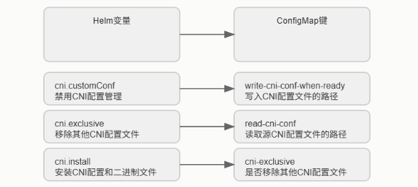
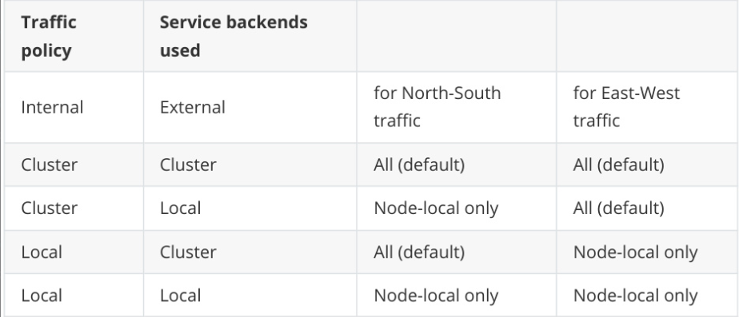

## CNI插件配置

首先看这三个核心变量：

- `cni.customConf`，默认是false，如果你想完全掌控CNI配置，就设成true；
- `cni.exclusive`，默认是true，它确保Cilium是唯一的网络配置管理器，避免与其他CNI插件冲突，就像霸道总裁，只认自己；
- `cni.install`，默认是true，负责把Cilium的配置文件和二进制包部署到位。

这三者是基础，但灵活性往往体现在更复杂的配置上。有时候，标准的默认配置可能不够用，比如你需要针对特定场景进行微调。这时候，Cilium就提供了自定义CNI配置文件的选项。你可以直接把你的CNI模板文件放在本地磁盘上，然后告诉Helm去读取，或者更优雅地，通过ConfigMap的方式将配置文件注入到集群里。Helm提供了三个关键的选项来实现这一点：`cni.readCniConf`，告诉Cilium代理从哪里读取配置文件；`cni.configMap`，指定包含这个配置文件的ConfigMap的名字；`cni.configMapKey`，如果ConfigMap里有多个键，就用这个指定具体哪个键对应CNI配置。

这就像给Cilium提供了一套定制化的说明书。Helm的配置选项最终会转化成Cilium内部使用的ConfigMap中的键值对。这个转换过程非常重要。比如，你通过 Helm 设置了 cni.readCniConf 指向一个路径，那么在 Cilium 的 ConfigMap 中，就会出现一个名为 read-cni-conf 的键，它的值就是你指定的路径。同样，cni.customConf 会映射到 cni-exclusive 这个键。理解这个映射关系，能让你更清晰地看到 Helm 的配置是如何影响 Cilium 的实际行为的。这就像翻译官，把你的指令翻译成 Cilium 能懂的语言。



我们进入一个更高级的话题：CRD验证。这在 Kubernetes 1.8.0 版本之后就引入了，虽然早期是 Alpha 版本，但现在已经非常成熟。对于 Cilium 来说，从 v1.0.0-rc3 开始，它就能自动创建或更新 Cilium Network Policy 的 CRD，并且把验证规则也就是 Schema 嵌入进去。这意味着什么呢？当你尝试创建或修改一个 Cilium Network Policy 时，验证会在 kube-apiserver 这个核心组件那里进行，而不是等到 Cilium 执行时才发现问题。这大大提高了效率和安全性。当然，前提是你得在启动 kube-apiserver 时，加上 --feature-gates=CustomResourceValidation=true 这个参数。

好消息是，Cilium 自己会自动利用这个特性，你不需要额外配置。如何启用这个强大的功能呢？很简单，就是在启动 kube-apiserver 的时候，加上那个 --feature-gates=CustomResourceValidation=true 参数。启用之后，怎么验证它是否真的在工作？你可以直接查询 Cilium Network Policy 的 CRD 定义。用 kubectl get crd ciliumnetworkpolicies.cilium.io -o json，然后用 grep 命令查找包含 openAPIV3Schema 的部分。你会看到类似这样的结构，里面定义了 spec 和 specs 两个字段的验证要求。这就像给你的策略写了一份详细的说明书，告诉你哪些字段是必须的，哪些是可选的。如果验证失败了，会发生什么？Kubernetes 会直接告诉你哪里错了。比如，我们来看一个例子：一个恶意的策略，它把端口设成了65536。这显然超出了TCP端口的合法范围。当你尝试用 kubectl create -f bad-cnp.yaml 创建这个策略时，Kubernetes 会立刻返回错误，告诉你 spec.ingress.toPorts.ports.port 的值不符合要求，必须在0到65535之间。这就像交通警察，直接拦住你，告诉你哪里违规了。这比等到策略应用到网络中才发现问题要高效得多。

## BPFFS

接下来，我们聊聊 BPFFS，也就是 BPF 文件系统，它是 eBPF 技术的核心依赖之一。在使用 systemd 的系统中，如何正确地挂载它呢？

```
$ cat < [Unit]
Description=Cilium BPF mounts
Documentation=https://docs.cilium.io/
DefaultDependencies=no
Before=local-fs.target umount.target
After=swap.target

[Mount]
what=bpfss
Where=/sys/fs/bpf
Type=bpf
Options=rw,nosuid,nodev,noexec,relatime,mode=700

[Install]
wantedBy=multi-user.target
EOF
```

这里有个关键点：systemd 的单元文件名必须包含挂载点的路径。比如，你想把 BPFFS 挂载到 /sys/fs/bpf，那么你的单元文件就应该命名为 /etc/systemd/system/sys-fs-bpf.mount。这个脚本展示了如何创建这个单元文件。注意 Mount 部分，what=bpfss 指定类型，Where=/sys/fs/bpf 指定挂载点，Type=bpf 指定文件系统类型，Options 则是一些挂载选项，比如只读、禁止 suid、nodev 等。最后，Install 部分确保它在系统启动时被加载。

现在，我们转向容器运行时。如果你选择了 CRI-O 这个轻量级的运行时，部署 Cilium 时需要注意一些细节。首先，确保你的 Helm 仓库里有 Cilium 的源。然后是安装命令，这里我们用的是 Helm 1.17.3 版本，指定安装到 kube-system 命名空间。注意这个 --set_bpf.autoMount.enabled=false 标志，它在某些 CRI-O 环境下可能需要设置，但也可能不需要，具体取决于你的环境。文档里提到了一个常见问题，我们稍后会讲到。

另外，安装完成后，CRI-O 需要手动重启，才能识别到 Cilium 作为新的 CNI 插件。安装完 Cilium，第一步是确认它是否在正常运行。可以用 kubectl get pods -n kube-system -o wide 查看 kube-system 命名空间下的 cilium Pod 状态。如果看到 Ready 是 1/1，Status 是 Running，那就说明基础运行没问题。

接下来，就是重启 CRI-O 守护进程。在 minikube 环境下，你可以用 minikube ssh -- sudo systemctl restart crio 来完成。这里要特别注意一个常见的 CRI-O 问题：有些 CRI-O 环境会自动在 Pod 中挂载 BPFFS，而 Cilium 默认情况下，如果设置了 --set_bpf.autoMount.enabled=false，是不希望在 Pod 中挂载的。如果 Cilium 日志里出现关于 BPF 文件系统未挂载的警告，很可能就是这个原因。这时，你需要检查你的 Helm 配置，移除那个标志，然后重新部署 Cilium。

## 网络策略

现在我们来聊聊 Kubernetes 的核心功能之一：网络策略。当 Cilium 与 Kubernetes 集成时，它能充分利用 Kubernetes 的分布式能力，自动将网络策略应用到集群中的所有节点。Cilium 提供了三种主要的策略配置方式：标准的 Kubernetes NetworkPolicy，它支持 L3 和 L4 层面的访问控制，是 Kubernetes 的原生规范；扩展的 CiliumNetworkPolicy，这是一个 CRD，它支持更丰富的 L3 到 L7 层面的策略，功能更强大；还有集群范围的 CiliumClusterwideNetworkPolicy，它可以在整个集群范围内生效，不受命名空间限制。你可以同时使用多种策略类型，但要小心，策略组合可能会变得复杂，需要仔细规划，避免出现意外的允许行为。

我们先来详细看看 CiliumNetworkPolicy。它本质上是对标准 NetworkPolicy 的扩展，旨在提供 NetworkPolicy 目前还不支持的功能，比如更精细的 L7 控制。理想情况下，这些功能最终会合并到标准的 NetworkPolicy 中，到时候这个 CRD 就可能不再需要了。

```
type CiliumNetworkPolicy struct {
  // ... (省略部分代码)
  Spec *api.Rule json:"spec,omitempty".
  Specs api.Rules json:"specs,omitempty".
  // ... (省略部分代码)
}
```

从 Go 代码来看，它的结构主要包括元数据、Spec 和 Specs 两个字段，以及状态。Spec 包含了单个规则的定义，而 Specs 则是一个规则列表，这在需要动态增删规则时非常有用。Status 字段则告诉你这个策略是否成功应用。理解这些字段，能帮助你更有效地编写和管理复杂的网络策略。除了命名空间级别的 CiliumNetworkPolicy，还有 CiliumClusterwideNetworkPolicy。这个 CRD 的主要区别在于，它定义的策略是集群范围的，不受命名空间的限制。而且，它支持 NodeSelector，这意味着你可以根据节点的标签来选择性地应用策略。从内部实现来看，它的策略定义和 CiliumNetworkPolicy 是完全一样的，只是作用域和选择方式不同。Go 代码结构也几乎一致，只是省略了命名空间相关的字段。这为跨命名空间的统一策略管理提供了便利。

```
type CiliumClusterwideNetworkPolicy struct {
  // Spec is the desired Cilium specific rule specification.
  Spec *api.Rule
  // Specs is a list of desired Cilium specific rule specification.
  Specs api.Rules
  // Status is the status of the Cilium policy rule.
  Statu
```

## 移除 kube-proxy

接下来，我们进入一个非常激动人心的部分：如何在 Kubernetes 集群中完全移除 kube-proxy，然后用 Cilium 来替代它所有的功能，包括服务发现和负载均衡。

我们将使用 kubeadm 来快速搭建一个基础集群。但是，这里有一个硬性要求：Cilium 的 eBPF-kube-proxy 替代方案依赖于 Linux 内核的 socket-LB 特性，所以你的内核版本必须足够新，比如 v4.19.57 或者 v5.1.16 以上。v5.3 和 v5.8 内核版本还有一些额外的优化。如果你还在用 v5.0.y 系列，那很遗憾，因为那个内核已经过期了，不支持这个特性。

开始动手搭建。

- 第一步，用 kubeadm init 启动控制平面节点，但这次我们要加上 --skip-phases=addon/kube-proxy 参数，告诉 kubeadm 不要安装 kube-proxy。

- 然后，加入至少一个工作节点。特别提醒：如果你的节点有多个网卡，务必确保 kubelet 的 --node-ip 参数指向正确的内部 IP 地址，否则 Cilium 的服务发现可能会出问题。如果你之前已经有 kube-proxy 在运行，记得先把它移除，但要注意，移除 kube-proxy 会中断现有的服务连接，直到 Cilium 启动完成。

- 最后，别忘了添加 Cilium 的 Helm 仓库。现在，我们用 Helm 来部署 Cilium。这里有几个关键步骤。首先，你需要生成并部署 Helm 的 YAML 文件。

- 然后，非常重要的一点是，你需要告诉 Cilium 你的 API Server 的 IP 地址和端口。因为我们在初始化 kubeadm 时跳过了 kube-proxy，所以 Kubernetes 服务的 ClusterIP 是由 kube-apiserver 本身提供的，而不是通过 kube-proxy。Cilium 需要知道这个地址，才能正确配置。所以，helm install 命令里要加上 --set k8sServiceHost 和 --set k8sServicePort 参数。

  ```
  $ kubeadm init --skip-phases=addon/kube-proxy
  
  helm repo add cilium https://helm.cilium.io/
  
  API_SERVER_IP=<your_api_server_ip>
  API_SERVER_PORT=<your_api_server_port>
  
  $ helm install cilium cilium/cilium --version 1.17.3 \
    --namespace kube-system \
    --set kubeProxyReplacement=true \
    --set k8sServiceHost=...
  ```

- 另外，Cilium 默认会尝试自动挂载 cgroup v2 文件系统，如果你需要禁用这个自动挂载，可以用 --set cgroup.autoMount.enabled=false，或者指定一个已有的挂载点，比如 --set cgroup.hostRoot=/sys/fs/cgroup。

- 部署完成之后，怎么检查 Cilium 是否成功接管了 kube-proxy 的角色？首先，用 kubectl -n kube-system get pods -l k8s-app-cilium 看看 Cilium 的 Pod 是否都在正常运行。注意，这里我们使用了 --set kubeProxyReplacement=true，这意味着 Cilium 会完全替代 kube-proxy。如果你的 Helm 版本默认设置是 false，那它只会启用 ClusterIP 服务的负载均衡，而不会替代 NodePort、LoadBalancer 等功能。

Cilium 的 eBPF-kube-proxy 替代方案支持两种模式：Direct Routing 和 Tunneling。默认情况下，它会根据网络环境自动选择最合适的模式。为了确认 Cilium 确实进入了 kube-proxy 替代模式，我们可以使用 cilium-dbg status 这个命令。通过 grep KubeProxyReplacement，我们可以看到类似 KubeProxyReplacement: True 的输出。

如果想看更详细的配置，比如 Socket LB 是否启用，支持哪些协议，使用了哪些设备，模式是 SNAT 还是 DNAT，可以加上 --verbose 参数。这个命令会告诉你 Cilium Agent 的当前状态，包括后端选择算法、会话亲和性、优雅终止等高级配置。这就像给 Cilium 做一个全面的体检。

```
$ kubectl -n kube-system exec ds/cilium -- cilium-dbg status | grep
KubeProxyReplacement
KubeProxyReplacement: True [eth0 (Direct Routing), eth1]

$ kubectl -n kube-system exec ds/cilium -- cilium-dbg status --verbose
[
  KubeProxyReplacement Details:
  Status: True
  Socket LB: Enabled
  Protocols: TCP, UDP
  Devices: eth0 (Direct Routing), eth1
  Mode: SNAT
]
```

理论讲完了，我们来做个简单的验证。我们创建一个 Nginx Deployment，部署两个副本。然后，我们创建一个 NodePort 类型的服务，暴露 Nginx 的 80 端口。这个服务会自动由 Cilium 的 eBPF-kube-proxy 替代方案来处理。

```
apiVersion: apps/v1
kind: Deployment
metadata:
  name: my-nginx
spec:
  selector:
    matchLabels:
      run: my-nginx
  replicas: 2
  template:
    metadata:
      labels:
        run: my-nginx
    spec:
      containers:
        - name: my-nginx
          image: nginx
          ports:
            - containerPort: 80
```

首先，我们确认 Nginx Pod 已经正常运行。然后，执行 kubectl expose deployment my-nginx --type=NodePort --port=80。这个命令会创建一个 NodePort 服务，并且 Cilium 应该会自动配置好相应的服务规则。服务创建成功后，我们用 kubectl get svc my-nginx 查看服务信息。你会看到一个 NodePort 地址，比如 80:31940。

```
$ kubectl get pods -l run=my-nginx -o wide
$ kubectl expose deployment my-nginx --type=NodePort --port=80
```

接下来，我们用 cilium-dbg service list 来检查 Cilium 是否真的创建了这个服务。你会看到类似 0.0.0.0:31940/TCP NodePort 1 => 10.217.0.107:80/TCP 这样的条目，这表示 Cilium 已经在 eth0 网卡上监听了 31940 端口，并将流量转发到后端的 Nginx Pod。同时，我们还可以用 jsonpath 从服务信息里提取出 NodePort 端口号，方便后续测试。

最关键的一步来了：验证 iptables 规则。在传统的 kube-proxy 模式下，服务规则会通过 iptables 链来实现。现在，我们用 iptables-save 命令，然后用 grep KUBE-SVC 查看，应该看到一个空行。这表明 iptables 规则确实不存在了。

最后，我们用 curl 命令来测试连接性。我们分别从本地环回地址、工作节点的 IP 地址、以及 ClusterIP 地址访问 NodePort 端口。如果都能成功返回 Nginx 的欢迎页面，那就证明 Cilium 的 eBPF-kube-proxy 替代方案已经成功接管了服务，而且没有使用 iptables。

现在我们来探索一些高级配置。首先是**客户端源 IP 保留**。在传统的 kube-proxy 模式下，NodePort 请求通常会被 SNAT，导致客户端的源 IP 在到达后端 Pod 时丢失。这对于某些需要追踪来源 IP 的场景，比如安全审计、日志分析等，是不可接受的。

Cilium 的 eBPF-kube-proxy 替代方案提供了多种方式来解决这个问题。

- 对于 externalTrafficPolicy=Local，也就是只允许来自本地节点的流量访问本地后端服务，Cilium 通常能通过 eBPF 实现来避免 SNAT，即使在没有本地后端的情况下，集群内的其他节点也能访问到这个服务。对于默认的 externalTrafficPolicy=Cluster，Cilium 也提供了多种选项，比如 DSR 或者 Hybrid 模式，来实现外部流量的源 IP 保留。
- 除了外部流量，集群内部的流量也一样可以进行策略控制。这就是 internalTrafficPolicy。它的逻辑和 externalTrafficPolicy 类似。internalTrafficPolicy=Local 表示，来自集群内部 Pod 的流量，只能被路由到同一个节点上的后端服务。而 internalTrafficPolicy=Cluster 是默认设置，它不限制后端服务，流量可以被路由到任何节点上的后端服务。这张表清晰地展示了不同组合下，南北向和东西向流量的后端选择情况。理解这些策略，能让你在设计内部网络拓扑时，有更精细的控制能力。



默认情况下，如果你定义了一个 LoadBalancer 服务，Cilium 不仅会创建 LoadBalancer 服务，还会同时创建对应的 NodePort 和 ClusterIP 服务。同样，如果你创建了一个 NodePort 服务，也会默认创建一个 ClusterIP 服务。

但有时候，你可能只希望暴露其中一种类型的服务。比如，你只想让一个服务通过 LoadBalancer 访问，而不希望它在内部网络中通过 NodePort 或者 ClusterIP 访问。这时，你可以使用 service.cilium.io/type 注解来精确控制。在 Service 的 metadata 中添加这个注解，指定你需要的服务类型，比如 LoadBalancer，Cilium 就只会创建对应的服务类型。

默认情况下，Cilium 会把所有 Kubernetes 服务暴露在集群的所有节点上。但有时候，你可能只希望某些服务只暴露在特定的节点上，比如只暴露在带有某个标签的节点上。Cilium 也支持这种选择性暴露。你可以通过给节点打上 service.cilium.io/node 标签，比如 beefy。然后，当你创建一个 Service 时，如果在它的 annotations 中添加了 service.cilium.io/node: beefy，那么这个服务就会被限制在只有那些带有 beefy 标签的节点上才暴露。需要注意的是，如果节点标签发生变化，Cilium Agent 可能不会立即感知到，你需要手动重启 Cilium Agent，才能让新的服务暴露策略生效。

所以，最好是在节点加入集群时就固定好标签。

## Maglev一致性哈希

最后，我们来介绍一个非常酷炫的高级特性：Maglev 一致性哈希。传统的负载均衡算法，比如轮询，当节点增删时，可能会导致流量分配的剧烈变化，影响服务稳定性。而 Cilium 的 eBPF-kube-proxy 替代方案支持 Maglev 哈希算法。这是一种一致性哈希算法，它能显著提升服务的故障恢复能力和负载均衡性能。当新节点加入时，它能保证大部分请求的后端选择不变，新增节点也能快速适应。

当后端节点移除时，流量的重新分配也更加平滑，对服务的影响降到最低。

要启用这个特性，只需要在 Helm 安装时加上 --set loadBalancer.algorithm=maglev 这个参数即可。这就像给你的负载均衡器装上了一个智能大脑，让流量分配更加稳定高效。

```
$ helm install cilium cilium/cilium --version 1.17.3 \
  --namespace kube-system \
  --set kubeProxyReplacement=true \
  --set loadBalancer.algorithm=maglev \
  --set k8sServiceHost=...
```

