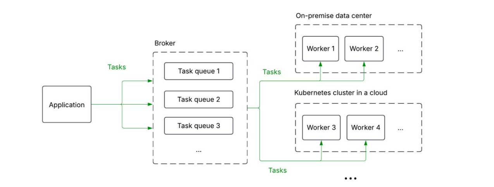
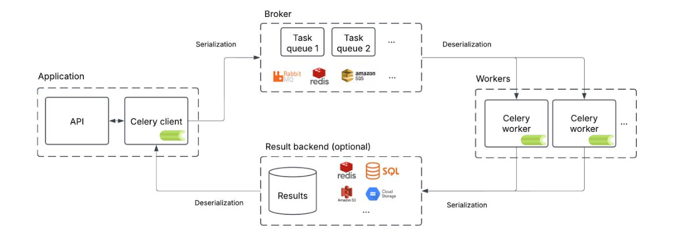
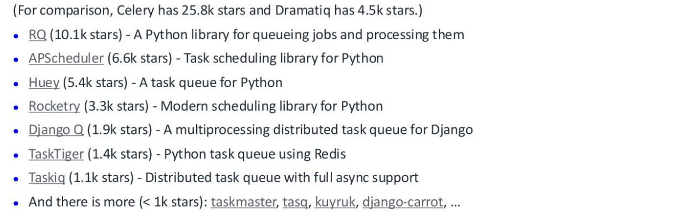

我们今天聚焦于Python生态中的分布式任务队列，特别是Celery以及它的一些替代方案。这不仅仅是技术选型，更是关乎如何构建高效、可扩展的系统。今天的议程将围绕几个核心部分展开。让我们深入了解一下分布式任务队列的概念，特别是通过Celery这个具体的实例来展开。

什么是分布式任务队列？简单来说，它是一个系统，允许你将任务从一个地方发送到多个地方去执行。想象一下这个架构：你的应用（Application）通过一个叫做Broker的中间件，把任务发送到不同的队列里。这些队列可以部署在不同的地方，比如本地的数据中心，或者云上的Kubernetes集群。然后，Worker节点会从这些队列中取出任务并执行。这就像一个高效的调度系统，确保任务能够被分配到合适的处理单元，无论是本地还是云端，都能实现负载均衡和扩展性。这种架构的核心价值在于解耦和异步处理。



那么，什么是Celery呢？它是一个开源的、用Python编写的分布式任务队列。在Python社区里，它几乎就是事实上的标准。你可以把它看作是**Python内置的多进程模块 multiprocessing 的一种扩展，只不过它能跨越多台机器工作**。它有哪些用武之地呢？比如，把那些CPU密集型或者需要长时间运行的任务，从你的Web应用或API中剥离出来，交给Celery去处理。它可以用于任务的排队和缓冲，比如处理上传的文件。还可以实现定时任务，比如每天凌晨的报表生成。更高级的是，它可以处理复杂的任务流程，比如链式执行、并行执行、组合任务等。

```py
from celery import celery
app = celery('hello', broker = '[...]', backend = '[...]')@ app.task
def add(x， y):
    return x + y
result = add.delay(2， 3)
print(result.get())
```

看这个示例代码，定义了一个简单的add任务，然后通过delay方法异步发送，最后通过get获取结果。这整个过程就是Celery的工作方式。Celery是如何工作的呢？这张图清晰地展示了它的内部运作机制。



大致分为三个层次：应用层、Broker层和Worker层。

- 应用通过API调用Celery客户端，将任务序列化后发送给Broker。
- Broker可以是多种消息队列，比如RabbitMQ、Redis或Amazon SQS等。
- Broker负责存储和管理这些任务。
- Worker节点会从Broker中拉取任务，然后执行相应的Python代码。
- 执行完成后，结果会被序列化并存储到结果后端，比如Redis或者SQL数据库里，供应用层查询。

**整个过程依赖于序列化和反序列化**，确保数据在不同组件间可靠传递。这个架构保证了应用的解耦和任务的异步处理。除了核心功能，Celery还支持很多其他特性和功能。

- 支持多种Broker，比如RabbitMQ、Redis、SQS，甚至还有实验性的ZooKeeper、Kafka和GCP Pub/Sub支持。
- 结果后端也非常灵活，可以是Redis、SQL数据库、RabbitMQ、AWS S3、GCP GCS等等。
- 任务序列化格式也支持多种，如JSON、YAML、Pickle、MessagePack。
- Worker模式也很丰富，可以是进程池prefork、线程、eventlet或gevent。

虽然它是用Python写的，但它的协议是开放的，理论上可以用任何语言实现，比如有人就用C++通过AMQP协议实现了对Celery的消费和发布。它支持自动和自定义的任务路由，包括优先级。Worker管理功能也很强大，可以进行监控、控制、动态调整Worker池大小。它还提供了信号机制，可以让你在任务生命周期的各个阶段插入钩子。总而言之，Celery是一个高度可配置、灵活且可扩展的系统。

那么，使用Celery相比直接使用底层的Broker比如RabbitMQ或Redis，有什么优缺点呢？优点很明显

- Celery提供了透明的RPC调用和结果存储，你不需要关心底层消息队列的细节。
- 自带额外功能，包括任务处理、序列化、反序列化、定时任务等等，开箱即用。
- 对Broker和结果存储的选择非常灵活，你可以根据需要更换底层组件，而无需修改太多应用代码。

缺点也很实在

- Celery本身更复杂，学习曲线和配置难度可能更高。
- 可能包含很多你用不到的特性，增加了代码库的复杂度
- 引入一个额外的依赖库，可能会带来复杂性，也可能带来便利性。
- 跨语言互操作性方面，如果只用Broker和结果存储，可能比直接用Celery更灵活，但这取决于具体需求。

所以，选择哪种方式，取决于你的具体场景和权衡。

理论讲完了，现在我们来看一个实际的Celery演示。这里会展示一些基本操作和功能。

安装直接执行

```
pip install celery
```

然后，我们需要创建一个Celery App实例。这个实例是整个Celery系统的入口。创建时，我们需要指定几个参数：

- 实例名，通常就是当前模块的名称，比如tasks。
- broker，这是消息队列的URL，格式是协议://用户名:密码@主机:端口，比如amqp://guest@localhost//或redis://localhost:6379/0。
- backend，这是结果后端的URL，比如rpc://或redis://。

```
from celery import Celery 
# app = Celery('tasks', broker='pyamqp://guest@localhost//',backend='rpc://guest@localhost//') app = Celery('tasks', broker='redis://localhost:6379/0', backend='redis://localhost:6379/0')
```

还可以用include参数指定Worker启动时需要加载哪些任务模块。定义好Celery App后，我们就可以注册任务了。最简单的方法是用@app.task这个装饰器。被装饰的函数就是一个任务，Worker可以远程调用它。每个任务都有一个唯一的名称，Broker会根据这个名称来匹配任务。

```py
@app.task 
def add(x, y): 
	return x + y
```

如果你想让任务函数的第一个参数变成self，方便你在任务里访问一些上下文信息，比如任务ID，可以使用@app.task(bind=True)。这样，你就可以通过self.request.id来获取当前任务的ID。

```py
@app.task(bind=True) 
def get_id(self): 
	return self.request.id
```

任务定义好了，接下来就是启动Worker来执行任务了。在命令行里，cd到你的项目目录下，然后运行命令

```
celery -A tasks worker --loglevel=INFO
```

这里的-A tasks告诉Celery去tasks.py模块里找任务。worker指定我们要启动Worker进程。loglevel=INFO设置了日志级别，INFO是默认的，你可以改成DEBUG看更详细的信息。

启动后，Worker会自动加载tasks.py里定义的@app.task任务，然后开始监听消息队列，等待任务执行。

```
result = add.delay(1, 1) 
result = add.apply_async((1, 1), queue='high-priority')
```

当我们在客户端调用一个任务时，比如add.delay(1, 1)，它会立即返回一个AsyncResult对象。这个对象包含了任务的ID。AsyncResult对象非常有用，它可以帮助我们追踪任务的状态。比如，你可以用result.state来查看任务当前是PENDING、STARTED、SUCCESS、FAILURE还是RETRY。如果你想等待任务完成并获取结果，可以调用result.get()。如果只想知道任务是否成功，可以用result.successful()，失败则用result.failed()。

- AsyncResult.get(),阻塞等待任务完成并获取结果。
- AsyncResult.successful(),判断任务是否成功。
- AsyncResult.failed(),判断任务是否失败。

这让我们可以很方便地处理异步任务的结果。

默认情况下，Celery是不存储任务结果的。如果你调用AsyncResult.get()，它会报错。如果你想获取任务结果，就需要在创建Celery App时配置结果后端。比如，我们把backend设置为redis://localhost:6379/0。这样，Worker执行完任务后，结果就会被保存到Redis里。

```
app = Celery('tasks', broker='redis://localhost:6379/0', backend='redis://localhost:6379/0')
```

你也可以使用RPC作为后端，比如backend='rpc://guest@localhost//'，这种方式是通过消息传递结果，结果只能被发起任务的客户端检索一次。选择哪种方式取决于你的具体需求。

Celery的日志使用的是Python的标准logging库，所以Worker启动时会自动打印日志。如果你需要在任务里记录日志，可以直接使用Celery提供的get_task_logger函数来获取一个日志器，然后在任务里用logger.info等方法记录。

```py
from celery import get_task_logger 
logger = get_task_logger(__name__) 
@app.task(bind=True) 
def my_task(self): 
    logger.info("Task started") 
    # ... do work ... 
    logger.info("Task completed")
```

随着项目复杂度增加，配置项会越来越多，硬编码在代码里显然不方便。Celery提供了两种方式来独立配置：

- 在代码里直接调用app.conf.update方法更新配置
- 更推荐的方式是创建一个单独的配置文件，比如settings.py，然后在Celery App里用app.config_from_object读取配置文件。

Celery的可视化管理工具，官方推荐的是Flower。它能让你直观地看到任务的运行状态、进度、历史记录，还能监控Broker的性能，甚至可以远程控制Worker，比如重启Worker、撤销任务等等。启动Flower有两种方式

- 可以直接在命令行里运行celery flower，但这种方式对Celery版本有要求。

  ```
  celery flower --broker=pyamqp://...
  ```

- 更推荐的方式是用Docker来启动，这样不受版本影响。

  ```
  docker run --name flower -p 5555:5555 mher/flower:0.9.5 flower --broker=pyamqp://...，
  ```

启动后访问5555端口，就能看到Flower的监控界面了。

最后，我们快速过一下Celery的两个重要功能：路由和定时任务。

- 路由任务是把任务分配到不同的队列去执行。你可以用简单的字典配置task_routes，比如tasks.add任务路由到add_queue队列。也可以手动定义Queue实例，然后配置task_queues。Worker启动时可以用-Q参数指定监听哪个队列。

  ```
  app.conf.task_routes = { 'tasks.add': {'queue': 'add_queue'}, 'tasks.get_id': {'queue': 'id_queue'} }
  ```

- 定时任务则是通过Celery Beat来实现。Beat是一个定时调度器，它会定期触发任务。你需要在配置里定义一个beat_schedule字典，指定哪个任务、多久执行一次，以及时区。注意，Beat最好只运行一个实例，避免任务重复执行。

接下来，我想和大家分享一下我们在使用Celery过程中的经验和教训。这包括我们遇到的坑，以及我们从中获得的宝贵经验。具体的经验教训，包括：

- 配置优化是关键，Celery的默认配置可能并不理想，需要根据实际负载进行调优。
- 监控和日志非常重要，可以帮助你快速定位问题。
- 任务处理的异步性是把双刃剑，处理不当可能导致数据不一致或丢失。对于某些特定场景，比如需要严格事务保证的流程，Celery的原生支持可能不够，需要额外的解决方案。
- 随着技术发展，Celery的某些特性可能显得有些过时，比如对异步原生支持的不足，以及社区活跃度的相对下降。这些都需要我们在实际应用中仔细权衡。

既然提到了Celery的局限性，那么Python生态里还有其他分布式任务队列可以选择吗？答案是肯定的。这里要重点介绍的是Dramatiq。它是一个相对较新的、专注于Python的分布式任务队列。它试图在设计上简化Celery的某些复杂性，并提供一些现代的特性。除了Celery和Dramatiq，Python社区还有其他一些选择。



这些工具各有特点，选择哪个取决于你的具体需求和偏好。现在进入问答环节。

什么时候应该使用分布式任务队列？

记住，它们只是工具箱里的一个选项。考虑使用它们的原因：当它们带来的好处比如透明的RPC调用、异步处理能力超过了额外的复杂性；当你使用的框架比如Django或Flask与它们集成良好；当你需要利用它们提供的高级功能，比如复杂的任务流；或者当你需要未来可能需要更换底层Broker或结果存储时的灵活性。

但什么时候应该避免使用它们？当你在单机环境下，简单的多进程或多线程就足够时；当你只需要一个消息队列本身，比如直接用RabbitMQ或Kafka就够了；当你只需要一个数据库或键值存储，比如PostgreSQL或Redis就够了；或者当你需要构建高吞吐量的系统，可能需要考虑更底层的Socket或ZeroMQ。还有，如果某些特定的保证，比如事务性的任务流，是你的核心需求，而当前的队列无法满足，那也可能是另一个选择。选择合适的工具，是成功的关键。

总结一下，分布式任务队列是将工作负载分发到多台机器上的机制。Python生态中有许多实现，其中Celery是最流行的，拥有庞大的社区和丰富的功能。它支持多种Broker和结果后端，高度可配置。但同时，它也有自身的缺点，比如默认配置不佳、需要调优、通过RabbitMQ调度效率不高、并非原生为云设计、复杂度高、缺乏原生异步支持、近期更新较少等。Dramatiq是另一个值得关注的选择，虽然经验积累较少，但提供了不同的设计思路。

记住，分布式任务队列是工具，有其优缺点，并非所有场景都适用。在选择之前，务必仔细思考和评估。