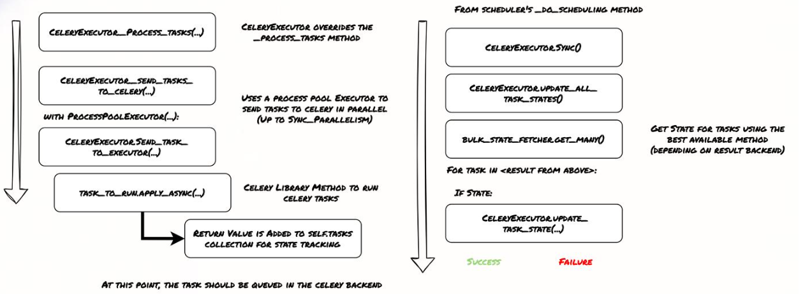
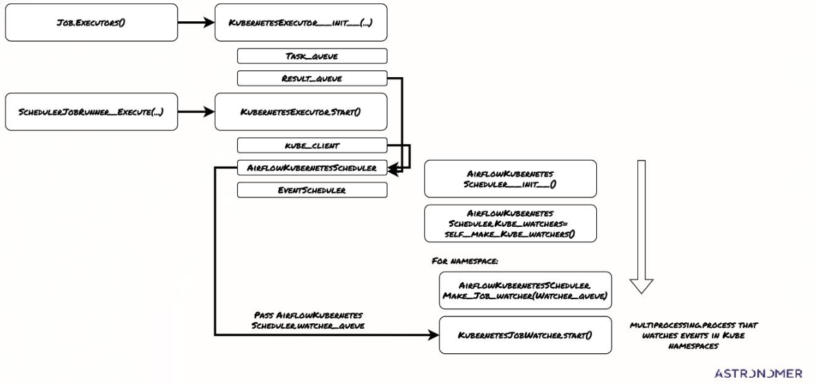

我们深入剖析Airflowscheduler内部的那些关键循环，看看它是如何驱动任务执行的。今天，我将带大家深入探讨Airflowscheduler的核心机制。本次分享将涵盖以下八个关键方面：

- 明确Airflow任务调度和执行组件及其角色；
- 剖析scheduler初始化过程；
- 从宏观层面理解任务调度框架；
- 深入探讨scheduler的定时器及其功能；
- 揭示DAGRun是如何创建的；
- 聚焦scheduler的“临界区”以及TaskInstance的处理方式；
- 探究executor如何获取TaskInstance，对比Celery和Kubernetesexecutor；
- 分析任务实际如何“运行”，同样对比两种executor。

在Airflow中，我们经常听到scheduler、DAG处理器、executor、工作者等等。它们之间是什么关系？简单来说：

- scheduler负责当任务依赖满足时，将任务添加到队列并触发执行；
- DAG processor解析、处理并序列化DAG文件，可以是独立的进程，也可以是scheduler的一部分；
- executor组件负责实际运行或提交任务进行执行，它通常作为scheduler的一部分运行；
- worker组件则负责执行任务的具体操作，也就是运行Operator的execute方法。
- triggerer，运行并检查trigger，这些是异步协程，用于监控任务被延迟后的情况，以便后续恢复执行。

理解这些角色是理解整个系统的基础。为了更清晰地理解，我们快速回顾一下几个核心概念：

- DAG，即有向无环图，定义了任务的流程和依赖关系。
- Task，是DAG中的一个具体操作，由一个Operator实现。
- DagRun，是DAG在运行时的实例化，代表了特定时间点的DAG执行。
- TaskInstance，是Task在运行时的实例化，它属于某个DagRun。

这张图形象地展示了它们之间的关系：Operator实现为Task，Task在DagRun和TaskInstance中被实例化。记住这个层级关系，有助于我们后续理解调度过程。

这张图展示了Airflow任务调度和执行的整体框架。可以看到

- DAG处理器生成DAG对象，包含多个任务。
- scheduler负责将DAG对象转换为DagRun，并进一步分解为多个TaskInstance。
- executor负责执行任务，这里展示了两种常见的executor：CeleryExecutor和KubernetesExecutor。
- CeleryExecutor会将任务分配给Celery Worker，而KubernetesExecutor则通过KubernetesWorker在Kubernetes集群中执行任务。

整个流程清晰地描绘了从任务定义到实际执行的完整路径。

要开始调度任务，第一步就是启动scheduler。

- 从命令行启动scheduler时，底层会调用_run_scheduler_job函数，这个函数会实例化一个SchedulerJobRunner。_
- 这个JobRunner有两个主要职责：运行主scheduler循环，启动executor。
- 遍历self.job.executors中定义的每个executor，然后调用每个executor的start()方法来启动它们。
- 之后，scheduler就进入SchedulerJobRunner._run_scheduler_loop这个循环，开始真正的任务调度工作。

我们来看这个核心的循环：SchedulerJobRunner._run_scheduler_loop。_

1. 初始化一些定时器，这些定时器由EventScheduler管理。
2. 进入一个无限循环。在每次循环中执行调度逻辑，即调用self._do_scheduling，这个方法包含了核心的TaskInstance和DagRun调度逻辑。
3. 遍历所有executor，调用它们的heartbeat()方法来检查状态和更新任务。scheduler自身也会进行心跳，

这个循环的核心就是_do_scheduling方法和heartbeat方法，它们分别负责调度决策和executor交互。

scheduler内部运行着许多定时任务，由EventScheduler管理。

上图中一些关键的后台任务，比如检查孤儿任务、触发超时、收集池指标、查找僵尸进程等。每个任务都有对应的配置设置，例如orphaned_tasks_check_interval，以及默认的执行间隔。有些任务，如清理过期的DAGs，其配置设置是None，这意味着它们的执行时间可能由其他机制触发，或者依赖于特定的配置。这些定时器共同维护了scheduler的健康状态和资源管理。

现在我们深入到调度的核心方法SchedulerJobRunner._do_scheduling。这个方法大致包含几个关键步骤。

1. 根据配置SCHEDULER_MAX_DAGRUNS_TO_CREATE_PER_LOOP，通常为10，创建新的DAGRuns，按NEXT_DAGRUN_CREATE_AFTER排序。
2. 启动排队中的DAGRuns。
3. 获取一批需要检查的正在运行的DAGRuns，用于后续的调度。核心步骤是安排所有DAGRuns的运行，并且限制在MAX_DAGRUNS_PER_LOOP_TO_SCHEDULE，通常为20。
4. 为正在运行的DAGRuns调度任务实例，更新状态，并将处于Scheduled状态的TaskInstances放入队列，使其对executor可见。

这个过程是scheduler的核心决策逻辑。在调度任务实例时，scheduler会进入一个关键的临界区，以确保并发访问的安全性。

1. 计算一个最大任务实例数MAX_TIS，取MAX_TIS_PER_QUERY和PARALLELISM的最小值。
2. 尝试将符合条件的TaskInstances添加到队列中，数量不超过MAX_TIS。为了保证原子性，它会获取池表行的锁，创建全局锁。在锁定状态下，它会检查一系列条件：池限制、DAG的最大活跃任务数、executor状态、优先级、每个DAG运行的最大活跃任务数等。只有满足所有条件的TaskInstance才会被排队，排序依据是优先级权重、执行日期和Map索引。这个过程确保了任务调度的公平性和资源的有序分配。优
3. 先级权重（Priority Weight）对任务调度的影响至关重要。假设我们有DAG A，包含多个任务，每个任务都有一个权重。如果一个任务的权重非常高，比如非常大，那么在scheduler决定哪些任务可以执行时，它会优先考虑这些高权重的任务。权重越高，任务越有可能被调度执行。

我们再来看executor的心跳过程。

对于每个executor，scheduler会调用其heartbeat()方法。心跳过程主要包括几个步骤：

1. 计算executor可用的空闲槽位，即PARALLELISM配置值减去正在运行的任务数量。接着，executor会根据可用的空闲槽位，尝试触发最多对应数量的TaskInstances。
2. executor会处理这些任务，这可能是通过调用ProcessTasks方法或类似逻辑。
3. executor会同步状态，更新任务状态，这通常涉及到与executor特定的后端进行交互。这个过程确保了scheduler和executor之间状态的同步和任务的正确执行。

现在我们来看具体的executor。首先是CeleryExecutor。

它的初始化过程相对简单。大部分初始化工作都在__init__方法中完成。它会初始化两个重要的对象：BulkStateFetcher，用于批量获取任务状态，以及Tasks map，用于跟踪任务。

需要注意的是，CeleryExecutor的start()方法实际上不做任何事情。另外，**使用CeleryExecutor时，必须手动启动Celery Worker，因为scheduler本身不负责启动它们**。当scheduler调用CeleryExecutor的sync方法时，它会调用update_all_task_states来更新所有任务的状态。这通常会调用BulkStateFetcher.get_many，尝试批量获取状态。

对于每个获取到的状态，如果状态发生变化，比如从成功变为失败，scheduler会调用update_task_state来更新本地跟踪。这个过程依赖于Celery的Result Backend来获取最终状态。CeleryExecutor的执行流程是：**scheduler发送任务到Celery Broker，Worker从Broker获取并执行，完成后将结果写入Result Backend，scheduler通过Result Backend获取状态并更新。**

这是一个典型的异步任务队列模式。上图展示了CeleryWorker的工作方式。

1. CeleryWorker从Celery Broker（通常是RabbitMQ或Redis）获取任务。它会根据worker_prefetch_multiplier参数预先获取一定数量的任务，以提高效率。同时，它会并行处理worker_concurrency数量的任务。
2. 当Worker处理完任务后，会将结果返回给Result Backend。
3. scheduler通过查询Result Backend来获取任务的状态。
4. CeleryWorker是CeleryExecutor的核心执行单元，负责实际任务的运行。

相比之下，KubernetesExecutor的初始化过程要复杂得多。这是因为KubernetesExecutor需要跟踪和管理更多的状态，比如Pod的生命周期、资源请求等。它主要初始化了五个子组件：

- 任务队列
- 结果队列
- AirflowKubernetesScheduler
- Kubernetes客户端（Kube client）
- 事件scheduler

由于某些组件的初始化比较复杂，KubernetesExecutor的start()方法被用来执行这些实际的初始化工作。

上图展示了KubernetesExecutor初始化过程中的关键步骤。

1. 从Job.Executors开始，调用KubernetesExecutor_init进行初始化。
2. SchedulerJobRunner_execute会启动KubernetesExecutor_start。这个过程会创建多个内部组件：任务队列TASK_QUEUE，结果队列RESULT_QUEUE，Kubernetes客户端Kube_client，以及AirflowKubernetesScheduler。
3. KubernetesScheduler会初始化Kubernetes watcher，用于监控Kubernetes集群中的事件。对于每个命名空间，它会创建一个任务观察者队列，并启动一个KubernetesJobWatcher进程。这个watcher进程会持续监控命名空间中的事件，并将事件放入watcher_queue。
4. 当KubernetesExecutor执行任务时，它会调用KUBERNETESEXECUTOR_EXECUTE_ASYNC方法。这个方法会从BASEEXECUTOR_QUEUED_TASKS中获取一个TaskInstance，然后生成Pod的规格和命令。它会将一个包含键、命令、KubeExecutor配置和Pod模板文件的元组放入任务队列。**这个任务队列是KubernetesExecutor内部的核心组件，它将任务调度请求传递给负责创建和管理Pod的KubernetesJobWatcher**。
5. KubernetesExecutor的同步方法主要处理两个队列：watcher_queue和result_queue。在主executor循环中，它会调用BaseExecutor.heartbeat()和KubernetesExecutor.Sync()。KubernetesExecutor.Sync()会处理watcher_queue中的所有事件，如果事件表明任务已完成，它会将结果放入result_queue。然后，它会处理result_queue中的所有项目，更新任务状态，并可能创建新的Pod。
6. 同时，KubernetesJobWatcher子进程会持续地将Kubernetes事件放入watcher_queue，然后在while True循环中处理这些事件，更新状态并可能将新的事件放入watcher_queue。这个循环确保了Kubernetes资源的动态管理和任务状态的及时更新。

总结一下今天的分享。Airflow调度过程的核心步骤是：创建DagRuns、排队DagRuns、排队TaskInstances、创建新TaskInstances、运行executor。一个任务总是从scheduler流向executor，再到工作者。配置参数众多，需要根据你的工作负载模式仔细调优。理解这些内部机制，有助于我们更好地设计和优化Airflow任务，确保数据管道的稳定性和效率。