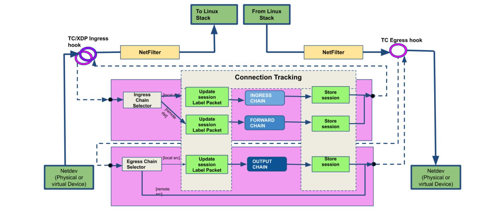

https://metaso.cn/s/ghH9RCy

我们今天要探讨的是在Kubernetes中如何用eBPF来替代传统的iptables。使用Cilium，结合eBPF、Envoy、Istio和Hubble等技术，实现更高效、更安全的网络策略。那么，问题来了：为什么我们需要替换掉iptables呢？它到底哪里出了问题？传统的iptables确实存在不少痛点。

- 它必须通过重建整个规则链的方式来更新规则，这在高负载场景下效率极低。
- 它本质上是链表结构，所有操作都是O n复杂度，这意味着规则越多，性能越差。实现访问控制列表ACL时，它通常采用顺序列表，这在面对大规模变更时非常脆弱。
- 它只基于IP和端口进行匹配，完全不理解L7层协议，无法进行精细化的策略控制。每次添加新的IP或端口，都需要重新构建整个链表，这在Kubernetes这种动态环境中简直是灾难。结果就是资源消耗巨大，尤其是在服务数量增加时，延迟变得不可预测，性能急剧下降。

实测数据也显示，随着服务数量增长，性能和延迟都会显著恶化。Kubernetes本身对iptables的依赖程度相当高。最核心的就是kube-proxy，它通过DNAT规则来实现Service和负载均衡。此外，很多CNI插件，特别是那些用于网络策略的，也都在底层使用了iptables。这使得整个Kubernetes的网络模型在面对复杂性时，显得越来越力不从心。

那么，什么是BPF？它是一种强大的内核技术，允许我们编写安全的、可执行的代码，直接注入到内核的特定钩点上，而无需修改内核源码。这个过程是这样的：开发者编写代码，通过LLVM和Clang编译成字节码，然后经过验证器和即时编译器的处理，最终生成汇编指令，注入到内核的网络栈等特定位置。这样，我们就能在内核层面高效地执行自定义逻辑，比如过滤、监控、负载均衡等等。Linux内核网络栈非常复杂，经历了多年的发展和演化，形成了多层抽象。从应用程序到硬件，层层递进，每层都有其特定的功能。这种分层设计带来了巨大的兼容性，但也意味着很难绕过这些层进行底层操作。

Netfilter模块作为网络过滤器，已经在Linux内核中存在了二十多年，它需要在数据包上下行穿越栈的过程中进行过滤。这种设计在早期很有效，但随着网络规模和复杂度的爆炸式增长，它的局限性就显现出来了。BPF的强大之处在于，它可以在内核的多个关键点上插入钩点，也就是所谓的BPF Hooks。

这张图展示了BPF如何嵌入到Linux内核的各个层级。从用户空间的进程，到系统调用接口，再到套接字层、Netfilter、IP层、以太网层，甚至底层的硬件驱动、桥接和OVS，BPF都能找到自己的位置。这意味着我们可以利用BPF来实现各种各样的网络功能，从流量控制、负载均衡到安全过滤，几乎覆盖了整个网络栈。

这张图展示了不同网络过滤技术的性能对比。横轴是不同的技术，纵轴是每秒百万包的处理能力。可以看到，基于硬件卸载的bpfiler性能达到了惊人的60Mpps，远超其他技术。即使是纯软件驱动的bpfiler也有接近40Mpps。相比之下，传统的legacy iptables和nftables性能则明显落后。这直观地说明了BPF在高性能网络过滤方面的巨大优势。

这张图展示了BPF如何取代iptables。它清晰地展示了数据包在网络栈中的五个主要阶段：PREROUTING、INPUT、FORWARD、OUTPUT、POSTROUTING。在每个阶段，都可以看到eBPF和XDP的钩点。这意味着我们可以利用BPF来实现更灵活、更高效的过滤、路由和NAT功能，而不再依赖于传统的iptables规则链。BPF代码可以直接在这些钩点上运行，处理数据包，然后决定是继续转发还是丢弃。

这张图展示了基于BPF的过滤架构。它特别强调了连接跟踪（Connection Tracking）的流程。

- 数据包从Linux栈进入，通过BPF的TC或XDP Ingress Hook，然后经过一个选择器，根据源地址和目的地址选择合适的链。
- 进入Ingress Chain，这里会更新会话标签，并将会话信息存储起来。
- 出站时，数据包也会通过Egress Hook，经过选择器，进入Output Chain，更新标签并存储会话。

整个过程都是基于BPF的高效执行，而不是传统的链表遍历。

这张图展示了BPF基于尾调用的机制。它展示了如何构建一个高效的程序链来处理网络包。每个BPF程序只在需要执行相关操作时才被注入，它们通过尾调用（tail calls）连接起来，形成一个链式结构。这种机制避免了传统的链表遍历，极大地提高了性能。

图中展示了多个程序，例如头部解析、IP查找、协议查找等，它们共享一个全局的CPU数组，用于存储中间结果，最终通过eBPF钩子将结果传递出去。BPF的应用远不止于防火墙。它已经渗透到各种关键的网络组件中。比如

- 负载均衡器，像katran；
- 性能监控工具，像perf；
- 系统管理工具，像systemd；
- 入侵检测系统，像Suricata；
- 虚拟交换机，像Open vSwitch的AF_XDP

可以说，BPF正在成为构建高性能、可扩展的网络和系统工具的核心技术之一。BPF的应用场景非常广泛，已经被众多行业巨头和开源项目采用。大家可以看到Facebook、SUSE、Google、Cloudflare、Cilium、Falco等公司的标志。这些公司在各自领域都面临着巨大的挑战，比如海量的流量、复杂的系统、严格的安全要求。BPF正是帮助他们解决这些挑战的关键技术。它的灵活性和性能使其成为构建下一代云原生基础设施的基石。

现在，让我们聚焦到今天的主角：Cilium。它是一个基于eBPF的开源网络项目，旨在为Kubernetes提供高性能、安全、可扩展的网络解决方案。Cilium究竟是什么呢？它是一个网络代理，但它的核心在于利用eBPF技术。

Cilium层包括CLI、策略库、插件和监控器，由一个守护进程Cilium Daemon来协调。它通过字节码注入的方式，将BPF程序直接嵌入到容器的网络接口eth0中。这些BPF程序负责处理进出容器的数据包，实现网络策略、安全检查和性能优化。这与传统的基于iptables的方案相比，完全是不同的范式。

CNI，即容器网络接口，是CNCF的一个项目，它定义了容器网络插件的规范和库。CNI插件的主要职责是确保容器的网络连通性。它通过ADD和DEL两个核心操作来管理网络接口。

- 对于ADD操作，容器运行时需要先为容器创建一个独立的网络命名空间，然后调用相应的CNI插件，为容器添加网络接口，分配IP地址。
- 对于DEL操作，则是移除网络接口，释放IP地址。CNI的设计要求插件必须是幂等的，不能对同一个容器进行多次ADD操作，必须保证ADD操作最终会有一个对应的DEL操作。

Cilium作为CNI插件，遵循这些规范。

这张图展示了Cilium作为CNI插件的控制流程。

- 当Kubernetes API Server收到Kubectl命令后，会通知Kubelet
- Kubelet再通过CRI接口与容器运行时Containerd交互。
- Containerd会调用CNI插件，这里是Cilium。
- Cilium Agent接收到请求后，会与Linux内核网络栈进行交互，通过bpf syscall与BPF Maps通信。
- BPF Maps存储着网络相关的数据，比如MAC地址映射。
- BPF程序通过BPF Hook作用于eth0接口，实现网络的配置和管理。

这张图更详细地展示了Cilium的组件以及BPF Hook点和BPF Maps在Linux网络栈中的位置。

- 用户空间部分有Cilium Agent、CLI、健康检查和监控器等。
- 内核空间则展示了虚拟网络设备、TCP/UDP、IP层、队列和转发层，以及关键的BPF Maps和XDP技术。

这些组件共同协作，实现了Cilium的网络功能。注意看BPF Maps是如何连接用户空间和内核空间的，以及BPF Hook是如何在数据包处理路径上发挥作用的。

这张图展示了Cilium作为CNI插件的典型部署。在Kubernetes节点上，每个Pod都有一个容器，比如容器A、容器B、容器C。每个容器通过eth0接口连接到一个虚拟网络接口，比如lxc0或lxc1。这些虚拟接口由Cilium负责管理。Cilium通过eth0接口连接到物理网卡，实现了Pod之间的通信。这种架构下，Cilium不仅负责网络连接，还负责执行网络策略，提供隔离和安全。

Cilium支持两种主要的网络模式：封装模式和直接路由模式。

- 封装模式下，Cilium负责在节点间路由，通常使用VXLAN隧道进行数据包封装。这适用于需要跨节点网络隔离的场景。

- 直接路由模式下，Cilium利用云提供商的路由器或BGP路由，实现Pod IP的直接路由。这适用于需要高性能、低延迟的场景，比如在云上使用云原生路由器或BGP路由。

选择哪种模式取决于具体的应用场景和性能需求。

这张图展示了Pod IP路由的Overlay模式（隧道模式）。在这种模式下，当两个Pod需要跨节点通信时，数据包会被封装在VXLAN隧道中。封装后的数据包包含源节点IP、目标节点IP、VXLAN头部信息以及原始的Pod IP和负载数据。Cilium负责在节点间转发这些封装后的数据包，直到目标节点解封装，然后才能被目标Pod接收。这种方式保证了跨节点的网络隔离。

这张图展示了Pod IP路由的直接路由模式。在这种模式下，Pod的IP地址可以直接路由到网络中。当一个Pod需要访问另一个Pod时，数据包直接携带目标Pod的IP地址和负载信息，通过网络路由转发。这种模式下，网络头部信息非常简洁，只包含源Pod IP和目标Pod IP以及负载。这使得通信效率更高，延迟更低，适合对性能要求高的场景。

现在我们来看Cilium的网络策略功能，首先是基于标签的三层过滤，针对入站流量。

这张图展示了如何定义一个策略，允许特定标签的Pod访问另一个标签的Pod。例如，允许所有标签为frontend的Pod访问标签为backend的Pod。这通过CiliumNetworkPolicy资源来定义，非常直观。注意，这里的策略是基于标签的，而不是基于IP的，这使得策略管理更加灵活，尤其是在Pod动态调度的情况下。

接下来是基于CIDR的三层过滤，针对出站流量。例如，允许一个标签为backend的Pod访问10.0.1.0/24这个子网，但拒绝访问其他子网，比如10.0.2.0/24。这在需要控制Pod出站流量的场景下非常有用，例如限制后端服务只能访问特定的数据库或缓存集群。它定义了一个名为backend-backend的策略，作用于所有标签为backend的Endpoint。在egress部分，它允许访问到10.0.1.0/24这个CIDR地址。同样，配置非常清晰地表达了允许后端访问特定子网的策略。

除了三层过滤，Cilium还支持四层过滤，即基于端口和协议的过滤。这张YAML示例展示了如何定义一个策略，只允许访问标签为backend的Pod的TCP端口80。这意味着，即使两个Pod之间有三层策略允许通信，但如果没有四层策略允许访问特定端口，该端口的流量也会被阻断。这张图直观地展示了四层过滤的效果。对于一个标签为backend的Pod，只有TCP端口80的流量是绿色的，表示允许通过，而其他端口的流量是红色的，表示被拒绝。这保证了只有期望的端口才能被访问，增强了安全性。

Cilium最强大的功能之一是七层过滤，也就是基于应用层协议，特别是HTTP协议的过滤。这张图展示了如何实现基于API的访问控制。比如，一个Pod可以访问另一个Pod的GET斜杠articles斜杠id API，但无法访问GET斜杠private API。这需要对HTTP请求的内容进行解析，才能做出正确的决策。这是实现七层过滤的YAML示例。它定义了一个名为frontend-backend的策略，作用于所有标签为backend的Endpoint。在ingress部分，它允许访问端口80，并且通过L7规则，允许特定的HTTP请求路径。这使得我们可以基于具体的API请求来控制访问权限，实现更精细化的安全策略。

这张图展示了如何将Cilium与Envoy这样的独立代理结合使用，实现七层过滤。在Node A上，Envoy通过libcilium.so生成L7过滤程序，然后通过Cilium和BPF模块进行L3斜杠L4过滤。Node B也类似。这种方式下，Envoy负责处理复杂的七层逻辑，而Cilium利用BPF进行高效的底层处理，实现了性能和功能的平衡。

接下来，我们来看Cilium的其他一些关键特性。Cluster Mesh是Cilium的一个重要特性，它允许跨集群的网络通信。

这张图展示了两个集群，A和B，它们都运行了Cilium。通过Cluster Mesh，集群A中的Pod可以访问集群B中的Pod，反之亦然。这使得多集群环境下的服务发现和网络通信变得非常方便。图中Pod A和Pod B、C都通过Cilium连接到一个共享的etcd实例，用于协调和管理跨集群的网络配置。

这张图展示了在没有Cilium的情况下，Istio如何实现透明的Sidecar注入。可以看到，Envoy代理被注入到Pod中，与应用进程共享网络命名空间。Envoy通过监听应用端口，拦截流量，然后转发给应用。这种方式需要在应用端口和Envoy端口之间建立连接，可能会引入额外的延迟和复杂性。

这张图展示了Istio与Cilium和sockmap结合后的架构。Cilium作为CNI插件，负责Pod的网络连接。Envoy作为Sidecar，仍然被注入到Pod中。但是，**Cilium通过sockmap技术，将Envoy的监听端口映射到应用的端口。这样，应用可以直接访问Envoy，而无需建立额外的连接**。这种方式利用了BPF的高效性，实现了更透明、更快速的Sidecar注入。

这张图展示了完整的Istio和Cilium集成。可以看到，Istio的控制平面（Pilot、Mixer、Citadel）负责服务发现、路由和安全策略。数据平面则由Envoy代理和Cilium网络组成。Cilium负责底层的网络连接和数据包处理，Envoy负责七层的负载均衡、路由和安全策略。这种结合充分发挥了Cilium和Istio各自的优势，构建了一个高性能、可扩展的服务网格。

这张图展示了Istio与Cilium结合实现的双向TLS认证。可以看到，服务A和B之间的通信被加密，通过Mutual TLS确保了双方的身份认证。这种安全通信是通过Istio的控制平面和Envoy的代理，以及Cilium的网络基础设施来实现的。

这张图展示了Istio与Cilium结合的Deferred kTLS特性。kTLS，即Kernel TLS，是内核直接提供TLS加密功能。Deferred kTLS允许在需要时才进行TLS加密，而不是在所有连接上都强制开启。这可以提高性能，尤其是在不需要加密的场景下。Cilium与Istio的结合，使得这种优化成为可能。

我们对比一下Kubernetes服务的实现方式。在Cilium和BPF中，服务路由通常使用哈希表。查找、插入和删除操作都是O(1)常数时间复杂度，非常高效。而在传统的Iptables和kube-proxy中，服务路由是基于线性列表的。查找是O(n)线性时间复杂度，插入和删除也是O(n)。这意味着，当服务数量增加时，BPF的性能优势会更加明显。

这张图展示了Kubernetes服务的基准测试结果。横轴是集群中的服务数量，纵轴是响应时间。蓝色柱代表Cilium（BPF），深蓝色柱代表kube-proxy（legacy iptables）。可以看到，随着服务数量增加，kube-proxy的响应时间急剧上升，而Cilium的响应时间基本保持稳定。这再次证明了BPF在处理大规模服务时的性能优势。

Cilium可以与其他CNI插件链式使用。比如，你可以将Cilium与Flannel、Calico、Weave、AWS CNI、Azure CNI等结合。例如，你可以使用一个CNI插件负责基础的网络配置，比如IP地址分配和网络接口配置，而Cilium则负责策略执行、负载均衡和多集群连接。这种链式组合提供了极大的灵活性，可以根据具体需求选择合适的组件。

Cilium原生支持AWS的弹性网络接口（ENI）。这张图展示了如何利用Cilium的Operator来读取ENI上的预分配IP地址，然后将这些IP地址分配给Pod使用。这使得Cilium能够充分利用AWS提供的网络功能，实现高性能的网络连接。Hubble是Cilium生态系统中的一个重要组件，它是一个分布式网络和安全可观测性平台。它建立在Cilium和eBPF之上，提供了对云原生工作负载的深度洞察。Hubble提供服务依赖关系和通信图谱、运维监控和告警、应用监控以及安全可观测性。虽然目前还处于Beta阶段，但其潜力巨大，是构建现代可观测性平台的关键工具。

Hubble由几个核心组件构成。

- Hubble Agent运行在每个节点上，负责与Cilium Agent交互，收集流量信息，并提供查询API和指标。Hubble Storage是一个内存存储层，用于存储收集到的流量信息。
- Hubble CLI是一个命令行工具，可以连接到Hubble Agent，查询存储的流量数据。
- Hubble UI则提供了图形化的服务通信图谱，基于Hubble Agent收集的数据。

这张图展示了Hubble在Cilium和eBPF之上的运行架构。可以看到，Hubble Agent与Cilium Agent紧密协作，收集网络流量信息。这些信息通过Hubble的API暴露出来，供Hubble CLI和Hubble UI使用。同时，Hubble还可以与Grafana、Prometheus等监控系统集成，提供更全面的可观测性。

这张图展示了Hubble提供的服务通信图谱。它以图形化的方式展示了不同服务之间的依赖关系和通信流量。例如，可以看到recruiter服务通过HTTP访问coreapi，elasticsearch服务通过TCP访问，kafka服务通过TCP访问zookeeper等。这种可视化对于理解复杂系统的运行状态至关重要。

Hubble还能提供丰富的HTTP指标。例如，这张图展示了HTTP请求和响应的统计，包括请求量、响应量、状态码分布、以及不同百分位的请求响应时间（p50, p99）。这些指标对于监控应用性能、发现瓶颈问题非常有帮助。总结一下，Cilium利用eBPF技术，为Kubernetes带来了革命性的网络和安全能力。

为什么Cilium如此优秀？它消除了传统iptables的弊端，始终从Linux内核中汲取最佳性能。它提供了多集群互联能力，加速了Istio的性能，提供了基于Kubernetes资源的七层API感知过滤，并且能够无缝集成其他流行的CNI插件。这些都是Cilium的核心价值。