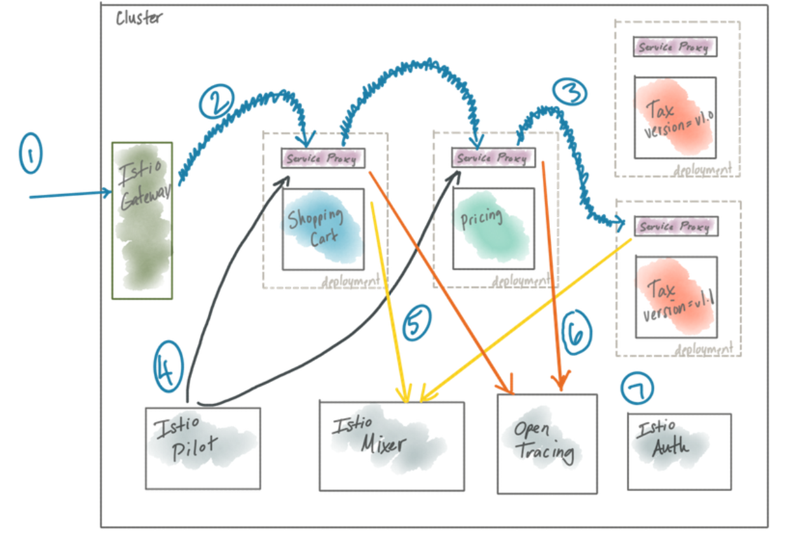

## 微服务

微服务将大系统拆解成一个个独立的、小型的服务单元。每个服务可以独立部署、快速迭代，团队可以自主决策，大大降低了变更风险。当然，微服务不是万能药，它需要强大的自动化和DevOps实践作为支撑。而Istio这样的工具，正是在微服务环境下，帮助我们实现流量控制、服务间韧性、指标收集等关键能力，让快速迭代变得可行且安全。学习和进步，离不开反馈。

- 自动化测试就是我们获取反馈、加速迭代的利器。它能让我们在代码变更后，立刻知道是否引入了新的bug，或者功能是否按预期工作。虽然单元测试很重要，但更关键的是功能测试，它让我们从API的角度审视服务，确保客户期望的行为得到保障。而且，当我们的代码因为重构、还债等原因发生变化时，功能测试应该尽可能保持稳定，避免频繁修改。更重要的是，测试不能只停留在测试环境，生产环境才是最真实的战场。我们需要在生产环境中进行测试，甚至进行探索性测试，比如在可控条件下引入混沌，观察系统的真实反应。这比任何预设的测试场景都更接近真实情况。

- 容器化技术，特别是Docker，彻底改变了我们构建和运行应用的方式。它让我们可以把应用、它的依赖、配置打包成一个轻量级的镜像。相比虚拟机，容器共享底层内核，资源利用率更高，启动速度更快。最关键的是，容器提供了强大的环境隔离能力，解决了长期以来困扰我们的环境漂移问题。这意味着我们可以放心地将应用从开发环境迁移到测试环境，再到生产环境，而无需担心环境配置不一致导致的问题。有了统一的容器API，我们就可以构建通用的工具链来管理这些应用，无论它们是什么语言、什么框架。Kubernetes就是这方面的佼佼者，它将容器管理提升到了一个新的高度。

- 自动化构建和部署流程，也就是CI/CD。CI确保我们每天都能把代码集成起来，尽早发现并修复问题。CD则更进一步，它提供了一条自动化流水线，将代码从提交到最终部署到生产环境。容器化为构建这条流水线提供了天然的便利。但是，部署上线并非易事，尤其是新版本上线时，如果直接替换旧版本，很容易导致服务中断。我们需要一种方式来控制流量，逐步将流量从旧版本迁移到新版本，这就是Istio的用武之地。它能让我们精确控制流量，实现金丝雀发布、灰度发布等策略，从而在追求速度的同时，最大限度地降低风险。

如何隔离故障、如何应对环境变化、如何保证系统在部分故障时仍能运行、如何实时监控系统状态、如何控制运行时行为、如何实施安全策略、如何降低变更风险、如何执行访问控制……这些都是我们必须攻克的难关。为什么这些服务架构会变得如此脆弱？一个关键原因在于我们所依赖的基础设施并非坚不可摧。

云服务看似强大，但本质上是由无数的硬件和软件组件组成的。任何一个组件都可能出故障。过去，我们可能假设基础设施是可靠的，可以在上面构建稳定的应用。但在云环境中，这种假设是危险的。比如，**一个服务调用另一个服务，中间可能因为网络拥塞、目标服务过载、甚至网络设备故障导致延迟飙升**。面对这种不可靠的网络，我们的服务该如何自处？我们需要给服务赋予韧性。这就像给系统穿上盔甲，让它在面对冲击时不至于崩溃。有哪些常用的武器呢？

- 比如，请求失败了，可以尝试重试，但要小心，如果重试太多，反而会加重下游压力。
- 可以设置超时时间，如果等太久，就果断放弃。
- 如果发现某个服务一直有问题，可以暂时熔断，停止调用它，让它冷静一下。
- 还可以限制每次请求的资源消耗，防止一个服务拖垮整个系统。
- 客户端负载均衡和动态服务发现则帮助我们找到健康的、可用的服务实例。

这些技术，我们统称为应用网络，它们在应用层面上构建了网络的韧性，确保服务在复杂多变的环境中依然能够稳定运行。光有韧性还不够，我们还需要知道系统到底发生了什么。我们需要实时了解系统状态：**服务之间是怎么通信的？负载情况如何？哪里出了故障？服务健康状况如何？**这些信息对于评估变更的影响、判断系统是否健康至关重要。

每一次部署新代码，都可能引入新的风险。我们需要强大的监控系统，通过指标、日志、追踪等手段，实时掌握系统的脉搏，确保我们能够及时发现问题，保障系统稳定可靠运行。为了解决这些问题，早期的互联网巨头们尝试了另一种方式：在应用层面引入各种库。比如Netflix的Hystrix、Ribbon、Eureka，Twitter的Finagle等等。这些库确实解决了不少问题，但它们也带来了新的挑战。

- 如果我想用一个新的语言或框架来构建服务，就必须找到对应的库，或者干脆放弃这个库。这限制了我们的技术选择。
- 不同语言的库，它们的实现方式可能完全不同，甚至基于不同的假设。这导致了系统行为的不一致，增加了排查故障的难度。
- 维护这么多不同语言的库，确保它们的版本一致、功能一致，本身就是一项巨大的工程。这就像给每个应用都装上了一套不同的工具，虽然功能强大，但管理和维护成本极高。

既然这些应用网络的功能，比如重试、超时、负载均衡、熔断，是通用的，不依赖于具体的应用语言或框架，那么我们能不能把这些关注点从应用中剥离出来，交给基础设施来处理呢？这正是我们接下来要探讨的。

Kubernetes这样的容器平台，已经帮我们把一些简单的网络服务，比如服务发现和负载均衡，从应用中解放出来了。但是，对于更复杂的、更高级的应用网络功能，比如精细化的熔断、重试策略、安全策略执行，Kubernetes本身还不够。我们需要一种更通用、更强大的解决方案。而代理，特别是应用感知代理，就是我们寻找的方向。它需要理解应用层的协议，比如HTTP请求、gRPC消息，而不仅仅是传统的网络连接和数据包。

## 服务网格

服务网格，就是这样一个解决方案。它是一个分布式的应用基础设施，它默默地站在应用的背后，处理所有进出应用的网络流量，而且对应用本身是透明的。它主要由两部分组成：**数据平面和控制平面**。

- 数据平面由像Envoy这样的应用代理构成，它们是网络流量的执行者，负责处理请求、建立连接、实施安全策略和控制。
- 控制平面则是大脑，负责管理数据平面的行为，它通过API接收操作人员的指令，然后配置数据平面。

服务网格的核心价值在于，它能提供强大的服务韧性、可观测性、流量控制、安全性和策略执行能力。这一切，都是在应用无需改动的情况下实现的。现在，让我们聚焦到一个具体的实现：Istio。

Istio是由Google、IBM、Lyft等巨头共同发起的开源项目，它是一个成熟的服务网格解决方案。Istio的目标就是让服务网格变得透明，应用开发者几乎不需要关心底层的网络细节。Istio的默认数据平面是Envoy，它负责具体的流量处理和代理功能。而控制平面则由一系列组件构成，

- Pilot负责配置管理
- Mixer负责监控和策略
- Auth负责身份认证
- Tracing负责追踪

这张图展示了Istio的典型架构

外部流量通过Gateway进入，然后通过Envoy代理路由到服务，整个过程受到Istio控制平面的管理和监控。

Istio的设计理念是平台无关的，它可以在Kubernetes上运行，也可以在其他平台上运行，甚至可以跨云环境Istio的核心优势在于它带来的透明性和一致性。应用开发者几乎不需要关心底层的网络细节，就能享受到服务网格带来的强大功能，比如韧性、可观测性、安全等等。这意味着，无论你的应用是用Java、Python还是Go写的，无论你用什么框架，Istio都能提供一致的、高质量的网络服务。这大大简化了运维工作，降低了运维复杂度。更重要的是，Istio默认启用mTLS，实现了端到端的加密通信，这对于保护微服务之间的通信至关重要。

此外，Istio还提供了强大的策略控制能力，可以实现精细的流量控制、访问控制、配额管理等等。这对于构建混合云、多云环境下的服务治理非常有帮助。可以说，Istio是构建云原生应用的基石之一。

服务网格的概念，可能让大家联想到以前的ESB（企业服务总线）。它们确实有相似之处，比如都希望简化服务调用。但ESB和ESB有着本质的区别。**ESB往往是集中式的，存在单点故障的风险**。而且，ESB常常把应用网络和业务逻辑混在一起，职责不清，还常常是昂贵的商业软件。而服务网格，它采用的是分布式架构，每个服务旁边都有一个代理，没有中心化的瓶颈。它的职责非常明确，就是专注于应用网络的连接、安全和控制。它通常是开源的，更加灵活和可扩展。所以，服务网格是ESB的升级版，解决了ESB的许多问题。

另一个容易混淆的概念是API网关。API网关通常用于暴露给外部的API，提供安全、限流、监控等能力。但传统的API网关，往往也是集中式的，所有服务都通过它访问，这会带来额外的网络延迟和潜在的瓶颈。而且，**API网关通常只关注入口流量**，对于服务内部的通信，它可能鞭长莫及。相比之下，服务网格的代理是分布式的，与服务同部署，减少了网络跳数，降低了延迟。更重要的是，服务网格的代理本身就具备强大的韧性、安全和可观测性能力，而API网关通常需要额外的插件来实现这些功能。

因此，服务网格正在成为一种更强大的API管理基础设施，甚至可能取代传统的API网关。Istio这么强大，是不是只能用在微服务架构上？答案是不一定。虽然Istio在微服务架构下能发挥最大的威力，尤其是在服务数量众多、交互复杂、跨越多个云环境的场景下，但它同样可以为非微服务架构，比如传统的单体应用，带来价值。

比如，你可以把Istio的代理部署在单体应用旁边，让它来处理单体应用的网络流量，这样就能获得指标监控、策略执行等能力，这对于理解单体应用的性能瓶颈、进行跨云访问控制都非常有帮助。对于已经使用了Netflix OSS等库的微服务，Istio也能提供额外的保障，比如统一的策略执行、更精细的流量控制，甚至可以发现和解决不同库之间可能存在的冲突。

当然，服务网格也不是万能的。它专注于解决应用网络层面的问题，比如连接、安全、流量控制、可观测性。它**不会帮你做业务逻辑处理，比如业务流程编排、数据转换、内容路由**等等。这些事情还是应该由应用本身来负责。理想的状态是，我们把应用架构分成不同的层次，每个层次负责不同的关注点。

- 部署平台负责实例的部署、调度、伸缩；
- 服务网格负责网络的连接、安全、控制和可观测；
- 应用本身负责业务逻辑。

Istio的角色就是服务网格层，它连接着应用层和部署平台层，让应用可以专注于业务逻辑，而无需关心底层复杂的网络细节。

