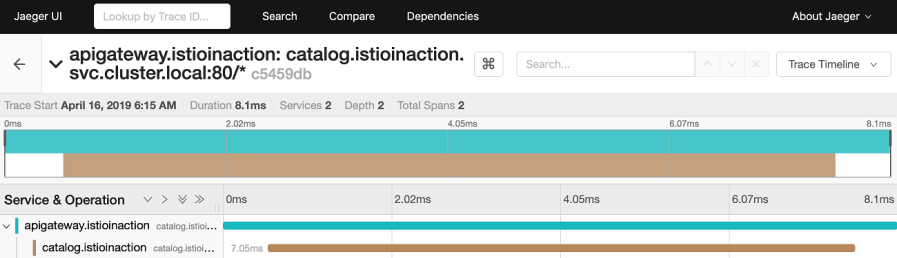

仓库代码，https://github.com/istioinaction/book-source-code

我们不再停留在理论层面，而是要动手实践，看看如何将Istio部署到实际的环境中，初步体验它的强大功能。Istio到底能解决什么问题？它提供了强大的能力，包括流量控制、可观察性、容错性、安全性以及服务发现。这些能力共同构成了一个健壮、可靠的服务网格，让微服务架构更加稳定可控。

我们会一步步完成安装过程，理解 Istio 的核心控制组件，然后部署一个实际的应用，看看 Istio 代理是如何工作的。最后，我们会通过简单的流量控制规则，初步感受 Istio 的核心功能，为后续更深入的学习打下基础。为什么选择 Kubernetes 作为 Istio 的部署平台？因为它太强大了。

Kubernetes 是一个卓越的容器平台，能够高效地调度和编排容器，管理集群中的节点。虽然 Istio 最初是为 Kubernetes 设计的，但它并不局限于容器，也能支持运行在虚拟机上的工作负载。不过，对于初学者来说，Kubernetes 是一个绝佳的起点，因为它能很好地配合 Istio 的部署和管理。

## 安装步骤

确保你的 Kubernetes 集群已就绪，可以通过 kubectl get nodes 命令验证连接，看到类似这样的输出就说明没问题。我们使用的 Istio 1.7.x 版本，需要 Kubernetes 1.16.x 或更高版本的支持

接下来，我们需要获取 Istio 的安装包。你可以访问 Istio 的官方发布页面，下载对应你操作系统版本的压缩包。或者，如果你喜欢自动化，可以直接运行这个 curl 命令，它会自动帮你下载并解压到当前目录。下载完成后，解压这个压缩包。你会看到几个目录

```shell
$ curl -L https://istio.io/downloadIstio | sh -
$ tar -xzf istio-1.7.0-osx.tar
$ cd istio-1.7.0
$ ls -l
total 48
-rw-r--r--@ 1 ceposta staff 11348 Aug 21 12:00 LICENSE
-rw-r--r--@ 1 ceposta staff 5756 Aug 21 12:00 README.md
drwxr-x---@ 3 ceposta staff 96 Aug 21 12:00 bin
-rw-r-----@ 1 ceposta staff 815 Aug 21 12:00 manifest.yaml
drwxr-xr-x@ 6 ceposta staff 192 Aug 21 12:00 manifests
drwxr-xr-x@ 21 ceposta staff 672 Aug 21 12:00 samples
drwxr-x---@ 7 ceposta staff 224 Aug 21 12:00 tools
```

- samples 包含了丰富的示例和教程
- tools 提供了一些调试工具
- manifests 是 Helm Charts 和配置文件，用于自定义安装
- bin 目录，里面包含了我们用来管理 Istio 的命令行工具，也就是 istioctl。这个工具类似于 kubectl，但专门用于 Istio

进入 bin 目录后，我们先运行 istioctl version 命令。这个命令会检查当前 Istio 的版本，同时还会尝试连接到 Istio 系统命名空间。这表明 istioctl 工具本身已经准备就绪，可以用来进行下一步操作了。

```shell
$ ./bin/istioctl version
no running Istio pods in "istio-system"
1.7.0
```

在正式安装 Istio 之前，最好先做一次预检查。运行 istioctl x precheck 命令，它会检查你的 Kubernetes 环境是否符合 Istio 的安装要求。比如，它会检查 Kubernetes API 是否可访问、版本是否兼容、Istio 是否会安装到 istio-system 命名空间、必要的 Kubernetes 配置是否已创建，以及 Sidecar 注入器是否支持。这个预检查能帮你提前发现潜在的问题，避免安装失败。

```shell
$ istioctl x precheck
Checking the cluster to make sure it is ready for Istio installation...
```

预检查通过后，就可以开始安装 Istio 了。我们使用 istioctl install 命令。这里我们指定 profile=demo 参数，这是 Istio 提供的一个简化配置，包含了核心组件和一些常用功能。

```shell
$ istioctl install --set profile=demo
✔ Istio core installed
✔ Istiod installed
✔ Ingress gateways installed
✔ Egress gateways installed
✔ Installation complete
```

安装完成后，我们去检查一下 Istio 的控制平面组件是否都运行起来了

```shell
$ kubectl get pod -n istio-system
NAME READY STATUS RESTARTS AGE
istio-egressgateway-55d547456b-q2ldq 1/1 Running 0 92s
istio-ingressgateway-7654895f97-2pb62 1/1 Running 0 93s
istiod-5b9d44c58b-vvrpb 1/1 Running 0 99s
```

可以看到 istio-system 命名空间下的几个关键 Pod，比如 istiod、istio-ingressgateway 和 istio-egressgateway。这些是 Istio 的核心控制组件和边界网关。**注意，这里默认安装的是单实例，虽然在演示环境中足够，但实际生产环境需要考虑高可用性，确保每个组件都有多个副本**。

## 控制平面

现在我们来看看 Istio 的控制平面到底负责什么。它就像服务网格的中央大脑，负责管理、控制、观察和配置整个网格。它的核心功能非常丰富，包括提供API给运维人员配置路由和容错，向数据平面代理下发配置，抽象服务发现，定义策略，管理证书和身份认证，收集遥测数据，注入服务代理，以及定义网络边界。可以说，控制平面掌控着整个服务网格的运作。

在控制平面组件中，istiod 是核心中的核心。它承担着将用户或运维人员配置的高级意图，比如路由规则、重试策略，转换成具体的代理配置，比如 Envoy Proxy 的配置。istiod 通过暴露给用户和数据平面的 API 来实现这一点。它还具有平台无关性，通过适配器来对接不同的底层平台，比如 Kubernetes。我们之前看到的**配置资源，最终都会通过 istiod 转化为 Envoy 可以理解的 xDS 配置**。


这张图清晰地展示了 Istiod 的工作流程。用户通过 Kubernetes API 提交配置，比如定义一个 VirtualService。Istiod 接收这些配置，然后通过 xDS API 将翻译后的配置下发给 Istio 代理。这些代理部署在每个服务旁边，负责实际的流量转发和处理。这样，用户只需要关心业务逻辑，而 Istiod 和代理则负责底层的网络配置和管理。

## 配置流量路由

我们来看一个具体的例子：配置流量路由。

```yaml
apiVersion: networking.istio.io/v1alpha3
kind: VirtualService
metadata:
  name: catalog-service
spec:
  hosts:
    - catalog.prod.svc.cluster.local
  http:
    - match:  # Request matching
        - headers:
            x-dark-launch:
              exact: "v2"  # Exact match of header
      route:  # Where to route on match
        - destination:
            host: catalog.prod.svc.cluster.local
            subset: v2
    - route:  # All other traffic
        - destination:
            host: catalog.prod.svc.cluster.local
            subset: v1
```

假设我们想根据请求头 x-dark-launch 的值来决定请求是发送到 catalog 服务的 v1 版本还是 v2 版本。

我们可以用 Istio 的 VirtualService 资源来定义这个规则。这个配置文件定义了 hosts 是 catalog，然后在 http 下面，match 匹配请求头 x-dark-launch 等于 v2，然后 route 指定目标是 catalog 服务的 v2 版本。如果没有匹配到这个头，就默认路由到 v1 版本。

这就是 Istio 控制流量的典型方式。Istio 如何将这些配置应用到 Kubernetes 集群中呢？它巧妙地利用了 Kubernetes 的自定义资源 CRD 机制。Istio 的配置资源，比如我们刚才看到的 **VirtualService，实际上是 Kubernetes 的 Custom Resource**。这些 CR 由 CRD 定义，扩展了 Kubernetes 的原生 API。这意味着我们可以像操作 Kubernetes 原生资源一样，使用 kubectl apply -f 来创建、修改和删除 Istio 的配置。**Istio 的控制器会监听这些 CR 的变化，并自动将它们翻译成 Envoy 的配置**。Istiod 如何将我们写的 YAML 配置文件，比如 VirtualService，转换成 Envoy 能够理解的 JSON 配置呢？这里展示了 Istiod 生成的 Envoy 配置示例。

```yaml
  "domains": [
    "catalog.prod.svc.cluster.local"
  ],
  "name": "catalog.prod.svc.cluster.local:80",
  "routes": [
    {
      "match": {
        "headers": [
          {
            "name": "x-dark-lauch",
            "value": "v2"
          }
        ],
        "prefix": "/"
      },
      "route": {
        "cluster": "outbound|80|v2|catalog.prod.svc.cluster.local",
        "use_websocket": false
      }
    },
    {
      "match": {
        "prefix": "/"
      },
      "route": {
        "cluster": "outbound|80|v1|catalog.prod.svc.cluster.local",
        "use_websocket": false
      }
    }
  ]
```

可以看到，它包含了 domains、name、routes 等字段，这些字段描述了 Envoy 应该如何监听端口、如何匹配路由规则。Istiod 会将 Istio 特定的配置逻辑，比如 match 和 route 的规则，翻译成 Envoy 的原生配置，然后通过 xDS API 推送给代理。

## xDS API

刚才提到的 xDS API 是什么？它是 Envoy Proxy 的核心机制，**xDS API用于动态发现和更新配置。它包括了监听器发现、端点发现、路由规则发现等服务**。通过 xDS API，Istio 控制平面可以实时地将配置推送给数据平面的代理，而**代理无需重启**就能感知到这些变化。这种动态配置能力极大地提升了系统的灵活性和响应速度。更重要的是，只要代理支持 xDS API，Istio 就可以与之集成，这为 Istio 的扩展性奠定了基础。

除了路由控制，Istio 的另一个核心能力是安全。它通过为每个服务实例分配身份，并使用 X.509 证书来加密服务间的通信。这背后是 SPIFFE 标准，它允许 Istio 实现强双向认证，也就是 mTLS。这意味着服务之间互相验证身份，确保通信的机密性和完整性。**Istiod 在其中扮演着证书颁发机构的角色，负责证书的签发、部署和轮换，整个过程对应用是透明的**。


这张图展示了 Istiod 如何管理证书。可以看到，两个服务实例都通过 Istio 代理与 Istiod 进行通信。Istiod 负责签发证书，然后将证书下发给代理。代理之间通过这些证书进行加密通信，实现了服务间的安全认证。这大大提高了微服务架构的安全性，尤其是在复杂的网络环境中。

## Gateway

服务网格需要与外部世界交互。**Istio 提供了 Ingress 和 Egress Gateway 组件来管理进出集群的流量**。

- istio-ingressgateway 是一个入口网关，负责将外部流量导向集群内部的服务。
- istio-egressgateway 则是出口网关，控制集群内部服务访问外部资源。

通过明确配置这些 Gateway，我们可以更好地管理网络边界，提高安全性和可审计性。


这张图展示了 Gateway 组件的角色。左侧是 Kubernetes 集群，右侧是 Istio 的控制平面。Ingress Gateway 和 Egress Gateway 作为数据平面组件，位于集群的边缘，负责处理进出集群的流量。它们接收来自外部的请求，或者允许集群内部的服务访问外部资源。通过 Istio Gateway，我们可以集中管理集群的网络访问策略，实现精细化的流量控制。

理论讲了不少，现在我们来部署一个实际的应用，看看 Istio 在实际场景中的应用。我们模拟一个会议用品供应商的在线商店，它采用了典型的微服务架构

- 前端有 AngularJS 和 NodeJS
- 中间有一个 API Gateway
- 后端则有目录服务和库存服务

## 示例服务

今天我们先聚焦于部署 API Gateway 和 Catalog Service 这两个核心服务。这就是我们应用的简化架构图。


左边是 API Gateway，它作为统一入口，接收来自外部的请求，然后根据请求转发到右边的 Catalog Service 或者其他的后端服务。这种架构模式在微服务中非常常见，API Gateway 承担了路由、安全、监控等职责，后端服务则专注于业务逻辑。

我们先从部署这两个服务开始。在部署应用之前，我们需要在 Kubernetes 中创建一个新的命名空间，叫做 istioinaction。现在我们来部署 [Catalog Service](https://github.com/istioinaction/book-source-code/blob/master/services/catalog/kubernetes/catalog-deployment.yaml)

关键步骤是使用 istioctl kube-inject 命令（**手动注入**）。

```shell
$ istioctl kube-inject -f services/catalog/kubernetes/catalog.yaml
```

**这个命令会读取原始的 YAML 文件，并自动添加一个 istio-proxy 的容器到 Pod 的定义中**

```yaml
- args:
  - proxy
  - sidecar
  - --domain=$(POD_NAMESPACE).svc.cluster.local
  - --serviceCluster=catalog.$(POD_NAMESPACE)
  - --proxyLogLevel=warning
  - --proxyComponentLogLevel=misc:error
  - --trust-domain=cluster.local
  - --concurrency=2
env:
  - name: JWT_POLICY
    value: first-party-jwt
  - name: PILOT_CERT_PROVIDER
    value: istiod
  - name: CA_ADDR
    value: istiod.istio-system.svc:15012
  - name: POD_NAME
    valueFrom:
      fieldRef:
        fieldPath: metadata.name
...
image: docker.io/istio/proxyv2:1.7.0
imagePullPolicy: Always
name: istio-proxy
```

这个 istio-proxy 代理就是我们之前说的 Sidecar。最后，我们把增强后的 YAML 文件应用到 Kubernetes 集群中。

```shell
$ istioctl kube-inject -f services/catalog/kubernetes/catalog.yaml \
| kubectl apply -f -
serviceaccount/catalog created
service/catalog created
deployment.extensions/catalog created
```

部署完成后，Pod 里有两个容器都运行正常，一个是我们的 Catalog 应用容器，另一个就是 Istio 的代理容器。为了验证服务是否真的工作，我们用一个临时的 Pod 运行 curl 命令，调用 catalog 服务的 /items 接口。如果能看到 JSON 响应，就说明服务部署成功，并且 Istio 代理已经正常工作了。

```
kubectl run -i --rm --restart=Never dummy --image=dockerqa/curl:ubuntu-trusty --command -- sh -c 'curl -s catalog/items'
```

部署 API Gateway 的步骤和 Catalog Service 一样。同样地，验证 Pod 状态和用 curl 命令测试服务是否正常工作。

```shell
$ istioctl kube-inject -f services/apigateway/kubernetes/apigateway.yaml | kubectl apply -f -
```

这个过程展示了如何将 Istio 代理注入到不同的服务中，为后续的流量控制和可观测性打下基础。


现在我们有两个服务，每个服务都配了 Istio 代理。**当 API Gateway 调用 Catalog Service 时，实际上请求是先经过 API Gateway 的 Istio 代理，然后由它转发给 Catalog Service 的 Istio 代理，再由后者传递给 Catalog 服务本身**。Istio 代理在服务间通信的两侧都扮演了角色，负责流量控制、路由、安全检查等关键功能。

目前我们的服务只能在集群内部访问。为了让外部也能访问 API Gateway，我们需要配置 Istio Gateway。这个 Gateway 会监听特定端口，比如 80 端口，并将流量转发到 API Gateway 服务。

```yaml
apiVersion: networking.istio.io/v1alpha3
kind: Gateway
metadata:
  name: outfitters-gateway
  namespace: istioinaction
spec:
  selector:
    istio: ingressgateway # use istio default controller
  servers:
  - port:
      number: 80
      name: http
      protocol: HTTP
    hosts:
    - "*"
---
apiVersion: networking.istio.io/v1alpha3
kind: VirtualService
metadata:
  name: webapp-virtualservice
  namespace: istioinaction
spec:
  hosts:
  - "*"
  gateways:
  - outfitters-gateway
  http:
  - route:
    - destination:
        host: webapp
        port:
          number: 80
```

我们配置了 coolstore-gateway 和 apigateway-virtualservice，前者定义了 Gateway 的监听，后者定义了路由规则。配置好后，我们就可以用 curl http://localhost:80/api/catalog 访问到 API Gateway 服务了。

Istio 的一个巨大优势是其强大的可观察性。由于 Istio 代理部署在服务调用链路的两侧，它可以收集到非常丰富的遥测数据，包括请求量、响应时间、错误率等。更重要的是，这种观察是黑盒式的，不需要修改应用代码。Istio 提供了两种主要的观测手段：

- 一是全局指标，提供宏观的性能概览；
- 二是分布式追踪，可以深入分析单个请求在服务链路中的详细路径。

要查看全局指标，Istio 提供了 Prometheus 和 Grafana 这两个工具。我们可以通过 Istio 的 Addons 功能快速安装它们。安装后，使用 **istioctl dashboard grafana 命令可以将 Grafana 的仪表板访问端口映射到本地**。打开 Grafana，你会看到 Istio 提供的默认仪表板，比如 Istio Service Dashboard。这个仪表板会显示集群中所有服务的总体指标。在 Grafana 中，我们选择 Istio Service Dashboard，然后在服务下拉列表中选择 apigateway。这时，你会看到一些指标，比如客户端请求量、成功率、请求持续时间等。这些指标目前都是空的。我们可以在另一个终端启动一个简单的流量生成器，不断向 apigateway/api/catalog 发送请求。

```
$ while true; do curl http://localhost/api/catalog; sleep .5; done
```

回到 Grafana，你会看到仪表盘上的图表开始更新，显示了请求量、成功率、响应时间等指标。


除了全局指标，Istio 还能提供分布式追踪。通过 Istio 的 Addons，我们可以轻松安装 Jaeger。

```
kubectl apply -f ./samples/addons/jaeger.yaml
```

Jaeger 是一个流行的分布式追踪系统。安装好后，使用 istioctl dashboard jaeger 命令访问 Jaeger 的 Web 界面。同样，我们需要先生成一些流量，然后在 Jaeger 的界面中查看追踪信息。



在 Jaeger 界面，我们可以看到追踪条目，每个条目代表一个完整的请求。点击一个条目，可以看到它包含的各个 Span，也就是请求的子操作。通过 Jaeger，我们可以清晰地看到一个请求是如何从 Istio Gateway 传递到 API Gateway，再到 Catalog Service 的整个过程。这有助于我们理解系统内部的调用链路和性能瓶颈。

分布式系统的一个核心问题是网络不可靠。过去，开发者需要在应用代码中手动实现重试、超时、熔断等机制。Istio 可以将这些容错能力下沉到服务网格层面，为所有应用提供一致的、默认的容错能力。我们可以通过一个简单的 chaos.sh 脚本，模拟 Catalog 服务偶尔出现故障的情况。

```shell
$ ./bin/chaos.sh 500 100 # 注入100%的500 code故障
```

这时，客户端调用 API Gateway 就会看到间歇性的失败。现在，我们用 Istio 的 VirtualService 来配置重试。我们定义一个规则，针对 catalog 服务，允许重试最多 3 次，每次重试的超时时间是 2 秒。

```yaml
apiVersion: networking.istio.io/v1alpha3
kind: VirtualService
metadata:
  name: catalog
spec:
  hosts:
  - catalog
  http:
  - route:
    - destination:
        host: catalog
    retries:
      attempts: 3
      retryOn: 5xx
      perTryTimeout: 2s
```

应用这个配置后，我们再次运行测试脚本。你会发现，即使 Catalog 服务仍然在模拟故障，客户端的响应却不再出现失败了。这是因为 Istio 的代理自动进行了重试，而无需修改应用代码。

```shell
$ ./bin/chaos.sh 500 delete # 删除500异常
```

Istio 的另一个重要能力是精细化的流量控制。假设我们发布了 Catalog Service 的新版本 v2，它增加了 imageUrl 字段。我们希望在正式上线前，先让一部分用户尝试新版本，比如内部员工。这时，我们需要 Istio 来控制流量，只将特定用户的请求路由到 v2 版本，而其他用户的请求仍然路由到稳定的 v1 版本。

要实现流量控制，首先要让 Istio 了解服务的不同版本。我们使用 DestinationRule 资源来定义这个。**DestinationRule 可以基于 Kubernetes Pod 的标签，比如 version: v1 和 version: v2，来区分不同的服务版本**。我们定义了两个版本：version-v1 和 version-v2。然后，我们需要部署 Catalog Service 的 v2 版本，并确保它的 Pod 标签是 version: v2。最后，应用这个 DestinationRule。有了版本定义，我们就可以使用 VirtualService 来控制流量了。

```yaml
apiVersion: networking.istio.io/v1alpha3
kind: DestinationRule
metadata:
  name: catalog
spec:
  host: catalog
  subsets:
  - name: version-v1
    labels:
      version: v1
  - name: version-v2
    labels:
      version: v2
```

我们定义一个规则，将所有请求都路由到 catalog 服务的 version-v1 版本。应用这个配置后，无论客户端发送什么请求，都会被路由到 v1 版本。这时，我们再次访问服务，应该只看到 v1 版本的响应。

```yaml
apiVersion: networking.istio.io/v1alpha3
kind: DestinationRule
metadata:
  name: catalog
spec:
  host: catalog
  subsets:
  - name: version-v1
    labels:
      version: v1
  - name: version-v2
    labels:
      version: v2
```

更进一步，我们可以根据请求的特征来动态路由。比如，我们定义一个规则，如果请求头包含 x-dark-launch: v2，就将请求路由到 v2 版本，否则路由到 v1 版本。

```yaml
apiVersion: networking.istio.io/v1alpha3
kind: VirtualService
metadata:
  name: catalog
spec:
  hosts:
  - catalog
  http:
  - match:
    - headers:
        x-dark-launch:
          exact: "v2"
    route:
    - destination:
        host: catalog
        subset: version-v2
  - route:
    - destination:
        host: catalog
        subset: version-v1
```

应用这个配置后，我们再次访问服务，发现默认情况下还是返回 v1 的响应。但是，如果我们发送一个带有 x-dark-launch: v2 头的请求，就能看到 v2 版本的响应了。这展示了 Istio 如何实现基于特定条件的精细化流量控制。

