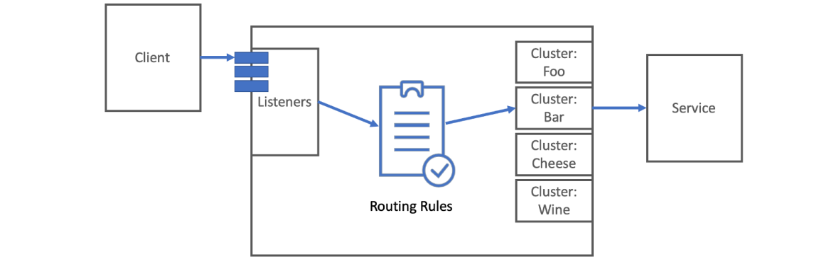
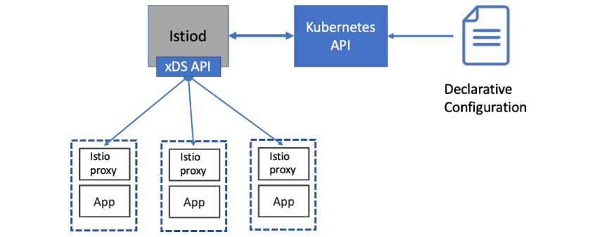

Envoy，这个由Lyft开发并开源的代理，最初是为了应对分布式系统中那些棘手的网络难题而生。它用C++构建，目标明确：高性能、高稳定，尤其在高负载下也能保持确定性。它的设计哲学非常清晰：

- 第一，网络应该对应用透明，让开发者专注于业务逻辑，而不是底层的网络复杂性；
- 第二，当问题出现时，无论是网络问题还是应用问题，必须能快速定位根源。

这两大原则，是理解Envoy价值的关键。在深入Envoy之前，我们先快速明确一个概念：什么是代理？简单来说，代理就像一个中间人，它站在客户端和服务器之间，拦截流量。它**不是简单地转发，而是要提供额外的功能**。比如，你公司里的互联网代理，所有访问外网的请求都得先经过它，它会根据你的组织策略，过滤掉不允许访问的网站或协议，然后才把请求放出去。这种设计，为网络流量的管理和优化提供了巨大的灵活性。

代理到底有什么用？至少有两大价值。

- 第一，它能大大简化客户端的负担。想象一下，一个服务 A 实际上可能由后端多个实例组成的集群来支撑。客户端怎么知道该用哪个 IP 地址去访问呢？这太麻烦了！有了代理，客户端只需要记住一个单一的入口点，比如一个域名或 IP 地址。代理内部负责处理负载均衡，把请求分发到不同的实例上，客户端完全不需要关心后端是怎么部署的。
- 第二，代理能保护你的后端服务。它可以实现负载均衡，确保请求均匀地分配到各个实例，避免某个实例被压垮。同时，它还能进行健康检查，如果发现某个后端实例挂了或者响应慢了，它会自动把流量绕开，继续转发给健康的实例。

Envoy 不仅仅是普通的网络代理，它更是一个应用层代理。这意味着什么？它能理解你应用程序之间通信的协议，比如 HTTP 1.1、HTTP 2，甚至是 gRPC。它不是像 L3 L4 代理那样，只看 IP 和端口，而是能看懂请求的内容。这赋予了它强大的能力：它可以在应用层进行精细化的操作。

比如，你可以为每个请求设置超时时间，或者在请求失败时自动重试，甚至可以实现断路器模式，防止雪崩效应。这些特性，对于构建高可用、弹性的微服务架构至关重要。而且，Envoy 的能力还不止于此，它可以通过 Filter 扩展，去理解和处理更多协议，比如 MongoDB、AMQP 等等。这使得它成为了一个非常灵活和强大的工具。

## Envoy核心价值

Envoy 的核心价值体现在哪里？我认为是两点：透明和可观测。

- 透明，它让网络对应用开发者来说是黑盒。开发者只需要关心如何编写业务逻辑，而不用去操心底层的网络连接、负载均衡、服务发现这些复杂的事情。Envoy 就像一个默默无闻的管家，把这些烦心事都处理好了。
- 其次是可观测性。在分布式系统中，问题往往隐藏在复杂的调用链条中。Envoy 作为所有请求的必经之路，能够收集到非常丰富的数据，比如请求耗时、吞吐量、错误率等等。这些数据就像是系统的体检报告，帮助我们快速了解系统健康状况，一旦出现问题，也能迅速定位。

而且，Envoy 不挑食，不管你用的是 Java、Python、Go，还是单体应用、微服务，只要它支持的协议，它就能帮你提升网络层面的可靠性和可观测性。Envoy 如何部署到你的系统中呢？它提供了多种部署模式。最常见的是作为边缘代理，也就是我们常说的 Ingress Gateway，它负责处理集群外部的流量进来。也可以部署为共享代理，比如在一个主机上，或者一组服务的前面放一个代理。但在 Istio 这种服务网格中，最典型、也是最推荐的模式是 Sidecar 代理，也就是每个服务实例旁边都配一个 Envoy。这种方式提供了最大的灵活性和控制力，因为每个服务都可以独立地配置自己的路由、安全策略等。当然，这并不意味着你不能同时使用边缘代理和 Sidecar 代理。实际上，很多场景下，比如**在边缘用 Envoy 作为统一的入口，然后在服务内部也用 Sidecar**，这样可以提供更全面的控制和可观测性，同时保持运维的统一性。Envoy 的部署方式非常灵活，可以根据你的具体需求来选择。



要理解 Envoy 的工作方式，我们需要了解三个核心概念：监听器、路由和集群。你可以把它们想象成一个请求处理流水线。

- 监听器，负责接收来自外部的请求，比如监听 8080 端口。
- 路由，根据请求的特征，比如 URL 路径，决定这个请求应该交给谁处理。
- 集群，就是实际的后端服务。

比如，catalog-v1 和 catalog-v2 可以看作是两个不同后端服务，路由规则可以决定将请求发送到哪个服务。这样，一个请求就从外部的监听器，经过了路由，最终到达了具体的集群，由集群负责处理请求。这个过程清晰地展示了请求如何在 Envoy 内部流动。

## Envoy核心能力

Envoy 的第一个核心能力是服务发现。在微服务架构中，服务实例是动态变化的，它们可能随时创建、销毁、迁移。如果每个服务都自己去维护一个服务列表，那简直是灾难。Envoy 可以帮你自动解决这个问题。它可以通过一个配置好的 Discovery API，比如一个简单的 REST API，去查询当前可用的服务实例列表。这个 API 可以封装在各种服务发现工具之上，比如 Consul、Zookeeper 或者 Eureka。

在 Istio 中，**控制平面的 Pilot 组件就扮演了这个角色，它为 Envoy 提供了服务发现的 API**。需要注意的是，**Envoy 依赖于最终一致性**。也就是说，它获取到的服务列表可能不是最新的，但最终会是正确的。它会结合主动和被动的健康检查来不断更新状态，确保路由到的是健康的服务实例。

有了服务发现，接下来就是负载均衡。Envoy 提供了多种内置的负载均衡算法。最基础的有随机和轮询，简单粗暴。更智能的是加权最小连接数，它会优先把请求发给当前连接数最少的实例，但可以给某些实例更高的权重。还有 一致性哈希，常用于缓存场景，保证同一个用户的请求总是路由到同一个缓存实例。

但 Envoy 的厉害之处在于它的 区域感知 负载均衡。在跨地域或者跨可用区的部署中，Envoy 会尝试**把请求优先路由到和客户端在同一区域的后端实例**。这能显著减少网络延迟，提高性能。当然，如果这样做会导致某个区域的负载过高，它也会智能地调整策略，确保整体的负载均衡。这种精细化的控制能力，是很多传统代理不具备的。

由于Envoy能理解HTTP协议，它的路由能力就变得异常强大。你可以基于域名、路径、甚至请求头来做精细的路由控制。比如，你可以设置虚拟主机，让不同的域名请求路由到不同的后端服务。你可以做路径路由，把/api的请求路由到API网关，把/static的请求路由到静态资源服务器。更进一步，你可以基于请求头的值来路由，或者设置不同的优先级。

当然，路由规则里还可以集成弹性特性，比如在路由失败时自动重试，或者在重试时设置特定的超时。这在做金丝雀发布、灰度发布时非常有用。你可以精确地控制百分比的流量，让一部分用户访问新版本，一部分用户访问旧版本。

还有一个非常酷的功能叫**流量影子**，它可以将生产流量复制一份，同时发送给一个新版本的服务集群，但这个新集群的处理结果会被忽略，不会影响真实业务。这就像在生产环境中进行 A B 测试，但又完全不干扰用户，非常安全。

网络环境总是充满不确定性，请求可能会因为网络波动、服务短暂故障等原因失败。Envoy 提供了一系列网络弹性机制来应对这些挑战。

- 请求超时，你可以为每个请求设置一个合理的超时时间，避免请求无限等待。
- 重试，当请求失败时，Envoy 可以自动尝试重新发送请求。这对于处理临时性的网络抖动非常有效。但是，重试也需要谨慎，如果配置不当，比如重试次数太多、重试时间太短，可能会导致请求雪崩，把整个系统压垮。所以，合理配置重试策略至关重要。
- 断路器模式。Envoy 可以配置 Bulkheading，限制对某个后端服务的并发连接数和请求数，防止某个下游服务的故障影响到整个系统
- Outlier Detection，也就是异常检测，当某个后端实例持续返回错误或超时，Envoy 会把它暂时移出负载均衡池，直到它恢复正常。

这些机制共同构成了 Envoy 的网络弹性防线。

现代 Web 应用越来越多地使用 HTTP 2 和 gRPC。HTTP 2 相比 HTTP 1.1 有显著改进，比如

- 支持多路复用，可以在一个连接上同时发送多个请求，减少延迟；
- 支持服务器推送，可以主动把资源推送给客户端；
- 支持流式传输，适合处理大数据或实时数据。

Envoy 从一开始就对 HTTP 1.1 和 HTTP 2 都有原生支持，而且它能做双向代理，比如把客户端的 HTTP 1.1 请求转换成 HTTP 2 发给后端服务，反之亦然。gRPC 是一种基于 HTTP 2 的高性能 RPC 框架，由 Google 开发。它使用 Protocol Buffers 作为接口定义语言，效率非常高。Envoy 同样原生支持 gRPC。这意味着，如果你的微服务架构大量使用了 HTTP 2 或 gRPC，Envoy 能够完美地支持这些现代协议，而不需要额外的转换层。这对于性能和开发效率来说，都是一个巨大的优势。

还记得我们前面提到的可观测性吗？Envoy 在这方面做得非常出色。它内置了强大的指标收集系统。它会监控下游客户端、自身服务器以及上游集群的大量行为。这些指标涵盖了计数器、表、直方图等类型。比如，你可以看到总共有多少个连接，HTTP 2 请求有多少，有多少个请求被重试了，有多少个后端实例因为连续返回 5xx 错误而被强制中断。这些指标非常具体，可以帮助你深入分析系统性能瓶颈和故障原因。


更棒的是，Envoy 支持多种输出格式，你可以把它收集到的指标发送到 Statsd、Datadog、Prometheus，甚至 Hystrix，方便你集成到现有的监控系统中。有了这些细粒度的指标，你的系统就真正变得可理解了。

除了指标，分布式追踪是另一个关键的可观测性维度。一个请求可能在多个服务之间跳转，你需要知道每个环节的耗时，以及整个调用链路。Envoy 可以直接向 OpenTracing 兼容的追踪系统，比如 Jaeger 或 Zipkin，报告追踪跨度。这意味着，你不需要在应用代码里加一堆追踪库，Envoy 就能帮你完成大部分工作。当然，Envoy 本身不会生成完整的追踪链，它需要应用来传递一些追踪头，比如 x-b3-traceid、x-b3-spanid 等，这些头包含了追踪信息的上下文。

- x-b3-traceid
- x-b3-spanid
- x-b3-parentspanid
- x-b3-sampled
- x-b3-flags  

Envoy 可以生成一个全局唯一的请求 ID，用于跨服务关联请求，也可以在追踪开始时生成初始的追踪头。这样，你就有了一个完整的分布式追踪系统，可以清晰地看到请求的流转路径和耗时。

安全通信是现代应用的标配。Envoy 可以在边缘或者服务网格内部，自动终止 TLS 流量。也就是说，客户端可以使用 HTTP 1.1，请求先经过 Envoy，Envoy 负责解密，然后以明文形式传递给后端服务。这大大简化了后端服务的配置，它们不需要关心 SSL 证书、证书路径等细节。

Envoy 还可以代表应用向上游服务发起 TLS 连接，也就是 mTLS。这通常用于服务间通信，确保只有经过认证的客户端才能访问服务。有了 Envoy 的自动 TLS 处理能力，无论是单向 TLS 还是双向 TLS，都可以通过配置轻松实现，而无需在每个应用中编写复杂的 TLS 代码，也不用去管理那些繁琐的证书和密钥库。

在资源受限的环境中，或者为了保护某些关键服务，我们需要对请求进行限流。比如，数据库可能很昂贵，或者响应速度很慢，我们不希望它被过多的请求淹没。Envoy 可以集成全局速率限制服务，来实现这一点。它可以在网络层，比如限制每个连接的请求数，或者在 HTTP 层，限制每个请求的频率。这对于防止 DDoS 攻击、保护慢速服务、以及防止重试机制导致的雪崩效应都非常有用。比如，一个服务可能配置了重试，但另一个服务如果本身就有问题，重试可能会让请求量急剧增加，导致系统崩溃。通过 Envoy 的速率限制，可以有效地控制这种风险。在 Istio 中，你可以很方便地配置和管理这些速率限制策略。

Envoy 的核心是一个强大的字节处理引擎，它**允许你通过 Filter 来扩展它的功能**。Filter 就像是插件，可以让你在请求处理的不同阶段插入自定义的逻辑。你可以用 C++ 编写 Filter，然后编译到 Envoy 的二进制文件中，这样性能最高，但修改起来比较麻烦。**Envoy 还支持 Lua 脚本，你可以用 Lua 语言来编写 Filter**，这种方式更轻量级，修改和部署更方便。这意味着，如果你有特定的需求，比如需要解析一种特殊的协议，或者在请求处理过程中做一些特定的计算，你可以通过编写 Filter 来扩展 Envoy 的能力。这使得 Envoy 不仅是一个功能强大的代理，也是一个可定制的平台。

市面上有很多代理，比如 Nginx、HAProxy。Envoy 在哪些方面做得更好呢？

- 它的社区非常活跃，是 CNCF 的顶级项目，持续更新迭代。
- 代码库设计得非常模块化，易于维护和扩展。
- 在 HTTP 2 支持方面，Envoy 是原生的，而且支持得非常全面。
- 可观测性指标非常丰富，特别是应用层的指标。
- 由于是 C++ 编写的，性能非常高，而且没有垃圾回收的开销。
- 还支持动态配置，可以通过 xDS API 在运行时更新配置，无需重启。

这些优势使得 Envoy 在很多场景下，特别是作为服务网格的 Sidecar 代理时，成为了更优的选择。当然，具体选择哪个代理，还需要根据你的具体需求来评估。这里提供了一些参考链接，可以深入了解。

## 配置 Envoy

现在我们来谈谈如何配置 Envoy。Envoy 的配置是通过一个 YAML 或 JSON 文件来完成的。这个文件里包含了监听器、路由、集群等所有必要的信息。

早期的版本是 v1，现在已经弃用了。我们现在使用的是 v2 配置。**v2 配置基于 gRPC**，这是一个非常重要的变化。它带来了流式更新的能力。这意味着，**控制平面可以主动地将配置变更推送给 Envoy 代理**，而不是让 Envoy 周期性地去查询控制平面。这种方式极大地提高了配置更新的效率和一致性，代理可以更快地应用到最新的配置。这也是 Istio 能够高效管理大量 Sidecar 代理的关键所在。

### 静态配置

所以，我们接下来主要关注 v2 的配置方式。最简单的方式是静态配置。你把所有的配置信息，比如监听哪个端口、路由规则是什么、后端服务怎么连接等等，都写在一个配置文件里。就像我们之前看到的 simple.yaml 示例。它定义了一个监听器，监听 15001 端口。它配置了一个 HTTP 连接管理器，这是处理 HTTP 请求的核心过滤器。它定义了一个路由规则，所有匹配的请求都路由到名为 httpbin_service 的集群。最后，它定义了这个集群的属性，比如连接超时时间是 5 秒，使用逻辑 DNS 发现服务，负载均衡策略是轮询。

```yaml
static_resources:
  listeners:
  - name: httpbin-demo
    address:
      socket_address: { address: 0.0.0.0, port_value: 15001 } # Listener definitions
    filter_chains:
    - filters:
      - name: envoy.http_connection_manager
        config:
          stat_prefix: egress_http
          route_config:
            name: httpbin_local_route
            virtual_hosts:
            - name: httpbin_local_service
              domains: ["*"] # Wildcard virtual hosts
              routes:
              - match: { prefix: "/" }
                route:
                  auto_host_rewrite: true # HTTP filter
                  cluster: httpbin_service # Route to cluster
          http_filters:
          - name: envoy.router
  clusters:
  - name: httpbin_service
    connect_timeout: 5s
    type: LOGICAL_DNS
    # Comment out the following line to test on v6 networks
    dns_lookup_family: V4_ONLY
    lb_policy: ROUND_ROBIN
    hosts: [{ socket_address: { address: httpbin, port_value: 8000 }}] # Upstream clusters
```

这种方式配置简单明了，适合小型或配置不常变动的场景。但缺点是，每次配置变更都需要重新加载或重启 Envoy 代理。

### 动态配置

为了应对动态变化的环境，Envoy 引入了动态配置。它通过一套名为 xDS 的 gRPC API 来实现。你可以把它想象成一系列的发现服务：

- LDS 用于发现监听器配置
- RDS 用于发现路由配置
- CDS 用于发现集群配置
- EDS 用于发现集群内的端点列表
- SDS 用于分发证书
- ADS 是一个聚合的接口，可以一次性获取所有这些配置的变更。

Envoy 代理只需要一个简单的启动配置文件，告诉它去哪里找这些 xDS 服务，然后它就可以通过这些 API 实时获取最新的配置信息。这种方式最大的好处是，配置可以在线更新，无需重启代理，非常适合云原生环境。

不过，由于配置是动态获取的，可能会存在短暂的不一致，这就是所谓的最终一致性。Istio 通过实现 ADS 来解决这个问题，确保配置更新的顺序和正确性。让我们看一个动态配置的例子。假设我们想让 Envoy 从一个名为 LDS 服务的地方动态获取监听器配置。

```yaml
dynamic_resources:
  lds_config:
    api_config_source:
      api_type: GRPC
      grpc_services:
      - envoy_grpc:
          cluster_name: xds_cluster  # Go to this cluster for listener API (LDS)
  clusters:
  - name: xds_cluster
    connect_timeout: 0.25s
    type: STATIC
    lb_policy: ROUND_ROBIN
    http2_protocol_options: {}
    hosts: [{ socket_address: { address: 127.0.0.3, port_value: 5678 }}]  # gRPC cluster that implements LDS
```

在配置文件中，我们不需要显式地定义每个监听器。我们只需要告诉 Envoy，它的监听器配置应该通过一个 gRPC 服务来获取。我们指定这个 gRPC 服务的类型是 envoyGrpc，它对应的集群名字是 xds grpc。

然后，在配置文件的 clusters 部分，我们定义一个静态的集群，名字就叫 xds grpc。这个集群的地址就是我们实际的 LDS 服务的地址，比如 127.0.0.3:5678。这样，Envoy 就知道去哪里找它的监听器配置了。



在 Istio 中，动态配置是如何实现的呢？Istio 的控制平面，也就是 Pilot 组件现在通常称为 Istiod，它负责管理服务网格中的所有 Sidecar 代理。Istiod 实现了 ADS Aggregate Discovery Service。在 Envoy 的启动配置文件里，我们只需要指定 ldsConfig 和 cdsConfig 都使用 ads。然后在 adsConfig 里，指定 apiType 是 GRPC，grpcServices 指向 envoyGrpc，clusterName 是 xds grpc。

接着，我们还需要定义一个 staticResources 部分，里面定义了那个 xds grpc 集群，这个集群的地址就是 Istiod 服务的地址，通常是 istio pilot.istio system:15010。

此外，我们还可以在这个 staticResources 部分定义一些可靠性相关的配置，比如断路器的阈值。这样，Istio 就通过 ADS 为 Envoy 提供了统一的、动态的配置管理接口，使得整个服务网格的配置管理变得非常高效和自动化。

## 配置实战

配置示例，https://github.com/istioinaction/book-source-code/blob/088fbcc/ch3/simple_retry.yaml

获取镜像

```shell
$ docker pull istioinaction/envoy:v1.15.0
$ docker pull tutum/curl

$ docker run -d --name httpbin citizenstig/httpbin
```

访问httpbin

```shell
$ docker run -it --rm --link httpbin tutum/curl \
curl -X GET http://httpbin:8000/headers
{
    "headers": {
        "Accept": "*/*",
        "Host": "httpbin:8000",
        "User-Agent": "curl/7.35.0"
    }
}
```

启动envoy，关联httpbin的ns，并指定配置文件

```shell
$ docker run -d --name proxy --link httpbin istioinaction/envoy:v1.15.0 envoy -c /etc/envoy/simple.yam

# 客户端访问envoy出现更多的header
$ docker run -it --rm --link proxy tutum/curl \
curl -X GET http://proxy:15001/headers
{
    "headers": {
        "Accept": "*/*",
        "Content-Length": "0",
        "Host": "httpbin",
        "User-Agent": "curl/7.35.0",
        "X-Envoy-Expected-Rq-Timeout-Ms": "15000",
        "X-Request-Id": "45f74d49-7933-4077-b315-c15183d1da90"
    }
}
```

配置超时

```yaml
  routes:
  - match: { prefix: "/" }
    route:
      auto_host_rewrite: true
      cluster: httpbin_service
      timeout: 1s
```

配置重试

```yaml
  routes:
  - match: { prefix: "/" }
    route:
      auto_host_rewrite: true
      cluster: httpbin_service
      retry_policy:
          retry_on: 5xx
          num_retries: 3
```

之后可以用Admin API查看retry的指标情况

## Admin API

Admin API 让我们了解代理的行为，访问其指标和配置。让我们先运行 对其进行操作

```shell
$ docker run -it --rm --link proxy tutum/curl \
curl -X GET http://proxy:15000/stats
```

admin API的可用path

- /certs - the certificates on the machine
- /clusters - the clusters Envoy is configured with
- /config_dump - dump the actual Envoy config
- /listeners - the listeners Envoy is configured with
- /logging - can view and change logging settings
- /stats - Envoy statistics
- /stats/prometheus - Envoy statistics as prometheus record

