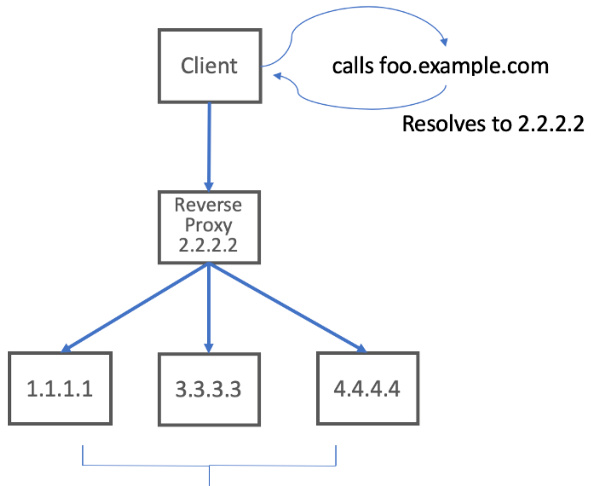
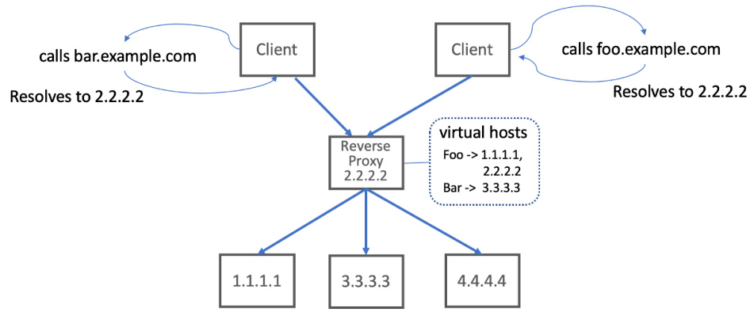
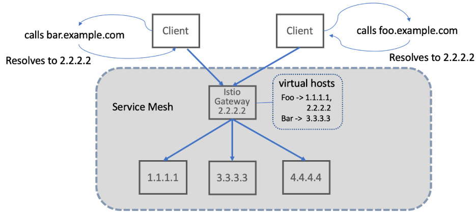
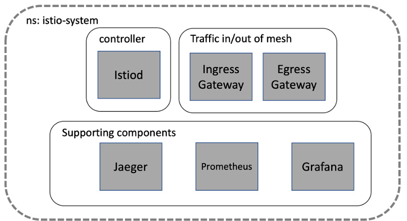
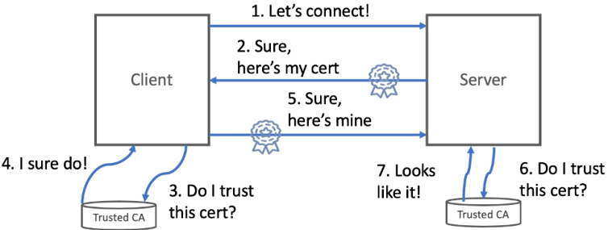

入口网关，简单来说，就是如何让外部世界和我们精心构建的集群内部服务顺畅地对话。在网络安全领域，有一个词叫流量入口，英文叫Ingress。这指的是那些从我们自己网络之外，比如互联网，发往我们内部网络的流量。你可以把它想象成一个门卫。所有想进入我们内部网络的访客，都必须先通过这个入口。

## 虚拟 IP 与反向代理

这个入口的作用非常关键，它不是随便放行的，而是要根据我们预先设定的规则和策略。没有这个入口，外部流量就无法触及我们内部的宝贵资源。现在我们来思考一个问题：如果我们想把一个服务，比如我们的产品目录 API，暴露给外部访问，域名是 api.istioinaction.io，那最直接的想法是不是就是把它的域名解析到一个具体的 IP 地址，比如 2.2.2.2，这个 IP 地址对应着我们集群里的一个具体服务实例？听起来好像挺简单直接。但问题来了，如果这个服务实例 2.2.2.2 有一天突然挂了呢？或者需要维护升级呢？这时候，所有依赖这个域名的客户端都会访问失败，用户体验极差，而且恢复起来也很麻烦，得手动去改 DNS 记录，指向另一个健康的实例。这种做法非常脆弱，可用性极低，简直是灾难的温床。



那怎么办呢？答案就是**引入虚拟 IP 和反向代理**。我们不再把域名直接指向某个具体的物理 IP 地址，而是指向一个逻辑上的虚拟 IP 地址，比如 2.2.2.2。这个虚拟 IP 地址实际上绑定在一台叫做反向代理的服务器上。即使其中一个实例，比如 1.1.1.1，挂掉了，反向代理也能自动停止向它发送请求，客户端访问依然可以正常进行，完全不受影响。这大大提高了系统的健壮性和可用性。

有了虚拟 IP，我们还能更进一步。我们可以在同一个入口点上托管多个不同的服务。比如，我们既想用 prod.example.com 暴露生产环境的 API，又想用 api.example.com 暴露开发环境的 API，这两个域名都可以解析到同一个虚拟 IP 2.2.2.2。这就叫做**虚拟主机**。



那么，**反向代理怎么知道哪个请求是给哪个服务的呢？这就需要利用请求头信息了**。

- 对于 HTTP 1.1，看 Host 头
- 对于 HTTP 2，看 authority 头
- 对于 TLS 的 TCP 连接，看 SNI 信息

反向代理根据这些信息，把请求准确地投递到对应的后端服务组，比如 foo.example.com 的请求去 1.1.1.1 和 2.2.2.2，bar.example.com 的请求去 3.3.3.3。这样，我们就用一个入口，实现了多个服务的灵活部署。

## Istio Gateway

现在，我们终于要介绍今天的主角之一：Istio Gateway。在 Istio 服务网格里扮演着入口网关的角色。你可以把它想象成 Istio 自己提供的那个门卫系统。它不仅负责检查流量，允许或拒绝，还集成了负载均衡和虚拟主机路由的能力。也就是说，Istio Gateway 本身就是一个功能强大的入口代理。它默认情况下，就是用我们前面提到的 Envoy Proxy 来实现的。它把网络入口的守卫、流量分发、以及基于域名的路由这些核心功能都整合在一起了，大大简化了我们管理外部访问的复杂性。



上图就很好地展示了这个概念，不同的域名请求通过同一个 Gateway 被路由到不同的后端服务。



那么，这个 Istio Gateway 在 Kubernetes 里是怎么实现的呢？**本质上就是一个 Kubernetes 的 Deployment，里面跑着一个 Envoy 代理**。我们通过创建一个特殊的 Kubernetes 资源，叫做 Gateway，来定义它的行为。比如，监听哪个端口，处理什么协议。而这个 Gateway 的配置，是由 Istio 的控制平面组件，主要是 Istiod Pilot，负责管理和分发的。同时，Istio 也提供了很多支撑组件，比如 Jaeger 用于追踪，Prometheus 用于监控，Grafana 用于可视化，它们共同构成了一个完整的可观测性体系。

如果你想验证一下，是不是真的在运行 Envoy，可以用kubectl exec命令进入 istio system 命名空间下的 istio ingressgateway Pod，然后看看进程列表里有没有 istio proxy 和 pilot agent。

### Gateway

要让 Istio Gateway 正常工作，我们得告诉它怎么配置。这就需要用到 Gateway 这个 Kubernetes 资源。它的作用非常明确，就是定义这个入口网关应该监听哪些端口，使用什么协议，以及允许哪些虚拟主机名的流量。

```yaml
apiVersion: networking.istio.io/v1alpha3
kind: Gateway
metadata:
  name: coolstore-gateway
spec:
  selector:
    istio: ingressgateway
  servers:
  - port:
      number: 80
      name: http
      protocol: HTTP
    hosts:
    - "webapp.istioinaction.io"
```

看这个 YAML 示例，定义了一个名为 coolstore gateway 的 Gateway。

- spec.selector 里面指定了 istio: ingressgateway，这意味着**这个配置是给默认的 Istio 入口网关用的**。
- spec.servers 里面定义了一个servers，监听 80 端口的 HTTP 流量，并且指定了这个端口主要服务于 apiserver.istioinaction.io 这个虚拟主机。这样，Gateway 就知道在 80 端口等待 HTTP 请求，并且只接受目标是 apiserver.istioinaction.io 的请求。

我们把它应用到 Kubernetes 集群里，可以用如下命令来检查一下看看 Istio Gateway 的 Envoy 代理是不是真的在监听 80 端口了。

```
istioctl proxyconfig listener 
```

这里有个小细节，istioingressgateway Pod 默认是监听 8080 端口的，但为了方便外部访问，我们通常会通过一个 Kubernetes Service 或者云负载均衡器把它暴露在 80 端口。

### VirtualService 

记住，这时候我们只配置了入口，也就是告诉 Gateway 什么流量可以进来，但还没告诉它这些流量进来之后应该去哪里。这就轮到我们今天的第二个主角 VirtualService 登场了。它的**作用是定义路由规则，告诉 Istio Gateway，当满足特定条件的流量进来时，应该把它送到集群内部的哪个服务**。

看这个例子，当来自 coolstore-gateway 的流量，目标是 webapp.istioinaction.io 时，就把这些 HTTP 请求路由到名为 webapp 的服务的 80 端口。spec.gateways 字段指定了这个规则适用于哪个 Gateway，spec.hosts 指定了虚拟主机名，而 spec.http 部分则定义了具体的 HTTP 路由匹配和目标。

```yaml
apiVersion: networking.istio.io/v1alpha3
kind: VirtualService
metadata:
  name: webapp-vs-from-gw
spec:
  hosts:
  - "webapp.istioinaction.io"
  gateways:
  - coolstore-gateway # (或 mesh 表示所有网格入口)
  http:
  - route:
    - destination:
        host: webapp # 即后端的service dns host名称
        port:
          number: 80
```

同样，配置完成后我们可以再次用 istioctl proxy config route 命令来检查，看看 Envoy 的路由表里是不是已经生成了对应的路由条目，确认它确实学会了把目标是 apiserver.istioinaction.io 的流量，导向到 apigateway 服务。当然，这一切的前提是，我们的内部服务 webapp 必须已经成功部署，并且 Istio 的 Sidecar 代理也正确地注入到它旁边。

现在，我们怎么从外部访问这个服务呢？首先，我们需要知道 istioingressgateway 的外部 IP 地址或者 URL，然后，我们用 curl 或者浏览器去访问它。但是**必须显式地在请求里加上 Host: webapp.istioinaction.io 这个头**。为什么？因为 Istio Gateway 是通过这个 Host 头来判断请求的目标虚拟主机的，只有匹配上了，它才会根据 VirtualService 的规则进行后续处理。如果你忘了加 Host 头，或者加错了，那 Gateway 就会认为你访问的是一个不存在的主机，直接返回 404 Not Found。

## Istio Gateway vs. Kubernetes Ingress

你可能会问，既然 Kubernetes 本身就提供了 Ingress 资源，那 Istio 为什么还要搞自己的 Gateway 呢？直接用 Kubernetes Ingress 不行吗？早期的 Istio 版本确实支持过 Kubernetes Ingress，但很快就发现，**Kubernetes Ingress 本身存在很多局限性**。

- 首先，它太简单了，主要就是为 HTTP 服务设计的，只关注 80 和 443 端口，对于 Kafka、NATS 这些需要暴露 TCP 端口的服务，就无能为力了。
- 其次，它的规范不够完善，很多高级的路由功能，比如流量分割、影子路由、复杂的路由匹配，都没有统一的标准。这就导致了不同厂商的 Ingress Controller，比如 NGINX、Contour，它们的实现方式和配置方式五花八门，用起来很不一致，可移植性很差。

Istio 的目标是构建一个更强大、更灵活、更统一的入口控制体系，所以它最终选择了采用 `Gateway` (L4/L5) 和 `VirtualService` (L7) 分离，提供更强大的、统一的入口控制。实现了更精细、更强大的控制能力。

## 安全 Gateway

我们的入口网关，它连接的是外部世界，比如互联网，和我们内部的敏感服务。这种情况下，安全就变得至关重要。我们有几大核心需求：

- 保护，要防止黑客攻击，保护好内部服务。
- 建立信任，让客户端确信他们连接的是真正的服务，而不是假冒的。
- 保密，防止数据在传输过程中被窃听。

Istio Gateway 提供了多种能力来满足这些需求。它可以终止 TLS 加密，也就是我们常说的 HTTPS，对流量进行加密。它可以强制将 HTTP 流量重定向到 HTTPS。更进一步，它还可以实现双向 TLS，也就是 mTLS，让客户端和服务器互相验证身份，安全性更高。

接下来我们就逐一看看这些安全特性。要实现加密和防止中间人攻击，最常用的就是 TLS，也就是传输层安全协议。服务器会把自己的证书发给客户端。上面写着服务器是谁，由谁签发的。客户端收到证书后，会检查这个证书是不是由自己信任的证书颁发机构 CA 签发的。如果信任，就确认了服务器的身份。然后，双方会通过一个叫 TLS 握手的复杂过程，协商出一个加密的密钥，之后所有的数据传输都会用这个密钥进行加密。这样，即使数据被截获，也无法被破解，同时也保证了服务器的身份是真实的，防止了冒充。



### 启用tls

要在 Istio Gateway 上启用 TLS，我们需要两步。

1. 把服务器证书和私钥准备好，然后把它们打包成一个 Kubernetes Secret。注意，这个 Secret 通常需要放在和 istioingressgateway Pod 同一个命名空间里，通常是 istio system，因为 Istio 会自动去那里找。
2. 修改我们的 Gateway 资源配置。在 servers 里，除了原有的 HTTP 端口，我们再添加一个 HTTPS 端口，比如 443。在 tls 配置块里，设置 mode 为 SIMPLE，表示服务器终止 TLS。最关键的是，用 credentialName 指定我们刚刚创建的 Secret 的名称，告诉 Gateway 去哪里找证书和私钥。

如下是示例的配置文件

```yaml
apiVersion: networking.istio.io/v1alpha3
kind: Gateway
metadata:
  name: coolstore-gateway
spec:
  selector:
    istio: ingressgateway
  servers:
  ...
  - port:
      number: 443
      name: https
      protocol: HTTPS
    tls:
      mode: SIMPLE
      credentialName: webapp-credential
    hosts:
    - "webapp.istioinaction.io"
```

应用到集群后，Gateway 就能处理 HTTPS 请求了。配置好 TLS 之后，我们怎么测试呢？

```shell
curl https://... \
-H "Host: webapp.istioinaction.io" \
--cacert /path/to/ca.crt \
--resolve apiserver.istioinaction.io:443:127.0.0.1
```

-  --cacert 参数，指定一个包含我们服务器证书或者 CA 证书链的文件。
- --resolve 参数，告诉 curl：虽然我访问的是 apiserver.istioinaction.io，但你把它当成 127.0.0.1 来处理。

这样，域名解析、证书验证和 IP 地址都匹配了，curl 才能成功建立连接并获取数据。如果 curl 报错说不支持 SSL，那可能是你用的 curl 版本太老，或者编译时没带 SSL 库，可以试试 curl --version 看看。

### 配置重定向tls

配置了 HTTPS，但客户端还是可以访问 HTTP 端口的。如果我们想强制所有流量都必须使用 HTTPS，防止有人不小心访问 HTTP 明文传输，怎么办？我们已经配置了 443 端口的 HTTPS 服务。现在，我们修改 80 端口的 HTTP 服务配置，不再需要证书，而是添加一个 tls 字段，把 httpsRedirect 设置为 true。这样，当客户端访问 http://localhost:80 时，Istio Gateway 的 Envoy 代理就会自动把请求重定向到 https://localhost:443。这个重定向是 HTTP 标准的 301 Moved Permanently。这样，我们就强制所有外部流量都走加密通道了，安全性大大提升。

```yaml
apiVersion: networking.istio.io/v1alpha3
kind: Gateway
metadata:
  name: coolstore-gateway
spec:
  selector:
    istio: ingressgateway
  servers:
  - port:
      number: 80
      name: http
      protocol: HTTP
    hosts:
    - "webapp.istioinaction.io"
    tls:
      httpsRedirect: true # 配置重定向
  - port:
      number: 443
      name: https
      protocol: HTTPS
    tls:
      mode: SIMPLE
      credentialName: webapp-credential
    hosts:
    - "webapp.istioinaction.io"
```

### 配置mtls

在某些对安全性要求极高的场景下，比如金融系统，仅仅服务器验证客户端身份还不够，我们还需要让客户端也验证服务器的身份，这就是双向 TLS，简称 mTLS。服务器不仅要看你的身份证，你也要看服务器的身份证，双方都要互相确认对方是合法的，才能进行通信。这个过程，客户端需要有自己的证书，服务器端需要配置相应的 CA 证书来验证客户端证书。


在 Istio Gateway 中，我们通过在 tls 配置里把 mode 设为 MUTUAL 来启用 mTLS。同时，我们还需要一个包含服务器证书、私钥和用于验证客户端的 CA 证书链的 Secret。这样，客户端在访问时，不仅要提供自己的证书和私钥，还要提供服务器证书的 CA 证书，才能完成整个双向验证过程。

```yaml
apiVersion: networking.istio.io/v1alpha3
kind: Gateway
metadata:
  name: coolstore-gateway
spec:
  selector:
    istio: ingressgateway
  servers:
  - port:
      number: 80
      name: http
      protocol: HTTP
    hosts:
    - "webapp.istioinaction.io"
  - port:
      number: 443
      name: https
      protocol: HTTPS
    tls:
      mode: MUTUAL
      credentialName: webapp-credential-mtls
    hosts:
    - "webapp.istioinaction.io"
```

配置 mTLS 也需要两步：

1. 创建一个 Kubernetes Secret，这个 **Secret 里面不仅要有服务器的证书和私钥，还要有用于验证客户端证书的 CA 证书链**。注意，这里的 Secret 类型是 generic，而不是 tls。
2. 修改 Gateway 资源。在 443 端口的 HTTPS 服务里，把 tls 的 mode 改为 MUTUAL，然后把 credentialName 指向我们刚刚创建的、包含 CA 证书的 generic Secret。

这样，Gateway 就知道它不仅要验证服务器证书，还要验证客户端证书。配置完成后，应用到集群。这时候，如果客户端只用之前的 TLS 证书去访问，就会失败，因为缺少了双向认证的环节。配置好 mTLS 之后，我们来测试一下。curl 命令需要更多参数了。除了之前的 Host 和 cacert（用于验证服务器），我们还需要加上 cert 和 key 参数，分别指定客户端证书和私钥的文件路径。这样，curl 才能向服务器证明自己的身份。

```
curl -k https://... -H "Host: apiserver.istioinaction.io" \
--cacert /path/to/ca.crt \
--resolve apiserver.istioinaction.io:443:127.0.0.1 \
--cert /path/to/client.crt \
--key /path/to/client.key
```

- **--cacert** 提供 CA 证书链
- **--resolve** 将域名解析到 IP
- **--cert** 提供客户端证书
- **--key** 提供客户端私钥

如果一切配置正确，服务器端的 Istio Gateway 就能成功验证客户端的证书，并且客户端也能验证服务器的证书，握手成功，最终得到 200 OK 的响应。如果缺少 cert 或者 key，或者证书不匹配，握手就会失败。这就是 mTLS 的威力，它提供了更高级别的身份验证和通信安全。

### 配置multi tls

有时候，一个 Gateway 443 端口需要同时为多个不同的虚拟主机服务，比如 apiserver.example.com 和 catalog.example.com，而且每个服务都需要自己的 TLS 证书和私钥。这在 Istio Gateway 中是可以实现的。我们只需要在 Gateway 的 servers 部分，针对同一个端口 443 和协议 HTTPS，定义多个条目。每个条目都有自己的名字，指定一个 hosts，比如 apiserver.example.com，然后用不同的 credentialName 指向不同的 Secret，每个 Secret 里放着对应服务的证书和私钥。这样，当一个请求到达 443 端口时，**Istio Gateway 就会根据请求头里的 Host 或者 TLS 握手时的 SNI 信息来判断客户端想访问哪个服务，然后自动选择对应的证书进行 TLS 终止和路由**。

```yaml
apiVersion: networking.istio.io/v1alpha3
kind: Gateway
metadata:
  name: coolstore-gateway
spec:
  selector:
    istio: ingressgateway
  servers:
  - port:
      number: 443
      name: https-webapp
      protocol: HTTPS
    tls:
      mode: SIMPLE
      credentialName: webapp-credential
    hosts:
    - "webapp.istioinaction.io"
  - port:
      number: 443
      name: https-catalog
      protocol: HTTPS
    tls:
      mode: SIMPLE
      credentialName: catalog-credential
    hosts:
    - "catalog.istioinaction.io"
```

### 配置tcp

除了 HTTP 和 HTTPS，我们还可以用 Istio Gateway 来暴露其他类型的网络服务，比如数据库、消息队列、或者任何使用 TCP 协议的应用。这在需要直接暴露 TCP 端口的场景下非常有用。

```yaml
apiVersion: networking.istio.io/v1alpha3
kind: Gateway
metadata:
  name: echo-tcp-gateway
spec:
  selector:
    istio: ingressgateway
  servers:
  - port:
      number: 31400
      name: tcp-echo
      protocol: TCP
    hosts:
    - "*"
```

配置方法也很简单：在 Gateway 的 servers 部分，定义一个端口，比如 31400，然后把 protocol 设置为 TCP。hosts 通常可以设成 ，表示接受所有主机名的请求。

```yaml
apiVersion: networking.istio.io/v1alpha3
kind: VirtualService
metadata:
  name: tcp-echo-vs-from-gw
spec:
  hosts:
  - "*"
  gateways:
  - echo-tcp-gateway
  tcp:
  - match:
    - port: 31400
    route:
    - destination:
        host: tcp-echo-service
        port:
          number: 2701
```

我们再创建一个 VirtualService，用 tcp 部分来定义路由规则。匹配条件通常是基于端口，比如 match: port: 31400，然后指定 route 目标，指向内部的 TCP 服务和它的端口。这样，外部的 TCP 客户端就可以通过这个 Gateway 端口连接到内部的 TCP 服务了。

需要注意的是，对于 TCP 流量，Istio 的控制能力会弱一些，比如重试、断路器、复杂的路由策略，这些高级功能就用不了了，因为 Istio 无法解析 TCP 之上的应用层协议。

### 配置SNI 透传

有时候，后端的 TCP 服务本身就需要处理 TLS，比如一个 MySQL 服务，它自己管理 TLS 证书和密钥。这时候，我们希望 Istio Gateway 只负责把请求转发过去，但根据客户端请求的 SNI 信息来决定路由到哪个后端服务。这种模式叫做 **SNI 透传，也就是 Passthrough**。

> [什么是 SNI（服务器名称指示）？](https://www.cloudflare-cn.com/learning/ssl/what-is-sni/)
>
> SNI 是 [TLS 协议](https://www.cloudflare-cn.com/learning/ssl/transport-layer-security-tls/)（以前称为 [SSL](https://www.cloudflare-cn.com/learning/ssl/what-is-ssl/) 协议）的扩展，该协议在 HTTPS 中使用。它包含在 [TLS/SSL 握手](https://www.cloudflare-cn.com/learning/ssl/what-happens-in-a-tls-handshake/)流程中，以确保客户端设备能够看到他们尝试访问的网站的正确 SSL 证书。该扩展使得可以在 TLS 握手期间指定网站的主机名或[域名 ](https://www.cloudflare-cn.com/learning/dns/glossary/what-is-a-domain-name/)，而不是在握手之后打开 [HTTP](https://www.cloudflare-cn.com/learning/ddos/glossary/hypertext-transfer-protocol-http/) 连接时指定。

在 Gateway 里，我们还是监听一个 TCP 端口，比如 31400，但 protocol 仍然是 TLS，而不是 TCP。关键在于 tls 配置，把 mode 设为 PASSTHROUGH。这样，Gateway 就不会终止 TLS 了，而是会把接收到的 TLS 连接原封不动地转发给后端。然后，我们通过 VirtualService 的 tls.match 配置，根据 sniHosts 来匹配客户端请求的 SNI 主机名，从而决定路由到哪个后端服务。后端服务自己负责处理 TLS 解密和加密。这种方式非常灵活，适用于各种需要自定义 TLS 处理的 TCP 服务。

假设我们有一个后端服务 simple tls service 1，它自己就能处理 TLS。我们先部署它。

```yaml
---
apiVersion: v1
kind: Service
metadata:
  labels:
    app: simple-tls-service-1
  name: simple-tls-service-1
spec:
  ports:
  - name: https
    port: 80
    protocol: TCP
    targetPort: 8080
  selector:
    app: simple-tls-service-1
---
apiVersion: apps/v1
kind: Deployment
metadata:
  labels:
    app: simple-tls-service-1
  name: simple-tls-service-1
spec:
  replicas: 1
  selector:
    matchLabels:
      app: simple-tls-service-1
  template:
    metadata:
      labels:
        app: simple-tls-service-1
    spec:
      containers:
      - env:
        - name: "LISTEN_ADDR"
          value: "0.0.0.0:8080"
        - name: "SERVER_TYPE"
          value: "http"              
        - name: "TLS_CERT_LOCATION"
          value: "/etc/certs/tls.crt"
        - name: "TLS_KEY_LOCATION"
          value: "/etc/certs/tls.key"          
        - name: "NAME"
          value: "simple-tls-service-1"      
        - name: "MESSAGE"
          value: "Hello from simple-tls-service-1!!!"                     
        - name: KUBERNETES_NAMESPACE
          valueFrom:
            fieldRef:
              fieldPath: metadata.namespace
        image: nicholasjackson/fake-service:v0.14.1
        imagePullPolicy: IfNotPresent
        name: simple-tls-service
        ports:
        - containerPort: 8080
          name: http
          protocol: TCP
        securityContext:
          privileged: false
        volumeMounts:
        - mountPath: /etc/certs
          name: tls-certs
      volumes:
      - name: tls-certs
        secret:
          secretName: simple-sni-1.istioinaction.io      
---
apiVersion: v1
data:
  tls.crt: LS0tLS1CRUdJTiBDRVJUSUZJeDBPYmtTeCswZQpzZUVudDM0PQotLS0tLUVORCBDRVJUSUZJQ0FURS0tLS0tCg==
  tls.key: LS0tLS1CRUdJTiBSU0EgUFJJVkFURSBLRVk0T3c9PQotLS0tLUVORCBSU0EgUFJJVkFURSBLRVktLS0tLQo=
kind: Secret
metadata:
  name: simple-sni-1.istioinaction.io
  namespace: istioinaction
type: kubernetes.io/tls
```

然后，我们创建一个 Gateway，比如 sni passthrough gateway，暴露 31400 端口的 TLS 协议，并设置 mode 为 PASSTHROUGH。

```yaml
apiVersion: networking.istio.io/v1alpha3
kind: Gateway
metadata:
  name: sni-passthrough-gateway
spec:
  selector:
    istio: ingressgateway
  servers:
  - port:
      number: 31400
      name: tcp-sni
      protocol: TLS
    hosts:
    - "simple-sni-1.istioinaction.io"
    tls:
      mode: PASSTHROUGH
```

接着，我们创建一个 VirtualService，比如 simple-sni-1-vs，指定它应用于 sni passthrough gateway。在 tls match 部分，我们匹配端口 31400，并且指定 sniHosts 为 ["simple-sni -1.istioinaction.io"]，表示当客户端请求的 SNI 主机名是这个时，就将流量路由到目标服务。目标服务是 simple tls-service 1，端口是 80

```yaml
apiVersion: networking.istio.io/v1alpha3
kind: VirtualService
metadata:
  name: simple-sni-1-vs
spec:
  hosts:
  - "simple-sni-1.istioinaction.io"
  gateways:
  - sni-passthrough-gateway
  tls:
  - match:
    - port: 31400
      sniHosts:
      - simple-sni-1.istioinaction.io
    route:
    - destination:
        host: simple-tls-service-1
        port:
          number: 80
```

配置完成后，我们用 curl 通过 31400 端口访问 https://simple-sni-1.istioinaction.io，并带上正确的 Host 头和 CA 证书，以及 resolve 参数，应该就能成功连接到后端服务，并收到它的响应。这表明，Istio Gateway 成功地根据 SNI 信息，将流量透传给了正确的后端服务。