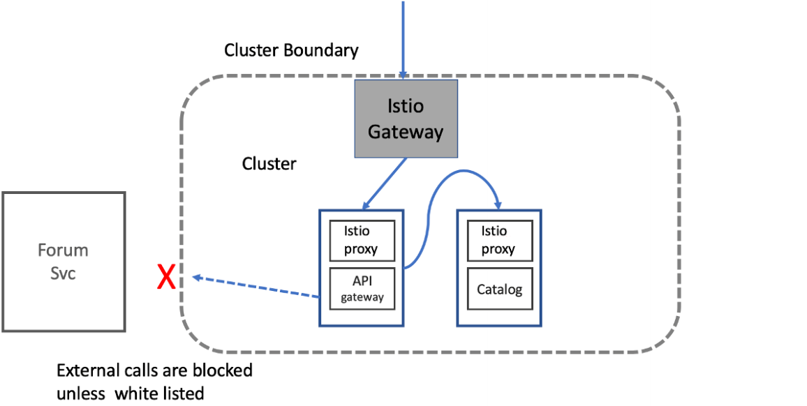

当流量进入集群后，我们如何确保它能被精确地路由到正确的服务？特别是当我们需要发布新版本时，如何在不中断服务的前提下，安全地将用户引入到新版本？这正是我们今天要深入探讨的精细化流量控制，看看 Istio 如何帮助我们实现这一点。


我们先来回顾一下大家可能都熟悉的蓝绿部署。这个方法确实很直观，就像图里展示的，蓝色版本是当前的稳定军，绿色版本是准备好的后备军。发布的时候把流量全部切到绿色。这听起来很完美，对吧？零停机时间，有问题还能切回去。但问题在于，一旦切换到绿色，就是所有用户，一起上阵，这本质上还是个大爆炸式发布。如果新版本有个隐藏的bug，或者性能突然下降，那影响范围可就大了。所以，我们需要更精细的控制手段。


要解决这个问题，**关键在于区分“部署”和“发布”这两个动作**。部署，就是把代码、容器，实实在在地放到生产环境里去，这时候还没有任何真实用户流量进来。这时候，我们可以在生产环境中进行各种测试，比如烟雾测试，看看基本功能是否正常，监控指标是否符合预期。只有当部署完成，我们才开始考虑“发布”，也就是把生产流量逐步引导到新部署的版本上。这个**发布过程，完全可以是渐进式的、可控的**。这种解耦，是实现低风险发布的基石。

解耦之后，我们就可以玩出花样了。最常见的就是金丝雀发布。大家知道矿井里的金丝雀，对环境变化特别敏感，可以用来预警。在发布新版本时，我们也可以选一小部分用户，比如内部员工，作为我们的金丝雀，让他们先体验新版本。

通过 Istio，我们可以轻松配置，比如只给内部用户路由到 v2 版本，其他人还是走 v1。如果金丝雀表现良好，我们就逐步扩大范围。这种方式的好处显而易见：风险可控，反馈及时，而且万一出了问题，随时可以回滚到旧版本，对大部分用户几乎没有影响。

那么，Istio 是如何实现这些精细路由的呢？核心就是两个关键的资源：**VirtualService 和 DestinationRule**。

- 可以把 **VirtualService 理解为路由规则**，告诉 Istio 如何处理流量。
- 而 **DestinationRule 则用来定义服务的版本**，也就是所谓的子集。

比如，我们可以通过 Kubernetes 的标签来区分 v1 和 v2 版本，然后在 DestinationRule 里把这些标签关联起来。这样，VirtualService 就能根据这些子集来决定流量该去向何方。

举个例子，我们想让所有带有 x-istio-cohort : internal 请求头的请求都去 v2 版本，就可以在 VirtualService 的 match 部分指定这个条件，然后在 route 部分指定目标子集为 version v2。

让我们来看一个具体的例子。假设我们已经部署了 catalog 服务的 v1 和 v2 两个版本，并且在 DestinationRule 中定义了 version v1 和 version v2 两个子集。现在，我们想创建一个 VirtualService，让所有带有 x-istio-cohort : internal 请求头的请求都路由到 v2。配置就是这样的

```yaml
apiVersion: networking.istio.io/v1alpha3
kind: VirtualService
metadata:
  name: catalog-vs-from-gw
spec:
  hosts:
    - "catalog.istioinaction.io"
  gateways:
    - catalog-gateway
  http:
    - match:
        - headers:
            x-istio-cohort:
              exact: "internal"
      route:
        - destination:
            host: catalog
            subset: version-v2
    - route:
        - destination:
            host: catalog
            subset: version-v1
```

在 match 部分，我们指定 headers 下 x-istio-cohort 的值必须是 exact internal。在 route 部分，我们指定 destination 的 host 是 catalog，subset 是 version-v2。如果请求没有这个特定的头，那么 Istio 会按照后续的 route 规则，通常是默认的，把流量路由到 version-v1。这样，我们就实现了基于请求头的精细路由。


以上的示例是从网关进入的流量，但 Istio 的路由能力远不止于此。它同样可以在服务内部的调用链中发挥作用。比如，我们有一个 apigateway 服务，它需要调用 catalog 服务。我们可以在 apigateway 的 VirtualService 中，设置一个规则，当 apigateway 收到请求时，它内部调用 catalog 时，也要根据请求头来决定是调用 v1 还是 v2。配置的关键在于，**将 gateways 字段设置为 mesh，表示这条规则适用于所有网格内部的请求**。这样，我们就可以在应用层实现复杂的路由逻辑，比如根据不同的用户请求，调用不同的后端服务版本。

```yaml
apiVersion: networking.istio.io/v1alpha3
kind: VirtualService
metadata:
  name: catalog
spec:
  hosts:
    - catalog
  gateways:
    - mesh # 设置gateways为mesh
  http:
    - match:
        - headers:
            x-istio-cohort:
              exact: "internal"
      route:
        - destination:
            host: catalog
            subset: version-v2
    - route:
        - destination:
            host: catalog
            subset: version-v1
```

除了基于请求头的路由，还有一种更常见的渐进式发布方式，就是**加权路由**。就是把总流量按照一定的比例分配给不同的服务版本。比如，我们可以设置 90% 的流量继续走 v1，同时把 10% 的流量导向新版本 v2。这样，新版本上线后，只有少量用户会受到影响，我们可以密切监控 v2 的性能和稳定性。如果一切顺利，我们可以逐步增加 v2 的权重，比如 10%、20%、30%，直到最终全部 100% 的流量都切换到 v2。这种方式的好处是平滑过渡，风险可控。而且，如果发现 v2 有问题，只需要把权重调回 0 就行了，非常容易回滚。我们再来看一个具体的配置。

```yaml
apiVersion: networking.istio.io/v1alpha3
kind: VirtualService
metadata:
  name: catalog
spec:
  hosts:
    - catalog
  gateways:
    - mesh
  http:
    - route:
      - destination:
          host: catalog
          subset: version-v1
          weight: 90
      - destination:
          host: catalog
          subset: version-v2
          weight: 10
```

假设我们要把 10% 的流量导向 v2。在 VirtualService 的 route 部分，我们定义两个 destination。第一个是 catalog 的 version v1，weight 设为 90。第二个是 catalog 的 version v2，weight 设为 10。这样，Istio 会自动将 90% 的流量发送到 v1，10% 的流量发送到 v2。

为了验证效果，我们可以用 curl 命令发送大量请求，比如 100 次，然后统计返回结果中带有 v2 特征字段imageUrl 的数量。理论上，应该接近 10 次。如果想改成 50/50 的分配，只需要把两个 weight 的值都改成 50 即可。

前面我们讲的路由和加权转移，虽然风险可控，但毕竟还是有真实流量经过了新版本，万一新版本处理有问题，还是可能影响用户体验。有没有更彻底的零风险验证方法呢？答案是肯定的，那就是**流量镜像**。这个技术非常巧妙，它会把每一个生产请求复制一份，然后把这份副本悄悄地发送给新版本 v2 去处理。但是，v2 的处理结果会被丢弃，完全不影响主请求的正常路径。这意味着，我们可以用真实流量来测试新版本，获取性能指标，观察日志，但用户完全感觉不到任何变化。这就像给新版本做一次全面的体检，而且是用真实环境的体检报告。在 Istio 中配置流量镜像也很简单。

> https://blog.christianposta.com/microservices/traffic-shadowing-with-istio-reduce-the-risk-of-code-release/

```yaml
apiVersion: networking.istio.io/v1alpha3
kind: VirtualService
metadata:
  name: catalog
spec:
  hosts:
    - catalog
  gateways:
    - mesh
  http:
    - route:
        - destination:
            host: catalog
            subset: version-v1
            weight: 100
      mirror: # 设置流量镜像
        host: catalog
        subset: version-v2
```

在 VirtualService 里，我们仍然可以指定主路由，比如 100% 的流量都去 v1。然后，添加一个 mirror 字段，告诉 Istio 把流量镜像到哪里。mirror 字段里也包含 host 和 subset，指向我们要镜像的 v2 服务。这样，每个请求都会同时到达 v1 和 v2。我们可以通过检查 v2 的日志来确认镜像是否成功。**注意，Istio 会自动修改镜像流量的 Host 头，加上一个 shadow 后缀，比如 Host: 10.12.1.178~shadow:8080**。应用程序可以根据这个特殊的 Host 头来判断自己是处理的主请求还是镜像请求，从而优化处理逻辑，比如避免不必要的数据库写入。

聊完了内部的流量控制，我们再来看看外部边界。**默认情况下，Istio 允许任何出站流量**。但这种做法存在安全隐患。如果某个服务不幸被攻破，攻击者可能会利用这个服务，偷偷摸摸地连接到外部的恶意服务器，进行数据窃取或者其他破坏活动。为了防止这种“外联”风险，我们可以收紧 Istio 的出站策略。



通过配置 ~meshConfig.outboundTrafficPolicy.mode`，我们可以把它从默认的 `ALLOW_ANY` 改为 `REGISTRY_ONLY`。这意味着，只有那些被明确添加到 Istio 服务注册表中的外部服务，才能被网格内的服务访问。其他所有出站请求，都会被 Istio 拦截。这是一种基本的安全防御纵深，可以有效阻止恶意的“外联”行为。在生产环境中我们通常会**修改 IstioOperator 的configmap配置来实现**。

```shell
$ istioctl install --set profile=demo \
--set meshConfig.outboundTrafficPolicy.mode=REGISTRY_ONLY
```

Istio 提供了 ServiceEntry 这个资源，可以把 ServiceEntry 理解为一个“通行证”，它允许我们把外部服务的信息，比如主机名、端口、协议，添加到 Istio 的内部服务注册表里。这样，当网格内的服务需要访问这些外部服务时，Istio 就知道该去哪个地址，用什么协议去访问。

配置也很简单，只需要指定 hosts、ports、resolution 和 location 等参数。让我们来看一个具体的例子。

```yaml
apiVersion: networking.istio.io/v1alpha3
kind: ServiceEntry
metadata:
  name: jsonplaceholder
spec:
  hosts:
    - jsonplaceholder.typicode.com
  ports:
    - number: 80
      name: http
      protocol: HTTP
      resolution: DNS
  location: MESH_EXTERNAL # 指定mesh外部服务
```

假设我们有一个名为 forum 的服务，它需要调用一个外部的论坛 API，地址是 jsonplaceholder.typicode.com。我们先创建一个 ServiceEntry，名称为 jsonplaceholder，spec.hosts 指定为 jsonplaceholder.typicode.com，spec.ports 定义了 HTTP 端口 80，resolution 设置为 DNS，location 设置为 MESH_EXTERNAL。创建好 ServiceEntry 之后，我们再尝试从网格内部的某个服务比如 curl 客户端去访问 forum 服务的接口，这个接口会调用到 jsonplaceholder.typicode.com。

如果一切配置正确，这次调用应该就能成功了。这证明了 ServiceEntry 确实让我们的服务能够安全地访问到需要的外部服务。