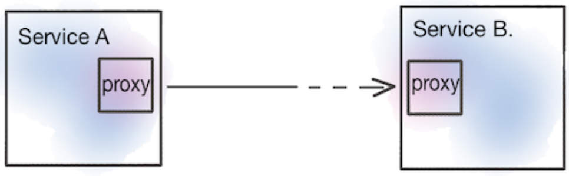
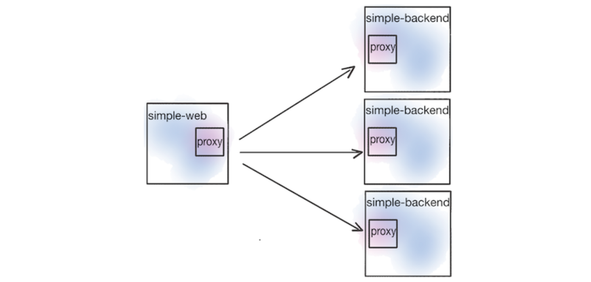
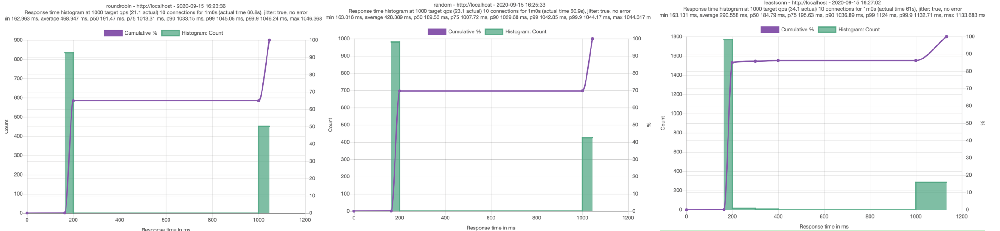
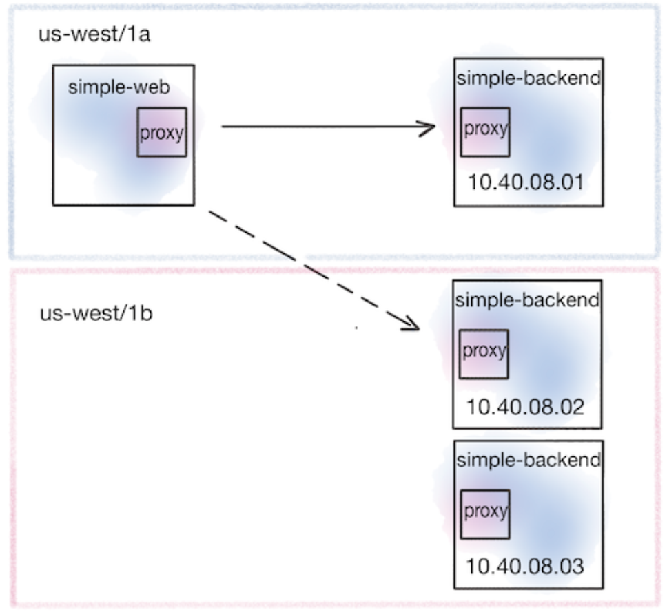
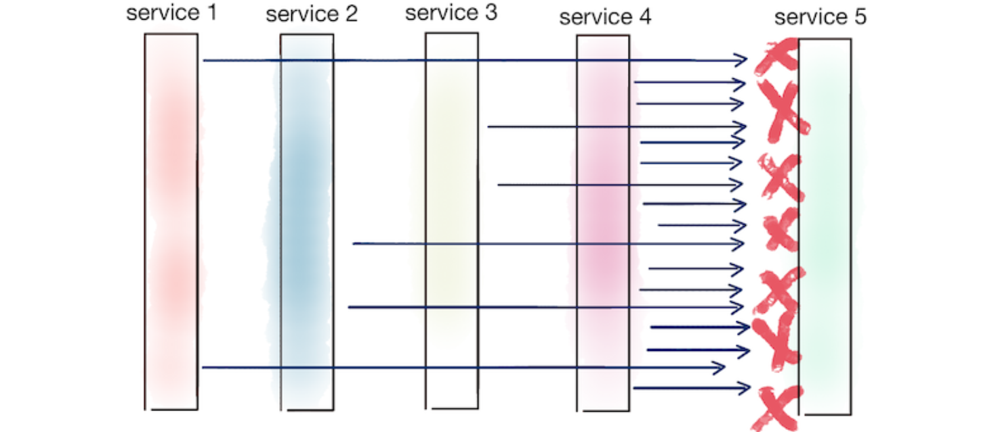

仅仅控制流量还不够，我们还需要让我们的系统在面对网络波动、服务偶发故障等不可预测情况时，能够自动保持稳定。这就是我们今天要深入探讨的主题：service Resilience（服务弹性）。

在分布式系统中，服务间的依赖关系就像一张错综复杂的网络，任何一个节点的抖动都可能引发连锁反应。因此，构建具有内在弹性的应用，是现代云原生架构设计的核心要求之一。为什么我们需要如此强调弹性？因为现实世界里，没有哪个系统是完美的，所谓的“永不宕机”只是个美好的愿望。尤其是在分布式系统中，服务之间通过网络进行通信，这本身就引入了无数个潜在的失败点。我们必须让服务从一开始就具备“容错”的意识，能够主动感知并尝试恢复，而不是被动等待。这不仅仅是技术问题，更是我们构建可靠系统的基石。

例如A服务访问B服务，可能的错误有

- 延迟，服务B响应慢
- 错误，比如服务B暂时挂了，或者返回了500错误
- 网络分区，导致服务A根本无法访问到服务B
- 雪崩效应，服务A持续不断地请求一个出问题的服务B，它不仅自己会被拖累，还可能把请求堆积如山，最终导致服务B彻底崩溃，甚至影响到其他依赖服务B的服务。

在 Istio 这样的服务网格技术普及之前，我们通常需要在应用代码里自己写这些弹性逻辑。比如，Twitter 的 Finagle，Netflix 的 Hystrix 和 Ribbon，它们在 Java 社区非常流行，提供了超时、重试、熔断等能力。但这种方式有几个痛点：

- 第一，侵入性太强，业务逻辑里掺杂着大量的网络处理代码；
- 第二，维护成本高，不同的语言、不同的框架，可能需要维护不同的库版本，打补丁、做功能对齐，简直是噩梦；
- 第三，一致性差，不同团队可能用不同的库，或者即使用了同一个库，配置也可能千差万别，很难保证全局的弹性策略是一致的。

那么，Istio 是如何解决这些问题的呢？它的核心理念是**将这些共性的、基础的弹性能力，从应用代码中解放出来，放到服务网格层面去统一管理**。这意味着什么呢？意味着我们可以为所有服务，无论用什么语言、什么框架写的，都提供一套一致的、可配置的弹性策略。而且，这一切都是**通过配置来实现的，不需要修改任何一行应用代码**。这背后的功臣就是 Istio 的 Sidecar 代理，部署在每个服务实例旁边，负责处理所有进出服务的网络流量。由于代理理解 HTTP、HTTPS 这些应用层协议，它就能在这些层面实现各种弹性机制，比如超时、重试、熔断等等。这大大降低了复杂性，提高了整体的可靠性。



这张图更直观地展示了 Istio 如何介入服务间的通信。服务A和B之间，不再是直接连接，而是各自通过一个 Sidecar Proxy 连接。所有的请求都必须先经过自己的代理，再经过对方的代理。代理不仅能处理网络层面的流量，还能理解应用层的请求，比如 HTTP 请求。这样，Istio 就可以在代理层面，非常灵活地实现各种弹性策略，比如当请求超时了，或者返回了特定的错误码，代理就可以自动进行重试，或者在多次失败后，将后续请求熔断，避免雪崩。这为我们提供了一个强大的、可配置的弹性基础设施。

在云原生时代，我们特别强调分布式弹性。为什么？因为传统的中心化方案，比如昂贵的硬件负载均衡器，或者复杂的 ESB，它们往往成为新的瓶颈和单点故障。而 Istio 的 Sidecar 代理模式，天然地就是分布式的。每个请求的处理路径都分散在各个服务实例旁边，没有一个中央的控制点。这使得系统更加健壮，能够更好地适应云环境的动态伸缩和弹性变化。

## 客户端负载均衡

我们接下来的示例，就是用 simple-web 服务来调用一个名为 simple backend 的服务，通过 Istio 的代理来实现客户端负载均衡。



客户端负载均衡就是让发起请求的客户端（比如我们的 simple-web 服务）自己去决定把请求发给哪个后端服务实例（比如 simple backend 的多个副本）。这和传统的服务器端负载均衡，比如 Nginx 或者硬件负载均衡器，把所有流量都导向一个中心点，然后由它决定转发到哪里，是完全不同的思路。客户端负载均衡的好处显而易见

- 避免了中心化设备带来的潜在瓶颈和故障点，让客户端可以直接连接到目标服务，减少延迟
- 更好地适应服务实例的动态变化

在 Istio 中，我们可以通过配置 DestinationRule 来定义客户端应该使用哪种负载均衡策略。Istio 基于强大的 Envoy 代理，提供了多种负载均衡策略。

- 默认的 ROUND_ROBIN，也就是轮询，简单粗暴地依次请求后端的每个实例
- RANDOM，随机选择
- WEIGHTED_LEAST_REQUEST，它会**根据后端实例当前活跃的请求数量来决定把请求发给谁**。哪个实例当前处理请求的压力最小，就优先发给它

我们可以通过修改 DestinationRule 的 spec.trafficPolicy.loadBalancer.simple 字段来切换这些策略。

刚才我们提到了，ROUND_ROBIN 和 RANDOM 这种简单的策略，不考虑后端实例的实时状态。但在实际生产环境中，服务的响应时间是波动的，这是正常的。可能是因为**请求本身复杂，或者数据库查询慢，或者它调用了其他慢服务**。更糟糕的是，还可能遇到突发状况，比如 **JVM 的 Full GC，或者 CPU 资源竞争激烈，或者网络突然拥塞**。这些都会导致某个后端实例突然变得非常慢。如果我们还用简单的轮询，那大部分请求可能就会被不幸地分配给那个慢实例，导致整体性能下降。这时候，负载均衡的作用就体现出来了，它可以帮助我们分散请求，避免被个别慢实例拖累。

部署backend

```
$ kubectl get pod
NAME READY STATUS RESTARTS AGE
simple-backend-1-54856d64fc-59dz2 2/2 Running 0 29h
simple-backend-2-64f898c7fc-bt4x4 2/2 Running 0 29h
simple-backend-2-64f898c7fc-kx88m 2/2 Running 0 29h
simple-web-56d955b6f5-7nflr 2/2 Running 0 29h
```

设置负载均衡策略

```yaml
apiVersion: networking.istio.io/v1beta1
kind: DestinationRule
metadata:
  name: simple-backend-dr
spec:
  host: simple-backend.istioinaction.svc.cluster.local
  trafficPolicy:
    loadBalancer:
      simple: ROUND_ROBIN
```

为了更直观地看到这一点，我们接下来会用一个负载测试工具 Fortio 来模拟这种情况。现在，我们来做一个实验。

1. 部署一个特殊的 simple-backend-1，它会故意让响应延迟增加到 1 秒，模拟一个性能变差的实例
2. 然后我们用 Fortio 这个工具，模拟一个高负载场景，每秒发送 1000 个请求，持续 60 秒，用 10 个并发连接。

```shell
kubectl -n default run fortio --image=fortio/fortio:1.6.8 \
--restart='Never' -- load -H "Host: simple-web.istioinaction.io" \
-jitter -t 60s -c 10 -qps 1000 \
http://istio-ingressgateway.istio-system/
```

我们会分别测试三种负载均衡策略：ROUND_ROBIN、RANDOM 和 LEAST_CONN。Fortio 会记录下每个请求的响应时间，并生成直方图和百分位数报告。我们重点关注 p99 和 p99.9 这些高百分位数，它们代表了绝大多数请求的最坏情况延迟。通过比较这三种策略的结果，就能看出哪种策略在面对这种延迟抖动时表现更好。我们来看一下测试结果。



对比三种策略的 p50、p75、p90、p99 和 p99.9 这些关键指标。p50 是中位数，p99 是 99% 的请求的响应时间，p99.9 是 99.9% 的请求的响应时间。可以看到，

1. ROUND_ROBIN 和 RANDOM 的 p50 延迟差不多，都在 180 到 190 毫秒左右，但它们的 p99 和 p99.9 延迟都超过了 1000 毫秒，这意味着有相当一部分请求会因为被分配到那个延迟 1 秒的实例而变得非常慢。
2. LEAST_CONN 策略，虽然 p50 和 p75 的延迟略低，但它的 p90、p99 和 p99.9 延迟也超过了 1000 毫秒。这说明即使是最少连接策略，也无法完全避免偶尔被分配到那个慢实例。
3. **从整体上看，这三种策略在面对这种极端情况时，表现都不是很理想**。

### 本地感知负载均衡

这引出了一个问题：我们能不能更智能地处理这种情况呢？除了考虑负载均衡算法，我们还可以利用地理位置信息来优化路由。这就是所谓的**本地感知负载均衡**。它的核心思想是，如果一个服务在 us west 区域，它调用的另一个服务，如果也部署在 us west 区域，那么优先选择同一个区域内的服务实例，特别是同一个可用区的。这样做的好处是显而易见的：**减少网络传输距离，降低延迟，同时也能节省跨区域或跨可用区的网络带宽成本**。Istio 也支持这种能力，我们可以通过配置 DestinationRule 的 localityLbSetting 来实现。它会优先考虑同区域、同可用区的服务，然后才是更远的区域。



这张图就展示了这个概念，simple-web 在 us-west-1a，它优先调用也在 us-west-1a 的 simple-backend-1。为了演示本地感知，我们手动给服务打上了 istio locality 标签，模拟它们在不同地域和可用区的情况。

```yaml
apiVersion: apps/v1
kind: Deployment
metadata:
  labels:
    app: simple-web
  name: simple-web
spec:
  replicas: 1
  selector:
    matchLabels:
      app: simple-web
  template:
    metadata:
      labels:
        app: simple-web
      istio-locality: us-west1.us-west1-a
    spec:
      serviceAccountName: simple-web
      containers:
      - image: nicholasjackson/fake-service:v0.14.1
        imagePullPolicy: IfNotPresent
        name: simple-web
        ports:
        - containerPort: 8080
          name: http
          protocol: TCP
      securityContext:
        privileged: false
```

比如，simple-web 和 simple-backend-1 都标记为 `istio-locality: us-west1.us-west1-a`，表示它们在同一个可用区；而 simple-backend-2 标记为 us-west1-b，表示在另一个可用区。**Istio 会读取这些标签信息。在默认情况下，它会优先把流量路由到本地的可用区。**

> Istio’s ability to load balance across locality includes region, zone and even a more fine-grained "subzone"  
>
> **Istio’s locality-aware load balancing is enabled by default.  If you wish to disable it, you can configure the meshConfig.localityLbSetting.enabled setting to be false**  

也就是说，我们期望的流量路径应该是 simple-web 到 simple-backend-1，因为它们都在 us-west1-a。只有当 simple-backend-1 出现问题时，才会考虑路由到 simple-backend-2。但是，仅仅优先本地还不够。如果本地的可用区，比如 us-west1-a，里的所有服务都挂了，或者都变得非常慢，我们总不能一直傻等吧？这时候就需要健康检查机制了。

在实际的测试中会发现，即使配置了本地感知负载均衡，来自web的请求仍旧会倍转发到backend2。因为**本地感知负载均衡想要生效需要开启健康检查**。如果没有开启健康检查，Istio 就不知道负载均衡池中的哪些端点是不健康的，以及应该使用什么启发式方法来spill over到下一个地域。

### 异常值检测

Istio 提供了一个叫做 Outlier Detection，也就是异常值检测的功能。它可以让 Istio 代理被动地监控后端服务的响应，如果发现某个服务实例连续返回了错误，比如连续 5xx 错误，超过了我们设定的阈值，比如 consecutiveErrors:1，那么代理就会认为这个实例是不健康的。然后，它会把这个不健康的实例暂时从负载均衡池里移除，不再把新请求发给它。这样，即使本地最优路径的实例出了问题，流量也会自动切换到其他可用区的健康实例，比如 us-west1-b 的 simple-backend-2。这大大增强了系统的容错能力。

```yaml
apiVersion: networking.istio.io/v1beta1
kind: DestinationRule
metadata:
  name: simple-backend-dr
spec:
  host: simple-backend.istioinaction.svc.cluster.local
  trafficPolicy:
    connectionPool:
      http:
        http2MaxRequests: 10
        maxRequestsPerConnection: 10
    outlierDetection:
      consecutiveErrors: 1
      interval: 1m
      baseEjectionTime: 30s
```

我们来实际看看这个效果。假设我们配置了一个带有 outlierDetection 的 DestinationRule，比如 consecutiveErrors 设为 1。现在，我们让本地的 simple-backend-1 故意返回 500 错误。由于 Istio 的 outlier detection 监控到了这个错误，它会迅速将 simple-backend-1 标记为不健康。这时，即使我们继续 curl 请求，你会发现，返回的响应已经来自 simple-backend-2，也就是那个不在本地可用区的实例了。这说明，当本地的最优服务实例出现故障时，Istio 能够自动切换到健康的、可能稍远的实例，保证了服务的可用性。当然，outlier detection 是被动的，它需要我们根据实际场景配置合适的阈值，比如连续多少个错误才判定为异常。

## 高级应用弹性

当然，Istio 的弹性能力远不止于此，它还提供了强大的超时、重试、熔断等机制。

### 超时（timeout）

我们先来看第一个关键机制：超时。简单说，就是给请求设定一个耐心等待的上限。你不能无限期地等待一个请求，否则你的资源比如线程、连接池就会被耗尽，最终导致整个系统瘫痪。Istio 提供了三种主要的超时类型：

- 连接超时，建立连接超时；
- 空闲超时，连接建立起来了，但长时间没反应，也得断开；
- 请求超时，请求发出去了，但响应迟迟不来，也得有个限度。

默认情况下，Istio 不会自动设置这些超时，你需要根据实际情况，比如服务的响应时间、网络状况等，来合理配置。这一步非常重要，是防止请求无限期挂起的第一道防线。

### 重试（retry）

网络世界充满了不确定性，有时候请求会失败，但可能只是短暂的网络抖动，或者服务端只是暂时过载。这时候，如果我们能给请求一次机会，重新发送一次，往往就能成功。重试机制能显著提高用户体验，避免因为一次偶然的失败而让用户感到沮丧。但是，凡事都有两面性。如果重试策略不当，比如对所有错误都盲目重试，或者重试次数过多，那就会变成灾难。这会导致系统压力越来越大，最终崩溃。所以，重试是个好东西，但用得好不好，直接关系到系统的稳定性和性能。我们需要找到一个平衡点。

那么，Istio 默认是怎么处理重试的呢？默认情况下是开启重试的，并且通常会尝试重试两次。但是，它不是对所有错误都重试，而是有选择性地进行重试。它会关注一些特定的错误场景，比如：

- connect-failure
- refused-stream
- unavailable (grpc status code 14)
- cancelled (grpc status code 1)
- retriable-status-codes (default to HTTP 503 in istio)  

默认情况下，HTTP 503 服务不可用 就是其中一个可恢复状态码。这意味着，如果后端服务返回 503，Istio 会认为这可能是暂时的，于是会尝试重试。这种默认的、有限的重试机制，能在一定程度上提升系统的健壮性，同时避免过度重试带来的风险。

当然，Istio 的默认行为只是起点，我们完全可以根据实际需求来定制重试策略。这主要通过 VirtualService 资源来实现。

```yaml
apiVersion: networking.istio.io/v1alpha3
kind: VirtualService
metadata:
  name: simple-backend-vs
spec:
  hosts:
  - simple-backend
  http:
  - route:
    - destination:
        host: simple-backend
    retries:
      attempts: 2 
      retryOn: gateway-error,connect-failure,retriable-4xx 
      perTryTimeout: 300ms 
      retryRemoteLocalities: true 
```

我们可以精确控制很多方面：

- 重试几次？在哪些错误情况下才重试？
- 只重试 5xx 错误，还是也包括 4xx 客户端错误？还是只重试连接失败？可以通过 retryOn 参数来指定。
- 每次重试之间，你希望等待多久？默认是 300毫秒，也可以调整。
- 是否允许重试到其他区域的副本，这在跨地域部署时很有用。

通过这些灵活的配置，我们可以根据不同的服务和场景，设计出最合适的重试策略。我们来看一个具体的例子。

```yaml
apiVersion: networking.istio.io/v1alpha3
kind: VirtualService
metadata:
  name: simple-backend-vs
spec:
  hosts:
  - simple-backend
  http:
  - route:
    - destination:
        host: simple-backend
    retries:
      attempts: 2
      retryOn: "5xx"
```

假设我们有一个服务，它偶尔会因为内部原因返回 500 Internal Server Error。我们知道，默认的重试策略是不包含 500 错误的。如果我们直接用默认配置，那请求失败后，Istio 就不会再尝试重试了，错误会直接传递给客户端。这显然不是我们想要的。如果 500 错误是暂时的，比如数据库连接暂时中断，那重试是有意义的。所以，我们可以在 VirtualService 的配置里，把 retryOn 参数改成 5xx。

一些重试功能考虑了一些不容易更改的默认值，比如退避重试时间或默认可重试的状态码。默认情况下，退避时间是 25 毫秒，可重试的代码仅限于 HTTP 503。但是我们可以**使用 EnvoyFilter 直接操作底层的 Envoy 配置**，设置 circuit_breakers 下的 retry_budget，来更精细地控制总的重试请求数量，或者按百分比来限制。这样，即使在高负载下，重试也能保持在一个可控的范围内，避免对系统造成更大的冲击。

```yaml
apiVersion: networking.istio.io/v1alpha3
kind: EnvoyFilter
metadata:
  name: simple-backend-retry-status-codes
  namespace: istioinaction
spec:
  workloadSelector:
    labels:
      app: simple-web
  configPatches:
  - applyTo: HTTP_ROUTE
    match:
      context: SIDECAR_OUTBOUND
      routeConfiguration:
        vhost:
          name: "simple-backend.istioinaction.svc.cluster.local:80"
    patch:
      operation: MERGE
      value:
        route:
          retry_policy:
            retry_back_off:
              base_interval: 50ms
            retriable_status_codes:
            - 402
            - 403
```

除了基本的重试次数和条件，我们还需要考虑更高级的特性，如果我们不加思考地进行简单的重试，并且不考虑分层重试，可能会使我们的系统严重过载。我们应该考虑通过固定数量或至少通过总请求数的一定比例来限制重试次数。

- 固定请求数量，从而限制并行重试，通过DestinationRule来实现

```yaml
apiVersion: networking.istio.io/v1beta1
kind: DestinationRule
metadata:
  name: simple-backend-dr
spec:
  host: simple-backend.istioinaction.svc.cluster.local
  trafficPolicy:
    connectionPool:
      http:
        maxRetries: 3
        http2MaxRequests: 10
        maxRequestsPerConnection: 10
```

- **重试预算就是用来限制这种并发压力的**，通过EnvoyFilter API 来实现

还有一个复杂的特性叫做请求对冲（Request Hedging）。这通常也需要通过 EnvoyFilter 来配置。它的想法是这样的：如果一个请求在等待响应的时候超时了，Envoy 不会傻等，而是会立刻向另一个后端服务实例发送一个备份请求。这两个请求同时进行，就像赛跑一样，看谁先返回结果。如果备份请求先成功了，那么结果就给原始的客户端；如果原始请求后来也成功了，但已经晚了，那结果就丢弃了。目的是为了在某些场景下，比如后端服务只是偶尔慢，但最终能成功的情况下，尽可能地缩短用户的等待时间。当然，代价是增加了额外的请求负载，可能会对后端服务造成额外的压力。所以，这是一个需要权衡的高级选项。



我们已经看到了重试的好处，但也要警惕它的潜在风险。最著名的就是Thundering Herd。想象一条服务链，A 调用 B，B 调用 C，C 调用 D，D 调用 E。如果 E 服务突然挂了，返回错误，那么 D 会重试，C 会重试 D 的请求，B 会重试 C 的请求，A 会重试 B 的请求。如果每层服务都配置了重试，一个请求可能最终变成 2 的 5 次方等于 32 个请求！所以，我们需要非常小心地设计重试策略。一种常见的做法是，只在系统的边缘，比如 API Gateway 或者客户端，进行重试，而内部服务则尽量不重试。或者，更精细地，根据服务的层级和重要性，设置不同的重试次数。当然，前面提到的重试预算也是解决这个问题的有效手段。

### 断路器（Circuit breaking  ）

如果说重试是试图修复问题，那么断路器就是承认问题并主动保护系统。它的核心思想是，**当检测到某个服务表现异常时，比如响应时间过长、错误率过高，就暂时停止向这个服务发送请求**。在服务网格里，断路器的作用就是防止一个不健康的服务拖垮整个系统。Istio 通过 DestinationRule 的 trafficPolicy 来实现这个功能。它提供了一种从快速失败的模式，而不是持续重试的模式。这在处理严重过载或已知故障的服务时非常有用。Istio 实现断路器主要有两种方式。

#### **连接池控制**（connection pool）

第一种是**连接池控制**（connection pool）。如果请求太猛，超过了池子的容量，就会被截断。在 Istio 里，我们通过 DestinationRule 的 connectionPool 参数来设置。

```yaml
apiVersion: networking.istio.io/v1beta1
kind: DestinationRule
metadata:
  name: simple-backend-dr
spec:
  host: simple-backend.istioinaction.svc.cluster.local
  trafficPolicy:
    connectionPool:
      tcp:
        maxConnections: 1 # the threshold at which we’ll report a connection "overflow".
      http:
        http1MaxPendingRequests: 1 # this setting is the allowable number of requests that are"pending" and don’t have a connection to use
        maxRequestsPerConnection: 1 # queued requests
        maxRetries: 1
        http2MaxRequests: 1 # （unfortunately misnamed in Istio）this controls the max number of parallel requests across all endpoints/hosts in a cluster regardless of HTTP2 or HTTP1.1
```

比如，你可以限制最大连接数 tcp.maxConnections，或者限制每个连接上最多允许多少个待处理的请求 http.maxRequestsPerConnection。对于 HTTP 1.1，还有 http1MaxPendingRequests。对于 HTTP 2，有 http2MaxRequests，这个参数实际上控制的是所有主机的总并发请求数。一旦请求量超过了这些限制，Istio 就不会继续发送请求，而是会立即返回一个错误，比如 503 服务过载。我们可以通过查看 Envoy 的统计指标，来确认确实是连接池控制在起作用，而不是后端服务本身的问题

```shell
$ kubectl exec -it deploy/simple-web -c istio-proxy \
-- curl localhost:15000/stats | grep simple-backend | grep overflow
<omitted>.upstream_cx_overflow: 32
<omitted>.upstream_cx_pool_overflow: 0
<omitted>.upstream_rq_pending_overflow: 2
<omitted>.upstream_rq_retry_overflow: 0
```

#### **异常点检测**（outlier detection）

第二种是**异常点检测**（outlier detection）。如果我们向一个经常失败的服务发送请求，而构成该服务的其他端点没有失败，那么它可能过载或以某种方式降级了，我们最好在一段时间内停止向它发送流量。此时istio会主动移除服务中表现不佳的特定主机。

```yaml
apiVersion: networking.istio.io/v1beta1
kind: DestinationRule
metadata:
  name: simple-backend-dr
spec:
  host: simple-backend.istioinaction.svc.cluster.local
  trafficPolicy:
    outlierDetection:
      consecutive5xxErrors: 1
      interval: 5s
      baseEjectionTime: 5s
      maxEjectionPercent: 100
```

以上配置，意味着异常检测在只有一个坏请求后就会触发。 `interval` 指定了服务代理检查的频率，并根据设置确定是否基于 `consecutive5xxErrors` 弹出端点。如果服务端点被弹出，它将被弹出 `n * baseEjectionTime` 时间，其中 `n` 是特定端点被移除的次数。在此时间过后，端点将被重新添加到负载均衡池中。我们可以通过maxEjectionPercent控制负载均衡池中最多有多少主机被移除。在这个特定的配置中，我们希望移除 100% 的主机，这将类似于断路器被打开，即当所有主机都表现不佳时，不会有请求通过。