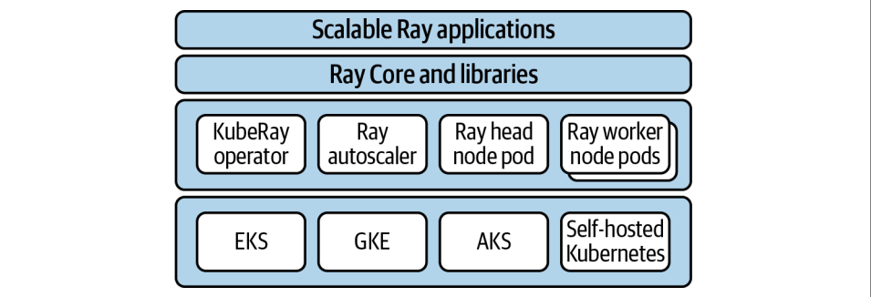
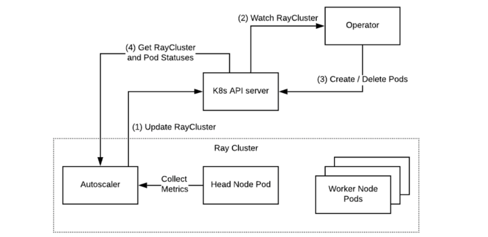

现在，让我们把目光投向更广阔的领域——Ray集群。Ray最吸引人的地方在于它能将你的计算任务，无论是单机上的简单模型，还是复杂的分布式训练，无缝地扩展到多台机器上。这背后的关键在于集群管理。但现实是，对于许多开发者和研究者来说，尤其是在资源有限的环境下，搭建和维护一个稳定的Ray集群并非易事。所以，今天我们就来详细拆解如何搞定这个挑战。

Ray提供了多种部署集群的方式，这三种方式就是：**手动创建、Kubernetes Operator 和 Ray Cluster Launcher**。

- 手动创建是最基础的，你需要自己准备机器，然后一步步配置。这种方式适合那些对网络环境有掌控力，或者有固定机房资源的场景。
- Kubernetes Operator 是目前主流的选择，尤其在生产环境，它利用Kubernetes强大的容器编排能力，实现自动化部署和管理。
- Ray Cluster Launcher，这是官方提供的工具，特别适合在云上快速搭建和测试环境，大大简化了云服务商的复杂API调用。

我们接下来会逐一深入。

## 手动创建集群

我们先从最基础的“手动挡”开始。想象一下，你有几台电脑，想让它们协同工作。

- 第一步，在Head节点节点上运行 ray start --head。这个命令会启动Ray的核心服务，比如GCS服务器，它会告诉你它的地址，比如 192.168.1.100:6379。这个地址就是你的集群入口。

  ```
  ray start --head --port=6379
  ```

- 接下来，把其他Worker节点运行 ray start --address=192.168.1.100:6379。这样，它们就找到了老大，加入了集群。

  ```
  ray start --address=<head-address>
  ```

- 最后，你可以用 ray.init(address='auto') 来验证连接是否成功。当然，如果机器有GPU，记得用 --num-gpus=1 来告诉Ray。

手动搭建虽然简单，但网络环境复杂时就容易出问题。比如，你的Head和Worker不在同一个局域网，中间有防火墙或者NAT，这时候直接用IP地址可能就通不了。怎么办？你可以试试用域名，比如compute04.berkeley.edu，让DNS帮你搞定。如果连接失败，最常见的错误就是Unable to connect to GCS。这时候别慌，先排查一下：是不是Head节点没启动？是不是版本不一样？地址是不是输错了？防火墙是不是挡了？可以用nmap或者netcat工具去检查一下端口是不是真的能通。

## KubeRay Operator

手动搭建虽然灵活，但管理起来太费劲了。现代企业级应用，尤其是AI训练，都离不开Kubernetes。Kubernetes，简称K8s，是目前公认的集群管理标准，它能帮你自动化地部署、管理和扩展你的应用。



对于Ray来说，Kubernetes是最佳拍档。社区维护的KubeRay项目就是官方推荐的解决方案。它通过Kubernetes的自定义资源RayCluster来定义你的集群，然后由一个KubeRay Operator来管理这个集群的生命周期。这个Operator就像一个智能管家，负责创建、删除、扩容、缩容你的Ray集群。



部署KubeRay其实不难

1. 克隆KubeRay的代码仓库。
2. 执行两个kubectl命令，把Operator部署到你的Kubernetes集群里。你可以看到类似create和apply的命令。
3. 检查一下看看ray-system命名空间下有没有Pod在跑，确认Operator起来了
4. 创建一个RayCluster的配置文件，然后用kubectl create -f 把它应用上去。KubeRay会自动帮你创建Head Pod、Worker Pod，甚至配置好服务。

部署

```
wget "https://raw.githubusercontent.com/ray-project/kuberay/\
${KUBERAY_VERSION}/ray-operator/config/samples/ray-cluster.complete.yaml"
kubectl create -f ray-cluster.complete.yaml
```

端口说明

```
6379,The Ray head’s GCS service. Ray worker pods connect to this service when
joining the cluster.
8265,Exposes the Ray Dashboard and the Ray Job Submission service.
10001,Exposes the Ray Client server.
```

集群建好了，怎么用呢？主要有三种方式。

- 第一种，最直接，用kubectl exec -it -c ray-head 进入Head Pod的容器，然后直接跑Python代码。简单粗暴，但不够优雅。

- 第二种，推荐使用Ray Job Submission Server。这个服务暴露在8265端口，你可以用ray job submit命令把你的脚本提交上去。这种方式更灵活，适合运行复杂的脚本。

  ```
  export RAY_ADDRESS="http://localhost:8265"
  ray job submit --working-dir=. -- python script.py
  ```

- 第三种，也是最推荐的方式，Ray Client。它允许你从本地的Python脚本直接连接到远程的Ray集群。你需要先用kubectl port-forward把10001端口映射到本地，然后在你的本地代码里调用ray.init(address="ray://localhost:10001")。这样，你就可以在本地IDE里直接写代码，跑在远程集群上，体验非常丝滑。

```
import ray
ray.init(address="auto")
print(ray.cluster_resources())

@ray.remote
def test():
    return 12

ray.get([test.remote() for i in range(12)])
```

KubeRay的强大之处在于它的配置灵活性。你可以通过一个YAML文件来定义整个集群的样子。这个文件主要分为两部分：headGroupSpec 和 workerGroupSpecs。

- headGroupSpec 定义了Head节点的配置，包括Ray的启动参数，比如端口号、CPU数量、GPU数量，以及Pod的模板，比如容器镜像、资源请求、端口等等。
- workerGroupSpecs 用来定义Worker节点，你可以配置多个不同的Worker组，比如一组CPU节点，一组GPU节点。每个组可以指定实例数量，replicas，以及它们的Ray启动参数和Pod模板。这样，你可以精确地控制集群的资源分配和节点类型。

```yaml
apiVersion: ray.io/v1alpha1
kind: RayCluster
metadata:
  name: raycluster-complete
spec:
  headGroupSpec:
    rayStartParams:
      port: '6379'
      num-cpus: '1'
    template: # Pod template
      metadata: # Pod metadata
        # 可以在这里添加更多的元数据信息
      spec: # Pod spec
        containers:
          - name: ray-head
            image: rayproject/ray:1.12.1
            resources:
              limits:
                cpu: "1"
                memory: "1024Mi"
              requests:
                cpu: "1"
                memory: "1024Mi"
            ports:
              - containerPort: 6379
                name: gcs
              - containerPort: 8265
                name: dashboard
              - containerPort: 10001
                name: client
            env:
              - name: "RAY_LOG_TO_STDERR"
                value: "1"
            volumeMounts:
              - mountPath: /tmp/ray
                name: ray-logs
        volumes:
          - name: ray-logs
            emptyDir: {}
  workerGroupSpecs:
    - groupName: small-group
      replicas: 2
      rayStartParams:
        # 这里可以添加特定于工作节点的ray启动参数
      template: # Pod template
        # 同样可以为工作节点定义具体的Pod模板，包括metadata和spec等内容
```

在Kubernetes环境下，日志管理是个关键问题。默认情况下，Ray的日志会写到Pod的容器里，Pod销毁了，日志就没了。为了持久化日志，有两种主流做法。

- 第一种是挂载一个空的临时卷 emptyDir 到 /tmp/ray 目录，然后在Pod里配置一个Sidecar容器，比如Promtail，专门用来收集和转发这个卷里的日志。
- 第二种是更方便的方式，直接设置环境变量 RAY_LOG_TO_STDERR=1。这样，Ray的日志就会输出到标准错误流 STDERR，然后你可以利用Kubernetes自带的或者第三方的日志收集系统，比如ELK Stack、Fluentd、Prometheus等等，来收集这些STDERR日志。

第二种方式更简洁，尤其适合云原生场景。

## Ray Cluster Launcher

前面讲了Kubernetes，但很多同学可能更习惯在云上直接用云服务。这时候，Ray Cluster Launcher 就派上用场了。它是一个命令行工具，目标就是让在AWS、GCP、Azure这些大厂的云上部署Ray集群变得像搭积木一样简单。它会自动帮你创建云实例，配置好Ray环境，甚至启动自动伸缩器。你只需要提供一个配置文件 cluster.yaml，告诉它你想用哪个云服务商，要多少Worker，用什么类型的机器，以及如何连接这些机器。Cluster Launcher 就会帮你搞定剩下的所有事情。

Cluster Launcher 的使用非常直观。你只需要一个配置文件 cluster.yaml，然后就可以用几个简单的命令来操作集群。

- 想创建或更新集群？ray up cluster.yaml。
- 想连接到Head节点？ray attach cluster.yaml。
- 想提交一个脚本去跑？ray job submit。
- 想把集群里的文件下载到本地？ray rsync-down。

整个过程非常流畅，大大降低了云上部署和使用Ray的门槛。Cluster Launcher 支持多种云服务商。对于 AWS，你需要先安装 boto3 库，然后配置好你的 AWS Access Key ID 和 Secret Access Key。

Ray 提供了现成的配置示例，比如 aws/example-full.yaml，它会创建一个 m5.large 的 Head 节点和最多两个 m5.large 的 Spot 实例作为 Worker。对于 GCP 和 Azure，配置方式类似，需要提供项目ID、区域、可用区、资源组等信息，以及 SSH 密钥对。Ray 也提供了相应的配置示例，比如 gcp/example-minimal.yaml 和 azure/example-minimal.yaml。

最后，我们来聊聊自动伸缩。这是 Ray 的一大亮点。Ray Autoscaler 能够根据你的任务负载，自动地增加或减少集群中的 Worker 节点数量。比如，当你的任务很多，需要更多计算资源时，它会自动拉起新的 Worker；当任务完成，资源闲置时，它会自动回收多余的 Worker，避免资源浪费。它会考虑你设定的最小最大 Worker 数量、不同类型的节点、Ray Core 的调度需求，以及一些程序化的伸缩提示。

核心思想是用一种叫做 **Bin Packing 的算法来最大化资源利用率，同时保证任务的及时性**。对于那些需要频繁启动和关闭的作业，或者需要应对突发流量的场景，自动伸缩能带来巨大的成本和效率优势。

今天我们一起探索了如何从零开始构建Ray集群，从最基础的手动搭建，到强大的Kubernetes集成KubeRay，再到便捷的云原生方案Cluster Launcher。我们还了解了自动伸缩如何让集群更加智能和高效。掌握了这些知识，你就能在各种环境下，灵活地部署和管理你的Ray应用，真正释放Ray的分布式计算潜力。