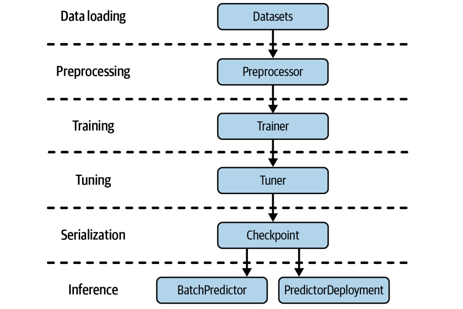
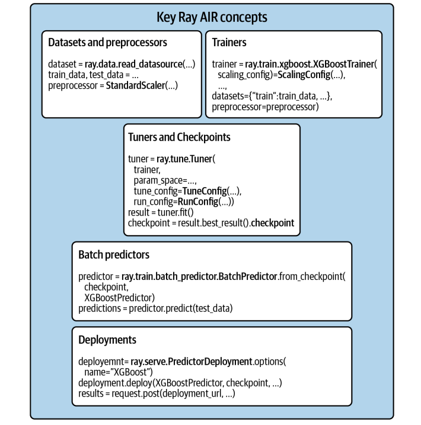

现在，让我们把目光转向如何利用这些基础设施，特别是Ray AI Runtime，来构建和优化我们实际的机器学习工作流程。这正是我们接下来要深入探讨的主题。为什么我们要选择 Ray AIR？它不仅仅是一个库，更像是一个统一的指挥中心。它把 Ray 生态系统里那些强大的工具——像 RLib、Tune、Train、Datasets、Serve——都整合到了一起。这背后是社区力量的推动，大家觉得需要一个更统一、更易用的框架。

Ray 本身是 Python 的，天然契合 Python 生态，GPU 支持也做得很好，再加上 Actors 的状态管理能力，处理复杂的 ML 任务简直是量身定做。无论是数据科学家想快速迭代实验，还是工程师想搭建稳定可靠的生产平台，Ray AIR 都能提供支持。它还能帮你避免那种系统太多、胶水代码太多，导致维护成本高、更新困难的迁移疲劳。

选择 Ray AIR，就是选择了一条更顺畅的路径。Ray AIR 的核心理念非常简洁，但极其强大：用一个脚本，一套系统，搞定所有事。你想想，以前可能需要写一堆脚本、调用多个库，现在AIR帮你把它们串起来，变成一个统一的流程。这带来的好处是显而易见的：代码更简洁，维护起来更轻松；系统之间的协调问题少了，调试和追踪问题也更容易；团队协作起来也更顺畅，大家用同一个语言，同一个框架。这就像从手动挡汽车升级到自动挡，操作更简单，效率更高。

理论讲完了，我们来看点实际的。我们用一个经典的乳腺癌数据集来做例子，一步步走一遍完整的 AIR 流程。目标很明确：从数据加载开始，到模型训练、超参数调优、保存、批量预测，最后部署成一个服务。我们会用到前面提到的各个组件，比如 Ray Datasets 处理数据，Preprocessors 做预处理，XGBoostTrainer 训练模型，Tuner 做超参数调优，Checkpoint 保存模型，BatchPredictor 做批量推理，最后用 PredictorDeployment 部署服务。整个过程就像搭积木，每个模块都清晰明了。



第一步，数据。在 AIR 里，加载数据的标准姿势就是用 Ray Datasets。它不是简单的 Pandas DataFrame，而是分布式的数据集。这意味着什么？意味着你可以用 Ray 的并行计算能力，比如多核 CPU 或 GPU，来加速你的数据加载和预处理操作。想想看，处理 TB 级别的数据集，用单机肯定要等很久，但有了 Ray Datasets，就能把任务分发到集群里，大大缩短时间。我们这里用 read_csv 从 S3 加载 CSV 文件，非常直观。数据加载进来，通常需要做一些特征工程。这就是 Preprocessors 的用武之地。它们的作用是把原始数据变成模型能直接吃的特征。AIR 的 Preprocessors 和 Ray Datasets 是好朋友，它们可以并行地处理大规模数据。而且，这些预处理步骤通常是可扩展的，你可以先用 fit 方法让预处理器学习一下数据分布，然后在训练和推理时都用它，保证一致性。比如我们这里用 StandardScaler 对两列特征进行标准化，让它们的均值为0，方差为1，这是很多模型喜欢的输入格式。注意，这里只是定义了预处理器，还没真正应用到数据上。

```py
import ray
from ray.data.preprocessors import StandardScaler
dataset = ray.data.read_csv("s3://anonymous@air-example-data/breast_cancer.csv")
train_dataset, valid_dataset = dataset.train_test_split(test_size=0.2)
test_dataset = valid_dataset.drop_columns(cols=["target"])py
preprocessor = StandardScaler(columns=["mean radius", "mean texture"])
```

有了数据和预处理，下一步就是训练模型了。这就是 Trainers 的角色。Ray AIR 提供了各种各样的 Trainer，比如 XGBoostTrainer、PyTorchTrainer、TensorFlowTrainer 等等，它们都遵循着一套统一的 API。这太重要了，意味着你可以用相似的方式去定义和训练不同的模型，切换起来非常方便。定义一个 Trainer，你需要告诉它：用多少个 worker？怎么分配 GPU？哪个是标签列？用哪些数据集？用哪个预处理器？以及模型本身的参数，比如 XGBoost 的 boosting rounds。配置好这些，调用 fit 方法，训练就启动了。

```py
# NOTE: Colab does not have enough resources to run this example.
# try using num_workers=1, resources_per_worker={"CPU": 1, "GPU": 0} in your
# ScalingConfig below.
# In any case, this training loop will take considerable time to run.
from ray.air.config import ScalingConfig
from ray.train.xgboost import XGBoostTrainer


trainer = XGBoostTrainer(
    scaling_config=ScalingConfig(
        num_workers=2,
        use_gpu=False,
    ),
    label_column="target",
    num_boost_round=20,
    params={
        "objective": "binary:logistic",
        "eval_metric": ["logloss", "error"],
    },
    datasets={"train": train_dataset, "valid": valid_dataset},
    preprocessor=preprocessor,
)
result = trainer.fit()
print(result.metrics)
```

模型训练好了，但效果可能还不够理想，这时候就需要超参数优化了。Ray Tune 就是干这个的。它和 Trainer 配合得非常默契，你可以直接把 Trainer 实例传给 Tuner，然后告诉 Tuner 你想搜索哪些参数，比如 XGBoost 的 max_depth。你还需要告诉 Tune 你想优化什么指标，比如训练损失的 logloss，以及优化的方向是 min 或 max。Tune 会自动帮你跑很多次实验，找到最佳的超参数组合。这就像给模型找最佳的装备，让它的战斗力达到巅峰。训练或者调优完成后，模型就保存成了一个 Checkpoint。这个 Checkpoint 是 AIR 的原生模型格式，非常方便。你可以把它从一个组件传到另一个组件，比如从 Tuner 传到 Serve，或者从 Trainer 传到 BatchPredictor。这样就不用关心底层模型是怎么保存的，换框架也方便。你可以把它想象成一个模型的快照，随时可以加载回来使用。获取 Checkpoint 非常简单，就是从 Trainer 或者 Tuner 的结果对象里取出来。

```py
# NOTE: Colab does not have enough resources to run this example.
from ray import tune

param_space = {"params": {"max_depth": tune.randint(1, 9)}}
metric = "train-logloss"

from ray.tune.tuner import Tuner, TuneConfig
from ray.air.config import RunConfig

tuner = Tuner(
    trainer,
    param_space=param_space,
    run_config=RunConfig(verbose=1),
    tune_config=TuneConfig(num_samples=2, metric=metric, mode="min"),
)
result_grid = tuner.fit()

best_result = result_grid.get_best_result()
print("Best Result:", best_result)

checkpoint = best_result.checkpoint
print(checkpoint)
```

有了 Checkpoint，我们就可以做批量预测了。BatchPredictor 就是这个环节的主角。它负责从 Checkpoint 中加载模型，然后对一批数据进行预测。这个过程也是并行化的。我们只需要指定用哪个 Checkpoint，以及对应的预测器类型，比如 XGBoostPredictor，然后调用 predict 方法，传入待预测的数据集，比如 Ray Dataset，它就能高效地返回预测结果。这就像把训练好的模型部署到一个临时的推理引擎上，专门用来处理一批数据。

```py
from ray.train.batch_predictor import BatchPredictor
from ray.train.xgboost import XGBoostPredictor

checkpoint = best_result.checkpoint
batch_predictor = BatchPredictor.from_checkpoint(checkpoint, XGBoostPredictor)

predicted_probabilities = batch_predictor.predict(test_dataset)
predicted_probabilities.show()
```

最后一步，也是很多实际应用的关键一步：把模型部署成服务。这样别人就可以通过 API 调用你的模型了。Ray Serve 就是实现这个目标的利器。我们用 PredictorDeployment 来创建服务。这里稍微有点细节，因为模型通常需要处理 DataFrame，而 HTTP 请求是 JSON，所以我们需要一个适配器 Adapter，把 JSON 转换为 DataFrame。定义好适配器，创建 PredictorDeployment，指定模型类型、Checkpoint 和适配器，然后调用 deploy 方法，服务就启动了。你可以通过返回的 URL 访问它。

```py
from ray import serve
from fastapi import Request
import pandas as pd
from ray.serve import PredictorDeployment

async def adapter(request: Request):
    payload = await request.json()
    return pd.DataFrame.from_dict(payload)

serve.start(detached=True)
deployment = PredictorDeployment.options(name="XGBoostService")

deployment.deploy(
    XGBoostPredictor,
    checkpoint,
    http_adapter=adapter
)

print(deployment.url)
```

这张图总结了 Ray AIR 的核心组件。可以看到，它把前面提到的 Datasets、Preprocessors、Trainers、Tuners、Checkpoints、BatchPredictors、Deployments 这些关键部分整合到了一个统一的 API 下。



你可以把它看作是 Ray 生态系统中专门用于机器学习工作流的工具箱。它覆盖了从数据加载、预处理、特征工程，到模型训练、超参数调优、模型保存、批量推理，再到模型部署的完整流程。目标就是让你用一套工具，搞定整个 AI 应用的开发和部署。

Ray AIR 适合处理哪些类型的工作负载呢？我们可以大致分为四类：**无状态、有状态、复合和在线服务**。

- 无状态计算，比如特征工程、批量预测，它们通常可以并行执行，互不影响。
- 有状态计算，比如模型训练、超参数调优、强化学习，它们需要维护状态，比如模型参数，通常需要 Actors 来管理。
- 复合工作负载，就是把无状态和有状态计算结合起来，比如先预处理数据，再用训练好的模型做预测。
- 在线服务，就是把模型部署成一个可以实时响应的 API。

Ray AIR 都能很好地支持。

- 无状态任务。可以看到，数据流通常是 Ray Dataset 进来，经过一系列基于 Ray Tasks 的计算，比如 map、transform、filter 等，最终输出还是 Ray Dataset 或者 Checkpoint。比如读取数据、清洗数据、转换特征、做批量预测等等。这些任务都可以并行执行，非常适合用 Ray 的 Tasks 来处理。Ray Datasets 的 map 和 transform 方法就是典型的例子。这种并行处理能力是处理大规模数据的基础。
- 有状态计算，顾名思义，就是模型的状态会随着训练过程而更新。这需要更精细的控制和状态管理。Ray AIR 的 Train、Tune、RLlib 等组件就是专门用来处理这类任务的。比如，用 XGBoostTrainer 进行分布式训练，Tuner 结合 Trainer 进行超参数调优，或者用 RLTrainer 训练强化学习模型。这些组件内部会使用 Ray Actors 来管理训练过程中的状态，比如模型参数、梯度、状态更新等等。这比纯 Tasks 的并行计算要复杂一些，但也更强大。
- 复合工作负载，比如先用 Preprocessors 处理数据，然后用 Trainer 训练模型。Ray AIR 的强大之处就在于它能很好地处理这种混合场景。它提供了一个统一的接口，让你可以轻松地把数据处理任务（Tasks）和模型训练任务（Actors）结合起来。比如，训练过程中可能需要动态地对数据集进行 shuffle，这时就需要 Tasks 来处理数据，然后 Actors 来接收和使用这些数据。当然，资源分配可能会有挑战，比如 Tune 默认会预留一部分 CPU 给无状态任务，避免资源冲突。
- 在线服务。Ray Serve 提供了强大的模型服务能力。你可以用 PredictorDeployment 把你的模型部署成一个 HTTP 服务。Serve 会自动管理一组无状态的预测器 Actor，当请求来的时候，会自动负载均衡到这些 Actor 上。而且，它还可以根据请求量自动伸缩，保证服务的稳定性和响应速度。从训练到部署，整个过程都在 Ray AIR 的生态里完成，非常流畅。

我们稍微深入一点，看看 Ray AIR 是如何执行这些任务的。

- 对于无状态计算，主要依赖的是 Ray Tasks。Ray Datasets 库会智能地调度这些任务，尽量让任务和它们产生的数据均匀分布在集群里。**数据通常会放在 Ray 的 Object Store 里，但如果你的数据量太大，会溢出到磁盘上**。一个很重要的技巧是流水线，也就是 pipelining，它允许你**按需加载数据，而不是一次性加载所有**，这大大减少了内存占用，尤其是在处理大规模数据集时。
- 对于有状态计算，比如模型训练，Ray AIR 主要使用 Ray Actors。Train 和 RLlib 会创建 Actors 来执行分布式训练。Tune 更进一步，它会创建一个嵌套的 Actor 结构：Tune Driver Actor 负责监控整个实验，每个 Trial 会有一个 Trial Actor，Trial Actor 再管理一组训练 Worker Actors，这些 Worker Actors 才是真正执行训练任务的。这种结构保证了状态的更新和同步。需要注意的是，**Actors 需要预先分配资源，比如 CPU 和 GPU**。
- 复合工作负载，就是同时用到 Tasks 和 Actors。这里可能会遇到资源竞争的问题。比如，如果所有资源都给了训练 Actors，那数据加载任务就没法跑了。Ray AIR 的设计考虑到了这个问题。**Tune 默认会限制 CPU 使用率，比如最多 80%，这样就能保证一部分资源留给无状态任务**。当然，如果训练主要用 GPU，那 CPU 的资源竞争就不是主要问题了。总的来说，Ray AIR 能够比较智能地处理这种混合场景的资源分配。
- 在线服务，核心就是 Ray Serve。它会管理一个无状态的 Actor 池，当请求来的时候，Serve 会自动把这些请求分发到池子里的 Actor 上，实现负载均衡。而且，Serve 还支持自动伸缩，可以根据当前的请求量动态地增加或减少 Actor 的数量，保证服务的稳定性和响应速度。这对于处理高并发、低延迟的在线推理请求非常关键。

内存管理是分布式系统里非常关键的一环。

- Ray Datasets 会把数据分成块，目标是每个块大小控制在 512MB 以内，太大了会溢出到磁盘。
- Ray Object Store 是用来存储和共享数据的，但 Actors 的内存如果不够用，可能会导致 OOM。对于复合工作负载，情况就更复杂了。
- 如果训练 Actor 的内存足够大，可以先把数据加载进来，然后直接用。如果内存不够，那就得用流水线模式，按需加载数据，这样对内存的要求就低多了。

系统运行难免会出错。Ray AIR 对不同类型的任务有不同的容错机制。

- 对于无状态计算，如果某个节点挂了，导致数据丢失了，Ray 可以**通过血缘重建来恢复数据**，重新提交任务就行。但要注意，这不适用于 Head Node 或者 GCS 故障。
- 对于有状态计算，比如 Tune，它主要**依赖 Checkpoint**。Tune 会定期保存 Trial 的状态，如果 Trial 失败了，可以从上次保存的 Checkpoint 重启。这使得它可以在 Spot 实例集群上运行，甚至可以恢复整个实验。
- 复合工作负载就继承了这两种容错机制的优点。

Ray AIR 非常适合在自动伸缩的 Ray 集群上运行。

- 对于无状态任务，如果任务队列满了，或者 Dataset 计算 Actor 队列满了，集群就会自动扩容。
- 对于有状态任务，比如 Tune 的 Trial，如果还有待调度的 Trial，集群也会自动扩容。当节点空闲一段时间后，集群就会自动收缩。

不过要注意，自动伸缩可能会导致数据分布不均衡，尤其是在数据密集型任务中，可能需要限制自动伸缩，或者干脆禁用它。

今天我们一起深入了 Ray AI Runtime 的核心概念和实践。我们看到了 Ray AIR 如何将 Ray 生态系统中的各种工具整合起来，提供了一个统一的 API，极大地简化了从实验到生产的机器学习流程。

我们了解了 Datasets、Preprocessors、Trainers、Tuners、Checkpoints、BatchPredictors 和 PredictorDeployments 这些关键组件，以及它们如何协同工作来处理无状态、有状态、复合和在线服务等各种工作负载。Ray AIR 的集成性也非常好，特别是和 Ray Serve 的无缝结合，让部署变得非常简单。今天我们主要聚焦在 Ray AIR 的核心功能和应用上。