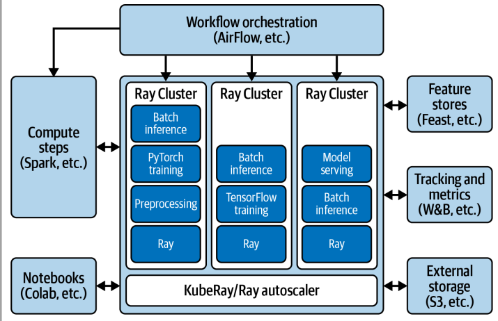

上节课我们深入探讨了Ray AI Runtime的实践细节，现在我们把目光投向更广阔的领域——Ray的生态系统。这不仅仅是工具的堆砌，而是如何将这些强大的组件整合起来，构建一个完整的机器学习工作流程。我们将以Ray AIR为核心，系统地展示Ray是如何连接和扩展我们已知的工具链。

Ray的生态系统绝不仅仅是几个库的简单叠加，它是一个复杂而动态的网络。它可以从不同角度被审视，比如作为数据处理引擎、分布式计算平台，甚至是强化学习框架。理解这一点至关重要，它能帮助我们更好地定位Ray在整体技术栈中的位置，并与市场上其他类似工具进行对比，比如Dask、Spark，甚至是云原生的MLOps平台。

更重要的是，我们要学会如何将Ray无缝地融入现有的机器学习工作流程中，而不是简单地替换。我们将一起探讨如何继续深入学习Ray，掌握更多高级技巧。我们来看一个实际的例子：如何使用Ray来处理图像数据。

- 我们选择经典的CIFAR-10数据集，通过PyTorch的torchvision库加载。注意，这里我们先用PyTorch的transforms做了预处理，比如转为Tensor和归一化。
- 我们使用了Ray AIR提供的from_torch函数，直接将PyTorch的数据加载器转换成Ray Dataset。这一步非常巧妙，它让我们可以利用Ray强大的数据处理能力，而无需从头开始编写复杂的并行加载代码。
- 最后，我们还用map_batches函数对数据格式进行了调整，使其更符合模型训练的需求。整个过程平滑自然，体现了Ray与现有框架的无缝集成。

刚才那个例子只是冰山一角。Ray Datasets的强大之处在于它的广泛兼容性。看看这张表，它支持从文本、图像到复杂的二进制、Parquet、Arrow等多种格式。无论是处理简单的CSV文件，还是大规模的结构化数据，Ray Datasets都能游刃有余。更重要的是，它还能与Spark、Dask、Modin等第三方数据处理框架深度集成，比如通过Spark on Ray，你可以利用Spark的SQL能力，同时享受Ray的分布式计算优势。这种能力使得Ray Datasets在处理大规模、异构数据时，效率和灵活性都大大提升。

数据准备好了，接下来就是模型训练。我们继续使用熟悉的PyTorch框架，定义了一个简单的卷积神经网络。关键在于如何让这个模型在Ray上进行分布式训练。Ray Train提供了一个核心概念：TorchTrainer。这个Trainer就像一个容器，你把你的PyTorch模型、训练循环、数据集和配置放进去，它就能帮你自动管理分布式训练的细节。注意代码里的几个关键点：prepare_model用于初始化模型，get_dataset_shard获取每个worker的专属数据分片，iter_torch_batches则方便地将数据分片转换成PyTorch的batch。

最后，通过session.report，你可以将训练过程中的指标和模型状态Checkpoint报告给Ray，用于监控和日志记录。Ray Train 的强大之处在于它的开放性。它不仅支持 TensorFlow 和 PyTorch 这两大主流框架，还通过社区集成，扩展到了 XGBoost、LightGBM、scikit-learn、Hugging Face Transformers 等等。这意味着，无论你习惯用哪种工具，Ray Train 都能提供一个统一的框架来管理和扩展你的训练任务。这种跨框架的支持，极大地提升了 Ray 在实际应用中的灵活性和普适性。你可以根据任务的特性，选择最合适的模型库，而无需担心底层的分布式实现细节。

模型训练好了，但如何找到最佳的超参数组合，让模型性能达到最优呢？这就轮到 Ray Tune 登场了。Ray Tune 提供了一个强大的超参数搜索框架，它内置了多种流行的优化算法，比如 Optuna、Hyperopt、Ax 等，同时也支持自定义算法。更棒的是，它能无缝集成到 Ray Train 中，实现大规模的并行超参数搜索。你可以同时运行多个实验，快速找到最佳配置。同时，Ray Tune 还能与 MLflow、Weights & Biases 等实验追踪平台集成，方便你记录和比较不同实验的结果，这对于模型迭代和性能优化至关重要。

训练完成，模型也调优了，最后一步就是部署。Ray Serve 提供了强大的模型服务化能力。我们这里用了一个非常流行的工具 Gradio，它能快速创建一个交互式的Web界面，让你直观地看到模型的预测效果。Ray Serve 的 GradioServer 就像一个容器，它可以把你的 Gradio 应用部署到 Ray 集群上，实现自动伸缩。比如，你可以设置 num_replicas=2，让两个副本同时运行，这样就能应对更高的并发请求，保证服务的稳定性和响应速度。整个过程非常简单，只需要几行代码，就能将你的模型变成一个可用的服务。

Ray Serve 的核心价值在于提供了一个轻量级、高性能的模型服务框架。它不依赖于容器，而是直接运行在 Ray 集群之上，启动和部署都非常快速。它支持多种预测器，比如 TorchPredictor、JaxPredictor，可以直接对接各种训练好的模型。同时，它也提供了丰富的集成选项，比如 Gradio、FastAPI、Arize 等，方便你根据不同的应用场景选择合适的部署方式。Ray Serve 的目标是让你能够专注于模型本身，而无需过多关注底层的服务器管理和运维细节。

Ray 的强大之处还在于它的开放性。如果你觉得现有的集成还不够，或者你想对接一些 Ray 官方尚未支持的工具，比如 Snowflake 数据库、JAX 模型，或者 Neptune 实验追踪平台，Ray 提供了清晰的接口让你自己动手扩展。比如，你可以通过实现 DataSource 接口来读取新的数据源，或者通过 DataParallelTrainer 接口来支持新的训练框架。同样，你也可以通过 LoggerCallback 接口来集成自定义的日志工具。这种开放性使得 Ray 不仅是一个强大的工具箱，更是一个可以不断生长、适应你特定需求的生态系统。

这张图，就是我们今天讨论的 Ray AIR 生态系统的全景图。它涵盖了从数据集处理、模型训练、超参数调优到最终的模型部署的整个流程。

- Ray Datasets 作为数据入口，连接了各种数据源和格式；
- Ray Train 和 RLib 提供了强大的训练能力，支持多种框架和算法；
- Ray Tune 则负责模型优化；
- Ray Serve 则负责将模型部署为服务。

这个生态系统还在不断扩展，越来越多的第三方工具和框架被集成进来，共同构建了一个日益完善、功能强大的机器学习平台。

在深入 Ray 生态之前，我们不妨把它和另外两个流行的 Python 分布式计算框架 Dask 和 Spark 做个对比。这张表总结了它们在不同工作负载上的表现。

- 对于结构化数据处理，Spark 和 Dask 无疑是王者，它们在 SQL 和大数据处理方面有深厚积累。
- Ray 在低级并行性和深度学习框架支持方面，凭借其独特的任务和 Actor 模型，以及对 PyTorch 等框架的深度集成，展现出独特的优势。

选择哪个框架，很大程度上取决于你的具体任务类型和需求。**Ray 的优势在于其灵活性和对 AI 应用场景的深度优化**。Ray AIR 与各大云厂商提供的 MLOps 平台，比如 AWS SageMaker、Azure ML、Google Vertex AI 等，是什么关系？Ray AIR 的定位是专注于计算密集型的环节，比如模型训练、评估和推理。它不试图取代 SageMaker 等平台提供的完整功能，比如实验管理、模型部署、CI/CD 流程等。相反，**Ray AIR 可以作为这些平台的计算引擎，提供强大的分布式计算能力**。同时，Ray 本身也是一个开源框架，你可以完全掌控它，根据自己的需求进行定制和扩展，这在某些场景下是非常有吸引力的。

Ray AIR 和云平台可以是互补的，也可以是替代的。Ray AIR 与专门的 MLOps 工作流编排工具，比如 KubeFlow、Flyte、AirFlow 等，又有什么不同？Ray AIR 提供了一种更简洁、更 Pythonic 的方式来定义和执行机器学习任务，它原生支持分布式数据，使得任务定义和执行更加直观。相比之下，KubeFlow、AirFlow 等工具通常更侧重于编排整个工作流程，从数据抽取、特征工程、模型训练到部署上线，提供一个端到端的管理界面。Ray AIR 可以作为这些工作流中的一个计算节点，也可以独立运行。Ray 自身也提供了一个更底层的原生工作流引擎 Ray Workflows，它提供了更灵活的编排能力，可以与 AirFlow 等工具进行更深度的集成。

那么，如何利用 Ray AIR 来构建自己的定制化 ML 平台呢？这张图展示了可能的架构。

核心是 Ray 集群，你可以利用 Ray Autoscaler 根据负载动态调整集群规模。你可以选择在 Kubernetes 上部署 KubeRay。围绕这个核心，你可以根据需要添加各种扩展组件，比如用 Spark 处理数据预处理，用 AirFlow 或者 Ray Workflows 编排整个工作流，用 Jupyter Notebook 进行交互式开发，接入 Feature Store 管理特征，用 MLflow 或者 Weights & Biases 进行实验追踪，甚至可以连接到 S3 等外部存储。Ray AIR 提供了强大的基础，你可以根据具体的业务场景和需求，灵活地组合这些组件，构建出最适合你的 ML 平台。

今天我们一起系统地探索了 Ray 的生态系统，特别是围绕 Ray AIR 的集成能力。我们看到了 Ray 如何与 PyTorch、MLflow、Gradio 等工具无缝对接，如何构建从数据到模型的完整工作流。Ray 的核心在于其强大的集成能力和灵活性，它不仅是一个工具，更是一个开放的平台。当然，这只是冰山一角。Ray 的世界非常广阔，从 Ray Core 的底层机制，到可观测性工具，再到集群管理，以及像 Ray Workflows 这样的新方向，都值得我们深入学习。

