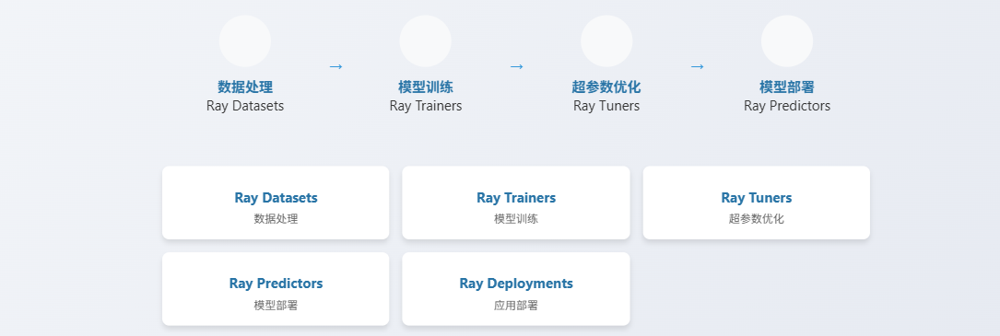

https://github.com/maxpumperla/learning_ray#

我们今天聚焦于一个正在改变机器学习和数据科学领域格局的工具——Ray。它是一种灵活的分布式计算框架，专为Python设计，旨在简化大规模计算任务的实现。为什么我们需要关注Ray？

因为数据量和计算需求的爆炸式增长，已经远远超出了单台机器的能力极限。无论是训练复杂的深度学习模型，还是处理海量数据集，单机性能都难以满足。传统的分布式计算方式往往复杂且难以维护，而Ray的目标就是打破这种壁垒，让开发者能够更轻松地将Python代码扩展到多台机器上运行。它不仅是一个框架，更是一种理念，它让分布式计算不再是少数专家的专利，而是每一位开发者都能触及的工具。无论是想提升模型性能的数据科学家，还是需要优化数据管道的数据工程师，Ray都能提供强大的支持。

Ray的核心架构设计非常清晰，可以看作是三层结构。

- 最底层是Core，这是整个框架的基石，负责底层的任务调度、Actor模型和通信机制。它就像一个灵活的计算引擎，提供了强大的分布式能力。
- 往上一层是Libraries，这里包含了针对特定应用场景的优化库，比如我们后面会提到的Tune、RLlib、Train等。这些库极大地简化了特定任务的实现，比如超参数调优、强化学习训练等。
- 最外层是Ecosystem，也就是生态系统，它包含了各种第三方工具和集成，比如Ray AIR，它进一步丰富了Ray的功能，使其成为一个完整的AI应用开发平台。

我们深入到Ray的核心——Core。它的API设计非常Pythonic，比如ray.task和ray.remote，让你可以轻松地将普通函数或类转换成可以在分布式环境中运行的组件。这大大降低了学习门槛。Ray Core自动管理任务的调度和执行，你不需要关心底层的网络通信和进程管理，只需要专注于业务逻辑。它引入了Actor模型，允许你创建具有持久状态的分布式对象，这对于构建复杂的应用，比如需要维护状态的强化学习环境，非常有用。

整个系统由主节点Head Node、工作节点Worker Node和作业调度器Job Scheduler组成，协同工作，保证任务的高效执行。

超参数优化，简称H P O，是机器学习中一个耗时且困难的过程。通常需要手动尝试大量参数组合，效率低下。Ray Tune就是为了解决这个问题而生的。它的核心优势在于并行化。你可以同时运行成百上千个实验，极大地加速探索过程。Tune内置了多种优化算法，从简单的随机搜索到复杂的贝叶斯优化，应有尽有。更重要的是，它与TensorFlow、PyTorch等主流框架无缝集成，你可以在几行代码内就能将你的模型训练过程接入Tune进行高效优化。

强化学习，也就是RL，是近年来非常热门的领域，但其开发过程往往非常复杂。Ray RLlib正是为了解决这个问题而设计的。它提供了一套统一的API，让你能够轻松地定义环境、策略、评估方法等。RLlib内置了丰富的算法库，从经典的Q-learning、DQN到更复杂的PPO、A3C等，覆盖了强化学习的主流方法。更重要的是，RLlib也支持分布式训练，这意味着你可以利用多台机器的计算能力来加速训练过程，这对于训练大型RL模型至关重要。无论是开发智能体，还是进行复杂的控制任务，RLlib都能提供强大的支持。随着模型规模的增大，单机训练已经难以满足需求，分布式训练成为必然。然而，手动实现分布式训练非常复杂，涉及到数据并行、模型并行、通信优化、资源管理等等。

Ray Train的目标就是简化这个过程。它提供了一个Trainer API，你只需要定义你的模型、训练数据和优化器，Ray Train就能自动处理分布式训练的细节，包括任务分配、数据分发、梯度同步等。你可以专注于模型的优化，而无需关心底层的分布式实现。它还支持自定义数据预处理和回调监控，非常灵活。并且，它能与Ray Tune完美集成，实现超参数优化和分布式训练的一体化。在数据科学和机器学习中，数据预处理和特征工程是耗时耗力的环节，特别是当数据集非常庞大时。传统的单机处理方式效率低下。

Ray Datasets 提供了一种高效的数据处理方式。它将数据集抽象成一个分布式的数据结构，可以利用Ray的分布式计算能力进行并行处理。你可以像操作本地数据集一样，对Ray Datasets进行各种操作，比如过滤、映射、分组、聚合等。它支持构建数据流水线，将多个数据处理步骤串联起来，形成一个完整的数据处理流程。同时，它还能与Dask、Arrow等库集成，进一步扩展数据处理能力。训练好模型只是第一步，如何将模型部署上线，提供实时的预测服务，也就是在线推理，同样是一个挑战。

Ray Serve 就是为了解决这个问题而设计的。它提供了一个轻量级的API，让你能够轻松地将你的模型暴露为HTTP服务。Ray Serve 的核心特点是弹性伸缩。它可以根据实际的请求量，动态地增加或减少模型实例的数量，从而保证在高并发情况下也能保持低延迟响应。同时，它还支持一个Serve实例托管多个模型，这对于需要同时部署多个模型的场景非常方便。无论是构建Web API，还是为移动应用提供后端服务，Ray Serve 都是一个强大的工具。

有了强大的计算能力，还需要一个可靠的平台来管理和部署这些计算资源。Ray Clusters 提供了集群管理的功能。它整合了Ray Core、Datasets、Trainers、Tuners、Predictors、Deployments等核心组件，目标是构建一个统一的AI应用开发平台。

Ray AIR的核心理念是简化AI应用的开发流程，从数据处理到模型训练、超参数优化、部署上线，整个流程都可以在一个平台上完成。它极大地降低了开发复杂AI应用的门槛，使得开发者能够更快地从想法到原型，再到生产部署。

Ray的成功离不开其活跃的社区。这个社区持续贡献着新的功能、新的库和新的集成。Ray的生态系统已经非常丰富，涵盖了数据处理、模型训练、模型服务等多个方面。

同时，Ray还与许多其他系统进行了集成，比如Kubernetes、Spark、Dask、TensorFlow、PyTorch等。这种广泛的兼容性使得Ray能够适应各种不同的应用场景和基础设施。可以预见，随着社区的不断发展，Ray的AI能力将越来越强大，生态系统也将更加完善，应用范围也会越来越广。

总结一下，Ray以其Pythonic的API、灵活的架构、丰富的库和活跃的生态系统，正在成为Python分布式计算领域的一个重要力量。它极大地简化了大规模机器学习和数据科学应用的开发过程，加速了从原型到生产的流程。掌握Ray，无疑将为各位专业人士在未来的AI和数据科学领域中提供强大的竞争力。

