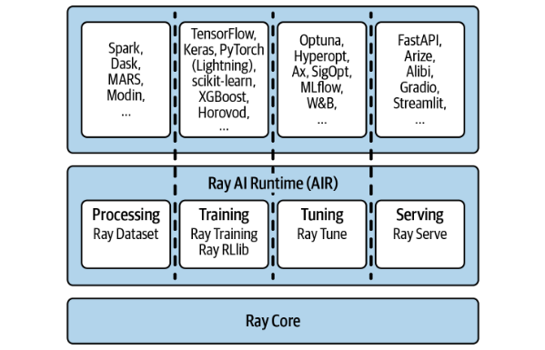

我们每天都在处理海量、多样且高速生成的数据，这对计算能力提出了前所未有的挑战。传统的单机计算模式在面对日益复杂的机器学习模型和大规模数据集时，往往显得力不从心。更重要的是，数据科学家们本应专注于模型训练、特征工程、超参数调优这些核心任务，而不是被繁琐的底层计算细节所困扰。因此，我们需要一种能够高效、灵活地将计算任务扩展到集群，并且易于使用的分布式计算框架，来解放数据科学家的创造力。

过去十年，我们见证了大数据技术的蓬勃发展，比如 Hadoop、Spark 等。这些技术极大地提升了数据存储和处理的能力，对于许多公司的成功至关重要。但有趣的是，这些技术大多是由数据工程师构建和维护的，它们主要服务于数据收集和处理流程。其初衷是好的，希望解放数据科学家，让他们专注于模型本身。然而，现实情况是，数据科学家们往往需要一套更贴近他们工作流程的工具。他们需要的不仅仅是强大的数据存储和处理能力，还需要能够高效地进行模型训练、超参数优化、甚至构建全新的模型或模拟。

现有的通用大数据框架，虽然强大，但有时显得过于底层和复杂，难以直接满足这些特定的需求。这就好比，我们有了强大的引擎，但还需要一个能直接驱动我们业务应用的变速箱。这就是 Ray 登场的背景。

Ray 是一款专门为 Python 数据科学社区打造的灵活分布式计算框架。它试图解决我们刚才提到的痛点。Ray 的核心理念是易用性，它的 API 设计非常简洁，让你能够快速上手。更重要的是，它强调灵活性。无论是处理大规模数据集，还是运行复杂的机器学习模型，甚至是需要利用 GPU 等异构硬件的场景，Ray 都能提供支持。它不仅要快，还要足够快，能够满足实时性要求。

同时，Ray 并非要取代现有的一切，而是致力于与你已有的大数据工具链无缝集成，比如 Spark、Dask 等，让你在享受分布式计算红利的同时，不必丢弃你熟悉的工具箱。Ray 的核心优势之一，就是它践行了简单的事情简单做 的原则。它的核心 API 设计得非常精简，让你能够清晰地理解分布式程序的运作方式。最酷的是，你可以在自己的笔记本电脑上编写并行化的 Python 代码，然后几乎无需改动，就能直接运行到一个强大的计算集群上。这极大地降低了分布式开发的门槛。

Ray 的高层库，比如我们后面会提到的 Rllib、Tune 等，配置起来也很方便，而且它们之间可以无缝协作。虽然 **Ray 的底层是用 C++ 实现的，以保证性能，但它从一开始就坚持 Python First，所有的高层库和功能开发都是围绕 Python 社区的需求来驱动的**，这使得它对 Python 数据科学家来说非常友好。Ray 的真正价值在于它的组合拳效应。它不是单一功能的工具，而是一个模块化的生态系统。你可以将 Ray 的不同组件组合起来，比如用 Rllib 训练模型，再用 Tune 进行超参数调优，最后用 Serve 部署模型。这种组合能力使得 Ray 能够处理那些用传统方法难以实现的复杂机器学习工作负载。它让你能够灵活地利用你熟悉的 Python 工具，去构建和运行大规模的 AI 应用。

可以说，学习 Ray，就是学习如何用 Python 来构建分布式机器学习系统。

这本书的目的，就是带大家一步步掌握 Ray 的精髓，解锁这种强大的分布式 Python 能力。Ray 的设计理念深受几个核心原则的指导。首先是 简单与抽象。Ray 的 API 设计得非常直观，易于理解和学习。无论你是在利用笔记本电脑的多核 CPU，还是在管理一个庞大的集群，使用的 Ray 代码逻辑几乎保持一致。这背后是 Ray 在幕后默默处理了任务的分配和协调，让你无需关心底层的分布式细节。这种强大的抽象层，让你能够专注于你的业务逻辑，而不是被分布式计算的复杂性所淹没。同时，Ray 的 API 非常 Pythonic，这使得它成为一个优秀的 胶水代码，可以轻松地将 Ray 与现有的分布式 Python 工作负载集成起来，无论是调用其他系统，还是被其他系统调用，都非常方便。第二个核心原则是 灵活性与异构性。

对于 AI 工作负载，特别是像强化学习这样复杂的任务，你需要一个非常灵活的编程模型。Ray 的 API 设计就是为了让你能够轻松编写灵活且可组合的代码。简单来说，只要你能在 Python 中表达出来，你就能用 Ray 将其分布式执行。当然，你需要确保资源充足，并且知道你想分布的是什么。但 Ray 不会限制你的创造力。Ray 对于异构计算也表现出色。比如，一个复杂的模拟任务可能包含耗时数小时的任务和毫秒级的任务，Ray 能够高效地调度它们。它还支持动态执行，处理任务之间的依赖关系，允许小任务在大任务运行的同时并行执行，而不会阻塞。

此外，Ray 还能很好地利用异构硬件，比如某些任务需要 GPU 加速，而另一些任务可能更适合 CPU，Ray 都能提供相应的灵活性。第三个关键原则是 速度与可扩展性。Ray 的目标是实现极高的任务执行速度。它每秒可以处理数百万个任务，并且具有极低的延迟。这得益于它高效的任务调度机制，能够快速地将任务分配到集群的各个节点上。同时，Ray 在设计上就考虑了容错性，即使在分布式环境中出现故障，比如某个节点宕机，Ray 也能快速恢复，保证整个系统的稳定性和持续运行。更进一步，Ray 还支持自动伸缩，可以根据当前工作负载的需求动态地增加或减少集群中的节点数量，这不仅有助于降低成本，还能确保集群始终拥有足够的资源来处理任务。这种速度和可扩展性的结合，使得 Ray 在处理大规模、实时性要求高的任务时非常有竞争力。

现在，让我们从宏观层面看看 Ray 的整体架构。我们可以将其理解为三层结构。最底层是 Ray Core，这是整个框架的核心，它提供了一个底层的分布式计算框架，包括核心的 API 和用于集群部署和管理的工具。第二层是高层库，这里主要是指由 Ray 团队开发和维护的那些专门用于数据科学的库，比如我们后面会讲到的 Rllib、Tune、Serve 等，它们通常会通过一个统一的接口，比如 Ray AIR，来整合使用。最顶层是不断扩展的生态系统，它包含了各种第三方集成和扩展，这些扩展了 Ray 的功能，使其能够更好地适应各种不同的应用场景。

你可以想象，Ray Core 是地基，高层库是建筑，而生态系统则是不断丰富和扩展的周边设施。

## Ray Core

我们先来看最基础的 Ray Core。它本质上就是一个分布式计算框架。它管理着一个由多台计算机组成的集群，这些计算机通过网络连接起来。集群中有头节点，负责运行你的程序 Driver 和一部分 Worker 进程，还有若干工作节点，主要负责执行任务 Worker 进程。

有趣的是，Ray Cluster 不仅可以是跨多台机器的集群，也可以是单台机器上的本地集群。在这种情况下，你自己的电脑就是头节点，同时运行着 Driver 和 Worker 进程。启动一个 Ray 集群非常简单，只需要一行代码：ray.init。这个 init 函数就是 Ray Core API 的核心调用之一，它会启动你的 Ray 集群，无论是本地还是远程。

Ray Core API 提供了构建分布式应用的基础能力，虽然它相对底层，但它非常强大，是构建 Ray 各种高级功能的基础。

## 高层库

接下来，我们进入 Ray 的第二层：高层库。这里最核心的概念就是 Ray AI Runtime，简称 Ray AIR。它就像一个大伞，把 Ray 的各个数据科学库整合起来，提供了一个统一的 API 接口，让你在处理数据科学工作流程时，能够享受到一致的体验。Ray AIR 的目标是覆盖从数据处理到模型训练、超参数调优、再到模型部署的完整流程。

具体来说，Ray 提供了几个关键的高层库：

- Ray Datasets 用于高效的数据处理
- Ray Train 用于分布式模型训练
- Ray RLlib 是一个强大的强化学习库
- Ray Tune 专门用于加速超参数搜索
- Ray Serve 则负责将训练好的模型部署为服务。

这些库都是基于 Ray Core 构建的，它们充分利用了底层的分布式能力，同时又提供了高层的抽象和易用性。我们先来看 Ray Datasets。它提供了一个名为 Dataset 的数据结构，专门用于分布式数据处理。Ray Datasets 的核心是基于 Arrow 框架，这使得它在数据传输和处理方面非常高效。它提供了丰富的数据加载器，可以轻松从各种常见的格式和数据源中读取数据。对于数据转换，Ray Datasets 提供了一套非常直观的函数式 API，比如 map、filter、flat_map。这些 API 非常符合 Python 的风格，让你能够像流水线一样处理数据。比如，你可以用 map 对每个数据点进行变换，用 filter 过滤掉不需要的数据，用 flat_map 将列表展开。更进一步，Ray Datasets 还支持 DatasetPipeline，它允许你构建异步执行的数据处理流水线，这样可以重叠执行不同的步骤，从而显著提升性能，尤其是在处理大规模数据时。

对于模型训练，Ray 提供了两个主要的库：Ray Train 和 Ray RLlib。Ray Train 是一个通用的分布式模型训练框架，它主要面向监督学习等场景，能够利用 Ray 的分布式能力来加速模型训练过程。它与 TensorFlow 和 PyTorch 紧密集成，你可以选择使用你熟悉的框架。Ray RLlib 则专注于强化学习领域。它提供了一个强大的强化学习库，支持包括 PPO 在内的多种先进算法，并且可以很好地与 OpenAI Gym 等标准环境配合使用。Ray RLlib 还提供了一个名为 rllib 的命令行工具，让你可以非常方便地运行预配置好的强化学习示例，比如经典的 CartPole 平衡杆问题。这大大降低了入门和实验的门槛。超参数优化是机器学习中一个耗时且关键的环节。

Ray Tune 就是专门为解决这个问题而设计的。它是一个强大的超参数优化库，能够自动帮你找到模型的最佳超参数。Tune 支持多种优化算法，比如网格搜索、随机搜索、贝叶斯优化等，你可以根据你的任务和预算选择合适的策略。Tune 的核心优势在于并行执行。它能够将多个超参数组合的训练任务同时运行，极大地加速了搜索过程。想象一下，如果每个训练组合需要花费数小时，用串行搜索可能需要几天甚至几周，而 Tune 可以通过并行执行，将时间缩短到几小时甚至几分钟。此外，Tune 还提供了强大的实验管理功能，能够自动跟踪和管理实验结果，方便你进行分析和比较。

最后，我们来看 Ray Serve。这个库的作用是将你训练好的模型部署成一个可以被外部调用的服务。Ray Serve 的核心是提供一个 HTTP 接口，让客户端可以通过发送 HTTP 请求来调用你的模型。这使得模型的部署非常便捷，用户无需关心底层的实现细节。Ray Serve 还支持弹性伸缩，可以根据请求量的大小自动增加或减少模型的实例，从而保证服务的性能和响应速度。同时，它还提供了模型版本管理功能，可以方便地进行 A/B 测试，或者在新旧模型之间切换。Ray Serve 的目标是让你能够高效、可靠地将模型部署到生产环境中，真正实现模型的价值。

## 生态系统

除了 Ray 自身提供的核心库和 AIR，它还有一个非常活跃的生态系统。这个生态系统是 Ray 价值的重要组成部分。Ray 非常注重与现有工具的集成，比如它可以与 Spark、Dask、TensorFlow、PyTorch 等等广泛使用的数据处理和机器学习框架协同工作。这意味着你可以将 Ray 的分布式计算能力与这些工具的特定功能结合起来。同时，Ray 社区也在不断涌现出各种第三方库，进一步扩展了 Ray 的功能边界。

Ray 的开放性也吸引了大量的开发者贡献代码和想法。这种持续的生态发展和社区活跃，使得 Ray 不仅是一个强大的工具，更是一个充满活力的平台。

让我们快速总结一下 Ray 的三层架构。最底层是 Ray Core，它提供了强大的分布式计算引擎，是整个框架的基础。中间层是高层库，特别是 Ray AIR，它通过统一的 API 整合了 Ray 的各种核心功能，比如数据处理、模型训练、超参数调优、模型部署等，极大地简化了数据科学家的工作流程。最外层是不断扩展的生态系统，它通过各种集成和扩展，进一步丰富了 Ray 的应用场景。Ray 的核心价值在于，它通过简洁的 API、强大的分布式能力、以及灵活的生态系统，极大地降低了分布式计算的门槛，让开发者能够更专注于业务逻辑本身，从而提升效率，扩展可能性，最终推动数据科学和人工智能应用的边界。