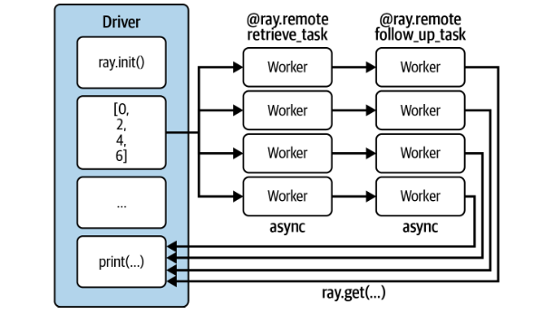
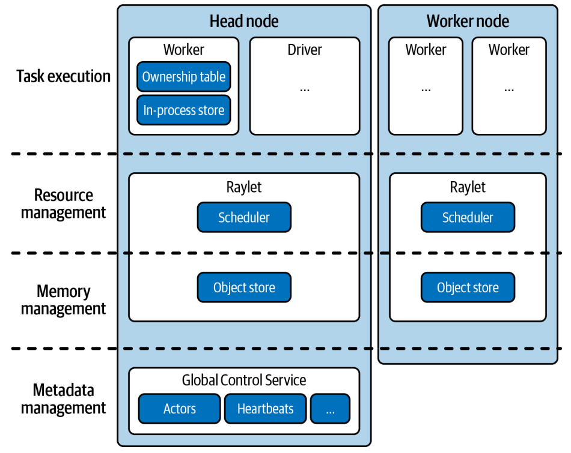
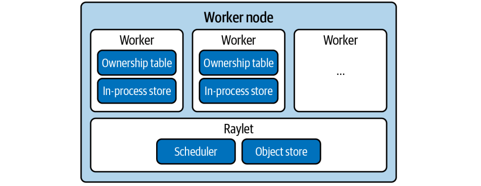
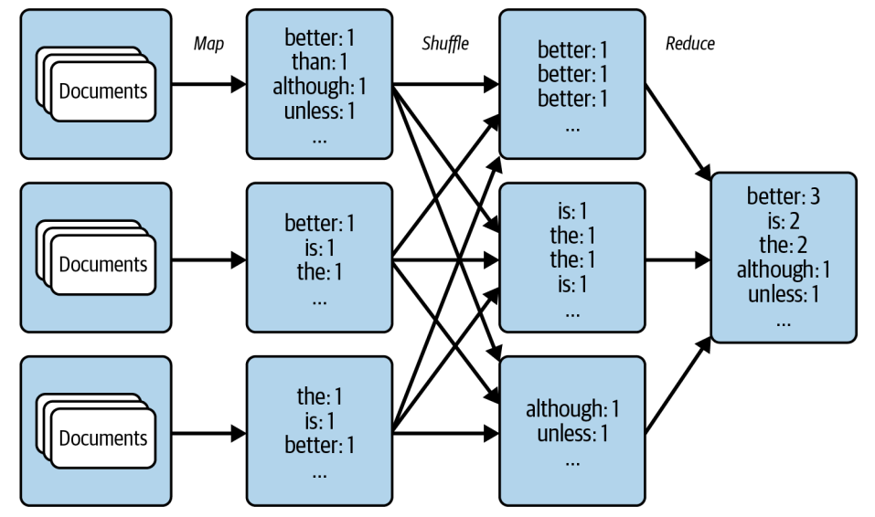

上节课我们深入探讨了Ray的核心设计与架构，现在我们来聊聊如何用它来解决实际问题。大家可能觉得有点讽刺，因为Python本身在分布式计算上其实有点力不从心。它的解释器本质上是单线程的，这使得我们很难充分利用多核CPU，更别说整个集群的计算能力了。

虽然Python生态系统里有一些工具，比如multiprocessing，但它们大多只能在单机上玩转，跨机器的分布式计算就有点力不从心了。所以，Ray Core API 就应运而生了。它就像一个强大的瑞士军刀，目标是让通用的分布式编程对Python社区来说触手可及。我们打个比方，有些公司可能只用预训练的模型就能搞定业务，但很多时候，你必须得自己训练模型才能成功。同样，你的分布式工作负载，也许能塞进现有框架的编程模型里，但它们可能不够灵活。**Ray Core 的厉害之处在于它的通用性，它能让你解锁构建分布式应用的所有可能性，而不是被限制在特定的模式里**。正因为如此，我们才要花时间来好好理解它的基础。

要理解Ray Core，你需要抓住三个核心概念：**任务、Actor和对象**。你可以把它们看作是Python函数、类和数据的分布式版本。

- Tasks就是我们用来并行执行的函数
- Actor是可以在集群中运行并保持状态的类
- Objects则是存储在Ray对象存储中的数据。

听起来是不是很基础？但别小看这些，它们构成了Ray Core的基石。更令人惊喜的是，掌握这些核心概念，只需要用到六个基本的API调用，是不是感觉门槛一下子就降低了？Ray Core API 的设计非常Pythonic，它充分利用了我们熟悉的装饰器、函数和类这些概念。这使得学习曲线非常平缓，对于Python开发者来说，上手速度非常快。它的目标是提供一个通用的分布式编程接口，把复杂的底层细节都封装起来，让开发者可以专注于业务逻辑。

Ray引擎在背后默默处理所有繁重的工作，这种设计理念使得Ray可以很好地与现有的Python库和系统集成。我们为什么要花时间从Ray Core这个底层开始讲起呢？因为这是我们相信它能极大提升分布式计算可及性的关键一步。通过学习Ray Core，你不仅能理解Ray是如何工作的，更能掌握其核心原理。

虽然对于初学者或者只想快速上手的人来说，Ray Core可能需要一些适应期，但强烈建议大家学习它。这不仅是进入Python分布式计算领域的一把金钥匙，更是你未来构建更复杂应用的基础。掌握了它，你就掌握了主动权。

## Ray core API

理论讲完了，我们来看点实际的。

```py
import time
database = [
    "Learning", "Ray",
    "Flexible", "Distributed", "Python", "for", "Machine", "Learning"
]
def retrieve(item):
    time.sleep(item / 10.)
    return item, database[item]

def print_runtime(input_data, start_time):
    print(f'Runtime: {time.time() - start_time:.2f} seconds, data:')
    print(*input_data, sep="\n")

start = time.time()
data = [retrieve(item) for item in range(8)]
print_runtime(data, start)
```

假设我们有一个函数，叫 retrieve，它模拟从数据库里拿数据，然后做一些处理。为了体现耗时，我们用 time.sleep(item divided by 10) 来模拟。如果我们要依次获取所有8个数据项，总共需要多少时间？简单计算一下，就是0.1加0.2加一直到0.7，大约是2.8秒。如果我们直接用Python的列表推导式来执行，结果就是这个耗时。

这说明什么？**说明串行执行，即使代码本身是并行的，也无法充分利用多核CPU，性能瓶颈就在那里**。这个串行执行的瓶颈，很大程度上要归咎于Python的全局解释器锁（GIL）。简单来说，GIL就是一把锁，保证了同一时刻，只有一个线程在执行Python代码。这在某些时候是好事，比如简化了内存管理，让单线程程序跑得飞快。但是，对于CPU密集型的任务，比如我们刚才的模拟，GIL就成了绊脚石，因为所有线程都得排队，实际上还是单线程运行。所以，如果你的程序是CPU密集型的，想突破单线程限制，就得想办法绕过GIL，比如使用Jython、IronPython或PyPy这些非CPython的实现。

既然串行不行，那我们能不能让这些任务并行跑起来呢？答案是肯定的，而且非常简单。我们只需要一个装饰器：@ray.remote。把这个装饰器加在我们的函数 retrieve_task 上，它就变成了一个Ray任务。神奇的是，这个函数的内部逻辑完全没变，还是那个 retrieve(item)，但它的执行方式发生了根本改变：**它可以在不同的进程里执行，甚至在不同的机器上执行**。

这设计得多优雅，你只需要关注你的Python代码逻辑，Ray帮你搞定分布式。用了Ray任务后，性能到底提升了多少呢？我们来看一下，串行执行用了2.82秒，而使用Ray任务并行执行，总时间只有0.71秒！这几乎是完美并行的理想状态，只比最长的任务耗时0.7秒稍微多一点点。

性能提升的关键在于，**Ray任务让任务可以在并行执行，充分利用了多核CPU的资源**。而且，Ray任务是异步执行的，你提交任务后，它会立刻返回一个结果引用，而不是傻等着结果。这在处理大量任务时，效率非常高。

```py
import ray 


@ray.remote
def retrieve_task(item):
    return retrieve(item)
```

我们注意到，之前的例子中，数据库是定义在Driver端的，如果真要在多个机器上跑，Worker怎么拿到这个数据？这就是**Ray对象存储Object Store的用武之地了。它是一个分布式共享的数据存储，可以跨节点访问**。我们只需要用ray.put把数据放进去，得到一个引用，然后把这个引用传递给需要数据的Worker任务。这样，Ray就能自动处理数据在不同节点间的共享和访问了。虽然操作对象存储会带来一些开销，但在处理大规模数据集时，这种效率提升是值得的。

```python
start = time.time()
object_references = [
    retrieve_task.remote(item) for item in range(8)
]
data = ray.get(object_references)
print_runtime(data, start)
```

我们之前用 ray.get() 来获取所有任务的结果，但这有个问题，它是阻塞的。也就是说，你得等所有任务都完成了，才能拿到结果。如果每个任务都要花很长时间，比如几分钟，那你的Driver进程就一直空等着，没法干别的。而且，如果某个任务卡住了，整个程序也卡住了。为了解决这个问题，Ray提供了 ray.wait() 函数。它允许你非阻塞地等待，你可以指定等待多少个任务完成，或者设置一个超时时间，比如只等7秒，然后继续处理其他任务

```python
start = time.time()
object_references = [
    retrieve_task.remote(item, db_object_ref) for item in range(8)
]
all_data = []

while len(object_references) > 0:
    finished, object_references = ray.wait(
        object_references, num_returns=2, timeout=7.0
    )
    data = ray.get(finished)
    print_runtime(data, start)
    all_data.extend(data)

print_runtime(all_data, start)
```

这大大提高了程序的灵活性和效率。现实世界中，任务往往不是孤立的，一个任务的结果可能需要作为下一个任务的输入。比如，我们先用 retrieve_task 获取数据，再用 follow_up_task 基于这个结果做进一步处理。Ray是怎么处理这种依赖关系的呢？神奇的是，你只需要像写普通Python代码一样，把前一个任务的返回值传递给下一个任务，比如 follow_up_task(remote(ref))，Ray就能自动帮你搞定。它会分析任务之间的依赖关系，确保 follow_up_task 只在 retrieve_task 完成后才执行。而且，**中间产生的大型数据，Ray可以直接在对象存储里传递引用，不用复制回Driver**，非常高效。



除了函数，我们还**可以把Python类也变成分布式对象**，这就是Ray的Actor。Actor允许你在集群中运行带有状态的计算，比如一个计数器，或者一个状态机。Actor之间还可以互相通信，这对于实现复杂的分布式算法非常有用。

```py
@ray.remote
class DataTracker:
    def __init__(self):
        self._counts = 0

    def increment(self):
        self._counts += 1

    def counts(self):
        return self._counts
    
@ray.remote
def retrieve_tracker_task(item, tracker, db):
    time.sleep(item / 10.)
    tracker.increment.remote()
    return item, db[item]


tracker = DataTracker.remote()

object_references = [
    retrieve_tracker_task.remote(item, tracker, db_object_ref) for item in range(8)
]
data = ray.get(object_references)

print(data)
print(ray.get(tracker.counts.remote()))
```

同样，我们用 @ray.remote 装饰器来定义一个Actor类，然后通过 .remote() 方法来创建它的实例。Actor的实例方法，本质上就是Ray任务，你可以用 .remote() 来调用它们。这为我们提供了更强大的状态管理和并发控制能力。

回顾一下我们刚才用到的API，是不是感觉很简洁？总共就六个核心方法：

- `ray.init()` 初始化集群，
- `@ray.remote` 负责把函数或类变成任务或Actor
- `ray.put()` 和 `ray.get()` 负责数据的存储和读取
- `.remote()` 用来执行任务或Actor方法
- `ray.wait()` 用来处理异步等待。

这六个API，构成了Ray Core API的核心，也是我们日常使用中最频繁的部分。它们简洁明了，但功能强大，足以支撑起复杂的分布式应用。

## Ray的内部运作机制



现在我们来看看Ray的内部运作机制。**一个Ray集群由多个节点组成，每个节点都有一个Raylet进程。Raylet是节点上的智能组件，负责管理Worker进程和调度任务**。



Raylet内部有两个关键部分：

- 一个是任务调度器，负责资源分配和任务依赖解析，确保任务有足够资源和所需数据才能执行；
- 另一个是对象存储，负责内存管理和数据共享。

Worker进程则负责实际执行任务，它们会维护一个所有权表，记录自己发起的任务和产生的数据。

除了工作节点，集群还有一个特殊的节点，叫做头节点。**头节点上运行着Driver进程，负责提交任务，但它本身不执行任务**。

头节点还运行着一个全局控制服务（GCS），这是整个集群的神经中枢。GCS是一个键值存储系统，用来存储集群的全局信息，比如各个节点的Raylet是否在线、Actor的位置信息等等。通过GCS，集群可以协调所有节点的工作，实现全局的资源管理。

整个集群的分布式调度和执行，是一个复杂的过程。数据可能需要在不同节点间传输，这被称为分布式内存传输。**节点间的通信主要通过gRPC协议进行**。

**资源管理方面，Raylet负责在本地节点上分配资源，而GCS则负责协调整个集群的资源情况**。任务执行前，Raylet会先解析依赖关系，确保任务所需的数据和资源都到位。这个过程涉及调度、内存、通信等多个方面，Ray的架构设计就是为了高效地处理这些复杂性。

Ray并不是孤立存在的，它与很多其他系统都有联系。

- 作为Python的并行计算框架，它和Celery、multiprocessing有相似之处。
- 在数据处理领域，它与Spark、Dask、Flink等框架有交集。
- 在集群管理方面，它与Kubernetes等工具协同工作。
- 由于采用了Actor模型，它与Akka等框架有理论渊源。
- 它底层的通信机制也使其与高性能计算HPC框架如MPI有一定的关联。

理解这些关系，有助于我们更好地定位Ray在整个生态系统中的位置。为了让大家更直观地感受Ray的威力，我们来看一个经典的分布式计算例子——MapReduce。



Word Count就是MapReduce最经典的用例。它包含三个核心步骤：Map、Shuffle和Reduce。Map阶段负责处理原始数据，比如把文档转换成单词和计数。Shuffle阶段负责把相同键的值聚集到一起，这在分布式环境中通常需要跨节点的数据移动。Reduce阶段则负责聚合这些数据，得到最终结果。

```py
import subprocess
zen_of_python = subprocess.check_output(["python", "-c", "import this"])
corpus = zen_of_python.split()

num_partitions = 3
chunk = len(corpus) // num_partitions
partitions = [
    corpus[i * chunk: (i + 1) * chunk] for i in range(num_partitions)
]

def map_function(document):
    for word in document.lower().split():
        yield word, 1
        
# map
import ray

@ray.remote
def apply_map(corpus, num_partitions=3):
    map_results = [list() for _ in range(num_partitions)]
    for document in corpus:
        for result in map_function(document):
            first_letter = result[0].decode("utf-8")[0]
            word_index = ord(first_letter) % num_partitions
            map_results[word_index].append(result)
    return map_results


map_results = [
    apply_map.options(num_returns=num_partitions)
    .remote(data, num_partitions)
    for data in partitions
]

for i in range(num_partitions):
    mapper_results = ray.get(map_results[i])
    for j, result in enumerate(mapper_results):
        print(f"Mapper {i}, return value {j}: {result[:2]}")
      
# reduce
@ray.remote
def apply_reduce(*results):
    reduce_results = dict()
    for res in results:
        for key, value in res:
            if key not in reduce_results:
                reduce_results[key] = 0
            reduce_results[key] += value

    return reduce_results


outputs = []
for i in range(num_partitions):
    outputs.append(
        apply_reduce.remote(*[partition[i] for partition in map_results])
    )

counts = {k: v for output in ray.get(outputs) for k, v in output.items()}

sorted_counts = sorted(counts.items(), key=lambda item: item[1], reverse=True)
for count in sorted_counts:
    print(f"{count[0].decode('utf-8')}: {count[1]}")
```

Ray非常适合用来实现这种模式，它可以轻松地并行化Map和Reduce阶段，而Shuffle阶段的数据移动，Ray也能帮你搞定。我们来看MapReduce的实现。

首先是Map阶段，我们定义了一个map_function，把每个单词映射成键值对，比如单词is出现一次，就生成is, 1。然后，我们把这个函数封装成一个Ray任务apply_map，让它并行处理整个文档集合。为了让Ray能自动进行Shuffle，我们把apply_map设计成返回多个分区的结果。在apply_map内部，我们用一个简单的哈希函数ord(first_letter) % num_partitions，把每个单词的计数结果分配到不同的分区。这样，同一个单词的计数就会出现在同一个分区里。

接下来是Reduce阶段。我们定义了一个apply_reduce函数，它接收来自多个分区的计数结果，然后把它们汇总起来。同样，我们把这个函数也封装成Ray任务。我们把每个分区的第i个结果收集起来，传递给一个apply_reduce任务，这样就实现了跨分区的聚合。最后，我们用ray.get收集所有Reduce任务的结果，再合并成一个总的词频表。

整个过程，无论是Map还是Reduce，都是Ray任务，数据在节点间的移动，Shuffle，也由Ray自动处理。

今天我们快速浏览了Ray Core API的核心概念和使用方法，以及Ray的系统架构。我们看到了任务、Actor和对象这三大核心概念，以及如何用寥寥几个API调用构建分布式应用。我们也了解了Ray如何通过Raylet、GCS等组件实现分布式调度和执行。通过MapReduce的例子，我们体会了Ray编程模型的灵活性和强大之处。希望这次内容能帮助大家对Ray Core有一个初步的认识，为后续深入学习和应用打下坚实的基础。