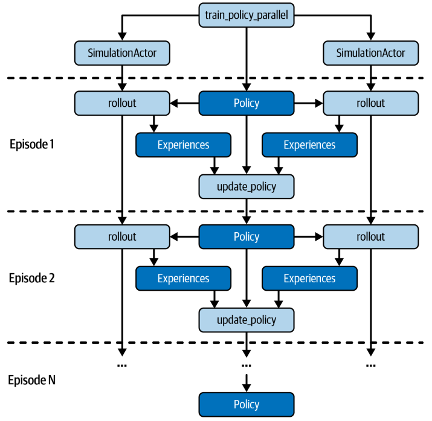

上节课我们掌握了Ray Core的基本编程，我们已经学会了如何使用Ray API。现在，让我们将这些知识应用到一个更实际的场景中——构建一个强化学习项目，并且利用Ray来加速它。

我们的目标是，通过Ray的任务和Actor，将一个简单的强化学习问题并行化，整个过程代码量不超过250行。这个项目不仅适合没有RL经验的初学者，即使是经验丰富的专家也能从中获得新的视角。

在深入代码之前，我们先快速回顾一下强化学习的核心思想。它本质上是一种让机器像人一样学习的方法。想象一下训练一只小狗，你不会直接告诉它坐下，而是给它做对了就奖励，做错了就忽略。强化学习就是这个道理。它让智能体通过与环境的交互，不断尝试、观察结果、接收奖励或惩罚，最终学会如何采取行动以达到目标，比如最大化累积奖励。这里面的关键角色包括：执行动作的智能体、它所处的环境、以及环境对智能体行为的反馈，也就是奖励。理解了这些，我们就能更好地理解接下来的实现。

强化学习的应用远不止于识别图像。它真正擅长处理那些需要动态决策、长期规划和复杂交互的场景。比如，我们前面提到的植物养护机器人，它需要根据季节变化、天气状况、甚至虫害情况，自动调整浇水、施肥策略。再比如，管理一个复杂的供应链，系统需要根据实时的需求预测和库存水平，智能地决定何时补货、补多少。还有像著名的咖啡机测试，要求机器人能在陌生环境中找到咖啡机并完成冲泡。这些都是强化学习大显身手的舞台，它们都需要智能体在复杂环境中做出最优决策。

为了让大家更直观地理解，我们来看一个具体的例子：一个简单的5x5迷宫游戏。想象一个寻觅者，它的目标是找到迷宫里的一个特定目标。我们不预先设定路径，而是让寻觅者通过反复尝试，学习如何找到目标。这个过程会涉及到智能体的移动、状态的观察、奖励的获取，以及最终的决策。

我们将使用Ray来并行化这个模拟过程，让多个寻觅者同时探索，从而加速学习过程。

在实现这个迷宫游戏之前，我们先定义一个基础的动作空间。我们称之为Discrete类，它代表一组离散的、可选的动作。比如，我们的寻觅者可以向上、向下、向左或向右移动。这个类的设计非常灵活，它接受一个参数num_actions，表示动作的数量。这样，我们就可以轻松地扩展到更多不同的动作，而不仅仅是这四个方向。通过sample方法，我们可以随机选择一个动作，这对于智能体的探索和学习至关重要。

```py
import random

class Discrete:
    def __init__(self, num_actions: int):
        self.n = num_actions

    def sample(self):
        return random.randint(0, self.n - 1)

space = Discrete(4)
print(space.sample())
```

现在我们有了动作空间，接下来就是构建迷宫本身，也就是Environment类。这个类包含了游戏的关键信息：寻觅者的当前位置seeker，目标的位置goal，以及寻觅者可以执行的动作空间action_space和它能观察到的状态空间observation_space。

```py
import os


class Environment:
    def __init__(self,  *args, **kwargs):
        self.seeker, self.goal = (0, 0), (4, 4)
        self.info = {'seeker': self.seeker, 'goal': self.goal}

        self.action_space = Discrete(4)
        self.observation_space = Discrete(5*5)

    def reset(self):
        """Reset seeker position and return observations."""
        self.seeker = (0, 0)

        return self.get_observation()

    def get_observation(self):
        """Encode the seeker position as integer"""
        return 5 * self.seeker[0] + self.seeker[1]

    def get_reward(self):
        """Reward finding the goal"""
        return 1 if self.seeker == self.goal else 0

    def is_done(self):
        """We're done if we found the goal"""
        return self.seeker == self.goal

    def step(self, action):
        """Take a step in a direction and return all available information."""
        if action == 0:  # move down
            self.seeker = (min(self.seeker[0] + 1, 4), self.seeker[1])
        elif action == 1:  # move left
            self.seeker = (self.seeker[0], max(self.seeker[1] - 1, 0))
        elif action == 2:  # move up
            self.seeker = (max(self.seeker[0] - 1, 0), self.seeker[1])
        elif action == 3:  # move right
            self.seeker = (self.seeker[0], min(self.seeker[1] + 1, 4))
        else:
            raise ValueError("Invalid action")

        obs = self.get_observation()
        rew = self.get_reward()
        done = self.is_done()
        return obs, rew, done, self.info

    def render(self, *args, **kwargs):
        """We override this method here so clear the output in Jupyter notebooks.
        The previous implementation works well in the terminal, but does not clear
        the screen in interactive environments.
        """
        os.system('cls' if os.name == 'nt' else 'clear')
        try:
            from IPython.display import clear_output
            clear_output(wait=True)
        except Exception:
            pass
        grid = [['| ' for _ in range(5)] + ["|\n"] for _ in range(5)]
        grid[self.goal[0]][self.goal[1]] = '|G'
        grid[self.seeker[0]][self.seeker[1]] = '|S'
        print(''.join([''.join(grid_row) for grid_row in grid]))
```

我们还定义了几个关键方法：reset()用于重置游戏状态；get_observation()将当前状态编码为一个整数；get_reward()判断是否到达目标并返回奖励；is_done()检查游戏是否结束；以及核心的step(action)方法，它根据动作更新状态，并返回新的状态、奖励、是否结束等信息。

这构成了我们游戏的基本交互逻辑。有了环境，我们还需要一个机制来模拟整个游戏过程，这就是Simulation类。它的主要任务是根据一个给定的策略Policy，模拟一个完整的寻宝游戏回合，直到找到目标或达到最大步数。

这个过程会收集一系列的经验数据，也就是在每个状态采取的动作、得到的奖励、以及下一个状态。这些经验数据是智能体学习的关键。Simulation类的rollout方法就是实现这个过程的，它会跟踪游戏状态，执行策略动作，收集经验，并在游戏结束时返回所有经验。

```py
class Simulation(object):
    def __init__(self, env):
        """Simulates rollouts of an environment, given a policy to follow."""
        self.env = env

    def rollout(self, policy, render=False, explore=True, epsilon=0.1):
        """Returns experiences for a policy rollout."""
        experiences = []
        state = self.env.reset()
        done = False
        while not done:
            action = policy.get_action(state, explore, epsilon)
            next_state, reward, done, info = self.env.step(action)
            experiences.append([state, action, reward, next_state])
            state = next_state
            if render:
                time.sleep(0.05)
                self.env.render()

        return experiences
```

策略Policy是智能体学习的核心。它决定了在给定状态下应该采取什么动作。最简单的策略就是维护一个状态-动作价值表，记录每个状态和动作组合的预期价值。我们的Policy类初始化时创建这样一个表，所有值都设为0。然后，get_action方法会根据当前状态查询这个表，选择价值最高的动作。这里引入了探索参数explore和epsilon，这是为了防止过早地陷入局部最优，即所谓的探索-利用权衡。有时我们需要随机尝试，即使当前策略看起来不错，以发现更好的可能性。

```py
import numpy as np

class Policy:

    def __init__(self, env):
        """A Policy suggests actions based on the current state.
        We do this by tracking the value of each state-action pair.
        """
        self.state_action_table = [
            [0 for _ in range(env.action_space.n)]
            for _ in range(env.observation_space.n)
        ]
        self.action_space = env.action_space

    def get_action(self, state, explore=True, epsilon=0.1):
        """Explore randomly or exploit the best value currently available."""
        if explore and random.uniform(0, 1) < epsilon:
            return self.action_space.sample()
        return np.argmax(self.state_action_table[state])
```

有了经验数据，我们如何让智能体学习呢？这里我们采用经典的Q-Learning算法。Q-Learning的核心在于更新那个状态-动作价值表。当智能体经历了一个状态、动作、奖励、下一个状态的序列后，它会更新当前状态和动作的价值。这个更新公式是关键：新价值等于旧价值乘以一个权重，加上新奖励加未来预期价值的折扣，再乘以另一个权重。这个公式平衡了当前的经验和对未来可能的期望。通过不断重复这个过程，智能体就能逐渐学会哪个动作在哪个状态下是最佳的。

现在我们来谈谈如何利用Ray来加速这个过程。我们注意到，**模拟一个游戏回合是独立的，可以并行执行。因此，我们可以将Simulation类封装成一个Ray Actor**。通过简单的@ray.remote装饰器，我们就能让这个类在Ray集群中运行，成为一个独立的进程。这样，我们就可以创建多个SimulationActor，它们可以同时运行，模拟不同的游戏回合，大大缩短训练时间。这对于需要大量模拟的强化学习任务来说，效率提升是巨大的。具体怎么用Ray Actor来加速呢？我们修改了之前的训练函数，创建了多个SimulationActor。我们把策略对象先用ray.put存到Ray对象存储里，这样所有Actor都能共享。然后在每个训练回合，我们**让多个Actor同时调用rollout远程方法，传入策略对象的引用。由于是并行执行的，有些Actor可能会先完成，所以我们用ray.wait来等待一批完成的，然后用ray.get获取结果并更新策略**。这样，我们就实现了并行训练，大大提高了效率。整个代码结构和之前的串行版本非常相似，只是把单个模拟换成了多个Actor。



通过这个迷宫寻宝的例子，我们看到了如何利用Ray Core来构建一个分布式强化学习应用。核心在于，Ray API让我们能够非常方便地将串行的代码转换为并行的分布式任务，而无需过多关注底层的分布式细节。这让我们能够专注于业务逻辑本身，比如如何定义环境、策略和奖励。当然，Ray还提供了更高级的库，比如RLLib，它提供了更丰富的强化学习算法和模型，可以处理更复杂的场景。今天我们只是用Ray Core打了个基础，为后续更深入的学习铺平了道路。