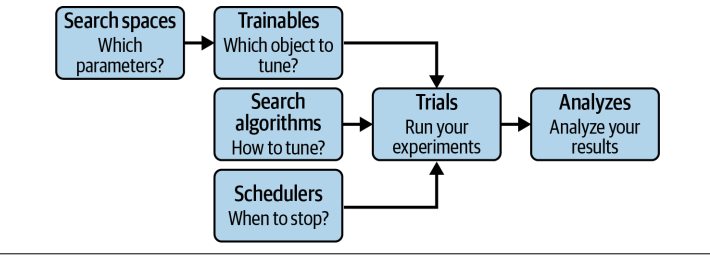

现在我们来聊聊如何更高效地调优这些模型，特别是当模型变得复杂，或者我们希望在有限的资源和时间下获得最佳性能时，超参数优化就显得尤为重要。今天，我们就来介绍一个强大的工具——Ray Tune。

为什么我们要花大力气去调优超参数？因为很多时候，仅仅选择一个算法，比如DQN，是远远不够的。就像我们之前在RLib里看到的，即使使用了DQN，也需要配置像rollout workers数量这样的参数。这些参数，我们称之为超参数，它们直接决定了模型的性能上限。尤其是在面对复杂任务时，模型的参数空间往往非常庞大，可能包含成百上千个参数，而且它们之间可能还相互影响。如果只是简单地随机尝试，或者凭感觉调整，那效率太低了，而且很可能找不到最优解。

我们的目标是找到那个最佳的超参数组合，让模型性能达到顶峰，同时尽可能地节省宝贵的计算资源和时间。最简单粗暴的方法是什么？就是随机搜索。每次随机抽取一组参数，跑一遍，然后记录结果。听起来不错，但实际操作起来问题多多。首先，效率极低。参数空间一旦变大，组合数量就呈指数级增长，你可能要跑成千上万次才能找到一个不错的组合。其次，它很容易陷入局部最优，找不到全局最优解。更重要的是，对于很多机器学习任务，尤其是深度学习，训练一次模型可能需要很长时间，比如几个小时甚至几天。在这种情况下，随机搜索简直就是一场灾难，你可能还没找到好参数，时间就耗尽了。

面对随机搜索的种种困境，我们该怎么办呢？这就需要 Ray Tune 登场了。**Ray Tune 是一个专门为分布式超参数优化设计的框架。它的核心优势在于分布式并行计算。**它利用 Ray 集群，可以将大量的实验任务并行分配到不同的节点上同时运行，极大地缩短了整体的优化时间。这就像把一个大任务拆分成多个小任务，然后交给多台机器同时处理，效率自然就上去了。同时，**Tune 不仅支持随机搜索，还集成了非常丰富的算法库，比如 Hyperopt、Optuna 等，提供了贝叶斯优化、网格搜索等多种策略**，你可以根据具体问题选择合适的算法。而且，Tune 的 API 设计得非常友好，上手简单，还提供了回调、检查点等实用功能，让整个超参数优化实验的管理变得更加高效和可控。

要理解 Tune 的工作原理，我们需要掌握几个核心概念。



- Search spaces，你可以把它想象成一个地图，标明了我们想要探索的参数有哪些，以及它们的取值范围和采样方式。比如，我们可以用 tune.uniform 来指定一个参数在0到1之间均匀取值，用 tune.randint 指定一个整数范围。这个空间定义了我们探索的范围。
- Trainables，也就是我们常说的目标函数。这个函数就是用来评估我们当前参数组合下模型性能的。在 Tune 的世界里，我们只需要定义一个函数，接收一个参数配置字典，然后返回一个评估结果，比如损失值或者准确率。Tune 会自动处理并行执行，我们不需要手动加 ray.remote 装饰器。
- Trials，它代表了我们针对每个参数组合进行的一次完整实验。Tune 会自动调度这些试运行，利用集群资源并行执行。每个试运行都会记录下它的参数配置和最终的评估结果。当我们调用 tune.run 完成所有试运行后，会得到一个分析结果，英文是 Analyses，它汇总了所有试运行的数据，包括每个试运行的参数、结果、日志等等。我们可以利用这个分析结果来找到最佳的超参数组合，甚至可以进行可视化分析。
- Schedulers，这个组件负责控制试运行的执行策略。比如，它可以决定何时启动新的试运行，何时停止那些看起来不太有希望的试运行。通过调度器，我们可以实现更智能的优化，比如早期停止，从而显著提升效率。

把这些组件串起来看，Tune 的工作流程就非常清晰了。我们

- 首先定义好搜索空间，告诉 Tune 我们要探索哪些参数。
- 然后，我们定义一个可训练对象，也就是评估函数，用来衡量参数好坏。
- Tune 会根据搜索空间和评估函数，生成一系列的试运行，也就是不同的参数组合。
- 调度器会负责管理这些试运行的执行，比如决定哪些先跑，哪些后跑，或者哪些跑得不好就赶紧停止。
- 最后，所有试运行结束后，Tune 会提供一个分析结果，让我们能够找到那个表现最好的参数组合。

整个过程，Tune 的核心就是自动化、并行化和智能化。刚才我们提到了搜索算法，Tune 默认支持随机搜索，但显然不是最聪明的。除了随机搜索，还有网格搜索，它会穷举所有可能的参数组合，虽然系统性好，但在高维空间里，计算量会爆炸，基本不可行。真正强大的是贝叶斯优化。它不是盲目地随机采样，而是基于之前试运行的结果，不断学习和调整探索策略，倾向于探索那些看起来更有希望的区域，从而更快地收敛到最优解。

Tune 内置了多种贝叶斯优化算法，比如 TPE。更厉害的是，Tune 还集成了大量的第三方优化库，像 Hyperopt、Optuna、Ax、SigOpt 等等。这意味着你可以轻松地利用这些强大的工具，而不需要自己再去学习它们的 API，直接在 Tune 的框架下就能使用它们。

调度器是 Tune 中另一个非常重要的组成部分，它能显著提升实验效率。一个核心思想是早期停止。想象一下，我们正在训练一个模型，如果发现某个参数组合下的性能提升非常缓慢，甚至停滞不前，那我们还有必要继续跑下去吗？当然没必要。调度器就可以监测到这种情况，及时停止这个试运行，把宝贵的资源比如GPU、CPU时间分配给更有潜力的参数组合。

HyperBand 是一个非常流行的调度器，它能动态地调整每个试运行的训练时间，让资源分配更加智能。除了 HyperBand，Tune 还提供了 Median Stopping Rule、ASHA、PBT、PB2 等多种调度器，你可以根据具体任务和数据集的特点，选择最合适的调度器来加速你的超参数优化过程。除了基本的搜索、调度和分析，Tune 还提供了一些非常实用的高级功能。

- 首先是资源管理。你可以精确地控制每个试运行需要多少 CPU、GPU 以及内存，甚至可以使用小数 GPU，比如 0.5 GPU，实现资源的共享。你还可以通过 max_concurrent_trials 参数来限制同时运行的试运行数量，避免资源过度占用。
- 其次是回调机制。你可以自定义一些回调函数，比如在每次试运行结果更新时，或者试运行出错时，执行一些操作，比如记录日志、打印信息、或者进行更复杂的监控。这大大增强了 Tune 的灵活性。
- 最后是检查点。Tune 会自动保存实验的中间状态，这样即使实验中途中断，比如断电或者网络问题，你也可以通过 resume 参数轻松地从上次保存的位置继续运行，保证了实验的可靠性和可重复性。

理论讲完了，我们来看几个实际应用。首先是 Ray RLib。由于 RLLib 是 Ray 生态的一部分，它和 Tune 的集成非常自然。我们只需要在 tune.run 的第一个参数里，直接传入 RLLib 的算法名称，比如 DQN，或者对应的 Trainer 类，Tune 就能自动识别并进行优化。

配置文件 config 就是我们熟悉的 RLLib 配置，但我们可以用 Tune 的搜索空间语法，比如 tune.uniform 或者 tune.choice，来定义需要优化的超参数，比如学习率 lr 或者训练批次大小 train_batch_size。

Tune 会自动帮你尝试不同的组合，找到最佳的 DQN 参数。你看这个例子，我们只需要几行代码，就能让 Tune 去优化 CartPole 环境下的 DQN 算法。

```py
from ray import tune

analysis = tune.run(
    "DQN",
    metric="episode_reward_mean",
    mode="max",
    config={
        "env": "CartPole-v1",
        "lr": tune.uniform(1e-5, 1e-4),
        "train_batch_size": tune.choice([10000, 20000, 40000]),
    },
)
```

除了强化学习，Tune 在监督学习领域也大有用武之地。比如，我们常用的深度学习框架 Keras。Tune 对 Keras 的支持也非常完善。你可以直接使用 TuneReportCallback，这是一个 Keras 的回调函数，它可以自动地把 Keras 模型训练过程中产生的指标，比如准确率，报告给 Tune。这样，你就可以在 Tune 的框架下，轻松地优化 Keras 模型的超参数了。

在这个例子中，我们用 Tune 来优化一个经典的 MNIST 手写数字识别模型。

```py
from tensorflow.keras.models import Sequential
from tensorflow.keras.layers import Flatten, Dense, Dropout
from ray.tune.integration.keras import TuneReportCallback


def objective(config):
    (x_train, y_train), (x_test, y_test) = load_data()
    model = Sequential()
    model.add(Flatten(input_shape=(28, 28)))
    model.add(Dense(config["hidden"], activation=config["activation"]))
    model.add(Dropout(config["rate"]))
    model.add(Dense(10, activation="softmax"))

    model.compile(loss="categorical_crossentropy", metrics=["accuracy"])
    model.fit(x_train, y_train, batch_size=128, epochs=10,
              validation_data=(x_test, y_test),
              callbacks=[TuneReportCallback({"mean_accuracy": "accuracy"})])
```

我们想调整的是隐藏层的激活函数、Dropout 率以及隐藏层的神经元数量。通过 Tune 和 Hyperopt 的结合，我们可以高效地找到最佳的超参数组合，提升模型的分类精度。

```py
from ray import tune
from ray.tune.suggest.hyperopt import HyperOptSearch

initial_params = [{"rate": 0.2, "hidden": 128, "activation": "relu"}]
algo = HyperOptSearch(points_to_evaluate=initial_params)

search_space = {
    "rate": tune.uniform(0.1, 0.5),
    "hidden": tune.randint(32, 512),
    "activation": tune.choice(["relu", "tanh"])
}


analysis = tune.run(
    objective,
    name="keras_hyperopt_exp",
    search_alg=algo,
    metric="mean_accuracy",
    mode="max",
    stop={"mean_accuracy": 0.99},
    num_samples=10,
    config=search_space,
)
print("Best hyperparameters found were: ", analysis.best_config)
```

总结一下，Ray Tune 是一个非常强大且易用的分布式超参数优化工具。它功能丰富，提供了从搜索空间、可训练对象到调度器、分析结果的完整工作流，同时又足够灵活，允许你自定义资源、回调和检查点。它的核心优势在于分布式并行计算能力，能够显著加速优化过程，尤其是在处理大规模、复杂模型时，这一点尤为重要。此外，Tune 的生态非常完善，它集成了众多主流的优化算法和机器学习框架，而且还在不断发展壮大。对于需要进行超参数优化的机器学习和强化学习任务来说，Ray Tune 绝对是一个值得考虑的优秀选择。关于 Ray Tune 的核心概念和应用，我们就先介绍到这里。大家有什么问题或者想法，欢迎提出来一起交流。