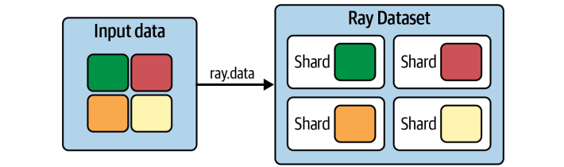
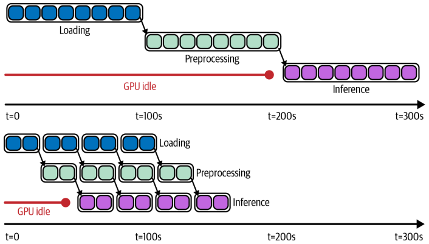
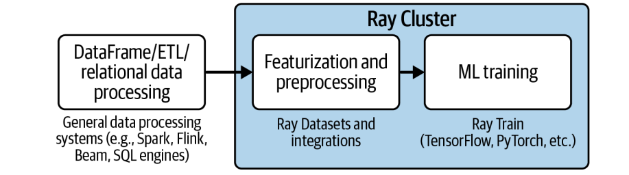
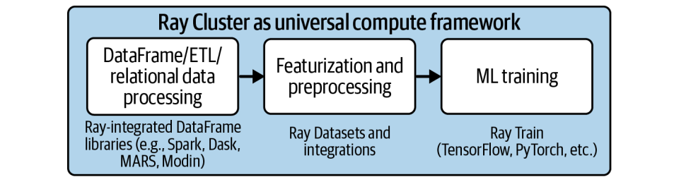

光有好的模型还不够，机器学习的基石是什么？毫无疑问，是数据！数据的质量和处理效率直接决定了模型的上限。因此，今天我们将聚焦于Ray生态系统中的数据处理核心组件——Ray Data。

Ray Data的核心是Ray Datasets。你可以把它想象成**Ray集群内部数据流动的通用语言和标准接口**。它不是要取代Spark或Hadoop，而是专注于提供一个轻量级、高性能的框架，用于数据的加载、转换和传递。它**底层巧妙地利用了Apache Arrow**，这是一种高效的列式存储格式，使得与NumPy、Pandas等库的交互变得顺畅。

更重要的是，数据集本质上是由一系列数据块组成的，这些数据块存储在Ray的共享内存对象存储中，这意味着数据在不同任务和Actor之间传递时，几乎不需要复制，极大地提升了效率和可扩展性。这就像搭积木一样，Ray Datasets就是那个最基础、最通用的积木块，让各种Ray库都能方便地拼接起来。

Ray Datasets之所以强大，主要归功于它的两大核心优势：灵活性和性能。

- 首先是灵活性。它能处理各种格式的数据，无论是CSV、JSON、Parquet还是自定义格式，它都能应对。更重要的是，它能与像Dask on Ray这样的外部库无缝集成，让你在Ray的框架下也能享受到Dask的高级数据处理能力。而且，由于数据是通过对象引用传递的，而不是实际复制，这大大减少了内存开销，使得数据在不同计算节点间高效流转。

- 其次是性能，尤其是在机器学习场景下。它原生支持GPU加速，能够利用流水线处理技术，让数据处理阶段重叠执行，而不是傻等上一个阶段完成，这大大提高了吞吐量。还有全局随机shuflle，这对训练模型至关重要。

总而言之，Ray Datasets是为那些需要高效处理大规模数据的机器学习和数据密集型应用量身打造的。好，理论讲完了，我们来看点实际操作。

```py
import ray

# Create a dataset containing integers in the range [0, 10000).
ds = ray.data.range(10000)

# Basic operations: show the size of the dataset, get a few samples, print the schema.
print(ds.count())  # -> 10000
print(ds.take(5))  # -> [0, 1, 2, 3, 4]
print(ds.schema())  # -> <class 'int'>
```

创建一个最简单的Dataset，就像这样：ds等于ray.data.range(10000)。它创建了一个包含0到9999整数的Dataset。然后，你可以用几个简单的命令来了解它：ds.count()告诉你总共有多少条记录，take(5)给你看几个样本，ds.schema()则显示了数据的类型。

```py
# Save the dataset to a local file and load it back.
ray.data.range(10000).write_csv("local_dir")
ds = ray.data.read_csv("local_dir")
print(ds.count())
```

当然，实际工作中数据通常来自外部存储。Ray Datasets提供了非常方便的读写接口，比如write_csv和read_csv。你可以把数据写入本地文件，也可以直接读取S3上的数据。它会自动处理并行读写，充分利用集群资源。这就像给数据装上了一个高速通道，让它们可以快速进出你的计算流程。

有了数据集，我们自然要进行各种变换。Ray Datasets提供了丰富的内置操作，让你可以像搭积木一样组合数据。

- unions 将两个数据集合并成一个更大的数据集。
- filter 操作可以根据你指定的条件过滤掉不需要的数据。
- sort 操作可以按某个字段对数据进行排序。

这些操作都非常直观，如果你熟悉Spark RDD或者类似的概念，会觉得非常熟悉。它们都是基于函数式编程思想，链式调用，非常简洁。当然，这只是冰山一角，还有 groupby、sum、min 等等聚合操作，甚至可以自定义聚合函数。

在深入数据转换之前，我们得理解一个关键概念：数据块。数据块是构成数据集的最小单元，所有的计算操作，比如map、filter，都是在这些块上并行执行的。块的数量直接影响到并行计算的效率。如果块数太少，比如只有10个，那可能就只有10个任务在跑，资源利用不充分；如果块数太多，比如每个块只有10条数据，那每个操作的开销都很大，反而会降低效率。所以，找到一个合适的块数很重要。



Ray Datasets提供了 repartition 方法，让你可以精确控制数据块的数量。比如，你可以把一个合并后块数增加的数据集，重新调整回原来的块数，以保持最佳的并行度。这就像调整生产线的节奏，确保每个环节都能高效运转。前面我们处理的数据比较简单，都是整数。

但在实际应用中，数据通常是结构化的，比如包含用户ID、商品名称、价格等等。这时候，我们需要定义数据模式，也就是Schema。**Schema告诉你数据有哪些列，每列是什么类型的**。Ray Datasets支持从多种来源创建带Schema的Dataset。最简单的方式是用from_items，传入一个Python字典的列表，它会自动推断出Schema。你也可以直接从Pandas DataFrame创建，或者从Parquet文件读取。

```
ds = ray.data.from_items([{"id": "abc", "value": 1}, {"id": "def", "value": 2}])
print(ds.schema())  # -> id: string, value: int64
```

得益于Arrow格式的支持，Dataset可以在这些不同类型的结构化数据之间轻松转换，比如ds.to_pandas()或者ds.to_arrow()。这保证了数据在不同处理阶段的兼容性，就像一个通用的翻译器，让不同格式的数据都能顺畅交流。

```
pandas_df = ds.to_pandas()  # pandas_df will inherit the schema from our Dataset.
```

Ray Datasets的强大之处不仅在于它能处理各种数据，更在于它能让你在上面高效地进行各种计算。最基础的计算方式是 map，它会将你提供的函数应用到每个数据项上。但如果你的函数是向量化的，比如在NumPy上运行，那用 map_batches 就更高效了。**map_batches 一次处理一批数据块，利用了向量化的计算优势，速度更快**。

对于需要GPU加速的场景，比如深度学习推理，map_batches 结合 Actor 模式就派上用场了。你可以创建一个 Actor 类，它负责加载模型到GPU上，然后在处理每个数据块时调用这个 Actor。由于 **Actor 是长驻内存的**，模型加载只需要一次，后续的推理计算就能充分利用GPU的性能。这就像给每个GPU分配一个专属的工人，负责处理一批批的数据。

```py
import numpy as np

ds = ray.data.range(10000).map_batches(lambda batch: np.square(batch).tolist())
ds.take(5)  # -> [0, 1, 4, 9, 16]
```

现在我们来聊聊一个非常重要的优化技巧：Dataset Pipeline。想象一下，你有一个数据处理流程，比如读取数据、预处理、GPU推理、再写入。如果用传统的串行方式，每个步骤完成后才开始下一个，那中间的资源，比如CPU、GPU、网络带宽，就会有大量闲置时间。这就像工厂流水线，如果每个工序都等上一个工序完全做完，那效率肯定不高。

而 Dataset Pipeline 就是解决这个问题的利器。它通过 window 方法，让数据处理变成流水线模式：**读取一批数据，同时开始预处理，预处理完成后，GPU推理开始，同时下一批数据的预处理也在进行，以此类推**。这样，各个阶段的资源就能重叠使用，最大限度地减少等待时间，提高整体吞吐量。这对于需要处理大量数据，特别是计算密集型任务，比如深度学习推理，意义重大。它能显著提升效率，降低计算成本。



理论讲了这么多，我们来看一个实际应用：并行训练多个分类器。这在超参数调优中非常常见。比如，我们要尝试不同的正则化参数 alpha，训练多个模型。怎么做？

```py
X_train, X_test, Y_train, Y_test = train_test_split(
    *datasets.make_classification()
)

train_ds = ray.data.from_items(list(zip(X_train, Y_train)))
shards = (train_ds.repeat(10)
          .random_shuffle_each_window()
          .split(len(workers), locality_hints=workers))

ray.get([worker.train.remote(shard) for worker, shard in zip(workers, shards)])
```

首先，用 Ray Datasets 加载并预处理好数据。然后，关键一步：数据分片。对于一个大型数据集，我们不可能把所有数据都加载到一个机器上训练，所以需要把数据分成几个小块，每个块分配给一个训练Worker。每个Worker负责训练一个模型，比如使用不同的alpha值。**Ray Datasets 的优势在于，它可以让多个 Worker 共享同一个数据集，只需要加载一次数据，然后分发数据块，这样就避免了重复加载数据的开销。**

同时，它还能轻松实现数据分片和全局随机洗牌，保证每个Worker都能拿到训练所需的随机数据子集。这就像一个高效的调度中心，把数据和任务合理分配给各个工人。虽然 **Ray Datasets 提供了强大的数据处理能力，但它的定位是专注于最后一公里的处理，比如在模型训练前的数据清洗和特征工程**。



对于更复杂的数据分析任务，比如复杂的SQL查询、复杂的DataFrame操作，Ray Datasets 可能就显得力不从心了。幸运的是，Ray 生态系统提供了丰富的外部库集成，弥补了这一不足。比如 Dask on Ray，它让你在 Ray 集群上运行 Dask 的任务图，享受 Dask 的高级数据处理能力，同时又利用 Ray 的调度和共享内存。还有 RayDP，也就是 Spark on Ray，让你在 Ray 上运行 Spark 的作业。Modin 则提供了 Pandas 的分布式版本。这些集成就像给 Ray Datasets 装上了各种高级工具，让它在处理复杂数据时也能游刃有余，同时又能保持 Ray 的高效和可扩展性。

构建一个完整的机器学习管道，从数据收集到模型训练再到部署，往往是一个复杂的过程。传统方法通常需要将不同的系统，比如 ETL 系统、数据仓库、Spark、TensorFlow 等，通过 Airflow 等工作流引擎串联起来。这不仅增加了系统的复杂性，而且在每个阶段之间，都需要将数据写入外部存储，然后再读取，这带来了巨大的开销和延迟。



而 Ray 的优势在于，它允许你用一个 Python 脚本，构建一个端到端的 ML 管道。Ray Datasets 就是这个管道中的核心粘合剂，它负责高效地加载、预处理、转换数据，并在不同的计算阶段，比如特征工程、模型训练、推理，之间传递数据，而且大部分数据都保持在内存中。这大大简化了流程，降低了延迟，提高了效率。你可以把整个流程想象成一个高度集成的工厂，数据在其中顺畅流转，无需频繁地进出仓库。

今天我们一起探索了 Ray Data 的核心组件 Ray Datasets，以及它如何利用 Ray 的强大能力，为数据处理和机器学习应用带来变革。它提供了可扩展、灵活的数据处理能力，与 Ray 生态系统深度集成，支持 GPU 加速、流水线处理和全局随机洗牌等关键特性，极大地提升了数据处理的效率和性能。通过 Ray Datasets，我们可以更高效地构建和部署机器学习管道，加速迭代，获得更好的模型，最终创造更大的商业价值。这不仅是技术的进步，更是我们工作方式的革新。