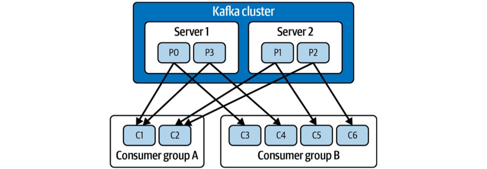

流式处理就是数据一来，咱们就得赶紧处理，不能攒批再算。这里的实时不是指瞬间完成，而是要在数据产生的那一刻，或者非常接近那个时间点，就做出响应。这种处理方式，我们称之为流式处理。

## 流式处理的应用场景

流式处理到底能干啥？它应用场景非常广泛。

- 日志分析。应用每天产生海量日志，边生产边分析，一旦发现异常，比如某个服务崩溃了，或者有安全事件发生，立刻就能报警，快速定位问题根源，大大缩短故障恢复时间。

- 金融交易，流式处理就能实时监控每一笔交易，结合用户行为模式、地理位置、交易金额等多维度信息，通过规则引擎或者机器学习模型，秒级识别出异常交易。

- 网络安全。实时监控网络流量、系统日志、用户登录行为等等。通过建立正常的安全基线，任何偏离这个基线的异常活动，比如大量未授权访问尝试、异常的数据包传输，都能被流式系统迅速捕捉到。
- 物流行业。GPS信号、传感器数据源源不断地传入系统，通过流式处理，可以实时计算最优路径，避开拥堵路段，动态调整配送计划。这不仅提高了效率，还能降低油耗和运营成本。
- 物联网IoT。无数的传感器设备，比如工厂里的机器、城市里的路灯、农田里的土壤湿度监测器，它们都在不停地产生数据。
- 推荐引擎。每一次点击、浏览、搜索，都被实时记录下来，形成你的行为数据流。推荐系统实时分析这些数据，结合协同过滤、深度学习等算法，不断更新你的兴趣画像，然后给你推送最相关的商品或内容。

## Ray如何实现流式处理

了解了流式应用的重要性，我们来看看如何在 Ray 中实现它们。目前主要有两种方式：

1. 利用 Ray 提供的强大底层组件，比如 Actors、Task 并行、共享内存等，自己动手构建一套定制化的流式处理框架。这种方式灵活性高，但开发量也相对较大。

2. 将 Ray 与现有的成熟流式引擎集成，比如 Apache Flink，通常会借助 Kafka 这样的消息中间件来连接数据源和处理逻辑。

Ray 的定位不是要做一个独立的、功能全面的流式系统，而是提供一个强大的计算平台，让开发者可以更方便地构建自己的流式应用。既然提到了集成，那为什么 Kafka 成为了流式应用中最受欢迎的消息中间件之一呢？Kafka 能够以惊人的吞吐量处理海量数据流，同时保证数据的持久化存储，这意味着你可以随时回溯历史数据进行分析。而且，Kafka 的水平扩展性非常好，可以通过增加 Broker 节点轻松应对数据量的增长。更重要的是，围绕 Kafka 已经形成了一个非常成熟的生态系统，各种工具和库层出不穷。

## kafka和ray集成

当然，今天我们不会深入探讨 Kafka 的所有细节，只关注那些与 Ray 集成时最相关的特性。很多人把 Kafka 当作消息队列，比如 RabbitMQ，但其实它**本质上是一个分布式日志系统**。


它不像传统的队列那样，消息发出去就没了，Kafka **把每一条消息都当作一个记录，按顺序追加写入到日志文件中**。每条记录可以包含 Key 和 Value，当然两者都是可选的。生产者总是往日志的末尾写入新消息。而消费者呢，它可以选择从哪个位置开始读取，这个位置叫做 Offset。这意味着，消费者可以读取任意历史消息，也可以只读最新的消息。

这种**基于日志**的设计，带来了几个关键区别。

- 消息的生命周期。传统队列里的消息，一旦被消费者成功消费，通常就从队列里删除了，是临时的。而 Kafka 的消息是持久化的，会一直保存在磁盘上，直到达到配置的保留策略。这使得 Kafka 支持消息回溯。

- 消费者管理。在队列系统里，通常是 Broker 来管理消费者的 Offset，告诉消费者下次该从哪里读。但在 Kafka 里，Offset 是由消费者自己负责管理的。Kafka 可以支持大量的消费者同时读取同一个 Topic，因为每个消费者只需要记录自己的 Offset 即可，互不干扰。

Kafka 也像消息队列一样，用 Topic 来组织数据。但 Kafka 的 **Topic 是一个纯粹的逻辑概念**，它下面实际上是由多个 Partition 组成的。你可以把 Partition 理解为 Topic 的物理分片。为什么要这样做？主要是为了实现水平扩展和并行处理。**每个 Partition 内部的数据是有序的，但不同 Partition 之间的数据是无序的**。生产者写入数据时，会根据一定的策略选择写入哪个 Partition。那么，生产者是怎么决定把消息写到哪个 Partition 的呢？主要有两种情况。

- 如果你没有指定 Key，Kafka 默认会采用轮询的方式，均匀地把消息分配到不同的 Partition。这样可以保证负载均衡。
- 你给消息指定一个 Key，比如用户的 ID 或者订单号。Kafka 默认会使用 Key 的 Hash 值来决定写入哪个 Partition。这样做的好处是，同一个 Key 的所有消息，都会被写入同一个 Partition，保证了该 Key 下消息的顺序性。
- 如果有特殊需求，也可以实现自定义的 Partitioning 策略。

记住，Partition 内部消息是有序的，跨 Partition 的消息是无序的。有了 Partition，怎么让消费者高效地读取呢？这就引出了 Consumer Group 的概念。你可以把多个消费者组成一个组，让它们共同消费同一个 Topic 的消息。Kafka 会把这个 Topic 的所有 Partition 分配给这个 Consumer Group 里的消费者。



比如，一个 Topic 有 10 个 Partition，你在一个 Group 里放了 5 个消费者，那么 Kafka 会把每个消费者分配到 2 个 Partition。这样，每个消费者就可以并行地从自己的 Partition 里读取消息，大大提高了整体的消费速度。所以，**想提升消费能力，要么增加消费者数量，要么增加 Partition 数量**。Kafka 提供了丰富的 API 来支持各种操作。主要有五大类：

- Producer API 用来发送消息；
- Consumer API 用来读取消息；
- AdminClient API 用来管理 Topic、Broker 等元数据；
- Streams API 提供了更高级的流处理能力，可以直接在 Kafka 上做转换；
- Connect API 则是用来连接 Kafka 和外部系统的，比如数据库、搜索引擎等。

Kafka 本身只关心字节数组，所以我们需要把实际的数据结构序列化成字节数组才能发送，这个过程叫做 Marshaling。常用的格式有很多，比如 Avro、Protobuf、JSON、甚至是 Python 的 Pickle。选择哪种格式取决于你的具体需求，比如性能、消息大小、是否需要 Schema 定义、扩展性以及语言兼容性。另外要注意一点，**Kafka 本身不保证消息的唯一性**，也就是说，可能会出现重复消息。所以，确保消息只被处理一次的责任落在了消费者身上，通常需要消费者自己记录 Offset 并提交。

### 示例代码

现在我们把 Kafka 和 Ray 结合起来。为什么[用 Ray Actors 来封装 Kafka 的 Consumer 和 Producer](https://github.com/scalingpythonml/scalingpythonml/blob/master/ray_examples/streaming/ray_with_kafka/ray_kafka.py) 呢？

- 对于 Kafka Consumer，它通常需要在一个无限循环里运行，不断拉取消息，并且需要记住自己已经读到哪里了，也就是维护 Offset。这正好符合 Ray Actor 的特点：一个 Actor 就是一个独立的状态服务。所以，把 Kafka Consumer 实现为一个 Ray Actor，非常自然。
- 对于 Producer，虽然它本身不需要维护状态，但把它放在一个 Actor 里，我们可以方便地异步调用 produce 方法，向任何 Kafka Topic 发送消息，而无需为每个 Topic 创建一个独立的 Producer 实例，简化了管理。

这是一个简单的 Kafka Producer Actor 的实现。

```py
@ray.remote
class KafkaProducer:
    def __init__(self, server: str = 'localhost:9092'):
        from confluent_kafka import Producer
        conf = {'bootstrap.servers': server}
        self.producer = Producer(**conf)

    def produce(self, data: dict, key: str = None, topic: str = 'test'):

        def delivery_callback(err, msg):
            if err:
                print(f'Message failed delivery: {err}')
            else:
                print(f'Message delivered to topic {msg.topic()} partition '
                      f'{msg.partition()} offset {msg.offset()}')

        binary_key = None
        if key is not None:
            binary_key = key.encode('UTF8')
        self.producer.produce(topic=topic, value=json.dumps(data).encode('UTF8'),
                              key=binary_key, callback=delivery_callback)
        self.producer.poll(0)

    def destroy(self):
        self.producer.flush(30)
```

它使用了 confluent_kafka 库，这是 Python 中常用的 Kafka 客户端。

- 在 init 方法里，我们根据 broker 地址初始化一个 Kafka Producer 对象。produce 方法就是我们用来发送消息的接口，它接收数据、可选的 key 和 topic 名称。内部，它会调用 Kafka Producer 的 produce 方法，这里我们用了 json.dumps 把 Python 字典序列化成 JSON 字符串，再 encode 成字节。
- delivery_callback 是一个回调函数，用来处理消息发送成功或失败的情况。
- destroy 方法在 Actor 销毁前调用，确保所有待发送的消息都被 flush 出去。

这是 Kafka Consumer Actor 的实现。

```py
@ray.remote
class KafkaConsumer:
    def __init__(self, callback, group: str = 'ray', server: str = 'localhost:9092',
                 topic: str = 'test', restart: str = 'latest'):
        from confluent_kafka import Consumer
        from uuid import uuid4
        # Configuration
        consumer_conf = {'bootstrap.servers': server,   # bootstrap server
                 'group.id': group,                      # group ID
                 'session.timeout.ms': 6000,            # session tmout
                 'auto.offset.reset': restart}          # restart

        # Create Consumer instance
        self.consumer = Consumer(consumer_conf)
        self.topic = topic
        self.callback = callback
        self.id = str(uuid4())

    def start(self):
        self.run = True
        def print_assignment(consumer, partitions):
            print(f'Consumer: {self.id}')
            print(f'Assignment: {partitions}')

        # Subscribe to topics
        self.consumer.subscribe([self.topic], on_assign = print_assignment)
        while self.run:
            msg = self.consumer.poll(timeout=1.0)
            if msg is None:
                continue
            if msg.error():
                print(f'Consumer error: {msg.error()}')
                continue
            else:
                # Proper message
                self.callback(self.id, msg)

    def stop(self):
        self.run = False

    def destroy(self):
        self.consumer.close()
```

同样使用了 confluent_kafka 库。

- init 方法里，除了 broker 地址，还需要配置 group.id、session.timeout.ms、auto.offset.reset 等参数。group.id 是 Consumer Group 的标识，auto.offset.reset 决定了消费者启动时没有 Offset 或者 Offset 不存在时的行为，比如 latest 表示从最新的消息开始读。

- start 方法启动了一个无限循环，使用 consumer.poll 拉取消息。如果收到消息，就调用传入的 callback 函数进行处理。
- stop 方法通过设置 run 为 False 来停止循环。
- destroy 方法则关闭 Kafka Consumer 连接。

测试函数

```py
def print_message(consumer_id: str, msg):
    print(f"Consumer {consumer_id} new message: topic={msg.topic()}  "
          f"partition= {msg.partition()}  offset={msg.offset()} "
          f"key={msg.key().decode('UTF8')}")
    print(json.loads(msg.value().decode('UTF8')))
    
# Start Ray
ray.init()

# Start consumers and producers
n_ = 5     # Number of consumers
consumers = [KafkaConsumer.remote(print_message) for _ in range(n_consumers)]
producer = KafkaProducer.remote()
refs = [c.start.remote() for c in consumers]

# publish messages
user_name = 'john'
user_favorite_color = 'blue'

try:
    while True:
        user = {
            'name': user_name,
            'favorite_color': user_favorite_color,
            'favorite_number': randint(0, 1000)
        }
        producer.produce.remote(user, str(randint(0, 100)))
        sleep(1)

# end gracefully
except KeyboardInterrupt:
    for c in consumers:
        c.stop.remote()
finally:
    for c in consumers:
        c.destroy.remote()
    producer.destroy.remote()
    ray.kill(producer)
```

额外的阅读材料

- https://www.anyscale.com/blog/serverless-kafka-stream-processing-with-ray