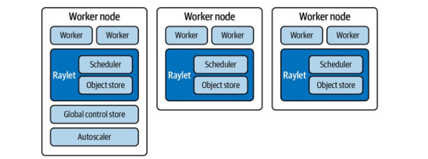
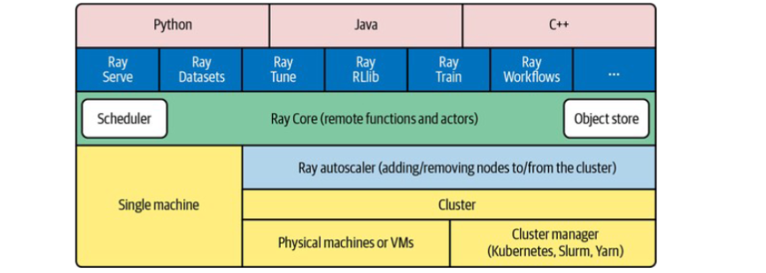
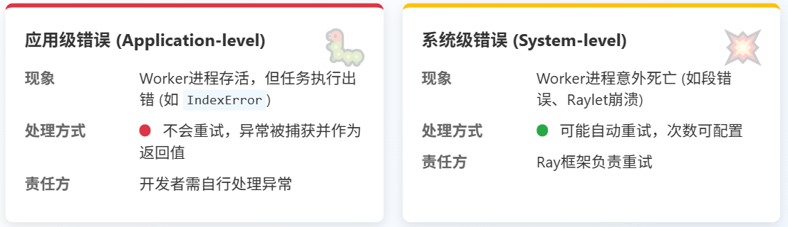

为什么我们需要 Ray？很简单，因为我们的数据和模型越来越大，单机跑不动了！想想看，十年前可能一台笔记本就能搞定很多机器学习任务，现在呢？大模型、海量数据，动辄几百上千个节点。传统的分布式系统，像搭积木一样复杂，运维起来头大。**Ray 的目标就是打破这个壁垒，让开发者能更专注于写代码，而不是跟服务器、网络、调度器较劲。**

Ray 到底牛在哪儿？

- 它是通用型选手，不只做大数据分析，机器学习、强化学习、各种并发模型都能玩转。
- API 设计非常友好，Python 语言本身就降低了门槛，你不需要成为分布式系统专家也能上手。
- 弹性伸缩能力，就像云服务一样，需要多少资源就给你多少，用完自动回收，省心省力。**底层是高性能的 C++ 实现**，保证了速度。
- 能自动处理各种故障，让你的程序更稳定可靠。

Ray 不仅仅是一个调度器，它构建了一个庞大的生态系统。核心部分包括**强大的调度器、高效的对象存储**，以及**独特的 Actor 模型**。



更重要的是，它上面还有一层丰富的应用层库，比如 

- Ray Serve 用来做高性能的在线服务部署
- Ray Datasets 处理大规模数据集
- Ray Tune 帮你快速找到最佳的超参数组合
- Ray RLlib 加速强化学习研究
- Ray Train 简化分布式训练流程
- Ray Workflows 来编排复杂的工作流

可以说，从数据处理到模型训练再到服务部署，Ray 都能提供一站式的解决方案。



提到分布式计算，很多人会想到 Spark。那 Ray 和 Spark 是什么关系呢？

| 特性           | Ray                        | Spark                                      |
| :------------- | :------------------------- | :----------------------------------------- |
| **适用场景**   | 计算密集型任务，ML 任务    | 数据密集型任务，大数据分析                 |
| **任务开销**   | 低                         | 相对较高                                   |
| **状态管理**   | Actor 模型，支持分布式状态 | 中心化状态管理                             |
| **扩展性**     | 更灵活，可扩展到更多场景   | 成熟的大数据生态，但扩展性受限             |
| **学习曲线**   | 相对平缓，Python API 易用  | 相对陡峭，需要掌握 Spark 生态和 Scala/Java |
| **社区活跃度** | 快速发展，社区活跃         | 成熟稳定，社区庞大                         |

它们更像是互补而非替代。

Spark 在大数据处理领域深耕多年，生态成熟，擅长处理结构化数据，比如 SQL 查询、批处理。而 Ray 更侧重于计算密集型任务，尤其是在机器学习领域，它的 Actor 模型对状态管理和并发控制更友好，任务开销也更低。很多时候，最佳实践是**先用 Spark 做数据清洗，再用 Ray 做 ML 训练**，两者结合威力更大。

Ray 的应用场景非常广泛。在机器学习领域，无论是训练大型模型、进行超参数调优，还是探索强化学习，Ray 都能提供强大的支持。对于需要处理海量数据的场景，比如日志分析、特征工程、ETL 流程，Ray 的分布式能力也能派上大用场。实时计算方面，它可以处理流数据、构建在线服务，甚至用于实时推荐系统。此外，在科学计算、模拟仿真、游戏开发、金融科技等领域，凡是涉及到大规模并行计算、需要高性能和易用性的场景，Ray 都能发挥重要作用。可以说，只要你的**问题是需要规模化解决的**，Ray 就值得考虑。

说了这么多，怎么开始用 Ray 呢？安装其实很简单，大部分情况下，pip install ray 就搞定了。如果你喜欢用 Conda，也可以在 Conda 环境里安装。对于 ARM 架构的用户，比如 M1 Mac 或者树莓派，可能需要稍微麻烦一点，从源码编译，但官方文档有详细的指导。最关键的是，Ray 支持本地模式。只需要在你的代码里加一句 ray.init，它就能在你自己的机器上启动一个单机 Ray 实例。这意味着你可以完全不用关心服务器集群，直接在本地开发、测试、验证逻辑。等熟悉了再把它部署到云端或者更大的集群上，代码几乎不需要改动。

Ray 最基础也是最核心的概念之一就是 Remote 函数。你想让一个函数在后台运行，或者并行执行，只需要给它加上 @ray.remote 装饰器。调用的时候，不是直接调用函数名，而是调用 remote 方法，这样会立刻返回一个 Future 对象，告诉你这个任务已经提交了，但结果还没出来。你需要用 ray.get 来获取这个 Future 的最终结果。

```py
@ray.remote
def remote_hi():
  import os
  import socket
  return"Running on {socket.gethostname()} in pid {os.getpid()}"

future = remote_hi.remote()
result = ray.get(future)
print(result)
```

用 ray.remote 装饰一个类，这个类的每个实例就是一个 Actor。每个 Actor 都有自己的独立内存空间，可以保存状态，比如计数器、缓存等等。当你调用 Actor 的方法时，实际上是向它发送一个消息，Actor 会按顺序处理这些消息，更新自己的状态，并返回结果。这种方式天然地**避免了复杂的锁机制，非常适合处理有状态的并发问题**。比如这个 Counter 示例，每次调用 increment，count 都会增加，而且是安全的，因为每次调用都是串行处理的。

```py
@ray.remote
classCounter:
  def __init__(self):
    self.count = 0
  def increment(self):
    self.count += 1
    return self.count

counter = Counter.remote()
print(ray.get(counter.increment.remote())) # 输出 1
print(ray.get(counter.increment.remote())) # 输出 2
```

处理大规模数据是分布式计算的核心需求之一。Ray 提供了 ray.data 模块来处理这个问题。它基于高效的 Apache Arrow 格式，能够轻松地在不同组件间传输数据。

```py
import ray
ray.init()

urls = ray.data.from_items(["https://example.com", "https://oreilly.com"])

def fetch_url(url):
  import requests
  return requests.get(url).text

pages = urls.map(fetch_url)

for page in pages.iter_batches():
  print(page)
```

你可以用 ray.data.from_items 创建一个分布式数据集，然后像操作 Pandas DataFrame 一样，使用 map、filter、groupby 等方法进行转换和聚合。Ray Dataset 会自动将这些操作分布到集群中的多个节点上并行执行，大大提升了处理效率。注意，**Dataset API 的调用方式是阻塞的**，它会等待操作完成才返回结果，这与返回 Future 的 Remote 函数有所不同。

## remote函数

在构建现代应用时，尤其是面对大规模数据和计算需求时，传统的multiprocessing模块常常显得力不从心。它难以高效地跨多核或机器运行相同代码，处理失败、传递大型参数以及进程间通信都存在挑战。而Ray的远程函数，正是为了解决这些问题而生。记住，这里的**远程并不一定意味着物理上的远程，它可能只是在本地机器的不同进程中**。Ray的核心价值在于，它接管了任务调度的复杂性，让你专注于逻辑本身，无需关心任务具体在哪运行。当我们**调用一个Ray远程函数时，它立刻返回ObjectRef**。ObjectRef就是获取最终结果的句柄。除了通过调用远程函数自然产生，我们也可以用ray.put显式地创建一个ObjectRef，把本地数据放到Ray的分布式内存里。、

### ray.get

那么，怎么拿到这个ObjectRef背后的真实数据呢？答案就是ray.get。但是要注意，**ray.get是个阻塞操作，它会一直等，直到那个远程任务真正完成并把结果写入ObjectRef后才返回**。一个远程函数调用背后，其实发生了一系列精密的步骤。

1. 发起调用的那个进程，我们称之为Owner，它负责整个任务的生命周期管理。
2. 当Owner提交一个任务时，它会先**检查所有依赖的ObjectRef是否已经就绪**，这些依赖可能是本地的，也可能是远程的。
3. 一旦依赖满足，Owner就会**向集群的调度器请求资源**。
4. 调度器找到合适的Worker节点后，会**将任务的具体指令通过gRPC发送给这个Worker**。
5. Worker收到指令后开始执行任务。任务完成后，如果返回值很小，比如小于100KB，Worker会直接把结果返回给Owner。如果结果很大，Worker会把它存到本地的**共享内存**中，然后告诉Owner结果已经在那里了，这样可以避免不必要的网络传输，提高效率。

在分布式系统中，错误是不可避免的。Ray区分了两种主要的错误类型：**应用级错误和系统级错误**。



- 应用级错误，顾名思义，是你的代码逻辑出了问题，比如除以零、索引越界等等，但Worker进程本身还在正常运行。这种情况下，Ray不会尝试重试，而是捕获异常，并将这个异常作为任务的返回值。
- 系统级错误则更严重，它指的是Worker进程本身挂掉了，比如发生了段错误，或者负责该Worker的Raylet服务崩溃了。对于这类故障，Ray通常会尝试自动重试，最多可以重试你配置的次数，直到成功或达到上限。

理解这两种错误的区别至关重要，它决定了你的程序如何应对故障，以及是否需要在代码层面添加额外的容错逻辑。

### ray.wait

前面我们提到了ray.get，它简单直接，但有时效率不高。想象一下，你有三个任务，分别需要1秒、5秒和10秒完成。如果你用ray.get，它会等最慢的那个10秒任务完成，然后一次性给你所有结果。但如果你的任务处理逻辑本身也需要时间，比如分析每个结果，那么在等待那10秒的过程中，你就干不了别的了。这时候，ray.wait就派上用场了。它不像ray.get那样傻等，而是会告诉你哪些任务已经完成了，你可以先处理那些已经完成的结果。这样，你就可以在后台任务还在运行的同时，就开始处理已经就绪的部分结果，大大提高了整体的吞吐量。特别是在任务执行时间差异很大，或者你不需要所有结果同时可用的情况下，ray.wait的优势非常明显。

| 特性     | ray.get                  | ray.wait                           |
| :------- | :----------------------- | :--------------------------------- |
| 获取方式 | 顺序获取所有结果         | 按需获取已完成结果                 |
| 适用场景 | 简单直接，结果处理逻辑短 | 结果处理逻辑较长，任务执行时间不均 |
| 等待行为 | 阻塞直到所有任务完成     | 非阻塞，可继续执行其他操作         |
| 效率     | 可能浪费等待时间         | 提高效率，避免不必要的等待         |

`ray.wait` 提供了一些有用的参数来精细化控制它的行为。

- `num_returns` 参数允许你指定你希望 `ray.wait` 返回多少个已完成的 `ObjectRef`。默认是1，意味着它只告诉你第一个完成的任务。你可以根据需要调整这个数字。
- `timeout` 参数非常重要，它设定了 `ray.wait` 最多等待多少秒。如果在超时时间内没有足够的任务完成，它就会返回当前已有的结果。强烈建议在生产代码中使用 `timeout`，否则万一某个任务卡死，你的程序可能会永远阻塞在那里。
- `fetch_local` 参数则是一个开关，设为 `False` 时，`ray.wait` 只会告诉你哪些任务完成了，但不会帮你把结果拉到本地。

### ray.cancel

有时候，我们可能会遇到一些任务，它们运行得太慢了，或者我们发现某个任务的结果已经不重要了，这时候就需要能够及时终止它。Ray提供了ray.cancel功能来实现这一点。你可以用它来**取消一个或多个ObjectRef对应的任务**。这在处理超时任务或者动态调整计算策略时非常有用。但是，要小心使用ray.cancel。频繁地取消任务，可能意味着你的任务设计或者调度策略存在问题。而且，一旦你取消了一个任务，之后再对该ObjectRef调用ray.get或ray.wait，其行为是未定义的，可能会抛出异常或返回错误的结果。所以，取消任务应该是一种应急措施，而不是常规操作。

Ray的真正威力在于组合。我们可以将多个远程函数像搭积木一样组合起来，构建更复杂的分布式工作流。主要有两种方式：**管道 (Pipelining)和嵌套并行 (Nested Parallelism)**。

- 管道就像是流水线，你把一个远程函数的输出作为另一个远程函数的输入。Ray会自动处理好中间的数据传递和依赖关系，确保下游任务在上游任务完成后再开始执行。这种方式非常适合表达顺序依赖的工作流程。
- 嵌套并行则是在一个远程函数内部，再启动其他的远程函数。这对于实现递归算法，或者像并行训练多个模型然后聚合结果这样的场景非常有用。

来看一个Pipelining的例子

```py
@ray.remote
def generate_number(s: int, limit: int, sl: float) -> int:
    import random
    import time
    
    random.seed(s)
    time.sleep(sl)
    return random.randint(0, limit)

@ray.remote
def sum_values(v1: int, v2: int, v3: int) -> int:
    return v1+v2+v3

print(ray.get(sum_values.remote(generate_number.remote(1, 10, .1),
                                        generate_number.remote(5, 20, .2), 
                                        generate_number.remote(7, 15, .3)))))
```

再来看嵌套并行。

```py
@ray.remote
def generate_number(s: int, limit: int) -> int:
    import random
    import time
    
    random.seed(s)
    time.sleep(1)
    return randint(0, limit)

@ray.remote
def remote_objrefs():
    results = []
    for n in range(4):
        results.append(generate_number.remote(n, 4*n))
    return results

@ray.remote
def remote_values():
    results = []
    for n in range(4):
        results.append(generate_number.remote(n, 4*n))
    return ray.get(results)

print(ray.get(remote_values.remote()))

futures = ray.get(remote_objrefs.remote())
while len(futures) > 0:
    ready_futures, rest_futures = ray.wait(futures, timeout=600, num_returns=1)
    if len(ready_futures) < 1:
        ray.cancel(*rest_futures)
        break
    for id in ready_futures:
        print(f'completed result {ray.get(id)}')
    futures = rest_futures
```

这里我们定义了一个generate_number函数，然后有两个聚合函数：remote_objrefs和remote_values。

- remote_objrefs只是并行调用generate_number四次，然后返回这四个ObjectRef的列表。
- remote_values则更进一步，它同样并行调用generate_number，但用ray.get等待它们全部完成，然后返回实际的计算结果。

这两种方式**展示了不同的控制粒度**。remote_objrefs把控制权交给了调用者，调用者可以决定何时以及如何处理这些结果，比如用我们之前讲的ray.wait循环。而remote_values则在内部完成了等待，直接返回最终结果。选择哪种方式取决于你的具体需求，比如是否需要递归调用，或者是否需要更灵活地处理中间结果。

掌握了基本用法后，我们来聊聊如何更好地使用Ray远程函数，避免踩坑。

- 任务不能太小。**每次远程调用都有一定的开销，包括调度、通信、状态更新等**。如果任务本身执行时间远短于这个开销，那还不如本地执行。
- 关于ray.get和ray.wait，记住，尽量晚调用ray.get，早用ray.wait。只有在你确实需要数据继续下一步时才去获取。
- 如果你有多个函数需要共享同一个大块数据，别每次都作为参数传递，那会重复拷贝多次。更好的做法是先用ray.put把数据存到共享存储里，然后把ObjectRef传给各个函数。
- 如果你从一个客户端发起大量远程调用，可以考虑用嵌套调用形成一个调用树，这样可以分散请求到不同的Raylet上，加快调度。
- 定义远程函数时，尽量在顶层定义，减少Ray需要导出的函数数量，尤其是在大型集群中。

## actor模式

但现实世界中，很多场景需要维护状态，比如一个简单的计数器，或者训练过程中不断更新的神经网络模型，甚至是模拟环境中的各种参数。如果每次调用都把状态传回来再传出去，数据量一大，效率就直线下降。这时候，Ray的Actors就派上用场了。

### Actor模型概念

Actor模型，由Carl Hewitt在1973年提出，是为了解决并发计算问题而生的。你可以把它想象成一个拥有独立地址的进程，就像一个独立的小房间。

- 这个房间可以**存放自己的东西**，也就是状态（存储数据 (State)）
- 可以通过门**接收来自其他房间的消息，也可以通过门向其他房间发送消息**。（向其他Actor发送消息，接收来自其他Actor的消息）
- 它还可以**自己创建新的小房间**（创建子Actor）
- **每个房间的东西都是私有的**，只有这个房间自己能动。（数据私有性，Actor内部数据对外不可见）
- 为了保证房间内部整洁有序，**一次只处理一个访客的请求**（串行处理，同一Actor一次只处理一个请求，保证状态一致性）

这跟我们熟悉的对象很像，但**Actor模型更强调在分布式环境下的并发和隔离**。

为什么我们要用Actor模型呢？因为它特别**适合处理那些状态复杂、分布式的难题**。所以，对于大规模分布式系统、需要持久化状态的应用，或者追求高并发低延迟的服务，Actor模型都是一个非常棒的选择。

现在来看看Ray里怎么实现Actor。其实非常简单，只需要在你的Python类前面加上一个@ray.remote装饰器。就像下面这个银行账户的例子。

```py
@ray.remote
class Account:
    def __init__(self, balance: float, minimal_balance: float):
        self.minimal = minimal_balance
        if balance < self.minimal:
            raise Exception("Starting balance is less than minimal balance")
        self.balance = balance
        
    def balance(self) -> float:
        return self.balance
        
    def deposit(self, amount: float) -> float:
        if amount < 0:
            raise Exception("Cannot deposit negative amount")
        self.balance = self.balance + amount
        return self.balance
        
    def withdraw(self, amount: float) -> float:
        if amount < 0:
            raise Exception("Cannot withdraw negative amount")
        balance = self.balance - amount
        if balance < self.minimal:
            raise Exception("Withdrawal is not supported by current balance")
        self.balance = balance
        return balance
```

这个Account类，有初始化余额、存款、取款、查询余额等方法。注意，它的状态balance和minimal_balance是封装在内部的，外部无法直接访问，只能通过调用这些方法来修改。这就是**Actor的基本形态：一个封装了状态和行为的远程对象**。

### Actor生命周期管理

Actor的生命周期由Ray集群中**GCS的全局控制服务**来管理。当你创建一个Actor时，比如account_actor等于Account.remote()，实际上发生的是什么呢？

1. 代码会同步地向GCS注册这个Actor，确保注册成功。
2. 创建一个特殊的Actor创建任务，这个任务会异步地被调度到某个节点上执行。与此同时，Python调用立即返回一个Actor Handle，也就是account_actor这个变量。
3. 创建Actor的过程是异步的，可以立刻用这个Handle去调用Actor的方法。
4. Actor的资源是在创建时分配的，后续调用方法就不用再分配资源了，所以比远程函数调用更快。
5. 如果你的Handle出了作用域，比如函数结束了，这个Actor进程就会被自动终止，它里面的状态也就丢失了。
6. 可以给Actor起个名字，让它变成一个命名Actor，这样即使Handle没了，也能通过名字ray.get_actor('Account')找到它。
7. 更进一步可以用lifetime等于'detached'让它成为一个分离Actor，这样它就能独立于任何Handle存在，非常适合长时间运行的任务。

有了Actor Handle，我们就可以调用它的方法了。调用方式也很直观，就是在方法后面加个点remote，比如account_actor.balance.remote()。这会返回一个Future对象，你可以用ray.get()来获取结果。如果Actor内部执行出错了，比如你尝试取负数，它会抛出异常，这个异常会随着结果返回给你。有趣的是，即使Actor内部抛了异常，整个Actor进程本身通常还会继续运行，不会因为一次失败就挂掉。所以，在调用方代码里，一定要记得用try except块来捕获这些可能的异常，就像示例代码里那样，这样程序才能健壮地处理错误情况。

### Actor持久化和状态保存

前面提到，如果Actor所在的节点挂了，或者Actor自己意外重启，它内部的状态就会丢失。这对于很多应用来说是不可接受的。怎么办？答案就是**持久化**。我们**需要让Actor学会把自己的状态保存到外部存储里，比如文件系统、数据库，甚至是更高级的事件溯源**。这里我们看一个简单的例子，用本地文件来持久化。

```py
@ray.remote
class Account:
    def __init__(self, balance: float, minimal_balance: float, account_key: str, basedir: str = '.'):
        self.basedir = basedir
        self.key = account_key
        if not self.restorestate():
            if balance < minimal_balance:
                raise Exception("Starting balance is less than minimal balance")
        self.balance = balance
        self.minimal = minimal_balance
        self.restorestate()
    
    def restorestate(self) -> bool:
        if os.path.exists(self.basedir + '/' + self.key):
            with open(self.basedir + '/' + self.key, "rb") as f:
                bytes = f.read()
            state = ray.cloudpickle.loads(bytes)
            self.balance = state['balance']
            self.minimal = state['minimal']
            return True
        else:
            return False
    
    def storestate(self):
        bytes = ray.cloudpickle.dumps(
            {'balance': self.balance, 'minimal': self.minimal})
        with open(self.basedir + '/' + self.key, "wb") as f:
            f.write(bytes)
```

修改后的Account类多了两个关键方法：restorestate和storestate。

- 在初始化时，它会先检查是否存在对应的持久化文件，如果有，就读取并恢复状态；如果没有，就用传入的初始余额创建。
- 每次存款或取款后，都会调用storestate把当前状态写入文件。这样，即使Actor重启，只要能读取到之前的文件，就能恢复状态了。

刚才那个文件持久化的例子虽然能用，但把文件操作的代码硬编码在Actor里，不够灵活。如果以后想换成数据库持久化怎么办？得改代码。更好的做法是引入可插拔的设计。

```py
class BasePersistence:
    def exists(self, key: str) -> bool:
        pass
    
    def save(self, key: str, data):
        pass
    
    def restore(self, key: str) -> dict:
        pass

class FilePersistence(BasePersistence):
    def __init__(self, basedir: str = '.'):
        self.basedir = basedir
    
    def exists(self, key: str) -> bool:
        return os.path.exists(self.basedir + '/' + key)
    
    def save(self, key: str, data):
        bytes = ray.cloudpickle.dumps(data)
        with open(self.basedir + '/' + key, "wb") as f:
            f.write(bytes)
    
    def restore(self, key: str) -> dict:
        if not self.exists(key):
            return None
        else:
            with open(self.basedir + '/' + key, "rb") as f:
                bytes = f.read()
            return ray.cloudpickle.loads(bytes)
```

我们可以定义一个抽象的基类，比如BasePersistence，规定了几个必须实现的方法：检查键是否存在、保存数据、恢复数据。然后，我们写一个具体的实现类，比如FilePersistence，它继承BasePersistence，并用文件系统来实现这三个方法。最后，在Actor的初始化时，我们不再直接指定文件路径，而是传入一个实现了BasePersistence接口的对象。这样一来，Actor本身就跟具体的持久化方式解耦了，想换用数据库或者其他存储方式，只需要提供一个不同的Persistence实现就行了，非常方便。

### Actor扩展

#### 水平扩展

单个Actor的处理能力是有限的，如果任务量很大，或者需要更高的吞吐量怎么办？Ray提供了水平扩展的手段，其中一个就是Actor Pool。你可以把它想象成一个Actor工厂或者调度中心。你**预先创建好一批功能相同的Actor，比如三个FilePersistence Actor，然后把它们放进一个ActorPool里**。之后，当你需要执行持久化操作时，不是直接调用单个Actor，而是通过这个Pool来提交任务。Pool会自动选择一个空闲的Actor来执行。

这种方式的好处是，你可以控制并发度，避免同时创建太多进程带来的开销。注意，池里的Actor还是独立的，它们的状态是分开的。所以，这种扩展方式最适合那些在初始化后状态就不再变化的场景。

```py
from ray.util import ActorPool

pool = ActorPool([
    FilePersistence.remote(), 
    FilePersistence.remote(), 
    FilePersistence.remote()
])

@ray.remote
class Account:
    def __init__(self, ... , persistence: ActorPool):
        self.persistence = persistence
    ...
    
    def storestate(self):
        self.persistence.submit(
            lambda a, v: a.save.remote(v),
            (self.key, {'balance': self.balance, 'minimal': self.minimal})
        )
```


#### 垂直扩展

除了水平扩展，我们还可以考虑**垂直扩展**，也就是在**同一个Actor内部提升并发能力**。Ray提供了两种主要方式：**基于线程的并发和基于异步的并发**。

这里要提到Python的一个特性——GIL，全局解释器锁。它限制了同一时刻只有一个Python线程在执行CPU密集型代码。这意味着，如果你的Actor代码全是纯Python，想用多线程实现真正的并行计算是困难的。不过，如果你的代码里调用了NumPy、TensorFlow、PyTorch这些底层库，它们在执行C/C++代码时会释放GIL，这时多线程就能发挥出并行效果。

- 异步并发，它依赖于asyncio库，采用事件循环驱动，任务之间是协作式的，开销相对较小。
- 线程并发，由操作系统调度，是抢占式的，代码改动可能更少，但需要小心处理锁的问题。

无论哪种方式，并发访问共享资源时都需要用锁来保护，否则会导致数据不一致。这两种方式特别适合那些状态在初始化后就固定不变，或者状态变化频率很低的场景。**要创建一个异步Actor，你需要在至少一个方法前加上async def关键字。Ray会自动为这个Actor创建一个asyncio事件循环**。调用这个异步方法时，你需要使用await关键字，但调用Actor方法本身不需要，Ray内部帮你处理了。需要注意的是，由于事件循环的特性，异步Actor内部不能使用阻塞的ray.get或ray.wait，否则会阻塞整个事件循环。你可以通过options配置max_concurrency参数来限制Actor的最大并发请求数。

下面的例子展示了如何定义一个简单的异步Actor，它包含一个等待一段时间的computation方法。

```py
@ray.remote
class AsyncActor:
    async def computation(self, num):
        print(f'Actor waiting for {num} sec')
        for x in range(num):
            await asyncio.sleep(1)
            print(f'Actor slept for {x+1} sec')
        return num

actor = AsyncActor.options(max_concurrency=5).remote()
```

创建线程Actor的方式也很简单，同样使用options配置max_concurrency参数。与异步Actor不同的是，线程Actor的方法不需要声明为async，普通的def方法即可。线程Actor内部可以使用阻塞的ray.get或ray.wait，因为它是在多个操作系统线程中运行的，阻塞一个线程不会影响其他线程。下面的例子展示了如何定义一个简单的线程Actor，它包含一个等待一段时间的computation方法。同样，你可以通过options设置max_concurrency来控制并发度。

```py
@ray.remote
class ThreadedActor:
    def computation(self, num):
        print(f'Actor waiting for {num} sec')
        for x in range(num):
            time.sleep(1)
            print(f'Actor slept for {x+1} sec')
        return num

actor = ThreadedActor.options(max_concurrency=3).remote()
```

总结一下这三种扩展方式

| Scaling Approach | Feature                                                      | Usage Criteria                                           |
| ---------------- | ------------------------------------------------------------ | -------------------------------------------------------- |
| Actor pool       | Multiple processes, high CPU utilization                     | CPU bound                                                |
| Async actor      | Single process, single thread, cooperative multitasking, tasks cooperatively decide on switching | Slow I/O bound                                           |
| Threaded actor   | Single process, multiple threads, preemptive multitasking, OS decides on task switching | Fast I/O bound and nonasync libraries you do not control |

- Actor Pool是水平扩展，通过多进程来提高吞吐量，适合CPU密集型任务，但需要处理进程间通信和资源分配。
- 异步Actor是单进程内的并发，利用事件循环，适合慢I/O密集型任务，开销低，但需要处理锁和不能阻塞事件循环。
- 线程Actor也是单进程内的并发，利用操作系统线程，适合快I/O密集型任务或使用非异步库，代码改动少，但同样需要处理锁。

选择哪种方式，取决于你的具体应用场景和性能需求。最后是一些使用Ray Actor的最佳实践。

- 利用Ray的max restarts参数，可以让Actor在意外崩溃时自动重启，增加系统的容错性。但光有重启还不够，如果Actor状态丢了，重启也没用。所以，务必结合前面讲的持久化机制，确保状态能够恢复。
- 不要在远程函数里直接修改全局变量，因为它们运行在不同的进程中，无法共享内存。应该把全局变量封装到Actor里，通过Actor的方法来访问和修改。
- 对于那些需要重复执行相同任务的场景，比如批量处理数据，使用Actor Pool可以避免频繁创建和销毁进程的开销，提高效率。
- 根据你的任务类型，合理选择扩展方式：Actor Pool、异步Actor还是线程Actor，没有绝对的好坏，只有是否适合。